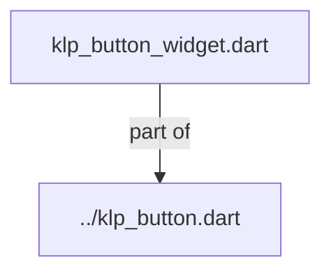
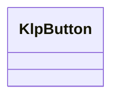
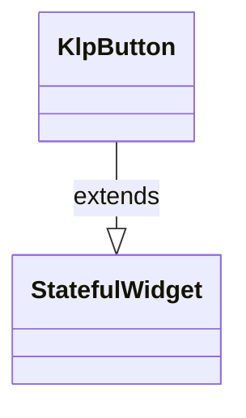

# klp_button_widget.dart：直接依賴與宣告架構

[回到目錄](README.md) · [來源檔案](../../../../../../../lib/src/features/actions/button/internal/klp_button_widget.dart)

## 範圍

核心是 `lib/src/features/actions/button/internal/klp_button_widget.dart`。主要視角為該檔案明寫的 import／export／part；輔助視角為本檔宣告及 extends／implements／with／on 關係。只展開一層外部邊界。

## 直接依賴圖

## 依賴證據

| 關係 | 原始 directive | 來源 |
|---|---|---|
| part of | <code>part of &#x27;../klp_button.dart&#x27;;</code> | [lib/src/features/actions/button/internal/klp_button_widget.dart:1](../../../../../../../lib/src/features/actions/button/internal/klp_button_widget.dart#L1) |

## 宣告關係圖

本組節點是本檔宣告；沒有箭頭的宣告未在此圖主張互相依賴。

## 宣告與成員證據

成員包含 public 與 private；簽章取自來源，省略函式本體與欄位初始值。`(inferred)` 表示來源未明寫型別；建構子只顯示參數部分，不含初始化列表。

### KlpButton

ClassDeclaration · public · [lib/src/features/actions/button/internal/klp_button_widget.dart:3](../../../../../../../lib/src/features/actions/button/internal/klp_button_widget.dart#L3)

<code>class KlpButton extends StatefulWidget</code>

來源註解摘要：主要動作按鈕。`tone` 決定語意強度（primary／secondary／ghost／dashed／danger）， `size` 支援五段緊湊尺寸階級（xs: 28px, sm: 32px, md: 36px, lg: 40px, xl: 48px）， 預設使用 sm，`compact` 使用 xs；`selected` 是由呼叫端持有的持續選取狀態。 圓角、內距、高度、狀態 wash 與邊框皆由風格表解析目前 theme。

- `extends` → <code>StatefulWidget</code>：[lib/src/features/actions/button/internal/klp_button_widget.dart:7](../../../../../../../lib/src/features/actions/button/internal/klp_button_widget.dart#L7)

| 成員 | 可見性 | 簽章／型別 | 來源註解摘要 | 證據 |
|---|---|---|---|---|
| constructor <code>KlpButton</code> | public | <code>const KlpButton({ super.key, required this.label, required this.onPressed, this.tone = KlpButtonTone.primary, this.size, this.leading, this.trailing, this.compact = false, this.selected = false, this.onLongPress, })</code> |  | [lib/src/features/actions/button/internal/klp_button_widget.dart:8](../../../../../../../lib/src/features/actions/button/internal/klp_button_widget.dart#L8) |
| field <code>label</code> | public | <code>final String label</code> |  | [lib/src/features/actions/button/internal/klp_button_widget.dart:21](../../../../../../../lib/src/features/actions/button/internal/klp_button_widget.dart#L21) |
| field <code>onPressed</code> | public | <code>final VoidCallback? onPressed</code> |  | [lib/src/features/actions/button/internal/klp_button_widget.dart:22](../../../../../../../lib/src/features/actions/button/internal/klp_button_widget.dart#L22) |
| field <code>tone</code> | public | <code>final KlpButtonTone tone</code> |  | [lib/src/features/actions/button/internal/klp_button_widget.dart:23](../../../../../../../lib/src/features/actions/button/internal/klp_button_widget.dart#L23) |
| field <code>size</code> | public | <code>final KlpControlSize? size</code> |  | [lib/src/features/actions/button/internal/klp_button_widget.dart:24](../../../../../../../lib/src/features/actions/button/internal/klp_button_widget.dart#L24) |
| field <code>leading</code> | public | <code>final Widget? leading</code> |  | [lib/src/features/actions/button/internal/klp_button_widget.dart:25](../../../../../../../lib/src/features/actions/button/internal/klp_button_widget.dart#L25) |
| field <code>trailing</code> | public | <code>final Widget? trailing</code> |  | [lib/src/features/actions/button/internal/klp_button_widget.dart:26](../../../../../../../lib/src/features/actions/button/internal/klp_button_widget.dart#L26) |
| field <code>compact</code> | public | <code>final bool compact</code> |  | [lib/src/features/actions/button/internal/klp_button_widget.dart:27](../../../../../../../lib/src/features/actions/button/internal/klp_button_widget.dart#L27) |
| field <code>selected</code> | public | <code>final bool selected</code> |  | [lib/src/features/actions/button/internal/klp_button_widget.dart:28](../../../../../../../lib/src/features/actions/button/internal/klp_button_widget.dart#L28) |
| field <code>onLongPress</code> | public | <code>final VoidCallback? onLongPress</code> |  | [lib/src/features/actions/button/internal/klp_button_widget.dart:29](../../../../../../../lib/src/features/actions/button/internal/klp_button_widget.dart#L29) |
| method <code>createState</code> | public | <code>State&lt;KlpButton&gt; createState()</code> |  | [lib/src/features/actions/button/internal/klp_button_widget.dart:31](../../../../../../../lib/src/features/actions/button/internal/klp_button_widget.dart#L31) |

## 閱讀說明與限制

箭頭只表示來源明寫的靜態關係；import 不等於呼叫。未分析動態呼叫、欄位的實際物件擁有權、狀態轉移或渲染流程；型別未進行語意解析，繼承目標保留原始型別拼寫。public／private 依 Dart 名稱前綴判斷；public 宣告不代表已由 `lib/kallopis.dart` 匯出。

本頁由 `tool/architecture_atlas` 產生；編輯來源或生成工具後重新產生，避免手改本頁。
