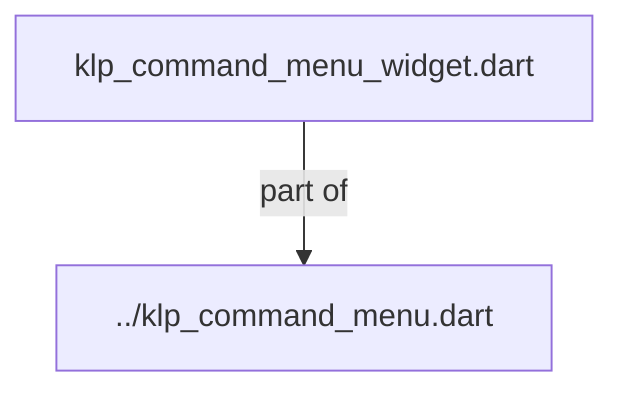
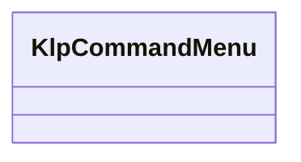
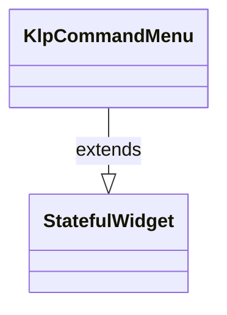

# klp_command_menu_widget.dart：直接依賴與宣告架構

[回到目錄](README.md) · [來源檔案](../../../../../../../lib/src/features/actions/command_menu/internal/klp_command_menu_widget.dart)

## 範圍

核心是 `lib/src/features/actions/command_menu/internal/klp_command_menu_widget.dart`。主要視角為該檔案明寫的 import／export／part；輔助視角為本檔宣告及 extends／implements／with／on 關係。只展開一層外部邊界。

## 直接依賴圖

## 依賴證據

| 關係 | 原始 directive | 來源 |
|---|---|---|
| part of | <code>part of &#x27;../klp_command_menu.dart&#x27;;</code> | [lib/src/features/actions/command_menu/internal/klp_command_menu_widget.dart:1](../../../../../../../lib/src/features/actions/command_menu/internal/klp_command_menu_widget.dart#L1) |

## 宣告關係圖

本組節點是本檔宣告；沒有箭頭的宣告未在此圖主張互相依賴。

## 宣告與成員證據

成員包含 public 與 private；簽章取自來源，省略函式本體與欄位初始值。`(inferred)` 表示來源未明寫型別；建構子只顯示參數部分，不含初始化列表。

### KlpCommandMenu

ClassDeclaration · public · [lib/src/features/actions/command_menu/internal/klp_command_menu_widget.dart:3](../../../../../../../lib/src/features/actions/command_menu/internal/klp_command_menu_widget.dart#L3)

<code>class KlpCommandMenu extends StatefulWidget</code>

來源註解摘要：命令面板：分組的指令清單，存在的意義就是不用滑鼠也能操作。 **鍵盤**：`↓`／`↑` 在（跨分組攤平後的）項目間移動高亮，跳過 [KlpCommandItemData.onPressed] 為 `null`（停用）的項目，並在頭尾之間循環； `Home`／`End` 跳到第一／最後一個可用項目；`Enter`／`Space` 觸發目前高亮的 項目；`Escape` 呼叫 [onEscape]。索引移動規則沿用 [KlpRovingIndex]，與 [KlpMenu]、[KlpCombobox] 共用同一套實作。 面板預設會在出現時自動取得鍵盤焦點（[autofocus]），因為命令面板通常是剛彈出 的 overlay。

- `extends` → <code>StatefulWidget</code>：[lib/src/features/actions/command_menu/internal/klp_command_menu_widget.dart:13](../../../../../../../lib/src/features/actions/command_menu/internal/klp_command_menu_widget.dart#L13)

| 成員 | 可見性 | 簽章／型別 | 來源註解摘要 | 證據 |
|---|---|---|---|---|
| constructor <code>KlpCommandMenu</code> | public | <code>const KlpCommandMenu({ super.key, required this.sections, this.framed = true, this.autofocus = true, this.onEscape, })</code> |  | [lib/src/features/actions/command_menu/internal/klp_command_menu_widget.dart:14](../../../../../../../lib/src/features/actions/command_menu/internal/klp_command_menu_widget.dart#L14) |
| field <code>sections</code> | public | <code>final List&lt;KlpCommandSectionData&gt; sections</code> |  | [lib/src/features/actions/command_menu/internal/klp_command_menu_widget.dart:22](../../../../../../../lib/src/features/actions/command_menu/internal/klp_command_menu_widget.dart#L22) |
| field <code>framed</code> | public | <code>final bool framed</code> |  | [lib/src/features/actions/command_menu/internal/klp_command_menu_widget.dart:23](../../../../../../../lib/src/features/actions/command_menu/internal/klp_command_menu_widget.dart#L23) |
| field <code>autofocus</code> | public | <code>final bool autofocus</code> | 是否在面板出現時自動取得鍵盤焦點。預設 `true`。 | [lib/src/features/actions/command_menu/internal/klp_command_menu_widget.dart:26](../../../../../../../lib/src/features/actions/command_menu/internal/klp_command_menu_widget.dart#L26) |
| field <code>onEscape</code> | public | <code>final VoidCallback? onEscape</code> | 按下 `Escape` 時呼叫，通常由呼叫端用來關閉面板；未提供時無效果。 | [lib/src/features/actions/command_menu/internal/klp_command_menu_widget.dart:29](../../../../../../../lib/src/features/actions/command_menu/internal/klp_command_menu_widget.dart#L29) |
| method <code>createState</code> | public | <code>State&lt;KlpCommandMenu&gt; createState()</code> |  | [lib/src/features/actions/command_menu/internal/klp_command_menu_widget.dart:31](../../../../../../../lib/src/features/actions/command_menu/internal/klp_command_menu_widget.dart#L31) |

## 閱讀說明與限制

箭頭只表示來源明寫的靜態關係；import 不等於呼叫。未分析動態呼叫、欄位的實際物件擁有權、狀態轉移或渲染流程；型別未進行語意解析，繼承目標保留原始型別拼寫。public／private 依 Dart 名稱前綴判斷；public 宣告不代表已由 `lib/kallopis.dart` 匯出。

本頁由 `tool/architecture_atlas` 產生；編輯來源或生成工具後重新產生，避免手改本頁。
