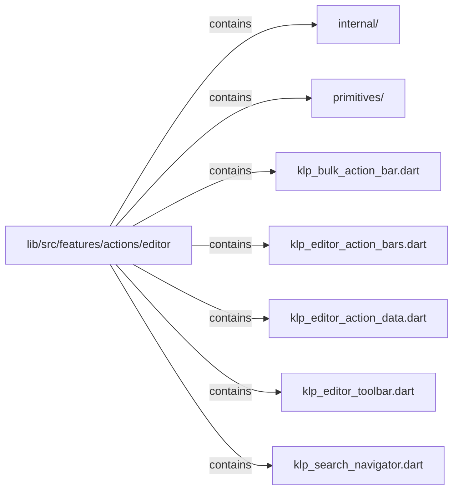

# lib/src/features/actions/editor：架構分析入口

[上一層](../README.md)

## 範圍

閱讀 `lib/src/features/actions/editor` 的直接子目錄與 Dart 檔案。結構圖表示實際檔案包含關係；依賴圖表示本層檔案明寫的 directives。每個檔案頁另列直接依賴、宣告、欄位、方法、建構子及行號證據。

## 本層直接依賴圖

箭頭以本層 Dart 檔案明寫的 directive 彙總到目標所在目錄或外部套件邊界；不遞迴將子目錄依賴算入本層。相同目標的不同 directive 類型分開計數。

```mermaid
flowchart LR
	n0["lib/src/features/actions/editor"]
	n1["lib/src/application/localization"]
	n2["lib/src/features/actions/button"]
	n3["lib/src/features/actions/editor/internal"]
	n4["lib/src/features/actions/editor/primitives"]
	n5["lib/src/features/forms/input"]
	n6["lib/src/foundation"]
	n7["lib/src/foundation/content"]
	n8["lib/src/foundation/layout"]
	n9["lib/src/foundation/surface"]
	n10["lib/src/styling/legacy_theme"]
	n11["package:flutter"]
	n0 -->|"import"| n1
	n0 -->|"import"| n2
	n0 -->|"part"| n3
	n0 -->|"part"| n4
	n0 -->|"import"| n5
	n0 -->|"import"| n6
	n0 -->|"import"| n7
	n0 -->|"import"| n8
	n0 -->|"import"| n9
	n0 -->|"import"| n10
	n0 -->|"import"| n11
```

| 目標邊界 | 關係 | directive 數 | 第一筆來源證據 |
|---|---|---|---|
| <code>lib/src/application/localization</code> | import | 1 | [lib/src/features/actions/editor/klp_editor_action_bars.dart:16](../../../../../../lib/src/features/actions/editor/klp_editor_action_bars.dart#L16) |
| <code>lib/src/features/actions/button</code> | import | 1 | [lib/src/features/actions/editor/klp_editor_action_bars.dart:5](../../../../../../lib/src/features/actions/editor/klp_editor_action_bars.dart#L5) |
| <code>lib/src/features/actions/editor/internal</code> | part | 2 | [lib/src/features/actions/editor/klp_editor_action_bars.dart:21](../../../../../../lib/src/features/actions/editor/klp_editor_action_bars.dart#L21) |
| <code>lib/src/features/actions/editor/primitives</code> | part | 1 | [lib/src/features/actions/editor/klp_editor_action_bars.dart:27](../../../../../../lib/src/features/actions/editor/klp_editor_action_bars.dart#L27) |
| <code>lib/src/features/forms/input</code> | import | 1 | [lib/src/features/actions/editor/klp_editor_action_bars.dart:6](../../../../../../lib/src/features/actions/editor/klp_editor_action_bars.dart#L6) |
| <code>lib/src/foundation</code> | import | 1 | [lib/src/features/actions/editor/klp_editor_action_bars.dart:7](../../../../../../lib/src/features/actions/editor/klp_editor_action_bars.dart#L7) |
| <code>lib/src/foundation/content</code> | import | 1 | [lib/src/features/actions/editor/klp_editor_action_bars.dart:19](../../../../../../lib/src/features/actions/editor/klp_editor_action_bars.dart#L19) |
| <code>lib/src/foundation/layout</code> | import | 8 | [lib/src/features/actions/editor/klp_editor_action_bars.dart:8](../../../../../../lib/src/features/actions/editor/klp_editor_action_bars.dart#L8) |
| <code>lib/src/foundation/surface</code> | import | 1 | [lib/src/features/actions/editor/klp_editor_action_bars.dart:17](../../../../../../lib/src/features/actions/editor/klp_editor_action_bars.dart#L17) |
| <code>lib/src/styling/legacy_theme</code> | import | 1 | [lib/src/features/actions/editor/klp_editor_action_bars.dart:18](../../../../../../lib/src/features/actions/editor/klp_editor_action_bars.dart#L18) |
| <code>package:flutter</code> | import | 1 | [lib/src/features/actions/editor/klp_editor_action_bars.dart:3](../../../../../../lib/src/features/actions/editor/klp_editor_action_bars.dart#L3) |

### 同目錄依賴

| 來源 → 目標 | 關係 | 證據 |
|---|---|---|
| <code>klp_bulk_action_bar.dart → klp_editor_action_bars.dart</code> | part of | [lib/src/features/actions/editor/klp_bulk_action_bar.dart:1](../../../../../../lib/src/features/actions/editor/klp_bulk_action_bar.dart#L1) |
| <code>klp_editor_action_bars.dart → klp_bulk_action_bar.dart</code> | part | [lib/src/features/actions/editor/klp_editor_action_bars.dart:23](../../../../../../lib/src/features/actions/editor/klp_editor_action_bars.dart#L23) |
| <code>klp_editor_action_bars.dart → klp_editor_action_data.dart</code> | part | [lib/src/features/actions/editor/klp_editor_action_bars.dart:24](../../../../../../lib/src/features/actions/editor/klp_editor_action_bars.dart#L24) |
| <code>klp_editor_action_bars.dart → klp_editor_toolbar.dart</code> | part | [lib/src/features/actions/editor/klp_editor_action_bars.dart:25](../../../../../../lib/src/features/actions/editor/klp_editor_action_bars.dart#L25) |
| <code>klp_editor_action_bars.dart → klp_search_navigator.dart</code> | part | [lib/src/features/actions/editor/klp_editor_action_bars.dart:26](../../../../../../lib/src/features/actions/editor/klp_editor_action_bars.dart#L26) |
| <code>klp_editor_action_data.dart → klp_editor_action_bars.dart</code> | part of | [lib/src/features/actions/editor/klp_editor_action_data.dart:1](../../../../../../lib/src/features/actions/editor/klp_editor_action_data.dart#L1) |
| <code>klp_editor_toolbar.dart → klp_editor_action_bars.dart</code> | part of | [lib/src/features/actions/editor/klp_editor_toolbar.dart:1](../../../../../../lib/src/features/actions/editor/klp_editor_toolbar.dart#L1) |
| <code>klp_search_navigator.dart → klp_editor_action_bars.dart</code> | part of | [lib/src/features/actions/editor/klp_search_navigator.dart:1](../../../../../../lib/src/features/actions/editor/klp_search_navigator.dart#L1) |

## 目錄結構圖

## 子目錄

| 目錄 | 導航 | 來源證據 |
|---|---|---|
| `internal/` | [架構入口](internal/README.md) | [來源目錄](../../../../../../lib/src/features/actions/editor/internal) |
| `primitives/` | [架構入口](primitives/README.md) | [來源目錄](../../../../../../lib/src/features/actions/editor/primitives) |

## 本層檔案

| 檔案 | 宣告 | 細節 | 來源證據 |
|---|---|---|---|
| `klp_bulk_action_bar.dart` | KlpBulkActionBar | [架構與 API](klp_bulk_action_bar.md) | [lib/src/features/actions/editor/klp_bulk_action_bar.dart:1](../../../../../../lib/src/features/actions/editor/klp_bulk_action_bar.dart#L1) |
| `klp_editor_action_bars.dart` | 無頂層宣告 | [架構與 API](klp_editor_action_bars.md) | [lib/src/features/actions/editor/klp_editor_action_bars.dart:1](../../../../../../lib/src/features/actions/editor/klp_editor_action_bars.dart#L1) |
| `klp_editor_action_data.dart` | KlpEditorActionData | [架構與 API](klp_editor_action_data.md) | [lib/src/features/actions/editor/klp_editor_action_data.dart:1](../../../../../../lib/src/features/actions/editor/klp_editor_action_data.dart#L1) |
| `klp_editor_toolbar.dart` | KlpEditorToolbar | [架構與 API](klp_editor_toolbar.md) | [lib/src/features/actions/editor/klp_editor_toolbar.dart:1](../../../../../../lib/src/features/actions/editor/klp_editor_toolbar.dart#L1) |
| `klp_search_navigator.dart` | KlpSearchNavigator | [架構與 API](klp_search_navigator.md) | [lib/src/features/actions/editor/klp_search_navigator.dart:1](../../../../../../lib/src/features/actions/editor/klp_search_navigator.dart#L1) |

## 閱讀說明

箭頭只表示來源明寫的靜態關係；import 不等於呼叫。未分析動態呼叫、欄位的實際物件擁有權、狀態轉移或渲染流程；型別未進行語意解析，繼承目標保留原始型別拼寫。public／private 依 Dart 名稱前綴判斷；public 宣告不代表已由 `lib/kallopis.dart` 匯出。

本頁的目錄與檔案由來源清冊產生；`manifest.json` 位於本圖集根目錄，可核對 SHA-256 與覆蓋數。人工模組摘要存於 `tool/architecture_atlas/briefs/`，重新生成時保留。
