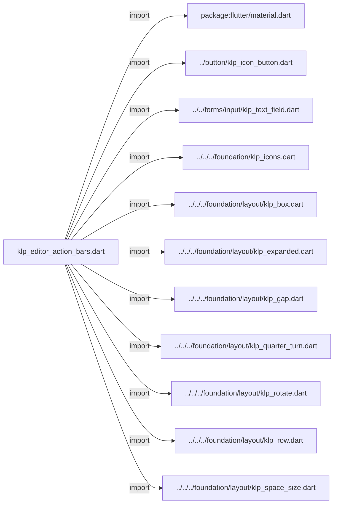
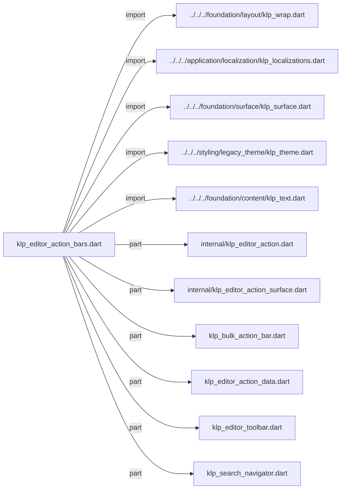
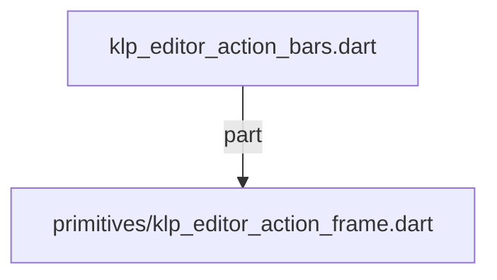

# klp_editor_action_bars.dart：直接依賴與宣告架構

[回到目錄](README.md) · [來源檔案](../../../../../../lib/src/features/actions/editor/klp_editor_action_bars.dart)

## 範圍

核心是 `lib/src/features/actions/editor/klp_editor_action_bars.dart`。主要視角為該檔案明寫的 import／export／part；輔助視角為本檔宣告及 extends／implements／with／on 關係。只展開一層外部邊界。

## 直接依賴圖

## 依賴證據

| 關係 | 原始 directive | 來源 |
|---|---|---|
| import | <code>import &#x27;package:flutter/material.dart&#x27;;</code> | [lib/src/features/actions/editor/klp_editor_action_bars.dart:3](../../../../../../lib/src/features/actions/editor/klp_editor_action_bars.dart#L3) |
| import | <code>import &#x27;../button/klp_icon_button.dart&#x27;;</code> | [lib/src/features/actions/editor/klp_editor_action_bars.dart:5](../../../../../../lib/src/features/actions/editor/klp_editor_action_bars.dart#L5) |
| import | <code>import &#x27;../../forms/input/klp_text_field.dart&#x27;;</code> | [lib/src/features/actions/editor/klp_editor_action_bars.dart:6](../../../../../../lib/src/features/actions/editor/klp_editor_action_bars.dart#L6) |
| import | <code>import &#x27;../../../foundation/klp_icons.dart&#x27;;</code> | [lib/src/features/actions/editor/klp_editor_action_bars.dart:7](../../../../../../lib/src/features/actions/editor/klp_editor_action_bars.dart#L7) |
| import | <code>import &#x27;../../../foundation/layout/klp_box.dart&#x27;;</code> | [lib/src/features/actions/editor/klp_editor_action_bars.dart:8](../../../../../../lib/src/features/actions/editor/klp_editor_action_bars.dart#L8) |
| import | <code>import &#x27;../../../foundation/layout/klp_expanded.dart&#x27;;</code> | [lib/src/features/actions/editor/klp_editor_action_bars.dart:9](../../../../../../lib/src/features/actions/editor/klp_editor_action_bars.dart#L9) |
| import | <code>import &#x27;../../../foundation/layout/klp_gap.dart&#x27;;</code> | [lib/src/features/actions/editor/klp_editor_action_bars.dart:10](../../../../../../lib/src/features/actions/editor/klp_editor_action_bars.dart#L10) |
| import | <code>import &#x27;../../../foundation/layout/klp_quarter_turn.dart&#x27;;</code> | [lib/src/features/actions/editor/klp_editor_action_bars.dart:11](../../../../../../lib/src/features/actions/editor/klp_editor_action_bars.dart#L11) |
| import | <code>import &#x27;../../../foundation/layout/klp_rotate.dart&#x27;;</code> | [lib/src/features/actions/editor/klp_editor_action_bars.dart:12](../../../../../../lib/src/features/actions/editor/klp_editor_action_bars.dart#L12) |
| import | <code>import &#x27;../../../foundation/layout/klp_row.dart&#x27;;</code> | [lib/src/features/actions/editor/klp_editor_action_bars.dart:13](../../../../../../lib/src/features/actions/editor/klp_editor_action_bars.dart#L13) |
| import | <code>import &#x27;../../../foundation/layout/klp_space_size.dart&#x27;;</code> | [lib/src/features/actions/editor/klp_editor_action_bars.dart:14](../../../../../../lib/src/features/actions/editor/klp_editor_action_bars.dart#L14) |
| import | <code>import &#x27;../../../foundation/layout/klp_wrap.dart&#x27;;</code> | [lib/src/features/actions/editor/klp_editor_action_bars.dart:15](../../../../../../lib/src/features/actions/editor/klp_editor_action_bars.dart#L15) |
| import | <code>import &#x27;../../../application/localization/klp_localizations.dart&#x27;;</code> | [lib/src/features/actions/editor/klp_editor_action_bars.dart:16](../../../../../../lib/src/features/actions/editor/klp_editor_action_bars.dart#L16) |
| import | <code>import &#x27;../../../foundation/surface/klp_surface.dart&#x27;;</code> | [lib/src/features/actions/editor/klp_editor_action_bars.dart:17](../../../../../../lib/src/features/actions/editor/klp_editor_action_bars.dart#L17) |
| import | <code>import &#x27;../../../styling/legacy_theme/klp_theme.dart&#x27;;</code> | [lib/src/features/actions/editor/klp_editor_action_bars.dart:18](../../../../../../lib/src/features/actions/editor/klp_editor_action_bars.dart#L18) |
| import | <code>import &#x27;../../../foundation/content/klp_text.dart&#x27;;</code> | [lib/src/features/actions/editor/klp_editor_action_bars.dart:19](../../../../../../lib/src/features/actions/editor/klp_editor_action_bars.dart#L19) |
| part | <code>part &#x27;internal/klp_editor_action.dart&#x27;;</code> | [lib/src/features/actions/editor/klp_editor_action_bars.dart:21](../../../../../../lib/src/features/actions/editor/klp_editor_action_bars.dart#L21) |
| part | <code>part &#x27;internal/klp_editor_action_surface.dart&#x27;;</code> | [lib/src/features/actions/editor/klp_editor_action_bars.dart:22](../../../../../../lib/src/features/actions/editor/klp_editor_action_bars.dart#L22) |
| part | <code>part &#x27;klp_bulk_action_bar.dart&#x27;;</code> | [lib/src/features/actions/editor/klp_editor_action_bars.dart:23](../../../../../../lib/src/features/actions/editor/klp_editor_action_bars.dart#L23) |
| part | <code>part &#x27;klp_editor_action_data.dart&#x27;;</code> | [lib/src/features/actions/editor/klp_editor_action_bars.dart:24](../../../../../../lib/src/features/actions/editor/klp_editor_action_bars.dart#L24) |
| part | <code>part &#x27;klp_editor_toolbar.dart&#x27;;</code> | [lib/src/features/actions/editor/klp_editor_action_bars.dart:25](../../../../../../lib/src/features/actions/editor/klp_editor_action_bars.dart#L25) |
| part | <code>part &#x27;klp_search_navigator.dart&#x27;;</code> | [lib/src/features/actions/editor/klp_editor_action_bars.dart:26](../../../../../../lib/src/features/actions/editor/klp_editor_action_bars.dart#L26) |
| part | <code>part &#x27;primitives/klp_editor_action_frame.dart&#x27;;</code> | [lib/src/features/actions/editor/klp_editor_action_bars.dart:27](../../../../../../lib/src/features/actions/editor/klp_editor_action_bars.dart#L27) |

## 宣告關係圖

本檔沒有 class／enum／mixin／extension 宣告；頂層函式、變數與 typedef 見下表。

## 宣告與成員證據

成員包含 public 與 private；簽章取自來源，省略函式本體與欄位初始值。`(inferred)` 表示來源未明寫型別；建構子只顯示參數部分，不含初始化列表。

## 閱讀說明與限制

箭頭只表示來源明寫的靜態關係；import 不等於呼叫。未分析動態呼叫、欄位的實際物件擁有權、狀態轉移或渲染流程；型別未進行語意解析，繼承目標保留原始型別拼寫。public／private 依 Dart 名稱前綴判斷；public 宣告不代表已由 `lib/kallopis.dart` 匯出。

本頁由 `tool/architecture_atlas` 產生；編輯來源或生成工具後重新產生，避免手改本頁。
