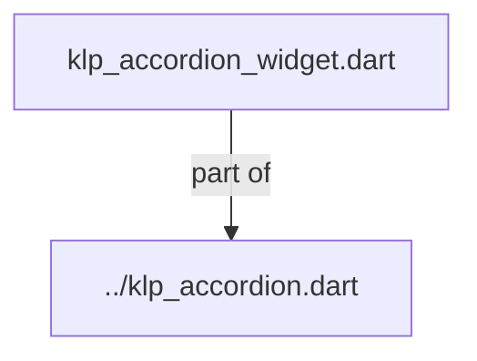
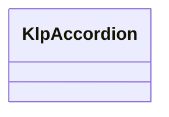
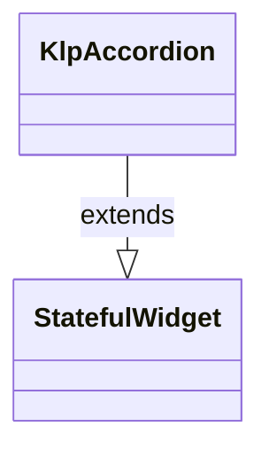

# klp_accordion_widget.dart：直接依賴與宣告架構

[回到目錄](README.md) · [來源檔案](../../../../../../../lib/src/features/collections/accordion/internal/klp_accordion_widget.dart)

## 範圍

核心是 `lib/src/features/collections/accordion/internal/klp_accordion_widget.dart`。主要視角為該檔案明寫的 import／export／part；輔助視角為本檔宣告及 extends／implements／with／on 關係。只展開一層外部邊界。

## 直接依賴圖

## 依賴證據

| 關係 | 原始 directive | 來源 |
|---|---|---|
| part of | <code>part of &#x27;../klp_accordion.dart&#x27;;</code> | [lib/src/features/collections/accordion/internal/klp_accordion_widget.dart:1](../../../../../../../lib/src/features/collections/accordion/internal/klp_accordion_widget.dart#L1) |

## 宣告關係圖

本組節點是本檔宣告；沒有箭頭的宣告未在此圖主張互相依賴。

## 宣告與成員證據

成員包含 public 與 private；簽章取自來源，省略函式本體與欄位初始值。`(inferred)` 表示來源未明寫型別；建構子只顯示參數部分，不含初始化列表。

### KlpAccordion

ClassDeclaration · public · [lib/src/features/collections/accordion/internal/klp_accordion_widget.dart:3](../../../../../../../lib/src/features/collections/accordion/internal/klp_accordion_widget.dart#L3)

<code>class KlpAccordion extends StatefulWidget</code>

來源註解摘要：可摺疊的內容區清單。 [multiple] 為 `false`（預設）時同一時間只能展開一項，再點其他標題會先收合原本 展開的那項；為 `true` 時各項互不影響。展開狀態是暫存的 UI 狀態而非產品資料， 因此元件自行持有——需要預先展開特定項目或觀察變化時用 [initialExpandedIds] 與 [onExpandedChanged]。

- `extends` → <code>StatefulWidget</code>：[lib/src/features/collections/accordion/internal/klp_accordion_widget.dart:9](../../../../../../../lib/src/features/collections/accordion/internal/klp_accordion_widget.dart#L9)

| 成員 | 可見性 | 簽章／型別 | 來源註解摘要 | 證據 |
|---|---|---|---|---|
| constructor <code>KlpAccordion</code> | public | <code>const KlpAccordion({ super.key, required this.items, this.multiple = false, this.initialExpandedIds = const &lt;String&gt;{}, this.onExpandedChanged, })</code> |  | [lib/src/features/collections/accordion/internal/klp_accordion_widget.dart:10](../../../../../../../lib/src/features/collections/accordion/internal/klp_accordion_widget.dart#L10) |
| field <code>items</code> | public | <code>final List&lt;KlpAccordionItemData&gt; items</code> |  | [lib/src/features/collections/accordion/internal/klp_accordion_widget.dart:18](../../../../../../../lib/src/features/collections/accordion/internal/klp_accordion_widget.dart#L18) |
| field <code>multiple</code> | public | <code>final bool multiple</code> |  | [lib/src/features/collections/accordion/internal/klp_accordion_widget.dart:19](../../../../../../../lib/src/features/collections/accordion/internal/klp_accordion_widget.dart#L19) |
| field <code>initialExpandedIds</code> | public | <code>final Set&lt;String&gt; initialExpandedIds</code> |  | [lib/src/features/collections/accordion/internal/klp_accordion_widget.dart:20](../../../../../../../lib/src/features/collections/accordion/internal/klp_accordion_widget.dart#L20) |
| field <code>onExpandedChanged</code> | public | <code>final ValueChanged&lt;Set&lt;String&gt;&gt;? onExpandedChanged</code> |  | [lib/src/features/collections/accordion/internal/klp_accordion_widget.dart:21](../../../../../../../lib/src/features/collections/accordion/internal/klp_accordion_widget.dart#L21) |
| method <code>createState</code> | public | <code>State&lt;KlpAccordion&gt; createState()</code> |  | [lib/src/features/collections/accordion/internal/klp_accordion_widget.dart:23](../../../../../../../lib/src/features/collections/accordion/internal/klp_accordion_widget.dart#L23) |

## 閱讀說明與限制

箭頭只表示來源明寫的靜態關係；import 不等於呼叫。未分析動態呼叫、欄位的實際物件擁有權、狀態轉移或渲染流程；型別未進行語意解析，繼承目標保留原始型別拼寫。public／private 依 Dart 名稱前綴判斷；public 宣告不代表已由 `lib/kallopis.dart` 匯出。

本頁由 `tool/architecture_atlas` 產生；編輯來源或生成工具後重新產生，避免手改本頁。
