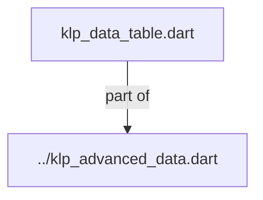
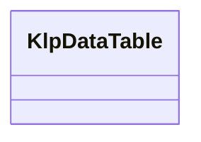
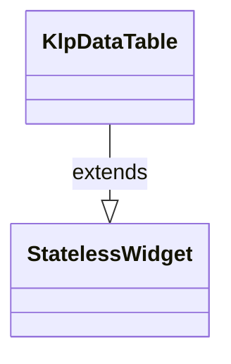

# klp_data_table.dart：直接依賴與宣告架構

[回到目錄](README.md) · [來源檔案](../../../../../../../lib/src/features/collections/advanced/internal/klp_data_table.dart)

## 範圍

核心是 `lib/src/features/collections/advanced/internal/klp_data_table.dart`。主要視角為該檔案明寫的 import／export／part；輔助視角為本檔宣告及 extends／implements／with／on 關係。只展開一層外部邊界。

## 直接依賴圖

## 依賴證據

| 關係 | 原始 directive | 來源 |
|---|---|---|
| part of | <code>part of &#x27;../klp_advanced_data.dart&#x27;;</code> | [lib/src/features/collections/advanced/internal/klp_data_table.dart:1](../../../../../../../lib/src/features/collections/advanced/internal/klp_data_table.dart#L1) |

## 宣告關係圖

本組節點是本檔宣告；沒有箭頭的宣告未在此圖主張互相依賴。

## 宣告與成員證據

成員包含 public 與 private；簽章取自來源，省略函式本體與欄位初始值。`(inferred)` 表示來源未明寫型別；建構子只顯示參數部分，不含初始化列表。

### KlpDataTable

ClassDeclaration · public · [lib/src/features/collections/advanced/internal/klp_data_table.dart:3](../../../../../../../lib/src/features/collections/advanced/internal/klp_data_table.dart#L3)

<code>class KlpDataTable extends StatelessWidget</code>

來源註解摘要：結構化資料表格：固定欄位、可選排序與多選。 不做分頁或虛擬捲動。選取與排序狀態由呼叫端持有，元件只回報意圖。

- `extends` → <code>StatelessWidget</code>：[lib/src/features/collections/advanced/internal/klp_data_table.dart:6](../../../../../../../lib/src/features/collections/advanced/internal/klp_data_table.dart#L6)

| 成員 | 可見性 | 簽章／型別 | 來源註解摘要 | 證據 |
|---|---|---|---|---|
| constructor <code>KlpDataTable</code> | public | <code>const KlpDataTable({ super.key, required this.columns, required this.rows, this.onRowPressed, this.selectable = false, this.selectedIds = const {}, this.sort, this.onSelected, this.onSort, })</code> |  | [lib/src/features/collections/advanced/internal/klp_data_table.dart:7](../../../../../../../lib/src/features/collections/advanced/internal/klp_data_table.dart#L7) |
| field <code>columns</code> | public | <code>final List&lt;KlpDataColumn&gt; columns</code> |  | [lib/src/features/collections/advanced/internal/klp_data_table.dart:19](../../../../../../../lib/src/features/collections/advanced/internal/klp_data_table.dart#L19) |
| field <code>rows</code> | public | <code>final List&lt;KlpDataRow&gt; rows</code> |  | [lib/src/features/collections/advanced/internal/klp_data_table.dart:20](../../../../../../../lib/src/features/collections/advanced/internal/klp_data_table.dart#L20) |
| field <code>onRowPressed</code> | public | <code>final ValueChanged&lt;String&gt;? onRowPressed</code> |  | [lib/src/features/collections/advanced/internal/klp_data_table.dart:21](../../../../../../../lib/src/features/collections/advanced/internal/klp_data_table.dart#L21) |
| field <code>selectable</code> | public | <code>final bool selectable</code> |  | [lib/src/features/collections/advanced/internal/klp_data_table.dart:22](../../../../../../../lib/src/features/collections/advanced/internal/klp_data_table.dart#L22) |
| field <code>selectedIds</code> | public | <code>final Set&lt;String&gt; selectedIds</code> |  | [lib/src/features/collections/advanced/internal/klp_data_table.dart:23](../../../../../../../lib/src/features/collections/advanced/internal/klp_data_table.dart#L23) |
| field <code>sort</code> | public | <code>final KlpDataSort? sort</code> |  | [lib/src/features/collections/advanced/internal/klp_data_table.dart:24](../../../../../../../lib/src/features/collections/advanced/internal/klp_data_table.dart#L24) |
| field <code>onSelected</code> | public | <code>final ValueChanged&lt;Set&lt;String&gt;&gt;? onSelected</code> |  | [lib/src/features/collections/advanced/internal/klp_data_table.dart:25](../../../../../../../lib/src/features/collections/advanced/internal/klp_data_table.dart#L25) |
| field <code>onSort</code> | public | <code>final ValueChanged&lt;String&gt;? onSort</code> |  | [lib/src/features/collections/advanced/internal/klp_data_table.dart:26](../../../../../../../lib/src/features/collections/advanced/internal/klp_data_table.dart#L26) |
| method <code>build</code> | public | <code>Widget build(BuildContext context)</code> |  | [lib/src/features/collections/advanced/internal/klp_data_table.dart:28](../../../../../../../lib/src/features/collections/advanced/internal/klp_data_table.dart#L28) |
| method <code>_selectAll</code> | private | <code>void _selectAll(bool selected)</code> |  | [lib/src/features/collections/advanced/internal/klp_data_table.dart:72](../../../../../../../lib/src/features/collections/advanced/internal/klp_data_table.dart#L72) |
| method <code>_selectRow</code> | private | <code>void _selectRow(String rowId, bool selected)</code> |  | [lib/src/features/collections/advanced/internal/klp_data_table.dart:81](../../../../../../../lib/src/features/collections/advanced/internal/klp_data_table.dart#L81) |

## 閱讀說明與限制

箭頭只表示來源明寫的靜態關係；import 不等於呼叫。未分析動態呼叫、欄位的實際物件擁有權、狀態轉移或渲染流程；型別未進行語意解析，繼承目標保留原始型別拼寫。public／private 依 Dart 名稱前綴判斷；public 宣告不代表已由 `lib/kallopis.dart` 匯出。

本頁由 `tool/architecture_atlas` 產生；編輯來源或生成工具後重新產生，避免手改本頁。
