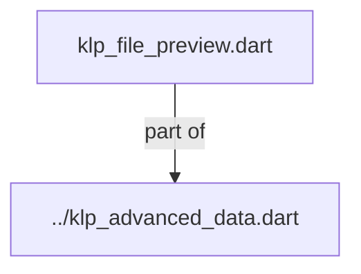
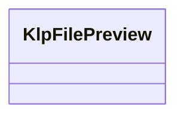
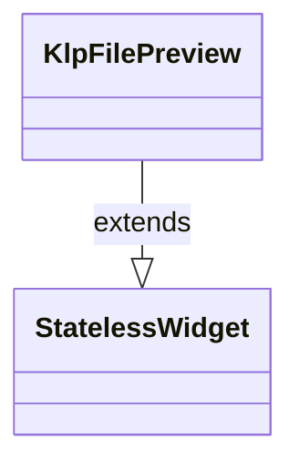

# klp_file_preview.dart：直接依賴與宣告架構

[回到目錄](README.md) · [來源檔案](../../../../../../../lib/src/features/collections/advanced/internal/klp_file_preview.dart)

## 範圍

核心是 `lib/src/features/collections/advanced/internal/klp_file_preview.dart`。主要視角為該檔案明寫的 import／export／part；輔助視角為本檔宣告及 extends／implements／with／on 關係。只展開一層外部邊界。

## 直接依賴圖

## 依賴證據

| 關係 | 原始 directive | 來源 |
|---|---|---|
| part of | <code>part of &#x27;../klp_advanced_data.dart&#x27;;</code> | [lib/src/features/collections/advanced/internal/klp_file_preview.dart:1](../../../../../../../lib/src/features/collections/advanced/internal/klp_file_preview.dart#L1) |

## 宣告關係圖

本組節點是本檔宣告；沒有箭頭的宣告未在此圖主張互相依賴。

## 宣告與成員證據

成員包含 public 與 private；簽章取自來源，省略函式本體與欄位初始值。`(inferred)` 表示來源未明寫型別；建構子只顯示參數部分，不含初始化列表。

### KlpFilePreview

ClassDeclaration · public · [lib/src/features/collections/advanced/internal/klp_file_preview.dart:3](../../../../../../../lib/src/features/collections/advanced/internal/klp_file_preview.dart#L3)

<code>class KlpFilePreview extends StatelessWidget</code>

來源註解摘要：檔案預覽卡片，呈現檔名、中繼資料、預覽內容與外部操作。

- `extends` → <code>StatelessWidget</code>：[lib/src/features/collections/advanced/internal/klp_file_preview.dart:4](../../../../../../../lib/src/features/collections/advanced/internal/klp_file_preview.dart#L4)

| 成員 | 可見性 | 簽章／型別 | 來源註解摘要 | 證據 |
|---|---|---|---|---|
| constructor <code>KlpFilePreview</code> | public | <code>const KlpFilePreview({ super.key, required this.name, required this.metadata, this.icon = KlpIcons.box, this.preview, this.onPressed, this.state = KlpFilePreviewState.ready, this.size = KlpFilePreviewSize.standard, this.textContent, this.onOpenExternal, this.onDownload, })</code> |  | [lib/src/features/collections/advanced/internal/klp_file_preview.dart:5](../../../../../../../lib/src/features/collections/advanced/internal/klp_file_preview.dart#L5) |
| field <code>name</code> | public | <code>final String name</code> |  | [lib/src/features/collections/advanced/internal/klp_file_preview.dart:19](../../../../../../../lib/src/features/collections/advanced/internal/klp_file_preview.dart#L19) |
| field <code>metadata</code> | public | <code>final String metadata</code> |  | [lib/src/features/collections/advanced/internal/klp_file_preview.dart:20](../../../../../../../lib/src/features/collections/advanced/internal/klp_file_preview.dart#L20) |
| field <code>icon</code> | public | <code>final KlpIconData icon</code> |  | [lib/src/features/collections/advanced/internal/klp_file_preview.dart:21](../../../../../../../lib/src/features/collections/advanced/internal/klp_file_preview.dart#L21) |
| field <code>preview</code> | public | <code>final Widget? preview</code> |  | [lib/src/features/collections/advanced/internal/klp_file_preview.dart:22](../../../../../../../lib/src/features/collections/advanced/internal/klp_file_preview.dart#L22) |
| field <code>onPressed</code> | public | <code>final VoidCallback? onPressed</code> |  | [lib/src/features/collections/advanced/internal/klp_file_preview.dart:23](../../../../../../../lib/src/features/collections/advanced/internal/klp_file_preview.dart#L23) |
| field <code>state</code> | public | <code>final KlpFilePreviewState state</code> |  | [lib/src/features/collections/advanced/internal/klp_file_preview.dart:24](../../../../../../../lib/src/features/collections/advanced/internal/klp_file_preview.dart#L24) |
| field <code>size</code> | public | <code>final KlpFilePreviewSize size</code> |  | [lib/src/features/collections/advanced/internal/klp_file_preview.dart:25](../../../../../../../lib/src/features/collections/advanced/internal/klp_file_preview.dart#L25) |
| field <code>textContent</code> | public | <code>final String? textContent</code> |  | [lib/src/features/collections/advanced/internal/klp_file_preview.dart:26](../../../../../../../lib/src/features/collections/advanced/internal/klp_file_preview.dart#L26) |
| field <code>onOpenExternal</code> | public | <code>final VoidCallback? onOpenExternal</code> |  | [lib/src/features/collections/advanced/internal/klp_file_preview.dart:27](../../../../../../../lib/src/features/collections/advanced/internal/klp_file_preview.dart#L27) |
| field <code>onDownload</code> | public | <code>final VoidCallback? onDownload</code> |  | [lib/src/features/collections/advanced/internal/klp_file_preview.dart:28](../../../../../../../lib/src/features/collections/advanced/internal/klp_file_preview.dart#L28) |
| method <code>build</code> | public | <code>Widget build(BuildContext context)</code> |  | [lib/src/features/collections/advanced/internal/klp_file_preview.dart:30](../../../../../../../lib/src/features/collections/advanced/internal/klp_file_preview.dart#L30) |
| getter <code>_extension</code> | private | <code>String get _extension</code> |  | [lib/src/features/collections/advanced/internal/klp_file_preview.dart:87](../../../../../../../lib/src/features/collections/advanced/internal/klp_file_preview.dart#L87) |
| method <code>_actionChildren</code> | private | <code>List&lt;Widget&gt; _actionChildren(KlpLocalizations labels)</code> |  | [lib/src/features/collections/advanced/internal/klp_file_preview.dart:90](../../../../../../../lib/src/features/collections/advanced/internal/klp_file_preview.dart#L90) |

## 閱讀說明與限制

箭頭只表示來源明寫的靜態關係；import 不等於呼叫。未分析動態呼叫、欄位的實際物件擁有權、狀態轉移或渲染流程；型別未進行語意解析，繼承目標保留原始型別拼寫。public／private 依 Dart 名稱前綴判斷；public 宣告不代表已由 `lib/kallopis.dart` 匯出。

本頁由 `tool/architecture_atlas` 產生；編輯來源或生成工具後重新產生，避免手改本頁。
