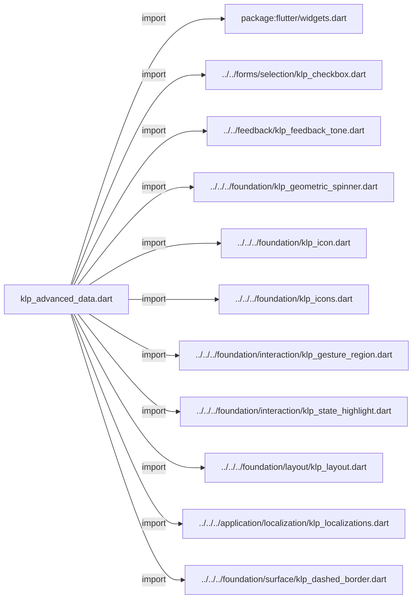
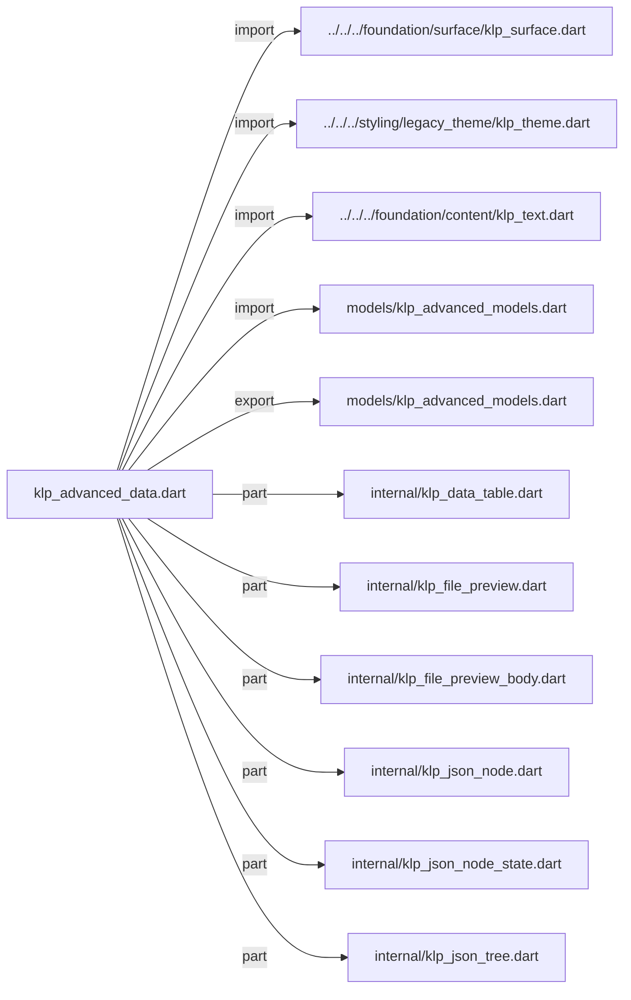
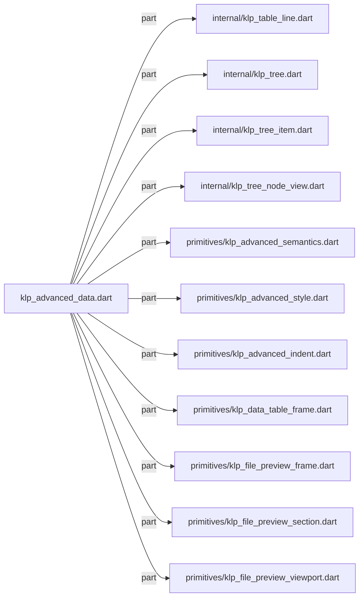
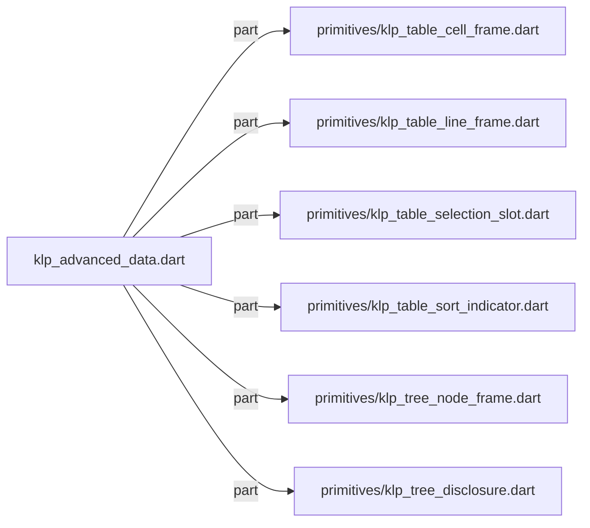

# klp_advanced_data.dart：直接依賴與宣告架構

[回到目錄](README.md) · [來源檔案](../../../../../../lib/src/features/collections/advanced/klp_advanced_data.dart)

## 範圍

核心是 `lib/src/features/collections/advanced/klp_advanced_data.dart`。主要視角為該檔案明寫的 import／export／part；輔助視角為本檔宣告及 extends／implements／with／on 關係。只展開一層外部邊界。

## 直接依賴圖

## 依賴證據

| 關係 | 原始 directive | 來源 |
|---|---|---|
| import | <code>import &#x27;package:flutter/widgets.dart&#x27;;</code> | [lib/src/features/collections/advanced/klp_advanced_data.dart:1](../../../../../../lib/src/features/collections/advanced/klp_advanced_data.dart#L1) |
| import | <code>import &#x27;../../forms/selection/klp_checkbox.dart&#x27;;</code> | [lib/src/features/collections/advanced/klp_advanced_data.dart:3](../../../../../../lib/src/features/collections/advanced/klp_advanced_data.dart#L3) |
| import | <code>import &#x27;../../feedback/klp_feedback_tone.dart&#x27;;</code> | [lib/src/features/collections/advanced/klp_advanced_data.dart:4](../../../../../../lib/src/features/collections/advanced/klp_advanced_data.dart#L4) |
| import | <code>import &#x27;../../../foundation/klp_geometric_spinner.dart&#x27;;</code> | [lib/src/features/collections/advanced/klp_advanced_data.dart:5](../../../../../../lib/src/features/collections/advanced/klp_advanced_data.dart#L5) |
| import | <code>import &#x27;../../../foundation/klp_icon.dart&#x27;;</code> | [lib/src/features/collections/advanced/klp_advanced_data.dart:6](../../../../../../lib/src/features/collections/advanced/klp_advanced_data.dart#L6) |
| import | <code>import &#x27;../../../foundation/klp_icons.dart&#x27;;</code> | [lib/src/features/collections/advanced/klp_advanced_data.dart:7](../../../../../../lib/src/features/collections/advanced/klp_advanced_data.dart#L7) |
| import | <code>import &#x27;../../../foundation/interaction/klp_gesture_region.dart&#x27;;</code> | [lib/src/features/collections/advanced/klp_advanced_data.dart:8](../../../../../../lib/src/features/collections/advanced/klp_advanced_data.dart#L8) |
| import | <code>import &#x27;../../../foundation/interaction/klp_state_highlight.dart&#x27;;</code> | [lib/src/features/collections/advanced/klp_advanced_data.dart:9](../../../../../../lib/src/features/collections/advanced/klp_advanced_data.dart#L9) |
| import | <code>import &#x27;../../../foundation/layout/klp_layout.dart&#x27;;</code> | [lib/src/features/collections/advanced/klp_advanced_data.dart:10](../../../../../../lib/src/features/collections/advanced/klp_advanced_data.dart#L10) |
| import | <code>import &#x27;../../../application/localization/klp_localizations.dart&#x27;;</code> | [lib/src/features/collections/advanced/klp_advanced_data.dart:11](../../../../../../lib/src/features/collections/advanced/klp_advanced_data.dart#L11) |
| import | <code>import &#x27;../../../foundation/surface/klp_dashed_border.dart&#x27;;</code> | [lib/src/features/collections/advanced/klp_advanced_data.dart:12](../../../../../../lib/src/features/collections/advanced/klp_advanced_data.dart#L12) |
| import | <code>import &#x27;../../../foundation/surface/klp_surface.dart&#x27;;</code> | [lib/src/features/collections/advanced/klp_advanced_data.dart:13](../../../../../../lib/src/features/collections/advanced/klp_advanced_data.dart#L13) |
| import | <code>import &#x27;../../../styling/legacy_theme/klp_theme.dart&#x27;;</code> | [lib/src/features/collections/advanced/klp_advanced_data.dart:14](../../../../../../lib/src/features/collections/advanced/klp_advanced_data.dart#L14) |
| import | <code>import &#x27;../../../foundation/content/klp_text.dart&#x27;;</code> | [lib/src/features/collections/advanced/klp_advanced_data.dart:15](../../../../../../lib/src/features/collections/advanced/klp_advanced_data.dart#L15) |
| import | <code>import &#x27;models/klp_advanced_models.dart&#x27;;</code> | [lib/src/features/collections/advanced/klp_advanced_data.dart:16](../../../../../../lib/src/features/collections/advanced/klp_advanced_data.dart#L16) |
| export | <code>export &#x27;models/klp_advanced_models.dart&#x27;;</code> | [lib/src/features/collections/advanced/klp_advanced_data.dart:18](../../../../../../lib/src/features/collections/advanced/klp_advanced_data.dart#L18) |
| part | <code>part &#x27;internal/klp_data_table.dart&#x27;;</code> | [lib/src/features/collections/advanced/klp_advanced_data.dart:20](../../../../../../lib/src/features/collections/advanced/klp_advanced_data.dart#L20) |
| part | <code>part &#x27;internal/klp_file_preview.dart&#x27;;</code> | [lib/src/features/collections/advanced/klp_advanced_data.dart:21](../../../../../../lib/src/features/collections/advanced/klp_advanced_data.dart#L21) |
| part | <code>part &#x27;internal/klp_file_preview_body.dart&#x27;;</code> | [lib/src/features/collections/advanced/klp_advanced_data.dart:22](../../../../../../lib/src/features/collections/advanced/klp_advanced_data.dart#L22) |
| part | <code>part &#x27;internal/klp_json_node.dart&#x27;;</code> | [lib/src/features/collections/advanced/klp_advanced_data.dart:23](../../../../../../lib/src/features/collections/advanced/klp_advanced_data.dart#L23) |
| part | <code>part &#x27;internal/klp_json_node_state.dart&#x27;;</code> | [lib/src/features/collections/advanced/klp_advanced_data.dart:24](../../../../../../lib/src/features/collections/advanced/klp_advanced_data.dart#L24) |
| part | <code>part &#x27;internal/klp_json_tree.dart&#x27;;</code> | [lib/src/features/collections/advanced/klp_advanced_data.dart:25](../../../../../../lib/src/features/collections/advanced/klp_advanced_data.dart#L25) |
| part | <code>part &#x27;internal/klp_table_line.dart&#x27;;</code> | [lib/src/features/collections/advanced/klp_advanced_data.dart:26](../../../../../../lib/src/features/collections/advanced/klp_advanced_data.dart#L26) |
| part | <code>part &#x27;internal/klp_tree.dart&#x27;;</code> | [lib/src/features/collections/advanced/klp_advanced_data.dart:27](../../../../../../lib/src/features/collections/advanced/klp_advanced_data.dart#L27) |
| part | <code>part &#x27;internal/klp_tree_item.dart&#x27;;</code> | [lib/src/features/collections/advanced/klp_advanced_data.dart:28](../../../../../../lib/src/features/collections/advanced/klp_advanced_data.dart#L28) |
| part | <code>part &#x27;internal/klp_tree_node_view.dart&#x27;;</code> | [lib/src/features/collections/advanced/klp_advanced_data.dart:29](../../../../../../lib/src/features/collections/advanced/klp_advanced_data.dart#L29) |
| part | <code>part &#x27;primitives/klp_advanced_semantics.dart&#x27;;</code> | [lib/src/features/collections/advanced/klp_advanced_data.dart:30](../../../../../../lib/src/features/collections/advanced/klp_advanced_data.dart#L30) |
| part | <code>part &#x27;primitives/klp_advanced_style.dart&#x27;;</code> | [lib/src/features/collections/advanced/klp_advanced_data.dart:31](../../../../../../lib/src/features/collections/advanced/klp_advanced_data.dart#L31) |
| part | <code>part &#x27;primitives/klp_advanced_indent.dart&#x27;;</code> | [lib/src/features/collections/advanced/klp_advanced_data.dart:32](../../../../../../lib/src/features/collections/advanced/klp_advanced_data.dart#L32) |
| part | <code>part &#x27;primitives/klp_data_table_frame.dart&#x27;;</code> | [lib/src/features/collections/advanced/klp_advanced_data.dart:33](../../../../../../lib/src/features/collections/advanced/klp_advanced_data.dart#L33) |
| part | <code>part &#x27;primitives/klp_file_preview_frame.dart&#x27;;</code> | [lib/src/features/collections/advanced/klp_advanced_data.dart:34](../../../../../../lib/src/features/collections/advanced/klp_advanced_data.dart#L34) |
| part | <code>part &#x27;primitives/klp_file_preview_section.dart&#x27;;</code> | [lib/src/features/collections/advanced/klp_advanced_data.dart:35](../../../../../../lib/src/features/collections/advanced/klp_advanced_data.dart#L35) |
| part | <code>part &#x27;primitives/klp_file_preview_viewport.dart&#x27;;</code> | [lib/src/features/collections/advanced/klp_advanced_data.dart:36](../../../../../../lib/src/features/collections/advanced/klp_advanced_data.dart#L36) |
| part | <code>part &#x27;primitives/klp_table_cell_frame.dart&#x27;;</code> | [lib/src/features/collections/advanced/klp_advanced_data.dart:37](../../../../../../lib/src/features/collections/advanced/klp_advanced_data.dart#L37) |
| part | <code>part &#x27;primitives/klp_table_line_frame.dart&#x27;;</code> | [lib/src/features/collections/advanced/klp_advanced_data.dart:38](../../../../../../lib/src/features/collections/advanced/klp_advanced_data.dart#L38) |
| part | <code>part &#x27;primitives/klp_table_selection_slot.dart&#x27;;</code> | [lib/src/features/collections/advanced/klp_advanced_data.dart:39](../../../../../../lib/src/features/collections/advanced/klp_advanced_data.dart#L39) |
| part | <code>part &#x27;primitives/klp_table_sort_indicator.dart&#x27;;</code> | [lib/src/features/collections/advanced/klp_advanced_data.dart:40](../../../../../../lib/src/features/collections/advanced/klp_advanced_data.dart#L40) |
| part | <code>part &#x27;primitives/klp_tree_node_frame.dart&#x27;;</code> | [lib/src/features/collections/advanced/klp_advanced_data.dart:41](../../../../../../lib/src/features/collections/advanced/klp_advanced_data.dart#L41) |
| part | <code>part &#x27;primitives/klp_tree_disclosure.dart&#x27;;</code> | [lib/src/features/collections/advanced/klp_advanced_data.dart:42](../../../../../../lib/src/features/collections/advanced/klp_advanced_data.dart#L42) |

## 宣告關係圖

本檔沒有 class／enum／mixin／extension 宣告；頂層函式、變數與 typedef 見下表。

## 宣告與成員證據

成員包含 public 與 private；簽章取自來源，省略函式本體與欄位初始值。`(inferred)` 表示來源未明寫型別；建構子只顯示參數部分，不含初始化列表。

## 閱讀說明與限制

箭頭只表示來源明寫的靜態關係；import 不等於呼叫。未分析動態呼叫、欄位的實際物件擁有權、狀態轉移或渲染流程；型別未進行語意解析，繼承目標保留原始型別拼寫。public／private 依 Dart 名稱前綴判斷；public 宣告不代表已由 `lib/kallopis.dart` 匯出。

本頁由 `tool/architecture_atlas` 產生；編輯來源或生成工具後重新產生，避免手改本頁。
