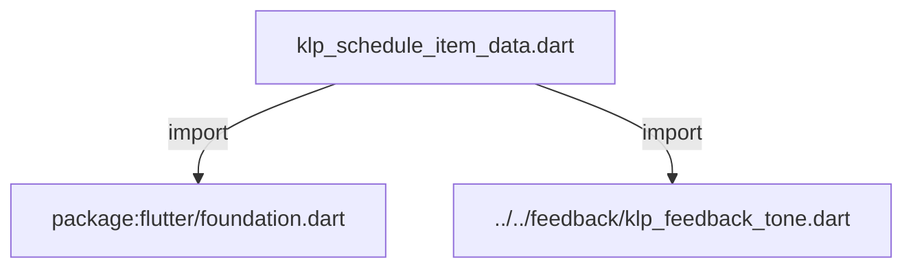
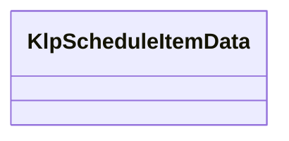

# klp_schedule_item_data.dart：直接依賴與宣告架構

[回到目錄](README.md) · [來源檔案](../../../../../../lib/src/features/collections/agenda/klp_schedule_item_data.dart)

## 範圍

核心是 `lib/src/features/collections/agenda/klp_schedule_item_data.dart`。主要視角為該檔案明寫的 import／export／part；輔助視角為本檔宣告及 extends／implements／with／on 關係。只展開一層外部邊界。

## 直接依賴圖

## 依賴證據

| 關係 | 原始 directive | 來源 |
|---|---|---|
| import | <code>import &#x27;package:flutter/foundation.dart&#x27;;</code> | [lib/src/features/collections/agenda/klp_schedule_item_data.dart:4](../../../../../../lib/src/features/collections/agenda/klp_schedule_item_data.dart#L4) |
| import | <code>import &#x27;../../feedback/klp_feedback_tone.dart&#x27;;</code> | [lib/src/features/collections/agenda/klp_schedule_item_data.dart:5](../../../../../../lib/src/features/collections/agenda/klp_schedule_item_data.dart#L5) |

## 宣告關係圖

本組節點是本檔宣告；沒有箭頭的宣告未在此圖主張互相依賴。

## 宣告與成員證據

成員包含 public 與 private；簽章取自來源，省略函式本體與欄位初始值。`(inferred)` 表示來源未明寫型別；建構子只顯示參數部分，不含初始化列表。

### KlpScheduleItemData

ClassDeclaration · public · [lib/src/features/collections/agenda/klp_schedule_item_data.dart:7](../../../../../../lib/src/features/collections/agenda/klp_schedule_item_data.dart#L7)

<code>class KlpScheduleItemData</code>

來源註解摘要：排程項目的視圖資料契約。

| 成員 | 可見性 | 簽章／型別 | 來源註解摘要 | 證據 |
|---|---|---|---|---|
| constructor <code>KlpScheduleItemData</code> | public | <code>const KlpScheduleItemData({ this.id = &#x27;&#x27;, required this.time, required this.title, this.tag, this.tone = KlpFeedbackTone.neutral, })</code> |  | [lib/src/features/collections/agenda/klp_schedule_item_data.dart:10](../../../../../../lib/src/features/collections/agenda/klp_schedule_item_data.dart#L10) |
| field <code>id</code> | public | <code>final String id</code> |  | [lib/src/features/collections/agenda/klp_schedule_item_data.dart:18](../../../../../../lib/src/features/collections/agenda/klp_schedule_item_data.dart#L18) |
| field <code>time</code> | public | <code>final String time</code> |  | [lib/src/features/collections/agenda/klp_schedule_item_data.dart:19](../../../../../../lib/src/features/collections/agenda/klp_schedule_item_data.dart#L19) |
| field <code>title</code> | public | <code>final String title</code> |  | [lib/src/features/collections/agenda/klp_schedule_item_data.dart:20](../../../../../../lib/src/features/collections/agenda/klp_schedule_item_data.dart#L20) |
| field <code>tag</code> | public | <code>final String? tag</code> |  | [lib/src/features/collections/agenda/klp_schedule_item_data.dart:21](../../../../../../lib/src/features/collections/agenda/klp_schedule_item_data.dart#L21) |
| field <code>tone</code> | public | <code>final KlpFeedbackTone tone</code> |  | [lib/src/features/collections/agenda/klp_schedule_item_data.dart:22](../../../../../../lib/src/features/collections/agenda/klp_schedule_item_data.dart#L22) |
| getter <code>label</code> | public | <code>String get label</code> |  | [lib/src/features/collections/agenda/klp_schedule_item_data.dart:24](../../../../../../lib/src/features/collections/agenda/klp_schedule_item_data.dart#L24) |

## 閱讀說明與限制

箭頭只表示來源明寫的靜態關係；import 不等於呼叫。未分析動態呼叫、欄位的實際物件擁有權、狀態轉移或渲染流程；型別未進行語意解析，繼承目標保留原始型別拼寫。public／private 依 Dart 名稱前綴判斷；public 宣告不代表已由 `lib/kallopis.dart` 匯出。

本頁由 `tool/architecture_atlas` 產生；編輯來源或生成工具後重新產生，避免手改本頁。
