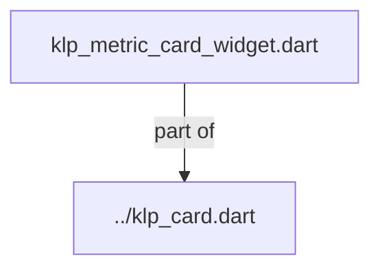
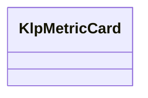
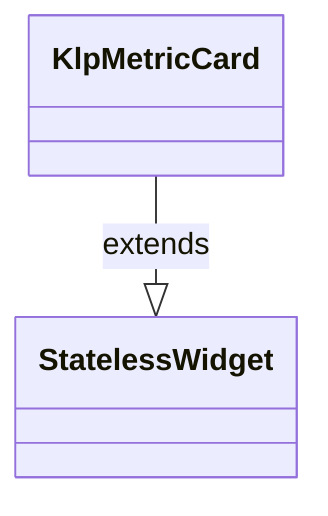

# klp_metric_card_widget.dart：直接依賴與宣告架構

[回到目錄](README.md) · [來源檔案](../../../../../../../lib/src/features/collections/card/internal/klp_metric_card_widget.dart)

## 範圍

核心是 `lib/src/features/collections/card/internal/klp_metric_card_widget.dart`。主要視角為該檔案明寫的 import／export／part；輔助視角為本檔宣告及 extends／implements／with／on 關係。只展開一層外部邊界。

## 直接依賴圖

## 依賴證據

| 關係 | 原始 directive | 來源 |
|---|---|---|
| part of | <code>part of &#x27;../klp_card.dart&#x27;;</code> | [lib/src/features/collections/card/internal/klp_metric_card_widget.dart:1](../../../../../../../lib/src/features/collections/card/internal/klp_metric_card_widget.dart#L1) |

## 宣告關係圖

本組節點是本檔宣告；沒有箭頭的宣告未在此圖主張互相依賴。

## 宣告與成員證據

成員包含 public 與 private；簽章取自來源，省略函式本體與欄位初始值。`(inferred)` 表示來源未明寫型別；建構子只顯示參數部分，不含初始化列表。

### KlpMetricCard

ClassDeclaration · public · [lib/src/features/collections/card/internal/klp_metric_card_widget.dart:3](../../../../../../../lib/src/features/collections/card/internal/klp_metric_card_widget.dart#L3)

<code>class KlpMetricCard extends StatelessWidget</code>

來源註解摘要：指標呈現卡片 (Metric Card)。 呈現標籤、核心數值、單位、趨勢箭頭、狀態說明或迷你進度長條。 支援正常（neutral/success）與違規告警（danger 具備紅色外框與文字）。

- `extends` → <code>StatelessWidget</code>：[lib/src/features/collections/card/internal/klp_metric_card_widget.dart:7](../../../../../../../lib/src/features/collections/card/internal/klp_metric_card_widget.dart#L7)

| 成員 | 可見性 | 簽章／型別 | 來源註解摘要 | 證據 |
|---|---|---|---|---|
| constructor <code>KlpMetricCard</code> | public | <code>const KlpMetricCard({ super.key, required this.label, this.value, this.unit, this.trend, this.subtitle, this.tone = KlpFeedbackTone.neutral, this.child, })</code> |  | [lib/src/features/collections/card/internal/klp_metric_card_widget.dart:8](../../../../../../../lib/src/features/collections/card/internal/klp_metric_card_widget.dart#L8) |
| field <code>label</code> | public | <code>final String label</code> | 指標標籤（如 &#x27;PASS RATE&#x27;, &#x27;P95 LATENCY&#x27;）。 | [lib/src/features/collections/card/internal/klp_metric_card_widget.dart:20](../../../../../../../lib/src/features/collections/card/internal/klp_metric_card_widget.dart#L20) |
| field <code>value</code> | public | <code>final String? value</code> | 數值（如 &#x27;98.2&#x27;, &#x27;1420&#x27;）。 | [lib/src/features/collections/card/internal/klp_metric_card_widget.dart:23](../../../../../../../lib/src/features/collections/card/internal/klp_metric_card_widget.dart#L23) |
| field <code>unit</code> | public | <code>final String? unit</code> | 數值單位（如 &#x27;%&#x27;, &#x27;ms&#x27;）。 | [lib/src/features/collections/card/internal/klp_metric_card_widget.dart:26](../../../../../../../lib/src/features/collections/card/internal/klp_metric_card_widget.dart#L26) |
| field <code>trend</code> | public | <code>final String? trend</code> | 趨勢或指標符號（如 &#x27;↑&#x27;, &#x27;↓&#x27;）。 | [lib/src/features/collections/card/internal/klp_metric_card_widget.dart:29](../../../../../../../lib/src/features/collections/card/internal/klp_metric_card_widget.dart#L29) |
| field <code>subtitle</code> | public | <code>final String? subtitle</code> | 底部說明（如 &#x27;Threshold 95%&#x27;, &#x27;Breached · threshold 800ms&#x27;）。 | [lib/src/features/collections/card/internal/klp_metric_card_widget.dart:32](../../../../../../../lib/src/features/collections/card/internal/klp_metric_card_widget.dart#L32) |
| field <code>tone</code> | public | <code>final KlpFeedbackTone tone</code> | 狀態語意色調。為 danger 時卡片邊框與數值呈現紅色。 | [lib/src/features/collections/card/internal/klp_metric_card_widget.dart:35](../../../../../../../lib/src/features/collections/card/internal/klp_metric_card_widget.dart#L35) |
| field <code>child</code> | public | <code>final Widget? child</code> | 自訂內容（如進度條）。 | [lib/src/features/collections/card/internal/klp_metric_card_widget.dart:38](../../../../../../../lib/src/features/collections/card/internal/klp_metric_card_widget.dart#L38) |
| method <code>build</code> | public | <code>Widget build(BuildContext context)</code> |  | [lib/src/features/collections/card/internal/klp_metric_card_widget.dart:40](../../../../../../../lib/src/features/collections/card/internal/klp_metric_card_widget.dart#L40) |

## 閱讀說明與限制

箭頭只表示來源明寫的靜態關係；import 不等於呼叫。未分析動態呼叫、欄位的實際物件擁有權、狀態轉移或渲染流程；型別未進行語意解析，繼承目標保留原始型別拼寫。public／private 依 Dart 名稱前綴判斷；public 宣告不代表已由 `lib/kallopis.dart` 匯出。

本頁由 `tool/architecture_atlas` 產生；編輯來源或生成工具後重新產生，避免手改本頁。
