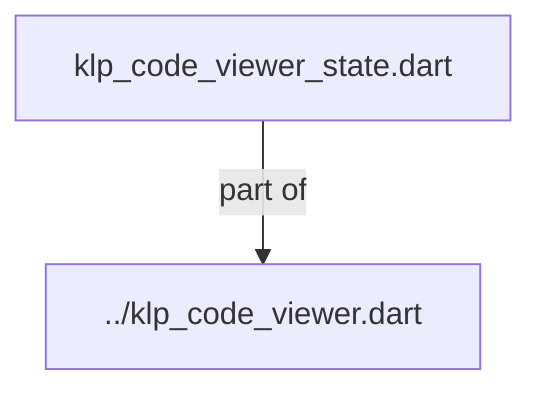
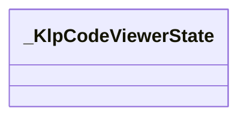
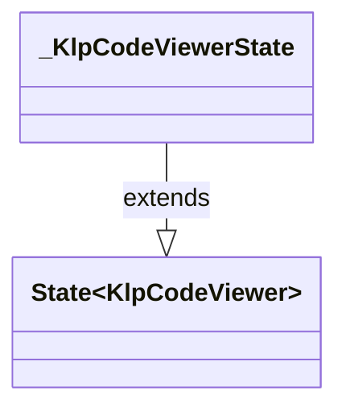

# klp_code_viewer_state.dart：直接依賴與宣告架構

[回到目錄](README.md) · [來源檔案](../../../../../../../lib/src/features/collections/code/internal/klp_code_viewer_state.dart)

## 範圍

核心是 `lib/src/features/collections/code/internal/klp_code_viewer_state.dart`。主要視角為該檔案明寫的 import／export／part；輔助視角為本檔宣告及 extends／implements／with／on 關係。只展開一層外部邊界。

## 直接依賴圖

## 依賴證據

| 關係 | 原始 directive | 來源 |
|---|---|---|
| part of | <code>part of &#x27;../klp_code_viewer.dart&#x27;;</code> | [lib/src/features/collections/code/internal/klp_code_viewer_state.dart:1](../../../../../../../lib/src/features/collections/code/internal/klp_code_viewer_state.dart#L1) |

## 宣告關係圖

本組節點是本檔宣告；沒有箭頭的宣告未在此圖主張互相依賴。

## 宣告與成員證據

成員包含 public 與 private；簽章取自來源，省略函式本體與欄位初始值。`(inferred)` 表示來源未明寫型別；建構子只顯示參數部分，不含初始化列表。

### _KlpCodeViewerState

ClassDeclaration · private · [lib/src/features/collections/code/internal/klp_code_viewer_state.dart:3](../../../../../../../lib/src/features/collections/code/internal/klp_code_viewer_state.dart#L3)

<code>class _KlpCodeViewerState extends State&lt;KlpCodeViewer&gt;</code>

- `extends` → <code>State&lt;KlpCodeViewer&gt;</code>：[lib/src/features/collections/code/internal/klp_code_viewer_state.dart:3](../../../../../../../lib/src/features/collections/code/internal/klp_code_viewer_state.dart#L3)

| 成員 | 可見性 | 簽章／型別 | 來源註解摘要 | 證據 |
|---|---|---|---|---|
| field <code>_wrapped</code> | private | <code>late bool _wrapped</code> |  | [lib/src/features/collections/code/internal/klp_code_viewer_state.dart:4](../../../../../../../lib/src/features/collections/code/internal/klp_code_viewer_state.dart#L4) |
| field <code>_showLineNumbers</code> | private | <code>late bool _showLineNumbers</code> |  | [lib/src/features/collections/code/internal/klp_code_viewer_state.dart:5](../../../../../../../lib/src/features/collections/code/internal/klp_code_viewer_state.dart#L5) |
| field <code>_expanded</code> | private | <code>late bool _expanded</code> |  | [lib/src/features/collections/code/internal/klp_code_viewer_state.dart:6](../../../../../../../lib/src/features/collections/code/internal/klp_code_viewer_state.dart#L6) |
| getter <code>_currentLanguage</code> | private | <code>KlpCodeLanguageOption? get _currentLanguage</code> |  | [lib/src/features/collections/code/internal/klp_code_viewer_state.dart:8](../../../../../../../lib/src/features/collections/code/internal/klp_code_viewer_state.dart#L8) |
| getter <code>_languageLabel</code> | private | <code>String get _languageLabel</code> |  | [lib/src/features/collections/code/internal/klp_code_viewer_state.dart:16](../../../../../../../lib/src/features/collections/code/internal/klp_code_viewer_state.dart#L16) |
| getter <code>_supportsView</code> | private | <code>bool get _supportsView</code> |  | [lib/src/features/collections/code/internal/klp_code_viewer_state.dart:23](../../../../../../../lib/src/features/collections/code/internal/klp_code_viewer_state.dart#L23) |
| method <code>initState</code> | public | <code>void initState()</code> |  | [lib/src/features/collections/code/internal/klp_code_viewer_state.dart:26](../../../../../../../lib/src/features/collections/code/internal/klp_code_viewer_state.dart#L26) |
| method <code>didUpdateWidget</code> | public | <code>void didUpdateWidget(KlpCodeViewer oldWidget)</code> |  | [lib/src/features/collections/code/internal/klp_code_viewer_state.dart:34](../../../../../../../lib/src/features/collections/code/internal/klp_code_viewer_state.dart#L34) |
| method <code>build</code> | public | <code>Widget build(BuildContext context)</code> |  | [lib/src/features/collections/code/internal/klp_code_viewer_state.dart:44](../../../../../../../lib/src/features/collections/code/internal/klp_code_viewer_state.dart#L44) |
| method <code>_buildHeader</code> | private | <code>Widget _buildHeader(_KlpCodeStyle style)</code> |  | [lib/src/features/collections/code/internal/klp_code_viewer_state.dart:58](../../../../../../../lib/src/features/collections/code/internal/klp_code_viewer_state.dart#L58) |
| method <code>_buildBody</code> | private | <code>Widget _buildBody(_KlpCodeStyle style)</code> |  | [lib/src/features/collections/code/internal/klp_code_viewer_state.dart:117](../../../../../../../lib/src/features/collections/code/internal/klp_code_viewer_state.dart#L117) |
| method <code>_resolveContent</code> | private | <code>Widget _resolveContent()</code> |  | [lib/src/features/collections/code/internal/klp_code_viewer_state.dart:127](../../../../../../../lib/src/features/collections/code/internal/klp_code_viewer_state.dart#L127) |
| method <code>_toggleExpanded</code> | private | <code>void _toggleExpanded()</code> |  | [lib/src/features/collections/code/internal/klp_code_viewer_state.dart:145](../../../../../../../lib/src/features/collections/code/internal/klp_code_viewer_state.dart#L145) |
| method <code>_openLanguageMenu</code> | private | <code>Future&lt;void&gt; _openLanguageMenu(BuildContext context)</code> |  | [lib/src/features/collections/code/internal/klp_code_viewer_state.dart:150](../../../../../../../lib/src/features/collections/code/internal/klp_code_viewer_state.dart#L150) |
| method <code>_openOptionsMenu</code> | private | <code>Future&lt;void&gt; _openOptionsMenu(BuildContext context)</code> |  | [lib/src/features/collections/code/internal/klp_code_viewer_state.dart:179](../../../../../../../lib/src/features/collections/code/internal/klp_code_viewer_state.dart#L179) |

## 閱讀說明與限制

箭頭只表示來源明寫的靜態關係；import 不等於呼叫。未分析動態呼叫、欄位的實際物件擁有權、狀態轉移或渲染流程；型別未進行語意解析，繼承目標保留原始型別拼寫。public／private 依 Dart 名稱前綴判斷；public 宣告不代表已由 `lib/kallopis.dart` 匯出。

本頁由 `tool/architecture_atlas` 產生；編輯來源或生成工具後重新產生，避免手改本頁。
