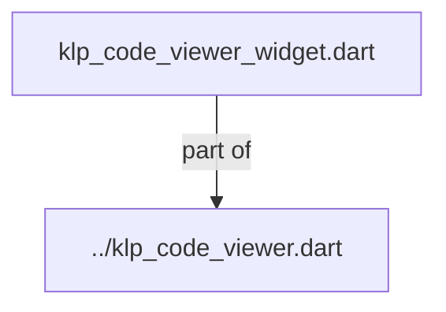
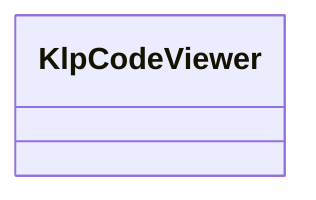
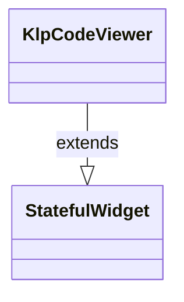

# klp_code_viewer_widget.dart：直接依賴與宣告架構

[回到目錄](README.md) · [來源檔案](../../../../../../../lib/src/features/collections/code/internal/klp_code_viewer_widget.dart)

## 範圍

核心是 `lib/src/features/collections/code/internal/klp_code_viewer_widget.dart`。主要視角為該檔案明寫的 import／export／part；輔助視角為本檔宣告及 extends／implements／with／on 關係。只展開一層外部邊界。

## 直接依賴圖

## 依賴證據

| 關係 | 原始 directive | 來源 |
|---|---|---|
| part of | <code>part of &#x27;../klp_code_viewer.dart&#x27;;</code> | [lib/src/features/collections/code/internal/klp_code_viewer_widget.dart:1](../../../../../../../lib/src/features/collections/code/internal/klp_code_viewer_widget.dart#L1) |

## 宣告關係圖

本組節點是本檔宣告；沒有箭頭的宣告未在此圖主張互相依賴。

## 宣告與成員證據

成員包含 public 與 private；簽章取自來源，省略函式本體與欄位初始值。`(inferred)` 表示來源未明寫型別；建構子只顯示參數部分，不含初始化列表。

### KlpCodeViewer

ClassDeclaration · public · [lib/src/features/collections/code/internal/klp_code_viewer_widget.dart:3](../../../../../../../lib/src/features/collections/code/internal/klp_code_viewer_widget.dart#L3)

<code>class KlpCodeViewer extends StatefulWidget</code>

- `extends` → <code>StatefulWidget</code>：[lib/src/features/collections/code/internal/klp_code_viewer_widget.dart:3](../../../../../../../lib/src/features/collections/code/internal/klp_code_viewer_widget.dart#L3)

| 成員 | 可見性 | 簽章／型別 | 來源註解摘要 | 證據 |
|---|---|---|---|---|
| constructor <code>KlpCodeViewer</code> | public | <code>const KlpCodeViewer({ super.key, required this.code, this.language, this.languageOptions = KlpCodeLanguages.options, this.labels = KlpCodeViewerLabels.english, this.showLineNumbers = false, this.startLine = 1, this.wrapped = false, this.loading = false, this.expandable = false, this.expanded = false, this.viewportLimit, this.content, this.viewSelected = false, this.onLanguageChanged, this.onToggleWrap, this.onToggleLineNumbers, this.onToggleView, this.onToggleExpand, this.onCopy, })</code> |  | [lib/src/features/collections/code/internal/klp_code_viewer_widget.dart:4](../../../../../../../lib/src/features/collections/code/internal/klp_code_viewer_widget.dart#L4) |
| field <code>code</code> | public | <code>final String code</code> |  | [lib/src/features/collections/code/internal/klp_code_viewer_widget.dart:27](../../../../../../../lib/src/features/collections/code/internal/klp_code_viewer_widget.dart#L27) |
| field <code>language</code> | public | <code>final String? language</code> |  | [lib/src/features/collections/code/internal/klp_code_viewer_widget.dart:28](../../../../../../../lib/src/features/collections/code/internal/klp_code_viewer_widget.dart#L28) |
| field <code>languageOptions</code> | public | <code>final List&lt;KlpCodeLanguageOption&gt; languageOptions</code> |  | [lib/src/features/collections/code/internal/klp_code_viewer_widget.dart:29](../../../../../../../lib/src/features/collections/code/internal/klp_code_viewer_widget.dart#L29) |
| field <code>labels</code> | public | <code>final KlpCodeViewerLabels labels</code> |  | [lib/src/features/collections/code/internal/klp_code_viewer_widget.dart:30](../../../../../../../lib/src/features/collections/code/internal/klp_code_viewer_widget.dart#L30) |
| field <code>showLineNumbers</code> | public | <code>final bool showLineNumbers</code> |  | [lib/src/features/collections/code/internal/klp_code_viewer_widget.dart:31](../../../../../../../lib/src/features/collections/code/internal/klp_code_viewer_widget.dart#L31) |
| field <code>startLine</code> | public | <code>final int startLine</code> |  | [lib/src/features/collections/code/internal/klp_code_viewer_widget.dart:32](../../../../../../../lib/src/features/collections/code/internal/klp_code_viewer_widget.dart#L32) |
| field <code>wrapped</code> | public | <code>final bool wrapped</code> |  | [lib/src/features/collections/code/internal/klp_code_viewer_widget.dart:33](../../../../../../../lib/src/features/collections/code/internal/klp_code_viewer_widget.dart#L33) |
| field <code>loading</code> | public | <code>final bool loading</code> |  | [lib/src/features/collections/code/internal/klp_code_viewer_widget.dart:34](../../../../../../../lib/src/features/collections/code/internal/klp_code_viewer_widget.dart#L34) |
| field <code>expandable</code> | public | <code>final bool expandable</code> |  | [lib/src/features/collections/code/internal/klp_code_viewer_widget.dart:35](../../../../../../../lib/src/features/collections/code/internal/klp_code_viewer_widget.dart#L35) |
| field <code>expanded</code> | public | <code>final bool expanded</code> |  | [lib/src/features/collections/code/internal/klp_code_viewer_widget.dart:36](../../../../../../../lib/src/features/collections/code/internal/klp_code_viewer_widget.dart#L36) |
| field <code>viewportLimit</code> | public | <code>final KlpCodeViewportLimit? viewportLimit</code> |  | [lib/src/features/collections/code/internal/klp_code_viewer_widget.dart:37](../../../../../../../lib/src/features/collections/code/internal/klp_code_viewer_widget.dart#L37) |
| field <code>content</code> | public | <code>final Widget? content</code> |  | [lib/src/features/collections/code/internal/klp_code_viewer_widget.dart:38](../../../../../../../lib/src/features/collections/code/internal/klp_code_viewer_widget.dart#L38) |
| field <code>viewSelected</code> | public | <code>final bool viewSelected</code> |  | [lib/src/features/collections/code/internal/klp_code_viewer_widget.dart:39](../../../../../../../lib/src/features/collections/code/internal/klp_code_viewer_widget.dart#L39) |
| field <code>onLanguageChanged</code> | public | <code>final ValueChanged&lt;String&gt;? onLanguageChanged</code> |  | [lib/src/features/collections/code/internal/klp_code_viewer_widget.dart:40](../../../../../../../lib/src/features/collections/code/internal/klp_code_viewer_widget.dart#L40) |
| field <code>onToggleWrap</code> | public | <code>final VoidCallback? onToggleWrap</code> |  | [lib/src/features/collections/code/internal/klp_code_viewer_widget.dart:41](../../../../../../../lib/src/features/collections/code/internal/klp_code_viewer_widget.dart#L41) |
| field <code>onToggleLineNumbers</code> | public | <code>final VoidCallback? onToggleLineNumbers</code> |  | [lib/src/features/collections/code/internal/klp_code_viewer_widget.dart:42](../../../../../../../lib/src/features/collections/code/internal/klp_code_viewer_widget.dart#L42) |
| field <code>onToggleView</code> | public | <code>final VoidCallback? onToggleView</code> |  | [lib/src/features/collections/code/internal/klp_code_viewer_widget.dart:43](../../../../../../../lib/src/features/collections/code/internal/klp_code_viewer_widget.dart#L43) |
| field <code>onToggleExpand</code> | public | <code>final VoidCallback? onToggleExpand</code> |  | [lib/src/features/collections/code/internal/klp_code_viewer_widget.dart:44](../../../../../../../lib/src/features/collections/code/internal/klp_code_viewer_widget.dart#L44) |
| field <code>onCopy</code> | public | <code>final VoidCallback? onCopy</code> |  | [lib/src/features/collections/code/internal/klp_code_viewer_widget.dart:45](../../../../../../../lib/src/features/collections/code/internal/klp_code_viewer_widget.dart#L45) |
| method <code>createState</code> | public | <code>State&lt;KlpCodeViewer&gt; createState()</code> |  | [lib/src/features/collections/code/internal/klp_code_viewer_widget.dart:47](../../../../../../../lib/src/features/collections/code/internal/klp_code_viewer_widget.dart#L47) |

## 閱讀說明與限制

箭頭只表示來源明寫的靜態關係；import 不等於呼叫。未分析動態呼叫、欄位的實際物件擁有權、狀態轉移或渲染流程；型別未進行語意解析，繼承目標保留原始型別拼寫。public／private 依 Dart 名稱前綴判斷；public 宣告不代表已由 `lib/kallopis.dart` 匯出。

本頁由 `tool/architecture_atlas` 產生；編輯來源或生成工具後重新產生，避免手改本頁。
