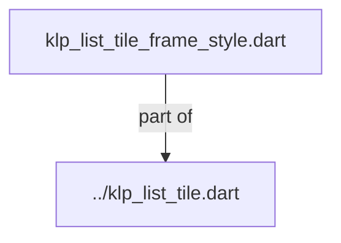
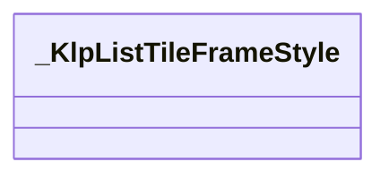

# klp_list_tile_frame_style.dart：直接依賴與宣告架構

[回到目錄](README.md) · [來源檔案](../../../../../../../lib/src/features/collections/list_tile/primitives/klp_list_tile_frame_style.dart)

## 範圍

核心是 `lib/src/features/collections/list_tile/primitives/klp_list_tile_frame_style.dart`。主要視角為該檔案明寫的 import／export／part；輔助視角為本檔宣告及 extends／implements／with／on 關係。只展開一層外部邊界。

## 直接依賴圖

## 依賴證據

| 關係 | 原始 directive | 來源 |
|---|---|---|
| part of | <code>part of &#x27;../klp_list_tile.dart&#x27;;</code> | [lib/src/features/collections/list_tile/primitives/klp_list_tile_frame_style.dart:1](../../../../../../../lib/src/features/collections/list_tile/primitives/klp_list_tile_frame_style.dart#L1) |

## 宣告關係圖

本組節點是本檔宣告；沒有箭頭的宣告未在此圖主張互相依賴。

## 宣告與成員證據

成員包含 public 與 private；簽章取自來源，省略函式本體與欄位初始值。`(inferred)` 表示來源未明寫型別；建構子只顯示參數部分，不含初始化列表。

### _KlpListTileFrameStyle

ClassDeclaration · private · [lib/src/features/collections/list_tile/primitives/klp_list_tile_frame_style.dart:3](../../../../../../../lib/src/features/collections/list_tile/primitives/klp_list_tile_frame_style.dart#L3)

<code>final class _KlpListTileFrameStyle</code>

來源註解摘要：已由 theme 解析的 ListTile 表面風格。

| 成員 | 可見性 | 簽章／型別 | 來源註解摘要 | 證據 |
|---|---|---|---|---|
| constructor <code>_KlpListTileFrameStyle</code> | private | <code>const _KlpListTileFrameStyle({ required this.background, required this.highlight, required this.clear, required this.radius, required this.height, required this.padding, })</code> |  | [lib/src/features/collections/list_tile/primitives/klp_list_tile_frame_style.dart:5](../../../../../../../lib/src/features/collections/list_tile/primitives/klp_list_tile_frame_style.dart#L5) |
| constructor <code>resolve</code> | public | <code>factory _KlpListTileFrameStyle.resolve( BuildContext context, { required KlpFeedbackTone? tone, required bool selected, required bool compact, })</code> |  | [lib/src/features/collections/list_tile/primitives/klp_list_tile_frame_style.dart:14](../../../../../../../lib/src/features/collections/list_tile/primitives/klp_list_tile_frame_style.dart#L14) |
| field <code>background</code> | public | <code>final Color background</code> |  | [lib/src/features/collections/list_tile/primitives/klp_list_tile_frame_style.dart:50](../../../../../../../lib/src/features/collections/list_tile/primitives/klp_list_tile_frame_style.dart#L50) |
| field <code>highlight</code> | public | <code>final Color highlight</code> |  | [lib/src/features/collections/list_tile/primitives/klp_list_tile_frame_style.dart:51](../../../../../../../lib/src/features/collections/list_tile/primitives/klp_list_tile_frame_style.dart#L51) |
| field <code>clear</code> | public | <code>final Color clear</code> |  | [lib/src/features/collections/list_tile/primitives/klp_list_tile_frame_style.dart:52](../../../../../../../lib/src/features/collections/list_tile/primitives/klp_list_tile_frame_style.dart#L52) |
| field <code>radius</code> | public | <code>final double radius</code> |  | [lib/src/features/collections/list_tile/primitives/klp_list_tile_frame_style.dart:53](../../../../../../../lib/src/features/collections/list_tile/primitives/klp_list_tile_frame_style.dart#L53) |
| field <code>height</code> | public | <code>final double? height</code> |  | [lib/src/features/collections/list_tile/primitives/klp_list_tile_frame_style.dart:54](../../../../../../../lib/src/features/collections/list_tile/primitives/klp_list_tile_frame_style.dart#L54) |
| field <code>padding</code> | public | <code>final EdgeInsetsGeometry padding</code> |  | [lib/src/features/collections/list_tile/primitives/klp_list_tile_frame_style.dart:55](../../../../../../../lib/src/features/collections/list_tile/primitives/klp_list_tile_frame_style.dart#L55) |

## 閱讀說明與限制

箭頭只表示來源明寫的靜態關係；import 不等於呼叫。未分析動態呼叫、欄位的實際物件擁有權、狀態轉移或渲染流程；型別未進行語意解析，繼承目標保留原始型別拼寫。public／private 依 Dart 名稱前綴判斷；public 宣告不代表已由 `lib/kallopis.dart` 匯出。

本頁由 `tool/architecture_atlas` 產生；編輯來源或生成工具後重新產生，避免手改本頁。
