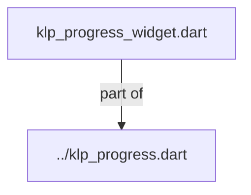
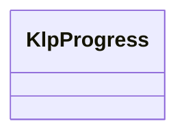
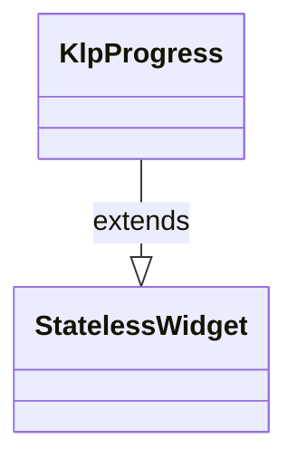

# klp_progress_widget.dart：直接依賴與宣告架構

[回到目錄](README.md) · [來源檔案](../../../../../../../lib/src/features/collections/progress/internal/klp_progress_widget.dart)

## 範圍

核心是 `lib/src/features/collections/progress/internal/klp_progress_widget.dart`。主要視角為該檔案明寫的 import／export／part；輔助視角為本檔宣告及 extends／implements／with／on 關係。只展開一層外部邊界。

## 直接依賴圖

## 依賴證據

| 關係 | 原始 directive | 來源 |
|---|---|---|
| part of | <code>part of &#x27;../klp_progress.dart&#x27;;</code> | [lib/src/features/collections/progress/internal/klp_progress_widget.dart:1](../../../../../../../lib/src/features/collections/progress/internal/klp_progress_widget.dart#L1) |

## 宣告關係圖

本組節點是本檔宣告；沒有箭頭的宣告未在此圖主張互相依賴。

## 宣告與成員證據

成員包含 public 與 private；簽章取自來源，省略函式本體與欄位初始值。`(inferred)` 表示來源未明寫型別；建構子只顯示參數部分，不含初始化列表。

### KlpProgress

ClassDeclaration · public · [lib/src/features/collections/progress/internal/klp_progress_widget.dart:3](../../../../../../../lib/src/features/collections/progress/internal/klp_progress_widget.dart#L3)

<code>class KlpProgress extends StatelessWidget</code>

來源註解摘要：呈現確定或未確定比例的通用進度資訊。

- `extends` → <code>StatelessWidget</code>：[lib/src/features/collections/progress/internal/klp_progress_widget.dart:4](../../../../../../../lib/src/features/collections/progress/internal/klp_progress_widget.dart#L4)

| 成員 | 可見性 | 簽章／型別 | 來源註解摘要 | 證據 |
|---|---|---|---|---|
| constructor <code>KlpProgress</code> | public | <code>const KlpProgress({ super.key, this.value, this.label, this.trailing, @Deprecated(&#x27;KlpProgress 使用連續軌道，segments 不影響呈現。&#x27;) this.segments = 12, this.detail, this.state = KlpProgressState.active, this.onCancel, this.cancelLabel = &#x27;Cancel&#x27;, })</code> |  | [lib/src/features/collections/progress/internal/klp_progress_widget.dart:5](../../../../../../../lib/src/features/collections/progress/internal/klp_progress_widget.dart#L5) |
| field <code>value</code> | public | <code>final double? value</code> | 介於 0 至 1 的資料比例；超出範圍時會被截斷。 | [lib/src/features/collections/progress/internal/klp_progress_widget.dart:19](../../../../../../../lib/src/features/collections/progress/internal/klp_progress_widget.dart#L19) |
| field <code>label</code> | public | <code>final String? label</code> |  | [lib/src/features/collections/progress/internal/klp_progress_widget.dart:20](../../../../../../../lib/src/features/collections/progress/internal/klp_progress_widget.dart#L20) |
| field <code>trailing</code> | public | <code>final String? trailing</code> |  | [lib/src/features/collections/progress/internal/klp_progress_widget.dart:21](../../../../../../../lib/src/features/collections/progress/internal/klp_progress_widget.dart#L21) |
| field <code>segments</code> | public | <code>final int segments</code> | 僅為舊版相容保留；連續進度軌道不使用分段數。 | [lib/src/features/collections/progress/internal/klp_progress_widget.dart:25](../../../../../../../lib/src/features/collections/progress/internal/klp_progress_widget.dart#L25) |
| field <code>detail</code> | public | <code>final String? detail</code> |  | [lib/src/features/collections/progress/internal/klp_progress_widget.dart:27](../../../../../../../lib/src/features/collections/progress/internal/klp_progress_widget.dart#L27) |
| field <code>state</code> | public | <code>final KlpProgressState state</code> |  | [lib/src/features/collections/progress/internal/klp_progress_widget.dart:28](../../../../../../../lib/src/features/collections/progress/internal/klp_progress_widget.dart#L28) |
| field <code>onCancel</code> | public | <code>final VoidCallback? onCancel</code> |  | [lib/src/features/collections/progress/internal/klp_progress_widget.dart:29](../../../../../../../lib/src/features/collections/progress/internal/klp_progress_widget.dart#L29) |
| field <code>cancelLabel</code> | public | <code>final String cancelLabel</code> |  | [lib/src/features/collections/progress/internal/klp_progress_widget.dart:30](../../../../../../../lib/src/features/collections/progress/internal/klp_progress_widget.dart#L30) |
| method <code>build</code> | public | <code>Widget build(BuildContext context)</code> |  | [lib/src/features/collections/progress/internal/klp_progress_widget.dart:32](../../../../../../../lib/src/features/collections/progress/internal/klp_progress_widget.dart#L32) |

## 閱讀說明與限制

箭頭只表示來源明寫的靜態關係；import 不等於呼叫。未分析動態呼叫、欄位的實際物件擁有權、狀態轉移或渲染流程；型別未進行語意解析，繼承目標保留原始型別拼寫。public／private 依 Dart 名稱前綴判斷；public 宣告不代表已由 `lib/kallopis.dart` 匯出。

本頁由 `tool/architecture_atlas` 產生；編輯來源或生成工具後重新產生，避免手改本頁。
