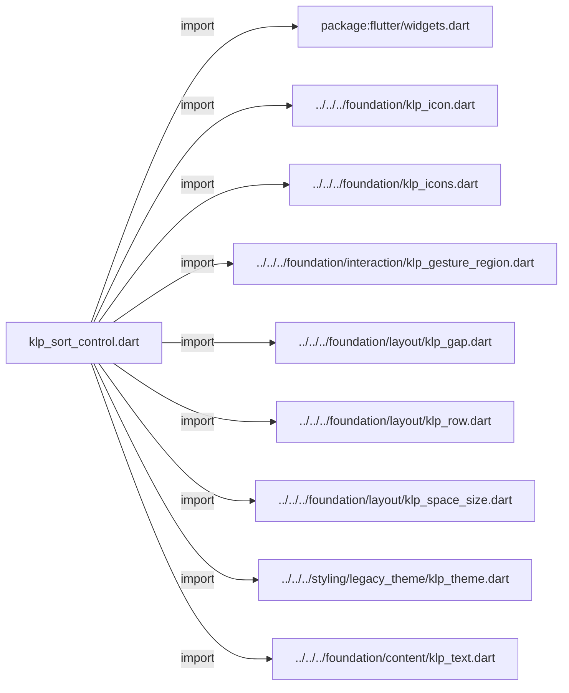
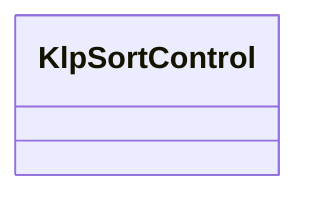
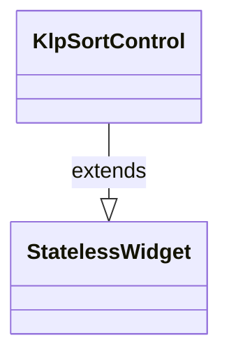

# klp_sort_control.dart：直接依賴與宣告架構

[回到目錄](README.md) · [來源檔案](../../../../../../lib/src/features/collections/sort_control/klp_sort_control.dart)

## 範圍

核心是 `lib/src/features/collections/sort_control/klp_sort_control.dart`。主要視角為該檔案明寫的 import／export／part；輔助視角為本檔宣告及 extends／implements／with／on 關係。只展開一層外部邊界。

## 直接依賴圖

## 依賴證據

| 關係 | 原始 directive | 來源 |
|---|---|---|
| import | <code>import &#x27;package:flutter/widgets.dart&#x27;;</code> | [lib/src/features/collections/sort_control/klp_sort_control.dart:1](../../../../../../lib/src/features/collections/sort_control/klp_sort_control.dart#L1) |
| import | <code>import &#x27;../../../foundation/klp_icon.dart&#x27;;</code> | [lib/src/features/collections/sort_control/klp_sort_control.dart:3](../../../../../../lib/src/features/collections/sort_control/klp_sort_control.dart#L3) |
| import | <code>import &#x27;../../../foundation/klp_icons.dart&#x27;;</code> | [lib/src/features/collections/sort_control/klp_sort_control.dart:4](../../../../../../lib/src/features/collections/sort_control/klp_sort_control.dart#L4) |
| import | <code>import &#x27;../../../foundation/interaction/klp_gesture_region.dart&#x27;;</code> | [lib/src/features/collections/sort_control/klp_sort_control.dart:5](../../../../../../lib/src/features/collections/sort_control/klp_sort_control.dart#L5) |
| import | <code>import &#x27;../../../foundation/layout/klp_gap.dart&#x27;;</code> | [lib/src/features/collections/sort_control/klp_sort_control.dart:6](../../../../../../lib/src/features/collections/sort_control/klp_sort_control.dart#L6) |
| import | <code>import &#x27;../../../foundation/layout/klp_row.dart&#x27;;</code> | [lib/src/features/collections/sort_control/klp_sort_control.dart:7](../../../../../../lib/src/features/collections/sort_control/klp_sort_control.dart#L7) |
| import | <code>import &#x27;../../../foundation/layout/klp_space_size.dart&#x27;;</code> | [lib/src/features/collections/sort_control/klp_sort_control.dart:8](../../../../../../lib/src/features/collections/sort_control/klp_sort_control.dart#L8) |
| import | <code>import &#x27;../../../styling/legacy_theme/klp_theme.dart&#x27;;</code> | [lib/src/features/collections/sort_control/klp_sort_control.dart:9](../../../../../../lib/src/features/collections/sort_control/klp_sort_control.dart#L9) |
| import | <code>import &#x27;../../../foundation/content/klp_text.dart&#x27;;</code> | [lib/src/features/collections/sort_control/klp_sort_control.dart:10](../../../../../../lib/src/features/collections/sort_control/klp_sort_control.dart#L10) |

## 宣告關係圖

本組節點是本檔宣告；沒有箭頭的宣告未在此圖主張互相依賴。

## 宣告與成員證據

成員包含 public 與 private；簽章取自來源，省略函式本體與欄位初始值。`(inferred)` 表示來源未明寫型別；建構子只顯示參數部分，不含初始化列表。

### KlpSortControl

ClassDeclaration · public · [lib/src/features/collections/sort_control/klp_sort_control.dart:12](../../../../../../lib/src/features/collections/sort_control/klp_sort_control.dart#L12)

<code>class KlpSortControl extends StatelessWidget</code>

來源註解摘要：顯示目前方向並將排序切換事件交還呼叫端的中性控制項。

- `extends` → <code>StatelessWidget</code>：[lib/src/features/collections/sort_control/klp_sort_control.dart:13](../../../../../../lib/src/features/collections/sort_control/klp_sort_control.dart#L13)

| 成員 | 可見性 | 簽章／型別 | 來源註解摘要 | 證據 |
|---|---|---|---|---|
| constructor <code>KlpSortControl</code> | public | <code>const KlpSortControl({ super.key, required this.label, required this.ascending, required this.onPressed, this.icon, })</code> |  | [lib/src/features/collections/sort_control/klp_sort_control.dart:14](../../../../../../lib/src/features/collections/sort_control/klp_sort_control.dart#L14) |
| field <code>label</code> | public | <code>final String label</code> |  | [lib/src/features/collections/sort_control/klp_sort_control.dart:22](../../../../../../lib/src/features/collections/sort_control/klp_sort_control.dart#L22) |
| field <code>ascending</code> | public | <code>final bool ascending</code> |  | [lib/src/features/collections/sort_control/klp_sort_control.dart:23](../../../../../../lib/src/features/collections/sort_control/klp_sort_control.dart#L23) |
| field <code>onPressed</code> | public | <code>final VoidCallback? onPressed</code> |  | [lib/src/features/collections/sort_control/klp_sort_control.dart:24](../../../../../../lib/src/features/collections/sort_control/klp_sort_control.dart#L24) |
| field <code>icon</code> | public | <code>final KlpIconData? icon</code> |  | [lib/src/features/collections/sort_control/klp_sort_control.dart:25](../../../../../../lib/src/features/collections/sort_control/klp_sort_control.dart#L25) |
| method <code>build</code> | public | <code>Widget build(BuildContext context)</code> |  | [lib/src/features/collections/sort_control/klp_sort_control.dart:27](../../../../../../lib/src/features/collections/sort_control/klp_sort_control.dart#L27) |

## 閱讀說明與限制

箭頭只表示來源明寫的靜態關係；import 不等於呼叫。未分析動態呼叫、欄位的實際物件擁有權、狀態轉移或渲染流程；型別未進行語意解析，繼承目標保留原始型別拼寫。public／private 依 Dart 名稱前綴判斷；public 宣告不代表已由 `lib/kallopis.dart` 匯出。

本頁由 `tool/architecture_atlas` 產生；編輯來源或生成工具後重新產生，避免手改本頁。
