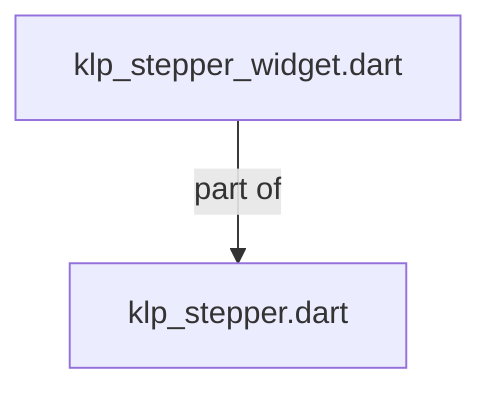
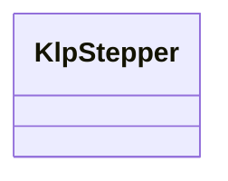
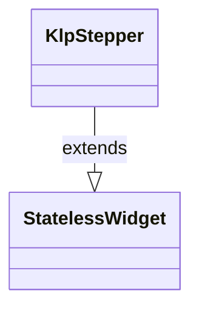

# klp_stepper_widget.dart：直接依賴與宣告架構

[回到目錄](README.md) · [來源檔案](../../../../../../lib/src/features/collections/stepper/klp_stepper_widget.dart)

## 範圍

核心是 `lib/src/features/collections/stepper/klp_stepper_widget.dart`。主要視角為該檔案明寫的 import／export／part；輔助視角為本檔宣告及 extends／implements／with／on 關係。只展開一層外部邊界。

## 直接依賴圖

## 依賴證據

| 關係 | 原始 directive | 來源 |
|---|---|---|
| part of | <code>part of &#x27;klp_stepper.dart&#x27;;</code> | [lib/src/features/collections/stepper/klp_stepper_widget.dart:1](../../../../../../lib/src/features/collections/stepper/klp_stepper_widget.dart#L1) |

## 宣告關係圖

本組節點是本檔宣告；沒有箭頭的宣告未在此圖主張互相依賴。

## 宣告與成員證據

成員包含 public 與 private；簽章取自來源，省略函式本體與欄位初始值。`(inferred)` 表示來源未明寫型別；建構子只顯示參數部分，不含初始化列表。

### KlpStepper

ClassDeclaration · public · [lib/src/features/collections/stepper/klp_stepper_widget.dart:3](../../../../../../lib/src/features/collections/stepper/klp_stepper_widget.dart#L3)

<code>class KlpStepper extends StatelessWidget</code>

來源註解摘要：步驟流程指示。依 [currentIndex] 把 [steps] 分成已完成／進行中／未開始三態。 純顯示元件——不持有互動狀態，也不處理點擊；切換到下一步是呼叫端更新 [currentIndex] 後重建的結果。[direction] 決定排列方向。

- `extends` → <code>StatelessWidget</code>：[lib/src/features/collections/stepper/klp_stepper_widget.dart:7](../../../../../../lib/src/features/collections/stepper/klp_stepper_widget.dart#L7)

| 成員 | 可見性 | 簽章／型別 | 來源註解摘要 | 證據 |
|---|---|---|---|---|
| constructor <code>KlpStepper</code> | public | <code>const KlpStepper({ super.key, required this.steps, required this.currentIndex, this.direction = KlpStepperDirection.horizontal, })</code> |  | [lib/src/features/collections/stepper/klp_stepper_widget.dart:8](../../../../../../lib/src/features/collections/stepper/klp_stepper_widget.dart#L8) |
| field <code>steps</code> | public | <code>final List&lt;KlpStepData&gt; steps</code> |  | [lib/src/features/collections/stepper/klp_stepper_widget.dart:15](../../../../../../lib/src/features/collections/stepper/klp_stepper_widget.dart#L15) |
| field <code>currentIndex</code> | public | <code>final int currentIndex</code> |  | [lib/src/features/collections/stepper/klp_stepper_widget.dart:16](../../../../../../lib/src/features/collections/stepper/klp_stepper_widget.dart#L16) |
| field <code>direction</code> | public | <code>final KlpStepperDirection direction</code> |  | [lib/src/features/collections/stepper/klp_stepper_widget.dart:17](../../../../../../lib/src/features/collections/stepper/klp_stepper_widget.dart#L17) |
| method <code>build</code> | public | <code>Widget build(BuildContext context)</code> |  | [lib/src/features/collections/stepper/klp_stepper_widget.dart:19](../../../../../../lib/src/features/collections/stepper/klp_stepper_widget.dart#L19) |

## 閱讀說明與限制

箭頭只表示來源明寫的靜態關係；import 不等於呼叫。未分析動態呼叫、欄位的實際物件擁有權、狀態轉移或渲染流程；型別未進行語意解析，繼承目標保留原始型別拼寫。public／private 依 Dart 名稱前綴判斷；public 宣告不代表已由 `lib/kallopis.dart` 匯出。

本頁由 `tool/architecture_atlas` 產生；編輯來源或生成工具後重新產生，避免手改本頁。
