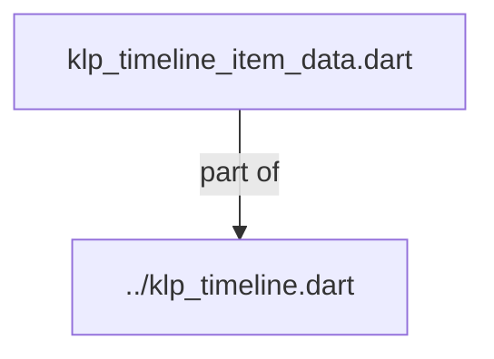
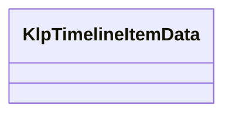

# klp_timeline_item_data.dart：直接依賴與宣告架構

[回到目錄](README.md) · [來源檔案](../../../../../../../lib/src/features/collections/timeline/models/klp_timeline_item_data.dart)

## 範圍

核心是 `lib/src/features/collections/timeline/models/klp_timeline_item_data.dart`。主要視角為該檔案明寫的 import／export／part；輔助視角為本檔宣告及 extends／implements／with／on 關係。只展開一層外部邊界。

## 直接依賴圖

## 依賴證據

| 關係 | 原始 directive | 來源 |
|---|---|---|
| part of | <code>part of &#x27;../klp_timeline.dart&#x27;;</code> | [lib/src/features/collections/timeline/models/klp_timeline_item_data.dart:1](../../../../../../../lib/src/features/collections/timeline/models/klp_timeline_item_data.dart#L1) |

## 宣告關係圖

本組節點是本檔宣告；沒有箭頭的宣告未在此圖主張互相依賴。

## 宣告與成員證據

成員包含 public 與 private；簽章取自來源，省略函式本體與欄位初始值。`(inferred)` 表示來源未明寫型別；建構子只顯示參數部分，不含初始化列表。

### KlpTimelineItemData

ClassDeclaration · public · [lib/src/features/collections/timeline/models/klp_timeline_item_data.dart:3](../../../../../../../lib/src/features/collections/timeline/models/klp_timeline_item_data.dart#L3)

<code>class KlpTimelineItemData</code>

來源註解摘要：時間軸上的一個事件。 [marker] 為 `null` 時使用預設圓點；需要客製標記（例如放圖示）時提供這個 slot， 而不是加一堆布林參數去描述「這是哪一種標記」。[highlighted] 只改變預設圓點的 顏色深淺，不表達產品語意（不是「成功」或「危險」那種狀態）。

| 成員 | 可見性 | 簽章／型別 | 來源註解摘要 | 證據 |
|---|---|---|---|---|
| constructor <code>KlpTimelineItemData</code> | public | <code>const KlpTimelineItemData({ required this.title, this.time, this.content, this.marker, this.highlighted = false, })</code> |  | [lib/src/features/collections/timeline/models/klp_timeline_item_data.dart:10](../../../../../../../lib/src/features/collections/timeline/models/klp_timeline_item_data.dart#L10) |
| field <code>title</code> | public | <code>final String title</code> |  | [lib/src/features/collections/timeline/models/klp_timeline_item_data.dart:18](../../../../../../../lib/src/features/collections/timeline/models/klp_timeline_item_data.dart#L18) |
| field <code>time</code> | public | <code>final String? time</code> |  | [lib/src/features/collections/timeline/models/klp_timeline_item_data.dart:19](../../../../../../../lib/src/features/collections/timeline/models/klp_timeline_item_data.dart#L19) |
| field <code>content</code> | public | <code>final Widget? content</code> |  | [lib/src/features/collections/timeline/models/klp_timeline_item_data.dart:20](../../../../../../../lib/src/features/collections/timeline/models/klp_timeline_item_data.dart#L20) |
| field <code>marker</code> | public | <code>final Widget? marker</code> |  | [lib/src/features/collections/timeline/models/klp_timeline_item_data.dart:21](../../../../../../../lib/src/features/collections/timeline/models/klp_timeline_item_data.dart#L21) |
| field <code>highlighted</code> | public | <code>final bool highlighted</code> |  | [lib/src/features/collections/timeline/models/klp_timeline_item_data.dart:22](../../../../../../../lib/src/features/collections/timeline/models/klp_timeline_item_data.dart#L22) |

## 閱讀說明與限制

箭頭只表示來源明寫的靜態關係；import 不等於呼叫。未分析動態呼叫、欄位的實際物件擁有權、狀態轉移或渲染流程；型別未進行語意解析，繼承目標保留原始型別拼寫。public／private 依 Dart 名稱前綴判斷；public 宣告不代表已由 `lib/kallopis.dart` 匯出。

本頁由 `tool/architecture_atlas` 產生；編輯來源或生成工具後重新產生，避免手改本頁。
