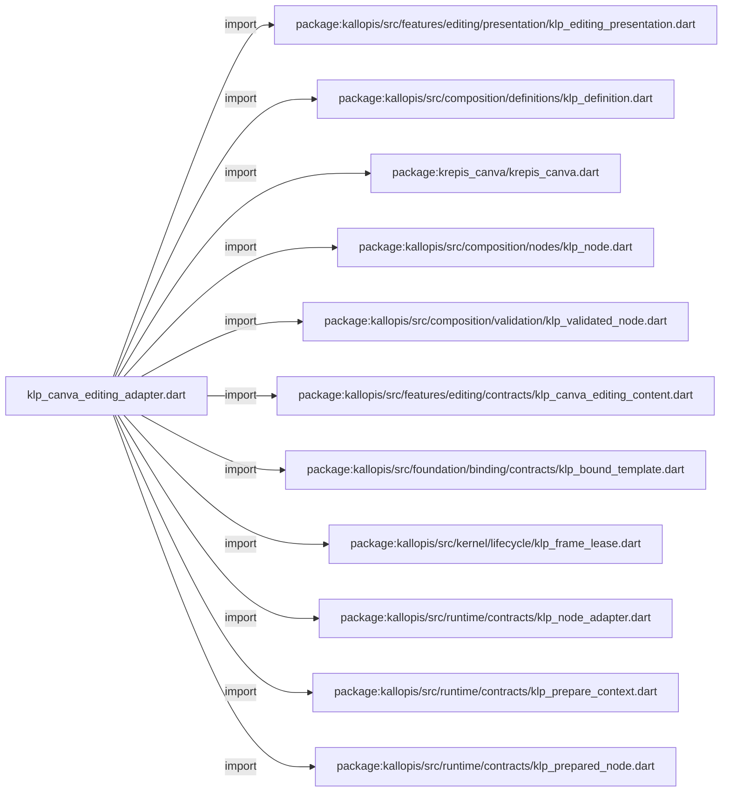
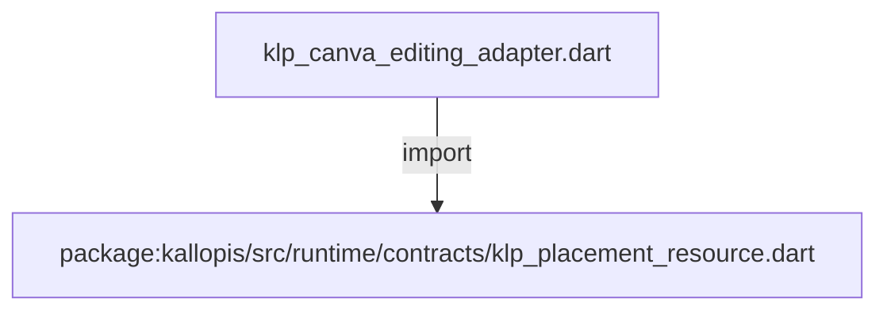
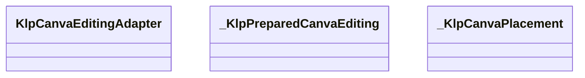
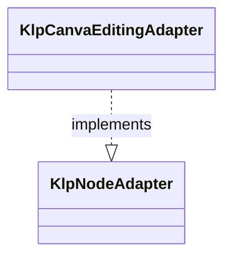
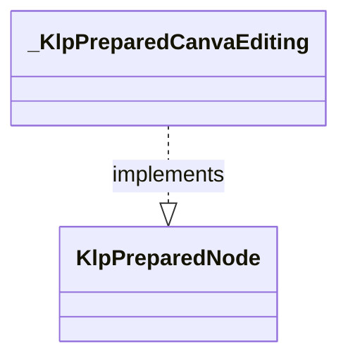
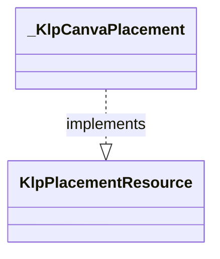

# klp_canva_editing_adapter.dart：直接依賴與宣告架構

[回到目錄](README.md) · [來源檔案](../../../../../../lib/src/features/editing/adapters/klp_canva_editing_adapter.dart)

## 範圍

核心是 `lib/src/features/editing/adapters/klp_canva_editing_adapter.dart`。主要視角為該檔案明寫的 import／export／part；輔助視角為本檔宣告及 extends／implements／with／on 關係。只展開一層外部邊界。

## 直接依賴圖

## 依賴證據

| 關係 | 原始 directive | 來源 |
|---|---|---|
| import | <code>import &#x27;package:kallopis/src/features/editing/presentation/klp_editing_presentation.dart&#x27;;</code> | [lib/src/features/editing/adapters/klp_canva_editing_adapter.dart:1](../../../../../../lib/src/features/editing/adapters/klp_canva_editing_adapter.dart#L1) |
| import | <code>import &#x27;package:kallopis/src/composition/definitions/klp_definition.dart&#x27;;</code> | [lib/src/features/editing/adapters/klp_canva_editing_adapter.dart:2](../../../../../../lib/src/features/editing/adapters/klp_canva_editing_adapter.dart#L2) |
| import | <code>import &#x27;package:krepis_canva/krepis_canva.dart&#x27;;</code> | [lib/src/features/editing/adapters/klp_canva_editing_adapter.dart:3](../../../../../../lib/src/features/editing/adapters/klp_canva_editing_adapter.dart#L3) |
| import | <code>import &#x27;package:kallopis/src/composition/nodes/klp_node.dart&#x27;;</code> | [lib/src/features/editing/adapters/klp_canva_editing_adapter.dart:4](../../../../../../lib/src/features/editing/adapters/klp_canva_editing_adapter.dart#L4) |
| import | <code>import &#x27;package:kallopis/src/composition/validation/klp_validated_node.dart&#x27;;</code> | [lib/src/features/editing/adapters/klp_canva_editing_adapter.dart:5](../../../../../../lib/src/features/editing/adapters/klp_canva_editing_adapter.dart#L5) |
| import | <code>import &#x27;package:kallopis/src/features/editing/contracts/klp_canva_editing_content.dart&#x27;;</code> | [lib/src/features/editing/adapters/klp_canva_editing_adapter.dart:6](../../../../../../lib/src/features/editing/adapters/klp_canva_editing_adapter.dart#L6) |
| import | <code>import &#x27;package:kallopis/src/foundation/binding/contracts/klp_bound_template.dart&#x27;;</code> | [lib/src/features/editing/adapters/klp_canva_editing_adapter.dart:7](../../../../../../lib/src/features/editing/adapters/klp_canva_editing_adapter.dart#L7) |
| import | <code>import &#x27;package:kallopis/src/kernel/lifecycle/klp_frame_lease.dart&#x27;;</code> | [lib/src/features/editing/adapters/klp_canva_editing_adapter.dart:8](../../../../../../lib/src/features/editing/adapters/klp_canva_editing_adapter.dart#L8) |
| import | <code>import &#x27;package:kallopis/src/runtime/contracts/klp_node_adapter.dart&#x27;;</code> | [lib/src/features/editing/adapters/klp_canva_editing_adapter.dart:9](../../../../../../lib/src/features/editing/adapters/klp_canva_editing_adapter.dart#L9) |
| import | <code>import &#x27;package:kallopis/src/runtime/contracts/klp_prepare_context.dart&#x27;;</code> | [lib/src/features/editing/adapters/klp_canva_editing_adapter.dart:10](../../../../../../lib/src/features/editing/adapters/klp_canva_editing_adapter.dart#L10) |
| import | <code>import &#x27;package:kallopis/src/runtime/contracts/klp_prepared_node.dart&#x27;;</code> | [lib/src/features/editing/adapters/klp_canva_editing_adapter.dart:11](../../../../../../lib/src/features/editing/adapters/klp_canva_editing_adapter.dart#L11) |
| import | <code>import &#x27;package:kallopis/src/runtime/contracts/klp_placement_resource.dart&#x27;;</code> | [lib/src/features/editing/adapters/klp_canva_editing_adapter.dart:12](../../../../../../lib/src/features/editing/adapters/klp_canva_editing_adapter.dart#L12) |

## 宣告關係圖

本組節點是本檔宣告；沒有箭頭的宣告未在此圖主張互相依賴。

## 宣告與成員證據

成員包含 public 與 private；簽章取自來源，省略函式本體與欄位初始值。`(inferred)` 表示來源未明寫型別；建構子只顯示參數部分，不含初始化列表。

### KlpCanvaEditingAdapter

ClassDeclaration · public · [lib/src/features/editing/adapters/klp_canva_editing_adapter.dart:14](../../../../../../lib/src/features/editing/adapters/klp_canva_editing_adapter.dart#L14)

<code>final class KlpCanvaEditingAdapter implements KlpNodeAdapter</code>

來源註解摘要：內建 Canva 節點的語意與準備資料轉接器；借用上游畫布 controller，不擁有文件或保存權威。

- `implements` → <code>KlpNodeAdapter</code>：[lib/src/features/editing/adapters/klp_canva_editing_adapter.dart:15](../../../../../../lib/src/features/editing/adapters/klp_canva_editing_adapter.dart#L15)

| 成員 | 可見性 | 簽章／型別 | 來源註解摘要 | 證據 |
|---|---|---|---|---|
| getter <code>contract</code> | public | <code>KlpDefinition&lt;KlpNode&gt; get contract</code> |  | [lib/src/features/editing/adapters/klp_canva_editing_adapter.dart:16](../../../../../../lib/src/features/editing/adapters/klp_canva_editing_adapter.dart#L16) |
| method <code>prepare</code> | public | <code>KlpPreparedNode prepare( KlpNode node, KlpValidatedNode snapshot, KlpPrepareContext context, )</code> |  | [lib/src/features/editing/adapters/klp_canva_editing_adapter.dart:20](../../../../../../lib/src/features/editing/adapters/klp_canva_editing_adapter.dart#L20) |

### _KlpPreparedCanvaEditing

ClassDeclaration · private · [lib/src/features/editing/adapters/klp_canva_editing_adapter.dart:28](../../../../../../lib/src/features/editing/adapters/klp_canva_editing_adapter.dart#L28)

<code>final class _KlpPreparedCanvaEditing implements KlpPreparedNode</code>

- `implements` → <code>KlpPreparedNode</code>：[lib/src/features/editing/adapters/klp_canva_editing_adapter.dart:28](../../../../../../lib/src/features/editing/adapters/klp_canva_editing_adapter.dart#L28)

| 成員 | 可見性 | 簽章／型別 | 來源註解摘要 | 證據 |
|---|---|---|---|---|
| field <code>controller</code> | public | <code>final KrepisCanvaSessionController controller</code> |  | [lib/src/features/editing/adapters/klp_canva_editing_adapter.dart:29](../../../../../../lib/src/features/editing/adapters/klp_canva_editing_adapter.dart#L29) |
| constructor <code>_KlpPreparedCanvaEditing</code> | private | <code>const _KlpPreparedCanvaEditing(this.controller)</code> |  | [lib/src/features/editing/adapters/klp_canva_editing_adapter.dart:30](../../../../../../lib/src/features/editing/adapters/klp_canva_editing_adapter.dart#L30) |
| method <code>createResource</code> | public | <code>KlpPlacementResource createResource(KlpValidatedNode node)</code> |  | [lib/src/features/editing/adapters/klp_canva_editing_adapter.dart:32](../../../../../../lib/src/features/editing/adapters/klp_canva_editing_adapter.dart#L32) |
| method <code>materialize</code> | public | <code>KlpBoundTemplate materialize( KlpPlacementResource resource, List&lt;KlpBoundTemplate&gt; children, KlpFrameLease lease, )</code> |  | [lib/src/features/editing/adapters/klp_canva_editing_adapter.dart:36](../../../../../../lib/src/features/editing/adapters/klp_canva_editing_adapter.dart#L36) |

### _KlpCanvaPlacement

ClassDeclaration · private · [lib/src/features/editing/adapters/klp_canva_editing_adapter.dart:44](../../../../../../lib/src/features/editing/adapters/klp_canva_editing_adapter.dart#L44)

<code>final class _KlpCanvaPlacement implements KlpPlacementResource</code>

- `implements` → <code>KlpPlacementResource</code>：[lib/src/features/editing/adapters/klp_canva_editing_adapter.dart:44](../../../../../../lib/src/features/editing/adapters/klp_canva_editing_adapter.dart#L44)

| 成員 | 可見性 | 簽章／型別 | 來源註解摘要 | 證據 |
|---|---|---|---|---|
| method <code>update</code> | public | <code>void update(KlpValidatedNode node)</code> |  | [lib/src/features/editing/adapters/klp_canva_editing_adapter.dart:45](../../../../../../lib/src/features/editing/adapters/klp_canva_editing_adapter.dart#L45) |
| method <code>dispose</code> | public | <code>void dispose()</code> |  | [lib/src/features/editing/adapters/klp_canva_editing_adapter.dart:48](../../../../../../lib/src/features/editing/adapters/klp_canva_editing_adapter.dart#L48) |

## 閱讀說明與限制

箭頭只表示來源明寫的靜態關係；import 不等於呼叫。未分析動態呼叫、欄位的實際物件擁有權、狀態轉移或渲染流程；型別未進行語意解析，繼承目標保留原始型別拼寫。public／private 依 Dart 名稱前綴判斷；public 宣告不代表已由 `lib/kallopis.dart` 匯出。

本頁由 `tool/architecture_atlas` 產生；編輯來源或生成工具後重新產生，避免手改本頁。
