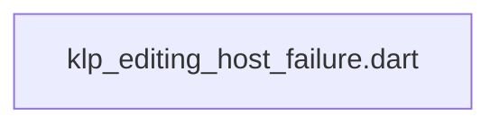
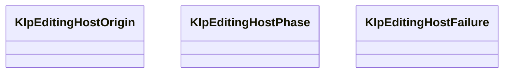

# klp_editing_host_failure.dart：直接依賴與宣告架構

[回到目錄](README.md) · [來源檔案](../../../../../../lib/src/features/editing/contracts/klp_editing_host_failure.dart)

## 範圍

核心是 `lib/src/features/editing/contracts/klp_editing_host_failure.dart`。主要視角為該檔案明寫的 import／export／part；輔助視角為本檔宣告及 extends／implements／with／on 關係。只展開一層外部邊界。

## 直接依賴圖

## 依賴證據

| 關係 | 原始 directive | 來源 |
|---|---|---|
| 無 | 本檔未宣告 import／export／part | [lib/src/features/editing/contracts/klp_editing_host_failure.dart:1](../../../../../../lib/src/features/editing/contracts/klp_editing_host_failure.dart#L1) |

## 宣告關係圖

本組節點是本檔宣告；沒有箭頭的宣告未在此圖主張互相依賴。

## 宣告與成員證據

成員包含 public 與 private；簽章取自來源，省略函式本體與欄位初始值。`(inferred)` 表示來源未明寫型別；建構子只顯示參數部分，不含初始化列表。

### KlpEditingHostOrigin

EnumDeclaration · public · [lib/src/features/editing/contracts/klp_editing_host_failure.dart:1](../../../../../../lib/src/features/editing/contracts/klp_editing_host_failure.dart#L1)

<code>enum KlpEditingHostOrigin</code>

來源註解摘要：編輯宿主失敗所屬的局部平台工作階段。

| 成員 | 可見性 | 簽章／型別 | 來源註解摘要 | 證據 |
|---|---|---|---|---|
| enum value <code>textInput</code> | public | <code>textInput</code> |  | [lib/src/features/editing/contracts/klp_editing_host_failure.dart:2](../../../../../../lib/src/features/editing/contracts/klp_editing_host_failure.dart#L2) |
| enum value <code>blockNote</code> | public | <code>blockNote</code> |  | [lib/src/features/editing/contracts/klp_editing_host_failure.dart:2](../../../../../../lib/src/features/editing/contracts/klp_editing_host_failure.dart#L2) |
| enum value <code>canva</code> | public | <code>canva</code> |  | [lib/src/features/editing/contracts/klp_editing_host_failure.dart:2](../../../../../../lib/src/features/editing/contracts/klp_editing_host_failure.dart#L2) |

### KlpEditingHostPhase

EnumDeclaration · public · [lib/src/features/editing/contracts/klp_editing_host_failure.dart:4](../../../../../../lib/src/features/editing/contracts/klp_editing_host_failure.dart#L4)

<code>enum KlpEditingHostPhase</code>

來源註解摘要：宿主失敗發生的操作階段；不代表正文交易結果。

| 成員 | 可見性 | 簽章／型別 | 來源註解摘要 | 證據 |
|---|---|---|---|---|
| enum value <code>environmentCreate</code> | public | <code>environmentCreate</code> |  | [lib/src/features/editing/contracts/klp_editing_host_failure.dart:5](../../../../../../lib/src/features/editing/contracts/klp_editing_host_failure.dart#L5) |
| enum value <code>bridgeReady</code> | public | <code>bridgeReady</code> |  | [lib/src/features/editing/contracts/klp_editing_host_failure.dart:5](../../../../../../lib/src/features/editing/contracts/klp_editing_host_failure.dart#L5) |
| enum value <code>bind</code> | public | <code>bind</code> |  | [lib/src/features/editing/contracts/klp_editing_host_failure.dart:5](../../../../../../lib/src/features/editing/contracts/klp_editing_host_failure.dart#L5) |
| enum value <code>configure</code> | public | <code>configure</code> |  | [lib/src/features/editing/contracts/klp_editing_host_failure.dart:5](../../../../../../lib/src/features/editing/contracts/klp_editing_host_failure.dart#L5) |
| enum value <code>open</code> | public | <code>open</code> |  | [lib/src/features/editing/contracts/klp_editing_host_failure.dart:5](../../../../../../lib/src/features/editing/contracts/klp_editing_host_failure.dart#L5) |
| enum value <code>flush</code> | public | <code>flush</code> |  | [lib/src/features/editing/contracts/klp_editing_host_failure.dart:5](../../../../../../lib/src/features/editing/contracts/klp_editing_host_failure.dart#L5) |
| enum value <code>receive</code> | public | <code>receive</code> |  | [lib/src/features/editing/contracts/klp_editing_host_failure.dart:5](../../../../../../lib/src/features/editing/contracts/klp_editing_host_failure.dart#L5) |
| enum value <code>callback</code> | public | <code>callback</code> |  | [lib/src/features/editing/contracts/klp_editing_host_failure.dart:5](../../../../../../lib/src/features/editing/contracts/klp_editing_host_failure.dart#L5) |
| enum value <code>input</code> | public | <code>input</code> |  | [lib/src/features/editing/contracts/klp_editing_host_failure.dart:5](../../../../../../lib/src/features/editing/contracts/klp_editing_host_failure.dart#L5) |
| enum value <code>interrupt</code> | public | <code>interrupt</code> |  | [lib/src/features/editing/contracts/klp_editing_host_failure.dart:5](../../../../../../lib/src/features/editing/contracts/klp_editing_host_failure.dart#L5) |
| enum value <code>dispose</code> | public | <code>dispose</code> |  | [lib/src/features/editing/contracts/klp_editing_host_failure.dart:5](../../../../../../lib/src/features/editing/contracts/klp_editing_host_failure.dart#L5) |

### KlpEditingHostFailure

ClassDeclaration · public · [lib/src/features/editing/contracts/klp_editing_host_failure.dart:7](../../../../../../lib/src/features/editing/contracts/klp_editing_host_failure.dart#L7)

<code>final class KlpEditingHostFailure</code>

來源註解摘要：將原始例外交由 application 處理，不取得正文或 controller 權威。

| 成員 | 可見性 | 簽章／型別 | 來源註解摘要 | 證據 |
|---|---|---|---|---|
| field <code>origin</code> | public | <code>final KlpEditingHostOrigin origin</code> |  | [lib/src/features/editing/contracts/klp_editing_host_failure.dart:9](../../../../../../lib/src/features/editing/contracts/klp_editing_host_failure.dart#L9) |
| field <code>phase</code> | public | <code>final KlpEditingHostPhase phase</code> |  | [lib/src/features/editing/contracts/klp_editing_host_failure.dart:10](../../../../../../lib/src/features/editing/contracts/klp_editing_host_failure.dart#L10) |
| field <code>error</code> | public | <code>final Object error</code> |  | [lib/src/features/editing/contracts/klp_editing_host_failure.dart:11](../../../../../../lib/src/features/editing/contracts/klp_editing_host_failure.dart#L11) |
| field <code>stackTrace</code> | public | <code>final StackTrace stackTrace</code> |  | [lib/src/features/editing/contracts/klp_editing_host_failure.dart:12](../../../../../../lib/src/features/editing/contracts/klp_editing_host_failure.dart#L12) |
| constructor <code>KlpEditingHostFailure</code> | public | <code>const KlpEditingHostFailure({ required this.origin, required this.phase, required this.error, required this.stackTrace, })</code> |  | [lib/src/features/editing/contracts/klp_editing_host_failure.dart:14](../../../../../../lib/src/features/editing/contracts/klp_editing_host_failure.dart#L14) |

### KlpEditingHostFailureSink

GenericTypeAlias · public · [lib/src/features/editing/contracts/klp_editing_host_failure.dart:22](../../../../../../lib/src/features/editing/contracts/klp_editing_host_failure.dart#L22)

<code>typedef KlpEditingHostFailureSink = void Function(KlpEditingHostFailure failure);</code>

來源註解摘要：由唯一 application 宿主安裝的編輯平台失敗接收端。

## 閱讀說明與限制

箭頭只表示來源明寫的靜態關係；import 不等於呼叫。未分析動態呼叫、欄位的實際物件擁有權、狀態轉移或渲染流程；型別未進行語意解析，繼承目標保留原始型別拼寫。public／private 依 Dart 名稱前綴判斷；public 宣告不代表已由 `lib/kallopis.dart` 匯出。

本頁由 `tool/architecture_atlas` 產生；編輯來源或生成工具後重新產生，避免手改本頁。
