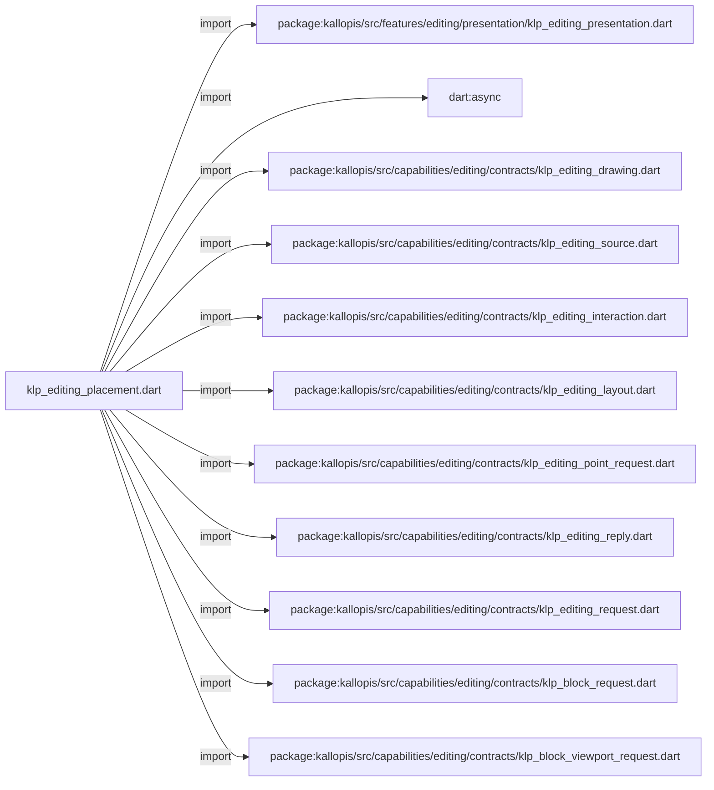
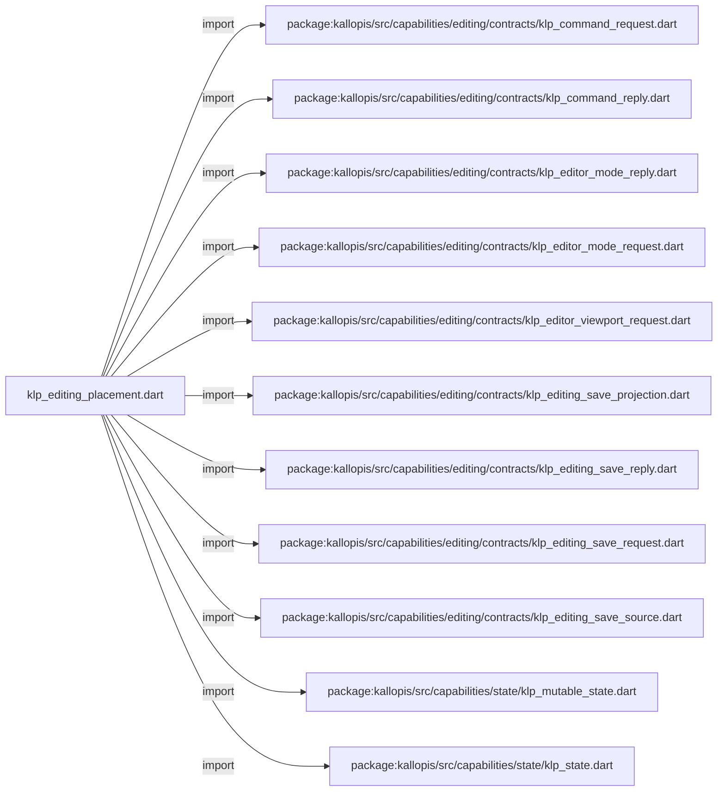
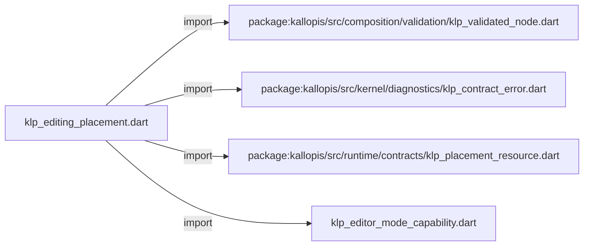
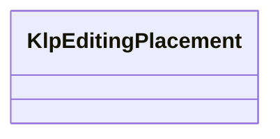
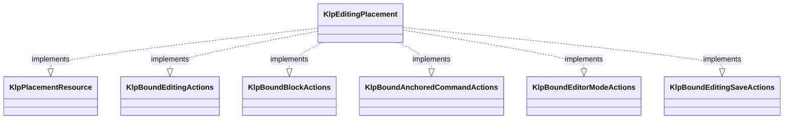

# klp_editing_placement.dart：直接依賴與宣告架構

[回到目錄](README.md) · [來源檔案](../../../../../../lib/src/features/editing/internal/klp_editing_placement.dart)

## 範圍

核心是 `lib/src/features/editing/internal/klp_editing_placement.dart`。主要視角為該檔案明寫的 import／export／part；輔助視角為本檔宣告及 extends／implements／with／on 關係。只展開一層外部邊界。

## 直接依賴圖

## 依賴證據

| 關係 | 原始 directive | 來源 |
|---|---|---|
| import | <code>import &#x27;package:kallopis/src/features/editing/presentation/klp_editing_presentation.dart&#x27;;</code> | [lib/src/features/editing/internal/klp_editing_placement.dart:1](../../../../../../lib/src/features/editing/internal/klp_editing_placement.dart#L1) |
| import | <code>import &#x27;dart:async&#x27;;</code> | [lib/src/features/editing/internal/klp_editing_placement.dart:2](../../../../../../lib/src/features/editing/internal/klp_editing_placement.dart#L2) |
| import | <code>import &#x27;package:kallopis/src/capabilities/editing/contracts/klp_editing_drawing.dart&#x27;;</code> | [lib/src/features/editing/internal/klp_editing_placement.dart:4](../../../../../../lib/src/features/editing/internal/klp_editing_placement.dart#L4) |
| import | <code>import &#x27;package:kallopis/src/capabilities/editing/contracts/klp_editing_source.dart&#x27;;</code> | [lib/src/features/editing/internal/klp_editing_placement.dart:5](../../../../../../lib/src/features/editing/internal/klp_editing_placement.dart#L5) |
| import | <code>import &#x27;package:kallopis/src/capabilities/editing/contracts/klp_editing_interaction.dart&#x27;;</code> | [lib/src/features/editing/internal/klp_editing_placement.dart:6](../../../../../../lib/src/features/editing/internal/klp_editing_placement.dart#L6) |
| import | <code>import &#x27;package:kallopis/src/capabilities/editing/contracts/klp_editing_layout.dart&#x27;;</code> | [lib/src/features/editing/internal/klp_editing_placement.dart:7](../../../../../../lib/src/features/editing/internal/klp_editing_placement.dart#L7) |
| import | <code>import &#x27;package:kallopis/src/capabilities/editing/contracts/klp_editing_point_request.dart&#x27;;</code> | [lib/src/features/editing/internal/klp_editing_placement.dart:8](../../../../../../lib/src/features/editing/internal/klp_editing_placement.dart#L8) |
| import | <code>import &#x27;package:kallopis/src/capabilities/editing/contracts/klp_editing_reply.dart&#x27;;</code> | [lib/src/features/editing/internal/klp_editing_placement.dart:9](../../../../../../lib/src/features/editing/internal/klp_editing_placement.dart#L9) |
| import | <code>import &#x27;package:kallopis/src/capabilities/editing/contracts/klp_editing_request.dart&#x27;;</code> | [lib/src/features/editing/internal/klp_editing_placement.dart:10](../../../../../../lib/src/features/editing/internal/klp_editing_placement.dart#L10) |
| import | <code>import &#x27;package:kallopis/src/capabilities/editing/contracts/klp_block_request.dart&#x27;;</code> | [lib/src/features/editing/internal/klp_editing_placement.dart:11](../../../../../../lib/src/features/editing/internal/klp_editing_placement.dart#L11) |
| import | <code>import &#x27;package:kallopis/src/capabilities/editing/contracts/klp_block_viewport_request.dart&#x27;;</code> | [lib/src/features/editing/internal/klp_editing_placement.dart:12](../../../../../../lib/src/features/editing/internal/klp_editing_placement.dart#L12) |
| import | <code>import &#x27;package:kallopis/src/capabilities/editing/contracts/klp_command_request.dart&#x27;;</code> | [lib/src/features/editing/internal/klp_editing_placement.dart:13](../../../../../../lib/src/features/editing/internal/klp_editing_placement.dart#L13) |
| import | <code>import &#x27;package:kallopis/src/capabilities/editing/contracts/klp_command_reply.dart&#x27;;</code> | [lib/src/features/editing/internal/klp_editing_placement.dart:14](../../../../../../lib/src/features/editing/internal/klp_editing_placement.dart#L14) |
| import | <code>import &#x27;package:kallopis/src/capabilities/editing/contracts/klp_editor_mode_reply.dart&#x27;;</code> | [lib/src/features/editing/internal/klp_editing_placement.dart:15](../../../../../../lib/src/features/editing/internal/klp_editing_placement.dart#L15) |
| import | <code>import &#x27;package:kallopis/src/capabilities/editing/contracts/klp_editor_mode_request.dart&#x27;;</code> | [lib/src/features/editing/internal/klp_editing_placement.dart:16](../../../../../../lib/src/features/editing/internal/klp_editing_placement.dart#L16) |
| import | <code>import &#x27;package:kallopis/src/capabilities/editing/contracts/klp_editor_viewport_request.dart&#x27;;</code> | [lib/src/features/editing/internal/klp_editing_placement.dart:17](../../../../../../lib/src/features/editing/internal/klp_editing_placement.dart#L17) |
| import | <code>import &#x27;package:kallopis/src/capabilities/editing/contracts/klp_editing_save_projection.dart&#x27;;</code> | [lib/src/features/editing/internal/klp_editing_placement.dart:18](../../../../../../lib/src/features/editing/internal/klp_editing_placement.dart#L18) |
| import | <code>import &#x27;package:kallopis/src/capabilities/editing/contracts/klp_editing_save_reply.dart&#x27;;</code> | [lib/src/features/editing/internal/klp_editing_placement.dart:19](../../../../../../lib/src/features/editing/internal/klp_editing_placement.dart#L19) |
| import | <code>import &#x27;package:kallopis/src/capabilities/editing/contracts/klp_editing_save_request.dart&#x27;;</code> | [lib/src/features/editing/internal/klp_editing_placement.dart:20](../../../../../../lib/src/features/editing/internal/klp_editing_placement.dart#L20) |
| import | <code>import &#x27;package:kallopis/src/capabilities/editing/contracts/klp_editing_save_source.dart&#x27;;</code> | [lib/src/features/editing/internal/klp_editing_placement.dart:21](../../../../../../lib/src/features/editing/internal/klp_editing_placement.dart#L21) |
| import | <code>import &#x27;package:kallopis/src/capabilities/state/klp_mutable_state.dart&#x27;;</code> | [lib/src/features/editing/internal/klp_editing_placement.dart:22](../../../../../../lib/src/features/editing/internal/klp_editing_placement.dart#L22) |
| import | <code>import &#x27;package:kallopis/src/capabilities/state/klp_state.dart&#x27;;</code> | [lib/src/features/editing/internal/klp_editing_placement.dart:23](../../../../../../lib/src/features/editing/internal/klp_editing_placement.dart#L23) |
| import | <code>import &#x27;package:kallopis/src/composition/validation/klp_validated_node.dart&#x27;;</code> | [lib/src/features/editing/internal/klp_editing_placement.dart:24](../../../../../../lib/src/features/editing/internal/klp_editing_placement.dart#L24) |
| import | <code>import &#x27;package:kallopis/src/kernel/diagnostics/klp_contract_error.dart&#x27;;</code> | [lib/src/features/editing/internal/klp_editing_placement.dart:25](../../../../../../lib/src/features/editing/internal/klp_editing_placement.dart#L25) |
| import | <code>import &#x27;package:kallopis/src/runtime/contracts/klp_placement_resource.dart&#x27;;</code> | [lib/src/features/editing/internal/klp_editing_placement.dart:26](../../../../../../lib/src/features/editing/internal/klp_editing_placement.dart#L26) |
| import | <code>import &#x27;klp_editor_mode_capability.dart&#x27;;</code> | [lib/src/features/editing/internal/klp_editing_placement.dart:27](../../../../../../lib/src/features/editing/internal/klp_editing_placement.dart#L27) |

## 宣告關係圖

本組節點是本檔宣告；沒有箭頭的宣告未在此圖主張互相依賴。

## 宣告與成員證據

成員包含 public 與 private；簽章取自來源，省略函式本體與欄位初始值。`(inferred)` 表示來源未明寫型別；建構子只顯示參數部分，不含初始化列表。

### KlpEditingPlacement

ClassDeclaration · public · [lib/src/features/editing/internal/klp_editing_placement.dart:29](../../../../../../lib/src/features/editing/internal/klp_editing_placement.dart#L29)

<code>final class KlpEditingPlacement implements KlpPlacementResource, KlpBoundEditingActions, KlpBoundBlockActions, KlpBoundAnchoredCommandActions, KlpBoundEditorModeActions, KlpBoundEditingSaveActions</code>

來源註解摘要：借用提供者來源並保存最後一份已通過版本閘門的繪圖。

- `implements` → <code>KlpPlacementResource</code>：[lib/src/features/editing/internal/klp_editing_placement.dart:30](../../../../../../lib/src/features/editing/internal/klp_editing_placement.dart#L30)
- `implements` → <code>KlpBoundEditingActions</code>：[lib/src/features/editing/internal/klp_editing_placement.dart:30](../../../../../../lib/src/features/editing/internal/klp_editing_placement.dart#L30)
- `implements` → <code>KlpBoundBlockActions</code>：[lib/src/features/editing/internal/klp_editing_placement.dart:30](../../../../../../lib/src/features/editing/internal/klp_editing_placement.dart#L30)
- `implements` → <code>KlpBoundAnchoredCommandActions</code>：[lib/src/features/editing/internal/klp_editing_placement.dart:30](../../../../../../lib/src/features/editing/internal/klp_editing_placement.dart#L30)
- `implements` → <code>KlpBoundEditorModeActions</code>：[lib/src/features/editing/internal/klp_editing_placement.dart:30](../../../../../../lib/src/features/editing/internal/klp_editing_placement.dart#L30)
- `implements` → <code>KlpBoundEditingSaveActions</code>：[lib/src/features/editing/internal/klp_editing_placement.dart:30](../../../../../../lib/src/features/editing/internal/klp_editing_placement.dart#L30)

| 成員 | 可見性 | 簽章／型別 | 來源註解摘要 | 證據 |
|---|---|---|---|---|
| field <code>_source</code> | private | <code>final KlpEditingSource _source</code> |  | [lib/src/features/editing/internal/klp_editing_placement.dart:31](../../../../../../lib/src/features/editing/internal/klp_editing_placement.dart#L31) |
| field <code>_subscription</code> | private | <code>late final StreamSubscription&lt;KlpEditingDrawing&gt; _subscription</code> |  | [lib/src/features/editing/internal/klp_editing_placement.dart:32](../../../../../../lib/src/features/editing/internal/klp_editing_placement.dart#L32) |
| field <code>_drawing</code> | private | <code>late final KlpMutableState&lt;KlpEditingDrawing&gt; _drawing</code> |  | [lib/src/features/editing/internal/klp_editing_placement.dart:33](../../../../../../lib/src/features/editing/internal/klp_editing_placement.dart#L33) |
| field <code>_queuedEnvironmentWatermarks</code> | private | <code>final Map&lt;String, KlpEditingDrawing&gt; _queuedEnvironmentWatermarks</code> |  | [lib/src/features/editing/internal/klp_editing_placement.dart:34](../../../../../../lib/src/features/editing/internal/klp_editing_placement.dart#L34) |
| field <code>_disposed</code> | private | <code>bool _disposed</code> |  | [lib/src/features/editing/internal/klp_editing_placement.dart:35](../../../../../../lib/src/features/editing/internal/klp_editing_placement.dart#L35) |
| constructor <code>KlpEditingPlacement</code> | public | <code>KlpEditingPlacement(this._source, KlpEditingDrawing prepared)</code> |  | [lib/src/features/editing/internal/klp_editing_placement.dart:37](../../../../../../lib/src/features/editing/internal/klp_editing_placement.dart#L37) |
| getter <code>drawing</code> | public | <code>KlpState&lt;KlpEditingDrawing&gt; get drawing</code> |  | [lib/src/features/editing/internal/klp_editing_placement.dart:52](../../../../../../lib/src/features/editing/internal/klp_editing_placement.dart#L52) |
| getter <code>queuedEnvironmentCount</code> | public | <code>int get queuedEnvironmentCount</code> |  | [lib/src/features/editing/internal/klp_editing_placement.dart:53](../../../../../../lib/src/features/editing/internal/klp_editing_placement.dart#L53) |
| method <code>matches</code> | public | <code>bool matches(KlpEditingSource source)</code> |  | [lib/src/features/editing/internal/klp_editing_placement.dart:54](../../../../../../lib/src/features/editing/internal/klp_editing_placement.dart#L54) |
| method <code>issueCommandSequence</code> | public | <code>int issueCommandSequence()</code> |  | [lib/src/features/editing/internal/klp_editing_placement.dart:56](../../../../../../lib/src/features/editing/internal/klp_editing_placement.dart#L56) |
| getter <code>saveState</code> | public | <code>KlpState&lt;KlpEditingSaveProjection&gt; get saveState</code> |  | [lib/src/features/editing/internal/klp_editing_placement.dart:70](../../../../../../lib/src/features/editing/internal/klp_editing_placement.dart#L70) |
| method <code>submitSave</code> | public | <code>Future&lt;KlpEditingSaveReply&gt; submitSave(KlpEditingSaveRequest request)</code> |  | [lib/src/features/editing/internal/klp_editing_placement.dart:77](../../../../../../lib/src/features/editing/internal/klp_editing_placement.dart#L77) |
| method <code>submitEditorMode</code> | public | <code>Future&lt;KlpEditorModeReply&gt; submitEditorMode(KlpEditorModeRequest request, {required int committedAtMs})</code> |  | [lib/src/features/editing/internal/klp_editing_placement.dart:84](../../../../../../lib/src/features/editing/internal/klp_editing_placement.dart#L84) |
| method <code>submitEditorViewport</code> | public | <code>Future&lt;KlpEditorModeReply&gt; submitEditorViewport(KlpEditorViewportRequest request, {required int committedAtMs})</code> |  | [lib/src/features/editing/internal/klp_editing_placement.dart:93](../../../../../../lib/src/features/editing/internal/klp_editing_placement.dart#L93) |
| method <code>submitAnchoredCommand</code> | public | <code>Future&lt;KlpCommandReply&gt; submitAnchoredCommand(KlpCommandRequest request, {required int committedAtMs})</code> |  | [lib/src/features/editing/internal/klp_editing_placement.dart:102](../../../../../../lib/src/features/editing/internal/klp_editing_placement.dart#L102) |
| method <code>layout</code> | public | <code>KlpEditingDrawing layout(KlpEditingLayout layout)</code> |  | [lib/src/features/editing/internal/klp_editing_placement.dart:112](../../../../../../lib/src/features/editing/internal/klp_editing_placement.dart#L112) |
| method <code>submit</code> | public | <code>Future&lt;KlpEditingReply&gt; submit(KlpEditingRequest request, {required int committedAtMs})</code> |  | [lib/src/features/editing/internal/klp_editing_placement.dart:128](../../../../../../lib/src/features/editing/internal/klp_editing_placement.dart#L128) |
| method <code>submitBlock</code> | public | <code>Future&lt;KlpEditingReply&gt; submitBlock(KlpBlockRequest request, {required int committedAtMs})</code> |  | [lib/src/features/editing/internal/klp_editing_placement.dart:135](../../../../../../lib/src/features/editing/internal/klp_editing_placement.dart#L135) |
| method <code>submitBlockViewport</code> | public | <code>Future&lt;KlpEditingReply&gt; submitBlockViewport(KlpBlockViewportRequest request, {required int committedAtMs})</code> |  | [lib/src/features/editing/internal/klp_editing_placement.dart:145](../../../../../../lib/src/features/editing/internal/klp_editing_placement.dart#L145) |
| method <code>selectPoint</code> | public | <code>Future&lt;KlpEditingReply&gt; selectPoint(KlpEditingPointRequest request)</code> |  | [lib/src/features/editing/internal/klp_editing_placement.dart:155](../../../../../../lib/src/features/editing/internal/klp_editing_placement.dart#L155) |
| method <code>bindInteraction</code> | public | <code>KlpEditingInteractionBinding bindInteraction(KlpEditingInteraction interaction)</code> |  | [lib/src/features/editing/internal/klp_editing_placement.dart:162](../../../../../../lib/src/features/editing/internal/klp_editing_placement.dart#L162) |
| method <code>_receive</code> | private | <code>void _receive(KlpEditingDrawing event)</code> |  | [lib/src/features/editing/internal/klp_editing_placement.dart:169](../../../../../../lib/src/features/editing/internal/klp_editing_placement.dart#L169) |
| method <code>_coveredBy</code> | private | <code>bool _coveredBy(KlpEditingDrawing drawing, KlpEditingDrawing watermark)</code> |  | [lib/src/features/editing/internal/klp_editing_placement.dart:191](../../../../../../lib/src/features/editing/internal/klp_editing_placement.dart#L191) |
| method <code>_validateAdvance</code> | private | <code>bool _validateAdvance(KlpEditingDrawing previous, KlpEditingDrawing next, {required bool allowSame, bool allowEnvironment = false})</code> |  | [lib/src/features/editing/internal/klp_editing_placement.dart:201](../../../../../../lib/src/features/editing/internal/klp_editing_placement.dart#L201) |
| method <code>update</code> | public | <code>void update(KlpValidatedNode node)</code> |  | [lib/src/features/editing/internal/klp_editing_placement.dart:229](../../../../../../lib/src/features/editing/internal/klp_editing_placement.dart#L229) |
| method <code>dispose</code> | public | <code>void dispose()</code> |  | [lib/src/features/editing/internal/klp_editing_placement.dart:232](../../../../../../lib/src/features/editing/internal/klp_editing_placement.dart#L232) |

## 閱讀說明與限制

箭頭只表示來源明寫的靜態關係；import 不等於呼叫。未分析動態呼叫、欄位的實際物件擁有權、狀態轉移或渲染流程；型別未進行語意解析，繼承目標保留原始型別拼寫。public／private 依 Dart 名稱前綴判斷；public 宣告不代表已由 `lib/kallopis.dart` 匯出。

本頁由 `tool/architecture_atlas` 產生；編輯來源或生成工具後重新產生，避免手改本頁。
