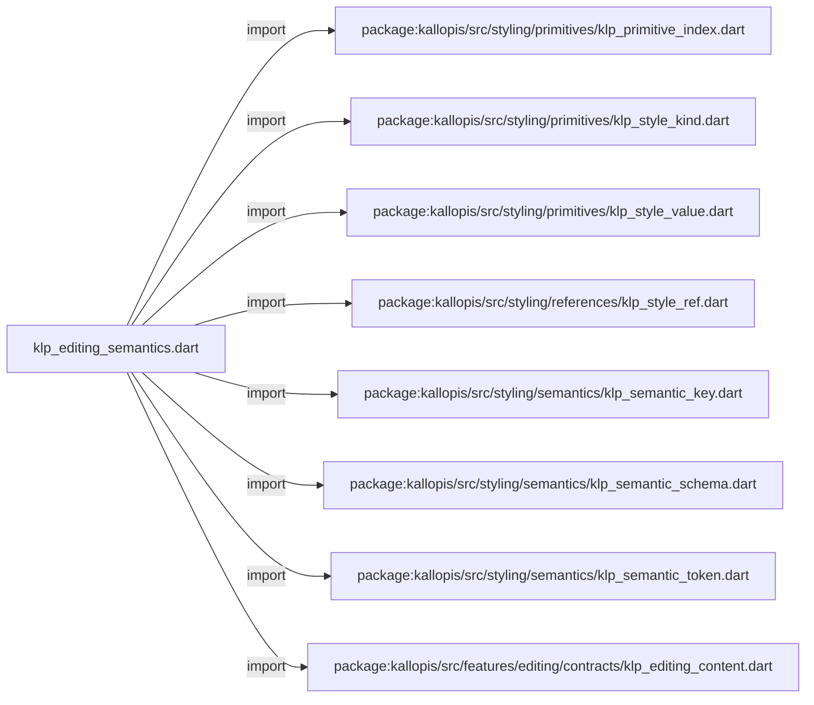
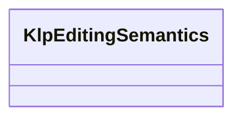

# klp_editing_semantics.dart：直接依賴與宣告架構

[回到目錄](README.md) · [來源檔案](../../../../../../lib/src/features/editing/internal/klp_editing_semantics.dart)

## 範圍

核心是 `lib/src/features/editing/internal/klp_editing_semantics.dart`。主要視角為該檔案明寫的 import／export／part；輔助視角為本檔宣告及 extends／implements／with／on 關係。只展開一層外部邊界。

## 直接依賴圖

## 依賴證據

| 關係 | 原始 directive | 來源 |
|---|---|---|
| import | <code>import &#x27;package:kallopis/src/styling/primitives/klp_primitive_index.dart&#x27;;</code> | [lib/src/features/editing/internal/klp_editing_semantics.dart:1](../../../../../../lib/src/features/editing/internal/klp_editing_semantics.dart#L1) |
| import | <code>import &#x27;package:kallopis/src/styling/primitives/klp_style_kind.dart&#x27;;</code> | [lib/src/features/editing/internal/klp_editing_semantics.dart:2](../../../../../../lib/src/features/editing/internal/klp_editing_semantics.dart#L2) |
| import | <code>import &#x27;package:kallopis/src/styling/primitives/klp_style_value.dart&#x27;;</code> | [lib/src/features/editing/internal/klp_editing_semantics.dart:3](../../../../../../lib/src/features/editing/internal/klp_editing_semantics.dart#L3) |
| import | <code>import &#x27;package:kallopis/src/styling/references/klp_style_ref.dart&#x27;;</code> | [lib/src/features/editing/internal/klp_editing_semantics.dart:4](../../../../../../lib/src/features/editing/internal/klp_editing_semantics.dart#L4) |
| import | <code>import &#x27;package:kallopis/src/styling/semantics/klp_semantic_key.dart&#x27;;</code> | [lib/src/features/editing/internal/klp_editing_semantics.dart:5](../../../../../../lib/src/features/editing/internal/klp_editing_semantics.dart#L5) |
| import | <code>import &#x27;package:kallopis/src/styling/semantics/klp_semantic_schema.dart&#x27;;</code> | [lib/src/features/editing/internal/klp_editing_semantics.dart:6](../../../../../../lib/src/features/editing/internal/klp_editing_semantics.dart#L6) |
| import | <code>import &#x27;package:kallopis/src/styling/semantics/klp_semantic_token.dart&#x27;;</code> | [lib/src/features/editing/internal/klp_editing_semantics.dart:7](../../../../../../lib/src/features/editing/internal/klp_editing_semantics.dart#L7) |
| import | <code>import &#x27;package:kallopis/src/features/editing/contracts/klp_editing_content.dart&#x27;;</code> | [lib/src/features/editing/internal/klp_editing_semantics.dart:8](../../../../../../lib/src/features/editing/internal/klp_editing_semantics.dart#L8) |

## 宣告關係圖

本組節點是本檔宣告；沒有箭頭的宣告未在此圖主張互相依賴。

## 宣告與成員證據

成員包含 public 與 private；簽章取自來源，省略函式本體與欄位初始值。`(inferred)` 表示來源未明寫型別；建構子只顯示參數部分，不含初始化列表。

### KlpEditingSemantics

ClassDeclaration · public · [lib/src/features/editing/internal/klp_editing_semantics.dart:10](../../../../../../lib/src/features/editing/internal/klp_editing_semantics.dart#L10)

<code>final class KlpEditingSemantics</code>

來源註解摘要：編輯用途的候選映射；已建立唯一解析路徑，但尚未宣稱視覺定型。

| 成員 | 可見性 | 簽章／型別 | 來源註解摘要 | 證據 |
|---|---|---|---|---|
| field <code>minimumBodyEm</code> | public | <code>static const (inferred) minimumBodyEm</code> |  | [lib/src/features/editing/internal/klp_editing_semantics.dart:13](../../../../../../lib/src/features/editing/internal/klp_editing_semantics.dart#L13) |
| field <code>text</code> | public | <code>static final (inferred) text</code> |  | [lib/src/features/editing/internal/klp_editing_semantics.dart:14](../../../../../../lib/src/features/editing/internal/klp_editing_semantics.dart#L14) |
| field <code>ink</code> | public | <code>static final (inferred) ink</code> |  | [lib/src/features/editing/internal/klp_editing_semantics.dart:15](../../../../../../lib/src/features/editing/internal/klp_editing_semantics.dart#L15) |
| field <code>caret</code> | public | <code>static final (inferred) caret</code> |  | [lib/src/features/editing/internal/klp_editing_semantics.dart:16](../../../../../../lib/src/features/editing/internal/klp_editing_semantics.dart#L16) |
| field <code>selection</code> | public | <code>static final (inferred) selection</code> |  | [lib/src/features/editing/internal/klp_editing_semantics.dart:17](../../../../../../lib/src/features/editing/internal/klp_editing_semantics.dart#L17) |
| field <code>fontFamily</code> | public | <code>static final (inferred) fontFamily</code> |  | [lib/src/features/editing/internal/klp_editing_semantics.dart:18](../../../../../../lib/src/features/editing/internal/klp_editing_semantics.dart#L18) |
| field <code>fontWeight</code> | public | <code>static final (inferred) fontWeight</code> |  | [lib/src/features/editing/internal/klp_editing_semantics.dart:19](../../../../../../lib/src/features/editing/internal/klp_editing_semantics.dart#L19) |
| field <code>fontSize</code> | public | <code>static final (inferred) fontSize</code> |  | [lib/src/features/editing/internal/klp_editing_semantics.dart:20](../../../../../../lib/src/features/editing/internal/klp_editing_semantics.dart#L20) |
| field <code>lineHeight</code> | public | <code>static final (inferred) lineHeight</code> |  | [lib/src/features/editing/internal/klp_editing_semantics.dart:21](../../../../../../lib/src/features/editing/internal/klp_editing_semantics.dart#L21) |
| field <code>letterSpacing</code> | public | <code>static final (inferred) letterSpacing</code> |  | [lib/src/features/editing/internal/klp_editing_semantics.dart:22](../../../../../../lib/src/features/editing/internal/klp_editing_semantics.dart#L22) |
| field <code>horizontalPadding</code> | public | <code>static final (inferred) horizontalPadding</code> |  | [lib/src/features/editing/internal/klp_editing_semantics.dart:23](../../../../../../lib/src/features/editing/internal/klp_editing_semantics.dart#L23) |
| field <code>verticalPadding</code> | public | <code>static final (inferred) verticalPadding</code> |  | [lib/src/features/editing/internal/klp_editing_semantics.dart:24](../../../../../../lib/src/features/editing/internal/klp_editing_semantics.dart#L24) |
| field <code>blockSpacing</code> | public | <code>static final (inferred) blockSpacing</code> |  | [lib/src/features/editing/internal/klp_editing_semantics.dart:25](../../../../../../lib/src/features/editing/internal/klp_editing_semantics.dart#L25) |
| field <code>overscan</code> | public | <code>static final (inferred) overscan</code> |  | [lib/src/features/editing/internal/klp_editing_semantics.dart:26](../../../../../../lib/src/features/editing/internal/klp_editing_semantics.dart#L26) |
| field <code>listIndent</code> | public | <code>static final (inferred) listIndent</code> |  | [lib/src/features/editing/internal/klp_editing_semantics.dart:27](../../../../../../lib/src/features/editing/internal/klp_editing_semantics.dart#L27) |
| field <code>markerGap</code> | public | <code>static final (inferred) markerGap</code> |  | [lib/src/features/editing/internal/klp_editing_semantics.dart:28](../../../../../../lib/src/features/editing/internal/klp_editing_semantics.dart#L28) |
| field <code>marker</code> | public | <code>static final (inferred) marker</code> |  | [lib/src/features/editing/internal/klp_editing_semantics.dart:29](../../../../../../lib/src/features/editing/internal/klp_editing_semantics.dart#L29) |
| field <code>controlExtent</code> | public | <code>static final (inferred) controlExtent</code> |  | [lib/src/features/editing/internal/klp_editing_semantics.dart:30](../../../../../../lib/src/features/editing/internal/klp_editing_semantics.dart#L30) |
| field <code>controlRadius</code> | public | <code>static final (inferred) controlRadius</code> |  | [lib/src/features/editing/internal/klp_editing_semantics.dart:31](../../../../../../lib/src/features/editing/internal/klp_editing_semantics.dart#L31) |
| field <code>controlFontSize</code> | public | <code>static final (inferred) controlFontSize</code> |  | [lib/src/features/editing/internal/klp_editing_semantics.dart:32](../../../../../../lib/src/features/editing/internal/klp_editing_semantics.dart#L32) |
| field <code>controlBackground</code> | public | <code>static final (inferred) controlBackground</code> |  | [lib/src/features/editing/internal/klp_editing_semantics.dart:33](../../../../../../lib/src/features/editing/internal/klp_editing_semantics.dart#L33) |
| field <code>controlFocus</code> | public | <code>static final (inferred) controlFocus</code> |  | [lib/src/features/editing/internal/klp_editing_semantics.dart:34](../../../../../../lib/src/features/editing/internal/klp_editing_semantics.dart#L34) |
| field <code>dragAutoScrollEdge</code> | public | <code>static final (inferred) dragAutoScrollEdge</code> |  | [lib/src/features/editing/internal/klp_editing_semantics.dart:35](../../../../../../lib/src/features/editing/internal/klp_editing_semantics.dart#L35) |
| field <code>dragAutoScrollStep</code> | public | <code>static final (inferred) dragAutoScrollStep</code> |  | [lib/src/features/editing/internal/klp_editing_semantics.dart:36](../../../../../../lib/src/features/editing/internal/klp_editing_semantics.dart#L36) |
| field <code>dragAutoScrollInterval</code> | public | <code>static final (inferred) dragAutoScrollInterval</code> |  | [lib/src/features/editing/internal/klp_editing_semantics.dart:37](../../../../../../lib/src/features/editing/internal/klp_editing_semantics.dart#L37) |
| method <code>_token</code> | private | <code>static KlpSemanticToken&lt;T&gt; _token&lt;T extends KlpStyleValue&gt;(KlpSemanticKey&lt;T&gt; key, KlpPrimitiveIndex index)</code> |  | [lib/src/features/editing/internal/klp_editing_semantics.dart:39](../../../../../../lib/src/features/editing/internal/klp_editing_semantics.dart#L39) |
| method <code>resolveHorizontalPadding</code> | public | <code>static KlpDistance resolveHorizontalPadding(KlpDistance scale)</code> |  | [lib/src/features/editing/internal/klp_editing_semantics.dart:42](../../../../../../lib/src/features/editing/internal/klp_editing_semantics.dart#L42) |
| method <code>resolveVerticalPadding</code> | public | <code>static KlpDistance resolveVerticalPadding(KlpDistance scale)</code> |  | [lib/src/features/editing/internal/klp_editing_semantics.dart:43](../../../../../../lib/src/features/editing/internal/klp_editing_semantics.dart#L43) |
| method <code>schema</code> | public | <code>static KlpSemanticSchema schema()</code> |  | [lib/src/features/editing/internal/klp_editing_semantics.dart:45](../../../../../../lib/src/features/editing/internal/klp_editing_semantics.dart#L45) |

## 閱讀說明與限制

箭頭只表示來源明寫的靜態關係；import 不等於呼叫。未分析動態呼叫、欄位的實際物件擁有權、狀態轉移或渲染流程；型別未進行語意解析，繼承目標保留原始型別拼寫。public／private 依 Dart 名稱前綴判斷；public 宣告不代表已由 `lib/kallopis.dart` 匯出。

本頁由 `tool/architecture_atlas` 產生；編輯來源或生成工具後重新產生，避免手改本頁。
