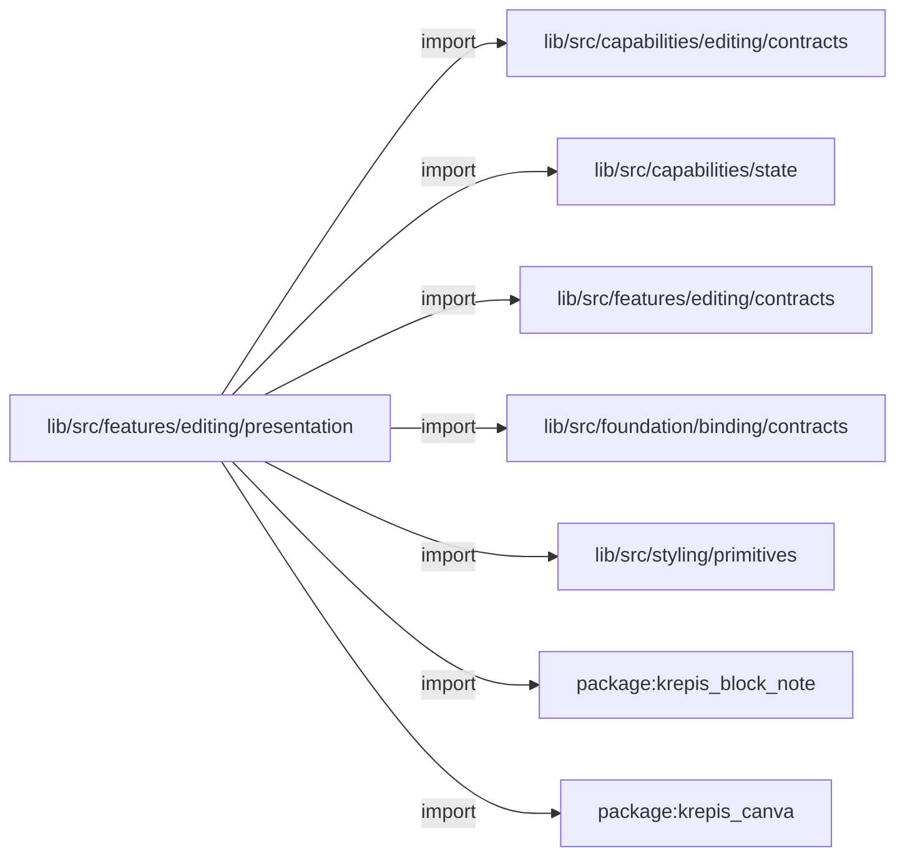
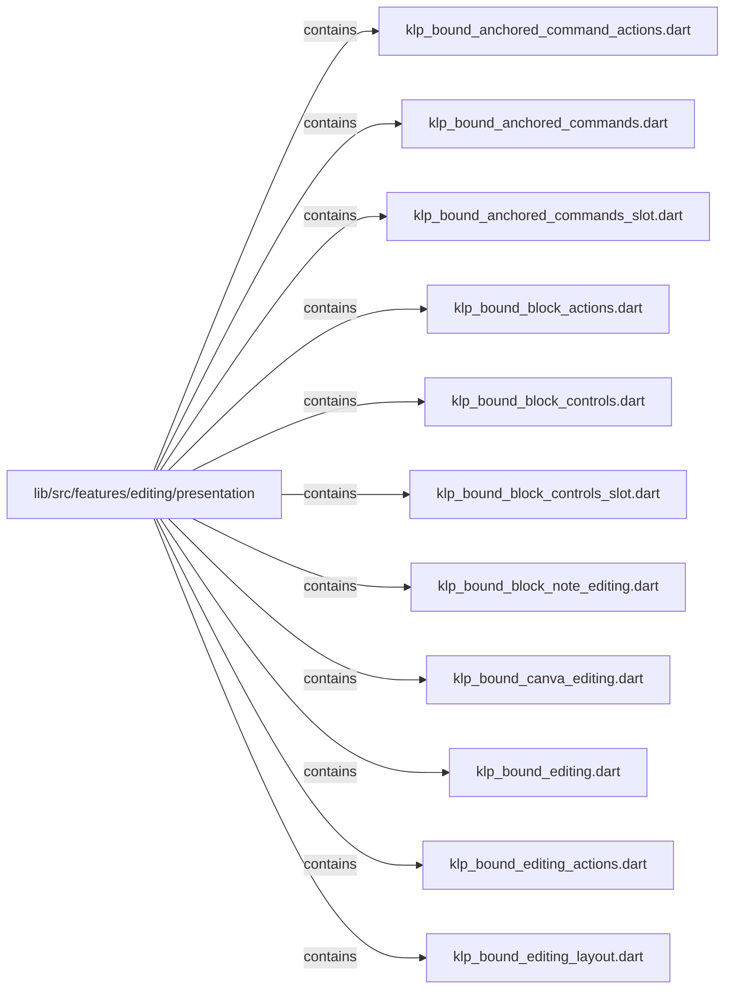
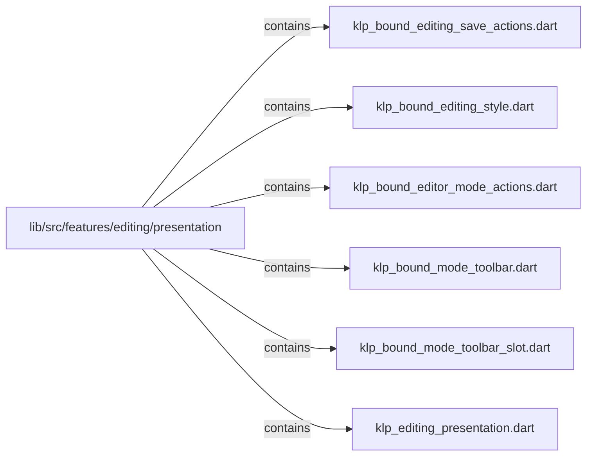

# lib/src/features/editing/presentation：架構分析入口

[上一層](../README.md)

## 範圍

閱讀 `lib/src/features/editing/presentation` 的直接子目錄與 Dart 檔案。結構圖表示實際檔案包含關係；依賴圖表示本層檔案明寫的 directives。每個檔案頁另列直接依賴、宣告、欄位、方法、建構子及行號證據。

## 本層直接依賴圖

箭頭以本層 Dart 檔案明寫的 directive 彙總到目標所在目錄或外部套件邊界；不遞迴將子目錄依賴算入本層。相同目標的不同 directive 類型分開計數。

| 目標邊界 | 關係 | directive 數 | 第一筆來源證據 |
|---|---|---|---|
| <code>lib/src/capabilities/editing/contracts</code> | import | 18 | [lib/src/features/editing/presentation/klp_bound_editing_style.dart:1](../../../../../../lib/src/features/editing/presentation/klp_bound_editing_style.dart#L1) |
| <code>lib/src/capabilities/state</code> | import | 1 | [lib/src/features/editing/presentation/klp_editing_presentation.dart:20](../../../../../../lib/src/features/editing/presentation/klp_editing_presentation.dart#L20) |
| <code>lib/src/features/editing/contracts</code> | import | 1 | [lib/src/features/editing/presentation/klp_editing_presentation.dart:9](../../../../../../lib/src/features/editing/presentation/klp_editing_presentation.dart#L9) |
| <code>lib/src/foundation/binding/contracts</code> | import | 2 | [lib/src/features/editing/presentation/klp_bound_editing_style.dart:4](../../../../../../lib/src/features/editing/presentation/klp_bound_editing_style.dart#L4) |
| <code>lib/src/styling/primitives</code> | import | 1 | [lib/src/features/editing/presentation/klp_bound_editing_style.dart:3](../../../../../../lib/src/features/editing/presentation/klp_bound_editing_style.dart#L3) |
| <code>package:krepis_block_note</code> | import | 1 | [lib/src/features/editing/presentation/klp_editing_presentation.dart:7](../../../../../../lib/src/features/editing/presentation/klp_editing_presentation.dart#L7) |
| <code>package:krepis_canva</code> | import | 1 | [lib/src/features/editing/presentation/klp_editing_presentation.dart:8](../../../../../../lib/src/features/editing/presentation/klp_editing_presentation.dart#L8) |

### 同目錄依賴

| 來源 → 目標 | 關係 | 證據 |
|---|---|---|
| <code>klp_bound_anchored_command_actions.dart → klp_editing_presentation.dart</code> | part of | [lib/src/features/editing/presentation/klp_bound_anchored_command_actions.dart:1](../../../../../../lib/src/features/editing/presentation/klp_bound_anchored_command_actions.dart#L1) |
| <code>klp_bound_anchored_commands.dart → klp_editing_presentation.dart</code> | part of | [lib/src/features/editing/presentation/klp_bound_anchored_commands.dart:1](../../../../../../lib/src/features/editing/presentation/klp_bound_anchored_commands.dart#L1) |
| <code>klp_bound_anchored_commands_slot.dart → klp_editing_presentation.dart</code> | part of | [lib/src/features/editing/presentation/klp_bound_anchored_commands_slot.dart:1](../../../../../../lib/src/features/editing/presentation/klp_bound_anchored_commands_slot.dart#L1) |
| <code>klp_bound_block_actions.dart → klp_editing_presentation.dart</code> | part of | [lib/src/features/editing/presentation/klp_bound_block_actions.dart:1](../../../../../../lib/src/features/editing/presentation/klp_bound_block_actions.dart#L1) |
| <code>klp_bound_block_controls.dart → klp_editing_presentation.dart</code> | part of | [lib/src/features/editing/presentation/klp_bound_block_controls.dart:1](../../../../../../lib/src/features/editing/presentation/klp_bound_block_controls.dart#L1) |
| <code>klp_bound_block_controls_slot.dart → klp_editing_presentation.dart</code> | part of | [lib/src/features/editing/presentation/klp_bound_block_controls_slot.dart:1](../../../../../../lib/src/features/editing/presentation/klp_bound_block_controls_slot.dart#L1) |
| <code>klp_bound_block_note_editing.dart → klp_editing_presentation.dart</code> | part of | [lib/src/features/editing/presentation/klp_bound_block_note_editing.dart:1](../../../../../../lib/src/features/editing/presentation/klp_bound_block_note_editing.dart#L1) |
| <code>klp_bound_canva_editing.dart → klp_editing_presentation.dart</code> | part of | [lib/src/features/editing/presentation/klp_bound_canva_editing.dart:1](../../../../../../lib/src/features/editing/presentation/klp_bound_canva_editing.dart#L1) |
| <code>klp_bound_editing.dart → klp_editing_presentation.dart</code> | part of | [lib/src/features/editing/presentation/klp_bound_editing.dart:1](../../../../../../lib/src/features/editing/presentation/klp_bound_editing.dart#L1) |
| <code>klp_bound_editing_actions.dart → klp_editing_presentation.dart</code> | part of | [lib/src/features/editing/presentation/klp_bound_editing_actions.dart:1](../../../../../../lib/src/features/editing/presentation/klp_bound_editing_actions.dart#L1) |
| <code>klp_bound_editing_layout.dart → klp_editing_presentation.dart</code> | part of | [lib/src/features/editing/presentation/klp_bound_editing_layout.dart:1](../../../../../../lib/src/features/editing/presentation/klp_bound_editing_layout.dart#L1) |
| <code>klp_bound_editing_save_actions.dart → klp_editing_presentation.dart</code> | part of | [lib/src/features/editing/presentation/klp_bound_editing_save_actions.dart:1](../../../../../../lib/src/features/editing/presentation/klp_bound_editing_save_actions.dart#L1) |
| <code>klp_bound_editor_mode_actions.dart → klp_editing_presentation.dart</code> | part of | [lib/src/features/editing/presentation/klp_bound_editor_mode_actions.dart:1](../../../../../../lib/src/features/editing/presentation/klp_bound_editor_mode_actions.dart#L1) |
| <code>klp_bound_mode_toolbar.dart → klp_editing_presentation.dart</code> | part of | [lib/src/features/editing/presentation/klp_bound_mode_toolbar.dart:1](../../../../../../lib/src/features/editing/presentation/klp_bound_mode_toolbar.dart#L1) |
| <code>klp_bound_mode_toolbar_slot.dart → klp_editing_presentation.dart</code> | part of | [lib/src/features/editing/presentation/klp_bound_mode_toolbar_slot.dart:1](../../../../../../lib/src/features/editing/presentation/klp_bound_mode_toolbar_slot.dart#L1) |
| <code>klp_editing_presentation.dart → klp_bound_editing_style.dart</code> | import | [lib/src/features/editing/presentation/klp_editing_presentation.dart:22](../../../../../../lib/src/features/editing/presentation/klp_editing_presentation.dart#L22) |
| <code>klp_editing_presentation.dart → klp_bound_editing.dart</code> | part | [lib/src/features/editing/presentation/klp_editing_presentation.dart:25](../../../../../../lib/src/features/editing/presentation/klp_editing_presentation.dart#L25) |
| <code>klp_editing_presentation.dart → klp_bound_block_note_editing.dart</code> | part | [lib/src/features/editing/presentation/klp_editing_presentation.dart:26](../../../../../../lib/src/features/editing/presentation/klp_editing_presentation.dart#L26) |
| <code>klp_editing_presentation.dart → klp_bound_canva_editing.dart</code> | part | [lib/src/features/editing/presentation/klp_editing_presentation.dart:27](../../../../../../lib/src/features/editing/presentation/klp_editing_presentation.dart#L27) |
| <code>klp_editing_presentation.dart → klp_bound_editing_layout.dart</code> | part | [lib/src/features/editing/presentation/klp_editing_presentation.dart:28](../../../../../../lib/src/features/editing/presentation/klp_editing_presentation.dart#L28) |
| <code>klp_editing_presentation.dart → klp_bound_editing_actions.dart</code> | part | [lib/src/features/editing/presentation/klp_editing_presentation.dart:29](../../../../../../lib/src/features/editing/presentation/klp_editing_presentation.dart#L29) |
| <code>klp_editing_presentation.dart → klp_bound_block_controls.dart</code> | part | [lib/src/features/editing/presentation/klp_editing_presentation.dart:30](../../../../../../lib/src/features/editing/presentation/klp_editing_presentation.dart#L30) |
| <code>klp_editing_presentation.dart → klp_bound_block_controls_slot.dart</code> | part | [lib/src/features/editing/presentation/klp_editing_presentation.dart:31](../../../../../../lib/src/features/editing/presentation/klp_editing_presentation.dart#L31) |
| <code>klp_editing_presentation.dart → klp_bound_block_actions.dart</code> | part | [lib/src/features/editing/presentation/klp_editing_presentation.dart:32](../../../../../../lib/src/features/editing/presentation/klp_editing_presentation.dart#L32) |
| <code>klp_editing_presentation.dart → klp_bound_anchored_commands.dart</code> | part | [lib/src/features/editing/presentation/klp_editing_presentation.dart:33](../../../../../../lib/src/features/editing/presentation/klp_editing_presentation.dart#L33) |
| <code>klp_editing_presentation.dart → klp_bound_anchored_commands_slot.dart</code> | part | [lib/src/features/editing/presentation/klp_editing_presentation.dart:34](../../../../../../lib/src/features/editing/presentation/klp_editing_presentation.dart#L34) |
| <code>klp_editing_presentation.dart → klp_bound_anchored_command_actions.dart</code> | part | [lib/src/features/editing/presentation/klp_editing_presentation.dart:35](../../../../../../lib/src/features/editing/presentation/klp_editing_presentation.dart#L35) |
| <code>klp_editing_presentation.dart → klp_bound_mode_toolbar.dart</code> | part | [lib/src/features/editing/presentation/klp_editing_presentation.dart:36](../../../../../../lib/src/features/editing/presentation/klp_editing_presentation.dart#L36) |
| <code>klp_editing_presentation.dart → klp_bound_mode_toolbar_slot.dart</code> | part | [lib/src/features/editing/presentation/klp_editing_presentation.dart:37](../../../../../../lib/src/features/editing/presentation/klp_editing_presentation.dart#L37) |
| <code>klp_editing_presentation.dart → klp_bound_editor_mode_actions.dart</code> | part | [lib/src/features/editing/presentation/klp_editing_presentation.dart:38](../../../../../../lib/src/features/editing/presentation/klp_editing_presentation.dart#L38) |
| <code>klp_editing_presentation.dart → klp_bound_editing_save_actions.dart</code> | part | [lib/src/features/editing/presentation/klp_editing_presentation.dart:39](../../../../../../lib/src/features/editing/presentation/klp_editing_presentation.dart#L39) |

## 目錄結構圖

## 子目錄

| 目錄 | 導航 | 來源證據 |
|---|---|---|
| 無 | 目前沒有下一層目錄 | — |

## 本層檔案

| 檔案 | 宣告 | 細節 | 來源證據 |
|---|---|---|---|
| `klp_bound_anchored_command_actions.dart` | KlpBoundAnchoredCommandActions | [架構與 API](klp_bound_anchored_command_actions.md) | [lib/src/features/editing/presentation/klp_bound_anchored_command_actions.dart:1](../../../../../../lib/src/features/editing/presentation/klp_bound_anchored_command_actions.dart#L1) |
| `klp_bound_anchored_commands.dart` | KlpBoundAnchoredCommands | [架構與 API](klp_bound_anchored_commands.md) | [lib/src/features/editing/presentation/klp_bound_anchored_commands.dart:1](../../../../../../lib/src/features/editing/presentation/klp_bound_anchored_commands.dart#L1) |
| `klp_bound_anchored_commands_slot.dart` | KlpBoundAnchoredCommandsSlot | [架構與 API](klp_bound_anchored_commands_slot.md) | [lib/src/features/editing/presentation/klp_bound_anchored_commands_slot.dart:1](../../../../../../lib/src/features/editing/presentation/klp_bound_anchored_commands_slot.dart#L1) |
| `klp_bound_block_actions.dart` | KlpBoundBlockActions | [架構與 API](klp_bound_block_actions.md) | [lib/src/features/editing/presentation/klp_bound_block_actions.dart:1](../../../../../../lib/src/features/editing/presentation/klp_bound_block_actions.dart#L1) |
| `klp_bound_block_controls.dart` | KlpBoundBlockControls | [架構與 API](klp_bound_block_controls.md) | [lib/src/features/editing/presentation/klp_bound_block_controls.dart:1](../../../../../../lib/src/features/editing/presentation/klp_bound_block_controls.dart#L1) |
| `klp_bound_block_controls_slot.dart` | KlpBoundBlockControlsSlot | [架構與 API](klp_bound_block_controls_slot.md) | [lib/src/features/editing/presentation/klp_bound_block_controls_slot.dart:1](../../../../../../lib/src/features/editing/presentation/klp_bound_block_controls_slot.dart#L1) |
| `klp_bound_block_note_editing.dart` | KlpBoundBlockNoteEditing | [架構與 API](klp_bound_block_note_editing.md) | [lib/src/features/editing/presentation/klp_bound_block_note_editing.dart:1](../../../../../../lib/src/features/editing/presentation/klp_bound_block_note_editing.dart#L1) |
| `klp_bound_canva_editing.dart` | KlpBoundCanvaEditing | [架構與 API](klp_bound_canva_editing.md) | [lib/src/features/editing/presentation/klp_bound_canva_editing.dart:1](../../../../../../lib/src/features/editing/presentation/klp_bound_canva_editing.dart#L1) |
| `klp_bound_editing.dart` | KlpBoundEditing | [架構與 API](klp_bound_editing.md) | [lib/src/features/editing/presentation/klp_bound_editing.dart:1](../../../../../../lib/src/features/editing/presentation/klp_bound_editing.dart#L1) |
| `klp_bound_editing_actions.dart` | KlpBoundEditingActions | [架構與 API](klp_bound_editing_actions.md) | [lib/src/features/editing/presentation/klp_bound_editing_actions.dart:1](../../../../../../lib/src/features/editing/presentation/klp_bound_editing_actions.dart#L1) |
| `klp_bound_editing_layout.dart` | KlpBoundEditingLayout | [架構與 API](klp_bound_editing_layout.md) | [lib/src/features/editing/presentation/klp_bound_editing_layout.dart:1](../../../../../../lib/src/features/editing/presentation/klp_bound_editing_layout.dart#L1) |
| `klp_bound_editing_save_actions.dart` | KlpBoundEditingSaveActions | [架構與 API](klp_bound_editing_save_actions.md) | [lib/src/features/editing/presentation/klp_bound_editing_save_actions.dart:1](../../../../../../lib/src/features/editing/presentation/klp_bound_editing_save_actions.dart#L1) |
| `klp_bound_editing_style.dart` | KlpBoundEditingStyle | [架構與 API](klp_bound_editing_style.md) | [lib/src/features/editing/presentation/klp_bound_editing_style.dart:1](../../../../../../lib/src/features/editing/presentation/klp_bound_editing_style.dart#L1) |
| `klp_bound_editor_mode_actions.dart` | KlpBoundEditorModeActions | [架構與 API](klp_bound_editor_mode_actions.md) | [lib/src/features/editing/presentation/klp_bound_editor_mode_actions.dart:1](../../../../../../lib/src/features/editing/presentation/klp_bound_editor_mode_actions.dart#L1) |
| `klp_bound_mode_toolbar.dart` | KlpBoundModeToolbar | [架構與 API](klp_bound_mode_toolbar.md) | [lib/src/features/editing/presentation/klp_bound_mode_toolbar.dart:1](../../../../../../lib/src/features/editing/presentation/klp_bound_mode_toolbar.dart#L1) |
| `klp_bound_mode_toolbar_slot.dart` | KlpBoundModeToolbarSlot | [架構與 API](klp_bound_mode_toolbar_slot.md) | [lib/src/features/editing/presentation/klp_bound_mode_toolbar_slot.dart:1](../../../../../../lib/src/features/editing/presentation/klp_bound_mode_toolbar_slot.dart#L1) |
| `klp_editing_presentation.dart` | 無頂層宣告 | [架構與 API](klp_editing_presentation.md) | [lib/src/features/editing/presentation/klp_editing_presentation.dart:1](../../../../../../lib/src/features/editing/presentation/klp_editing_presentation.dart#L1) |

## 閱讀說明

箭頭只表示來源明寫的靜態關係；import 不等於呼叫。未分析動態呼叫、欄位的實際物件擁有權、狀態轉移或渲染流程；型別未進行語意解析，繼承目標保留原始型別拼寫。public／private 依 Dart 名稱前綴判斷；public 宣告不代表已由 `lib/kallopis.dart` 匯出。

本頁的目錄與檔案由來源清冊產生；`manifest.json` 位於本圖集根目錄，可核對 SHA-256 與覆蓋數。人工模組摘要存於 `tool/architecture_atlas/briefs/`，重新生成時保留。
