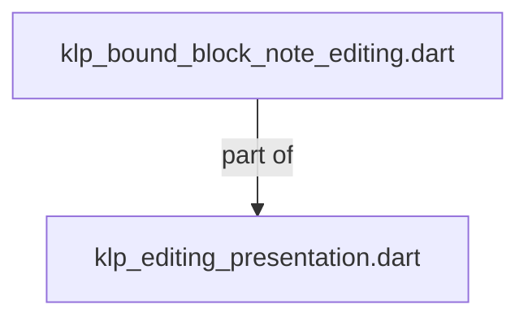
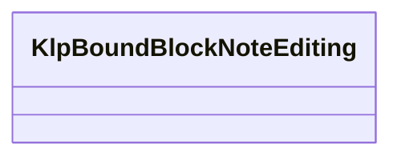
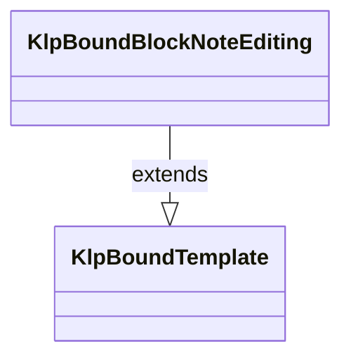

# klp_bound_block_note_editing.dart：直接依賴與宣告架構

[回到目錄](README.md) · [來源檔案](../../../../../../lib/src/features/editing/presentation/klp_bound_block_note_editing.dart)

## 範圍

核心是 `lib/src/features/editing/presentation/klp_bound_block_note_editing.dart`。主要視角為該檔案明寫的 import／export／part；輔助視角為本檔宣告及 extends／implements／with／on 關係。只展開一層外部邊界。

## 直接依賴圖

## 依賴證據

| 關係 | 原始 directive | 來源 |
|---|---|---|
| part of | <code>part of &#x27;klp_editing_presentation.dart&#x27;;</code> | [lib/src/features/editing/presentation/klp_bound_block_note_editing.dart:1](../../../../../../lib/src/features/editing/presentation/klp_bound_block_note_editing.dart#L1) |

## 宣告關係圖

本組節點是本檔宣告；沒有箭頭的宣告未在此圖主張互相依賴。

## 宣告與成員證據

成員包含 public 與 private；簽章取自來源，省略函式本體與欄位初始值。`(inferred)` 表示來源未明寫型別；建構子只顯示參數部分，不含初始化列表。

### KlpBoundBlockNoteEditing

ClassDeclaration · public · [lib/src/features/editing/presentation/klp_bound_block_note_editing.dart:3](../../../../../../lib/src/features/editing/presentation/klp_bound_block_note_editing.dart#L3)

<code>final class KlpBoundBlockNoteEditing extends KlpBoundTemplate</code>

來源註解摘要：已通過組裝檢查的 BlockNote session，不接受 consumer Widget 或 script。

- `extends` → <code>KlpBoundTemplate</code>：[lib/src/features/editing/presentation/klp_bound_block_note_editing.dart:4](../../../../../../lib/src/features/editing/presentation/klp_bound_block_note_editing.dart#L4)

| 成員 | 可見性 | 簽章／型別 | 來源註解摘要 | 證據 |
|---|---|---|---|---|
| field <code>controller</code> | public | <code>final KlpBlockNoteSessionController controller</code> |  | [lib/src/features/editing/presentation/klp_bound_block_note_editing.dart:5](../../../../../../lib/src/features/editing/presentation/klp_bound_block_note_editing.dart#L5) |
| field <code>onOpened</code> | public | <code>final Future&lt;void&gt; Function()? onOpened</code> |  | [lib/src/features/editing/presentation/klp_bound_block_note_editing.dart:6](../../../../../../lib/src/features/editing/presentation/klp_bound_block_note_editing.dart#L6) |
| field <code>resolveAsset</code> | public | <code>final Future&lt;KlpResolvedAsset&gt; Function(String assetId)? resolveAsset</code> |  | [lib/src/features/editing/presentation/klp_bound_block_note_editing.dart:7](../../../../../../lib/src/features/editing/presentation/klp_bound_block_note_editing.dart#L7) |
| field <code>onOpenAsset</code> | public | <code>final Future&lt;void&gt; Function(String assetId)? onOpenAsset</code> |  | [lib/src/features/editing/presentation/klp_bound_block_note_editing.dart:8](../../../../../../lib/src/features/editing/presentation/klp_bound_block_note_editing.dart#L8) |
| field <code>onOpenReference</code> | public | <code>final Future&lt;void&gt; Function(String referenceId, String sourceDocumentId, String sourceBlockId)? onOpenReference</code> |  | [lib/src/features/editing/presentation/klp_bound_block_note_editing.dart:9](../../../../../../lib/src/features/editing/presentation/klp_bound_block_note_editing.dart#L9) |
| field <code>background</code> | public | <code>final String background</code> |  | [lib/src/features/editing/presentation/klp_bound_block_note_editing.dart:10](../../../../../../lib/src/features/editing/presentation/klp_bound_block_note_editing.dart#L10) |
| field <code>text</code> | public | <code>final String text</code> |  | [lib/src/features/editing/presentation/klp_bound_block_note_editing.dart:11](../../../../../../lib/src/features/editing/presentation/klp_bound_block_note_editing.dart#L11) |
| field <code>fontFamily</code> | public | <code>final String fontFamily</code> |  | [lib/src/features/editing/presentation/klp_bound_block_note_editing.dart:12](../../../../../../lib/src/features/editing/presentation/klp_bound_block_note_editing.dart#L12) |
| field <code>fontSize</code> | public | <code>final double fontSize</code> |  | [lib/src/features/editing/presentation/klp_bound_block_note_editing.dart:13](../../../../../../lib/src/features/editing/presentation/klp_bound_block_note_editing.dart#L13) |
| constructor <code>KlpBoundBlockNoteEditing</code> | public | <code>const KlpBoundBlockNoteEditing(this.controller, {required this.background, required this.text, required this.fontFamily, required this.fontSize, this.onOpened, this.resolveAsset, this.onOpenAsset, this.onOpenReference})</code> |  | [lib/src/features/editing/presentation/klp_bound_block_note_editing.dart:14](../../../../../../lib/src/features/editing/presentation/klp_bound_block_note_editing.dart#L14) |

## 閱讀說明與限制

箭頭只表示來源明寫的靜態關係；import 不等於呼叫。未分析動態呼叫、欄位的實際物件擁有權、狀態轉移或渲染流程；型別未進行語意解析，繼承目標保留原始型別拼寫。public／private 依 Dart 名稱前綴判斷；public 宣告不代表已由 `lib/kallopis.dart` 匯出。

本頁由 `tool/architecture_atlas` 產生；編輯來源或生成工具後重新產生，避免手改本頁。
