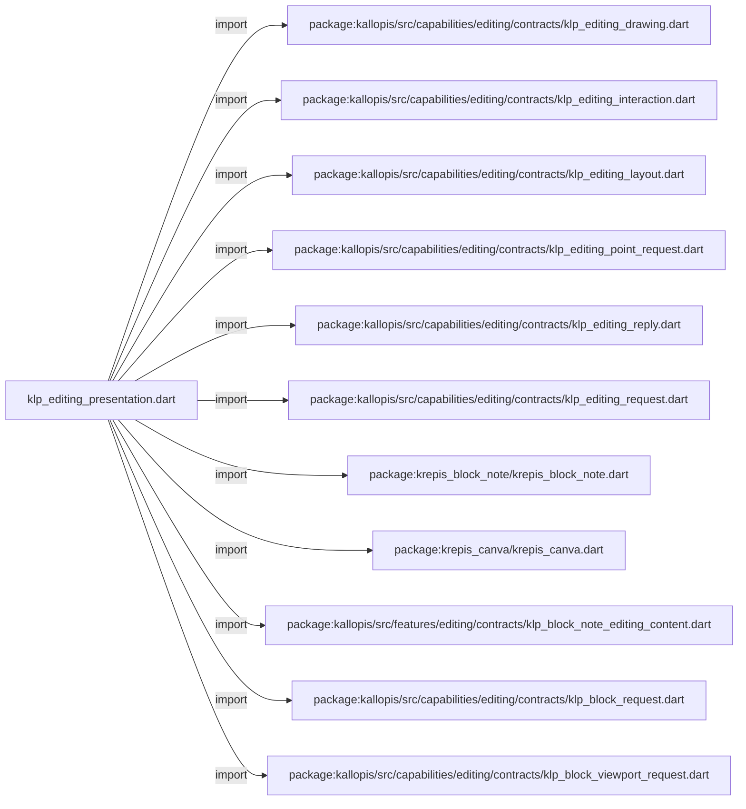
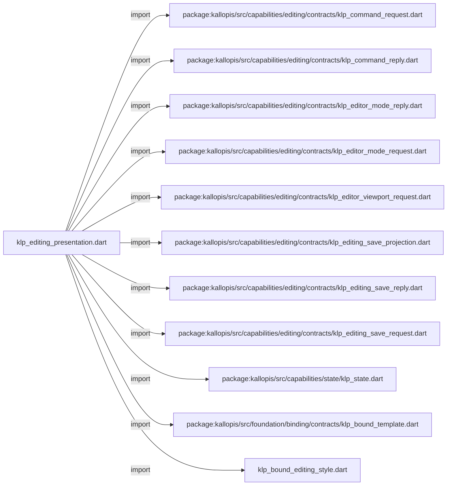
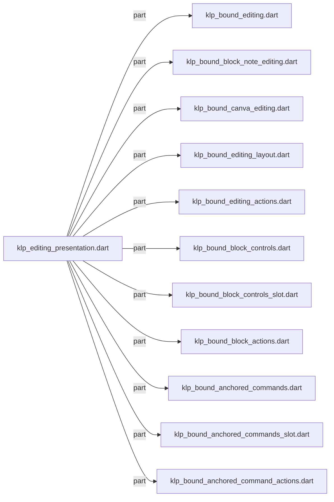
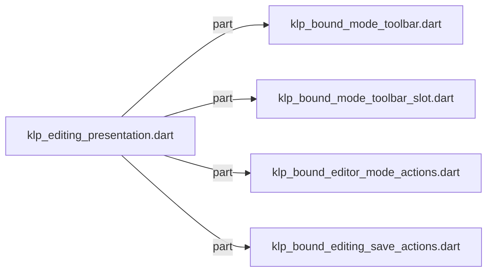

# klp_editing_presentation.dart：直接依賴與宣告架構

[回到目錄](README.md) · [來源檔案](../../../../../../lib/src/features/editing/presentation/klp_editing_presentation.dart)

## 範圍

核心是 `lib/src/features/editing/presentation/klp_editing_presentation.dart`。主要視角為該檔案明寫的 import／export／part；輔助視角為本檔宣告及 extends／implements／with／on 關係。只展開一層外部邊界。

## 直接依賴圖

## 依賴證據

| 關係 | 原始 directive | 來源 |
|---|---|---|
| import | <code>import &#x27;package:kallopis/src/capabilities/editing/contracts/klp_editing_drawing.dart&#x27;;</code> | [lib/src/features/editing/presentation/klp_editing_presentation.dart:1](../../../../../../lib/src/features/editing/presentation/klp_editing_presentation.dart#L1) |
| import | <code>import &#x27;package:kallopis/src/capabilities/editing/contracts/klp_editing_interaction.dart&#x27;;</code> | [lib/src/features/editing/presentation/klp_editing_presentation.dart:2](../../../../../../lib/src/features/editing/presentation/klp_editing_presentation.dart#L2) |
| import | <code>import &#x27;package:kallopis/src/capabilities/editing/contracts/klp_editing_layout.dart&#x27;;</code> | [lib/src/features/editing/presentation/klp_editing_presentation.dart:3](../../../../../../lib/src/features/editing/presentation/klp_editing_presentation.dart#L3) |
| import | <code>import &#x27;package:kallopis/src/capabilities/editing/contracts/klp_editing_point_request.dart&#x27;;</code> | [lib/src/features/editing/presentation/klp_editing_presentation.dart:4](../../../../../../lib/src/features/editing/presentation/klp_editing_presentation.dart#L4) |
| import | <code>import &#x27;package:kallopis/src/capabilities/editing/contracts/klp_editing_reply.dart&#x27;;</code> | [lib/src/features/editing/presentation/klp_editing_presentation.dart:5](../../../../../../lib/src/features/editing/presentation/klp_editing_presentation.dart#L5) |
| import | <code>import &#x27;package:kallopis/src/capabilities/editing/contracts/klp_editing_request.dart&#x27;;</code> | [lib/src/features/editing/presentation/klp_editing_presentation.dart:6](../../../../../../lib/src/features/editing/presentation/klp_editing_presentation.dart#L6) |
| import | <code>import &#x27;package:krepis_block_note/krepis_block_note.dart&#x27;;</code> | [lib/src/features/editing/presentation/klp_editing_presentation.dart:7](../../../../../../lib/src/features/editing/presentation/klp_editing_presentation.dart#L7) |
| import | <code>import &#x27;package:krepis_canva/krepis_canva.dart&#x27;;</code> | [lib/src/features/editing/presentation/klp_editing_presentation.dart:8](../../../../../../lib/src/features/editing/presentation/klp_editing_presentation.dart#L8) |
| import | <code>import &#x27;package:kallopis/src/features/editing/contracts/klp_block_note_editing_content.dart&#x27;;</code> | [lib/src/features/editing/presentation/klp_editing_presentation.dart:9](../../../../../../lib/src/features/editing/presentation/klp_editing_presentation.dart#L9) |
| import | <code>import &#x27;package:kallopis/src/capabilities/editing/contracts/klp_block_request.dart&#x27;;</code> | [lib/src/features/editing/presentation/klp_editing_presentation.dart:10](../../../../../../lib/src/features/editing/presentation/klp_editing_presentation.dart#L10) |
| import | <code>import &#x27;package:kallopis/src/capabilities/editing/contracts/klp_block_viewport_request.dart&#x27;;</code> | [lib/src/features/editing/presentation/klp_editing_presentation.dart:11](../../../../../../lib/src/features/editing/presentation/klp_editing_presentation.dart#L11) |
| import | <code>import &#x27;package:kallopis/src/capabilities/editing/contracts/klp_command_request.dart&#x27;;</code> | [lib/src/features/editing/presentation/klp_editing_presentation.dart:12](../../../../../../lib/src/features/editing/presentation/klp_editing_presentation.dart#L12) |
| import | <code>import &#x27;package:kallopis/src/capabilities/editing/contracts/klp_command_reply.dart&#x27;;</code> | [lib/src/features/editing/presentation/klp_editing_presentation.dart:13](../../../../../../lib/src/features/editing/presentation/klp_editing_presentation.dart#L13) |
| import | <code>import &#x27;package:kallopis/src/capabilities/editing/contracts/klp_editor_mode_reply.dart&#x27;;</code> | [lib/src/features/editing/presentation/klp_editing_presentation.dart:14](../../../../../../lib/src/features/editing/presentation/klp_editing_presentation.dart#L14) |
| import | <code>import &#x27;package:kallopis/src/capabilities/editing/contracts/klp_editor_mode_request.dart&#x27;;</code> | [lib/src/features/editing/presentation/klp_editing_presentation.dart:15](../../../../../../lib/src/features/editing/presentation/klp_editing_presentation.dart#L15) |
| import | <code>import &#x27;package:kallopis/src/capabilities/editing/contracts/klp_editor_viewport_request.dart&#x27;;</code> | [lib/src/features/editing/presentation/klp_editing_presentation.dart:16](../../../../../../lib/src/features/editing/presentation/klp_editing_presentation.dart#L16) |
| import | <code>import &#x27;package:kallopis/src/capabilities/editing/contracts/klp_editing_save_projection.dart&#x27;;</code> | [lib/src/features/editing/presentation/klp_editing_presentation.dart:17](../../../../../../lib/src/features/editing/presentation/klp_editing_presentation.dart#L17) |
| import | <code>import &#x27;package:kallopis/src/capabilities/editing/contracts/klp_editing_save_reply.dart&#x27;;</code> | [lib/src/features/editing/presentation/klp_editing_presentation.dart:18](../../../../../../lib/src/features/editing/presentation/klp_editing_presentation.dart#L18) |
| import | <code>import &#x27;package:kallopis/src/capabilities/editing/contracts/klp_editing_save_request.dart&#x27;;</code> | [lib/src/features/editing/presentation/klp_editing_presentation.dart:19](../../../../../../lib/src/features/editing/presentation/klp_editing_presentation.dart#L19) |
| import | <code>import &#x27;package:kallopis/src/capabilities/state/klp_state.dart&#x27;;</code> | [lib/src/features/editing/presentation/klp_editing_presentation.dart:20](../../../../../../lib/src/features/editing/presentation/klp_editing_presentation.dart#L20) |
| import | <code>import &#x27;package:kallopis/src/foundation/binding/contracts/klp_bound_template.dart&#x27;;</code> | [lib/src/features/editing/presentation/klp_editing_presentation.dart:21](../../../../../../lib/src/features/editing/presentation/klp_editing_presentation.dart#L21) |
| import | <code>import &#x27;klp_bound_editing_style.dart&#x27;;</code> | [lib/src/features/editing/presentation/klp_editing_presentation.dart:22](../../../../../../lib/src/features/editing/presentation/klp_editing_presentation.dart#L22) |
| part | <code>part &#x27;klp_bound_editing.dart&#x27;;</code> | [lib/src/features/editing/presentation/klp_editing_presentation.dart:25](../../../../../../lib/src/features/editing/presentation/klp_editing_presentation.dart#L25) |
| part | <code>part &#x27;klp_bound_block_note_editing.dart&#x27;;</code> | [lib/src/features/editing/presentation/klp_editing_presentation.dart:26](../../../../../../lib/src/features/editing/presentation/klp_editing_presentation.dart#L26) |
| part | <code>part &#x27;klp_bound_canva_editing.dart&#x27;;</code> | [lib/src/features/editing/presentation/klp_editing_presentation.dart:27](../../../../../../lib/src/features/editing/presentation/klp_editing_presentation.dart#L27) |
| part | <code>part &#x27;klp_bound_editing_layout.dart&#x27;;</code> | [lib/src/features/editing/presentation/klp_editing_presentation.dart:28](../../../../../../lib/src/features/editing/presentation/klp_editing_presentation.dart#L28) |
| part | <code>part &#x27;klp_bound_editing_actions.dart&#x27;;</code> | [lib/src/features/editing/presentation/klp_editing_presentation.dart:29](../../../../../../lib/src/features/editing/presentation/klp_editing_presentation.dart#L29) |
| part | <code>part &#x27;klp_bound_block_controls.dart&#x27;;</code> | [lib/src/features/editing/presentation/klp_editing_presentation.dart:30](../../../../../../lib/src/features/editing/presentation/klp_editing_presentation.dart#L30) |
| part | <code>part &#x27;klp_bound_block_controls_slot.dart&#x27;;</code> | [lib/src/features/editing/presentation/klp_editing_presentation.dart:31](../../../../../../lib/src/features/editing/presentation/klp_editing_presentation.dart#L31) |
| part | <code>part &#x27;klp_bound_block_actions.dart&#x27;;</code> | [lib/src/features/editing/presentation/klp_editing_presentation.dart:32](../../../../../../lib/src/features/editing/presentation/klp_editing_presentation.dart#L32) |
| part | <code>part &#x27;klp_bound_anchored_commands.dart&#x27;;</code> | [lib/src/features/editing/presentation/klp_editing_presentation.dart:33](../../../../../../lib/src/features/editing/presentation/klp_editing_presentation.dart#L33) |
| part | <code>part &#x27;klp_bound_anchored_commands_slot.dart&#x27;;</code> | [lib/src/features/editing/presentation/klp_editing_presentation.dart:34](../../../../../../lib/src/features/editing/presentation/klp_editing_presentation.dart#L34) |
| part | <code>part &#x27;klp_bound_anchored_command_actions.dart&#x27;;</code> | [lib/src/features/editing/presentation/klp_editing_presentation.dart:35](../../../../../../lib/src/features/editing/presentation/klp_editing_presentation.dart#L35) |
| part | <code>part &#x27;klp_bound_mode_toolbar.dart&#x27;;</code> | [lib/src/features/editing/presentation/klp_editing_presentation.dart:36](../../../../../../lib/src/features/editing/presentation/klp_editing_presentation.dart#L36) |
| part | <code>part &#x27;klp_bound_mode_toolbar_slot.dart&#x27;;</code> | [lib/src/features/editing/presentation/klp_editing_presentation.dart:37](../../../../../../lib/src/features/editing/presentation/klp_editing_presentation.dart#L37) |
| part | <code>part &#x27;klp_bound_editor_mode_actions.dart&#x27;;</code> | [lib/src/features/editing/presentation/klp_editing_presentation.dart:38](../../../../../../lib/src/features/editing/presentation/klp_editing_presentation.dart#L38) |
| part | <code>part &#x27;klp_bound_editing_save_actions.dart&#x27;;</code> | [lib/src/features/editing/presentation/klp_editing_presentation.dart:39](../../../../../../lib/src/features/editing/presentation/klp_editing_presentation.dart#L39) |

## 宣告關係圖

本檔沒有 class／enum／mixin／extension 宣告；頂層函式、變數與 typedef 見下表。

## 宣告與成員證據

成員包含 public 與 private；簽章取自來源，省略函式本體與欄位初始值。`(inferred)` 表示來源未明寫型別；建構子只顯示參數部分，不含初始化列表。

## 閱讀說明與限制

箭頭只表示來源明寫的靜態關係；import 不等於呼叫。未分析動態呼叫、欄位的實際物件擁有權、狀態轉移或渲染流程；型別未進行語意解析，繼承目標保留原始型別拼寫。public／private 依 Dart 名稱前綴判斷；public 宣告不代表已由 `lib/kallopis.dart` 匯出。

本頁由 `tool/architecture_atlas` 產生；編輯來源或生成工具後重新產生，避免手改本頁。
