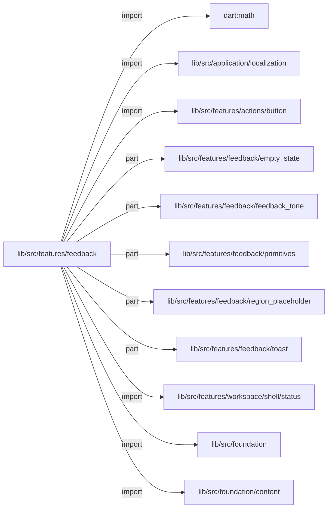
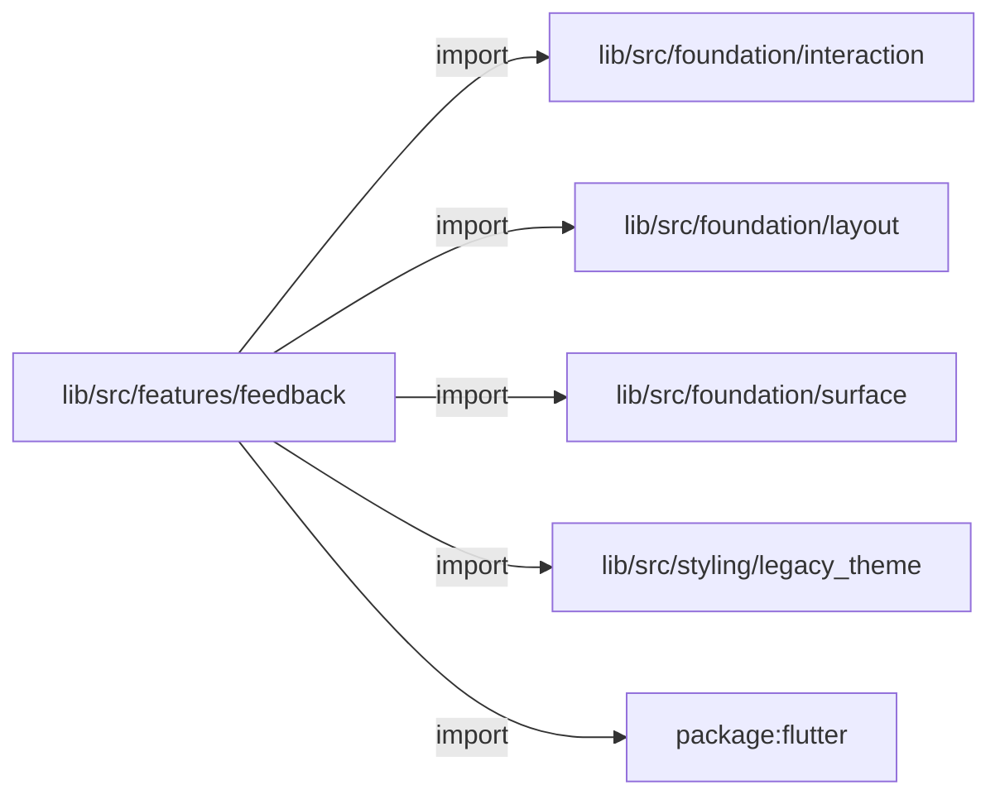
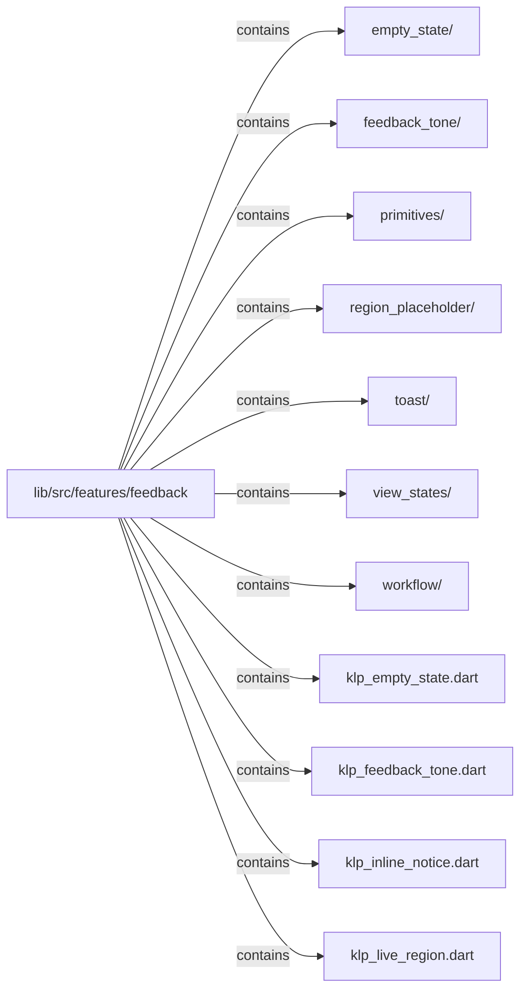
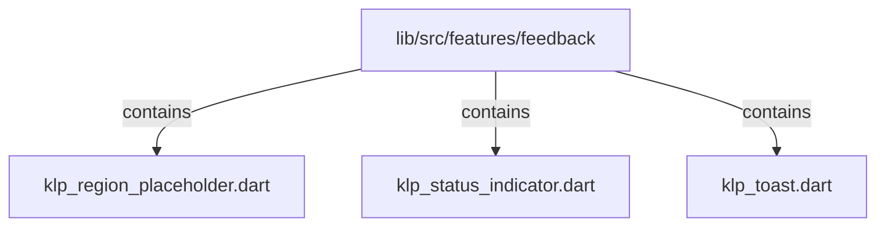

# lib/src/features/feedback：架構分析入口

[上一層](../README.md)

## 範圍

閱讀 `lib/src/features/feedback` 的直接子目錄與 Dart 檔案。結構圖表示實際檔案包含關係；依賴圖表示本層檔案明寫的 directives。每個檔案頁另列直接依賴、宣告、欄位、方法、建構子及行號證據。

## 本層直接依賴圖

箭頭以本層 Dart 檔案明寫的 directive 彙總到目標所在目錄或外部套件邊界；不遞迴將子目錄依賴算入本層。相同目標的不同 directive 類型分開計數。

| 目標邊界 | 關係 | directive 數 | 第一筆來源證據 |
|---|---|---|---|
| <code>dart:math</code> | import | 1 | [lib/src/features/feedback/klp_region_placeholder.dart:1](../../../../../lib/src/features/feedback/klp_region_placeholder.dart#L1) |
| <code>lib/src/application/localization</code> | import | 1 | [lib/src/features/feedback/klp_toast.dart:6](../../../../../lib/src/features/feedback/klp_toast.dart#L6) |
| <code>lib/src/features/actions/button</code> | import | 1 | [lib/src/features/feedback/klp_toast.dart:3](../../../../../lib/src/features/feedback/klp_toast.dart#L3) |
| <code>lib/src/features/feedback/empty_state</code> | part | 2 | [lib/src/features/feedback/klp_empty_state.dart:11](../../../../../lib/src/features/feedback/klp_empty_state.dart#L11) |
| <code>lib/src/features/feedback/feedback_tone</code> | part | 2 | [lib/src/features/feedback/klp_feedback_tone.dart:7](../../../../../lib/src/features/feedback/klp_feedback_tone.dart#L7) |
| <code>lib/src/features/feedback/primitives</code> | part | 5 | [lib/src/features/feedback/klp_live_region.dart:5](../../../../../lib/src/features/feedback/klp_live_region.dart#L5) |
| <code>lib/src/features/feedback/region_placeholder</code> | part | 3 | [lib/src/features/feedback/klp_region_placeholder.dart:14](../../../../../lib/src/features/feedback/klp_region_placeholder.dart#L14) |
| <code>lib/src/features/feedback/toast</code> | part | 2 | [lib/src/features/feedback/klp_toast.dart:13](../../../../../lib/src/features/feedback/klp_toast.dart#L13) |
| <code>lib/src/features/workspace/shell/status</code> | import | 1 | [lib/src/features/feedback/klp_status_indicator.dart:4](../../../../../lib/src/features/feedback/klp_status_indicator.dart#L4) |
| <code>lib/src/foundation</code> | import | 5 | [lib/src/features/feedback/klp_empty_state.dart:3](../../../../../lib/src/features/feedback/klp_empty_state.dart#L3) |
| <code>lib/src/foundation/content</code> | import | 5 | [lib/src/features/feedback/klp_empty_state.dart:9](../../../../../lib/src/features/feedback/klp_empty_state.dart#L9) |
| <code>lib/src/foundation/interaction</code> | import | 5 | [lib/src/features/feedback/klp_empty_state.dart:4](../../../../../lib/src/features/feedback/klp_empty_state.dart#L4) |
| <code>lib/src/foundation/layout</code> | import | 6 | [lib/src/features/feedback/klp_empty_state.dart:5](../../../../../lib/src/features/feedback/klp_empty_state.dart#L5) |
| <code>lib/src/foundation/surface</code> | import | 5 | [lib/src/features/feedback/klp_empty_state.dart:6](../../../../../lib/src/features/feedback/klp_empty_state.dart#L6) |
| <code>lib/src/styling/legacy_theme</code> | import | 6 | [lib/src/features/feedback/klp_empty_state.dart:8](../../../../../lib/src/features/feedback/klp_empty_state.dart#L8) |
| <code>package:flutter</code> | import | 7 | [lib/src/features/feedback/klp_empty_state.dart:1](../../../../../lib/src/features/feedback/klp_empty_state.dart#L1) |

### 同目錄依賴

| 來源 → 目標 | 關係 | 證據 |
|---|---|---|
| <code>klp_inline_notice.dart → klp_feedback_tone.dart</code> | import | [lib/src/features/feedback/klp_inline_notice.dart:8](../../../../../lib/src/features/feedback/klp_inline_notice.dart#L8) |
| <code>klp_toast.dart → klp_feedback_tone.dart</code> | import | [lib/src/features/feedback/klp_toast.dart:10](../../../../../lib/src/features/feedback/klp_toast.dart#L10) |
| <code>klp_toast.dart → klp_live_region.dart</code> | import | [lib/src/features/feedback/klp_toast.dart:11](../../../../../lib/src/features/feedback/klp_toast.dart#L11) |

## 目錄結構圖

## 子目錄

| 目錄 | 導航 | 來源證據 |
|---|---|---|
| `empty_state/` | [架構入口](empty_state/README.md) | [來源目錄](../../../../../lib/src/features/feedback/empty_state) |
| `feedback_tone/` | [架構入口](feedback_tone/README.md) | [來源目錄](../../../../../lib/src/features/feedback/feedback_tone) |
| `primitives/` | [架構入口](primitives/README.md) | [來源目錄](../../../../../lib/src/features/feedback/primitives) |
| `region_placeholder/` | [架構入口](region_placeholder/README.md) | [來源目錄](../../../../../lib/src/features/feedback/region_placeholder) |
| `toast/` | [架構入口](toast/README.md) | [來源目錄](../../../../../lib/src/features/feedback/toast) |
| `view_states/` | [架構入口](view_states/README.md) | [來源目錄](../../../../../lib/src/features/feedback/view_states) |
| `workflow/` | [架構入口](workflow/README.md) | [來源目錄](../../../../../lib/src/features/feedback/workflow) |

## 本層檔案

| 檔案 | 宣告 | 細節 | 來源證據 |
|---|---|---|---|
| `klp_empty_state.dart` | 無頂層宣告 | [架構與 API](klp_empty_state.md) | [lib/src/features/feedback/klp_empty_state.dart:1](../../../../../lib/src/features/feedback/klp_empty_state.dart#L1) |
| `klp_feedback_tone.dart` | 無頂層宣告 | [架構與 API](klp_feedback_tone.md) | [lib/src/features/feedback/klp_feedback_tone.dart:1](../../../../../lib/src/features/feedback/klp_feedback_tone.dart#L1) |
| `klp_inline_notice.dart` | KlpInlineNotice | [架構與 API](klp_inline_notice.md) | [lib/src/features/feedback/klp_inline_notice.dart:1](../../../../../lib/src/features/feedback/klp_inline_notice.dart#L1) |
| `klp_live_region.dart` | KlpLiveRegion | [架構與 API](klp_live_region.md) | [lib/src/features/feedback/klp_live_region.dart:1](../../../../../lib/src/features/feedback/klp_live_region.dart#L1) |
| `klp_region_placeholder.dart` | 無頂層宣告 | [架構與 API](klp_region_placeholder.md) | [lib/src/features/feedback/klp_region_placeholder.dart:1](../../../../../lib/src/features/feedback/klp_region_placeholder.dart#L1) |
| `klp_status_indicator.dart` | KlpStatusIndicator | [架構與 API](klp_status_indicator.md) | [lib/src/features/feedback/klp_status_indicator.dart:1](../../../../../lib/src/features/feedback/klp_status_indicator.dart#L1) |
| `klp_toast.dart` | 無頂層宣告 | [架構與 API](klp_toast.md) | [lib/src/features/feedback/klp_toast.dart:1](../../../../../lib/src/features/feedback/klp_toast.dart#L1) |

## 閱讀說明

箭頭只表示來源明寫的靜態關係；import 不等於呼叫。未分析動態呼叫、欄位的實際物件擁有權、狀態轉移或渲染流程；型別未進行語意解析，繼承目標保留原始型別拼寫。public／private 依 Dart 名稱前綴判斷；public 宣告不代表已由 `lib/kallopis.dart` 匯出。

本頁的目錄與檔案由來源清冊產生；`manifest.json` 位於本圖集根目錄，可核對 SHA-256 與覆蓋數。人工模組摘要存於 `tool/architecture_atlas/briefs/`，重新生成時保留。
