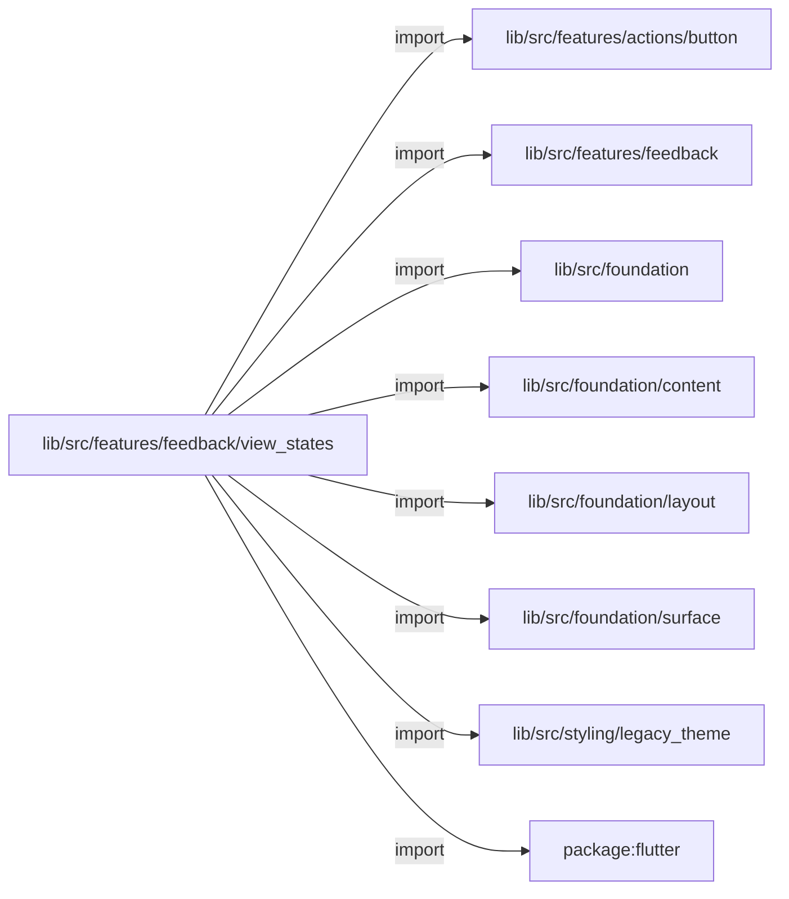
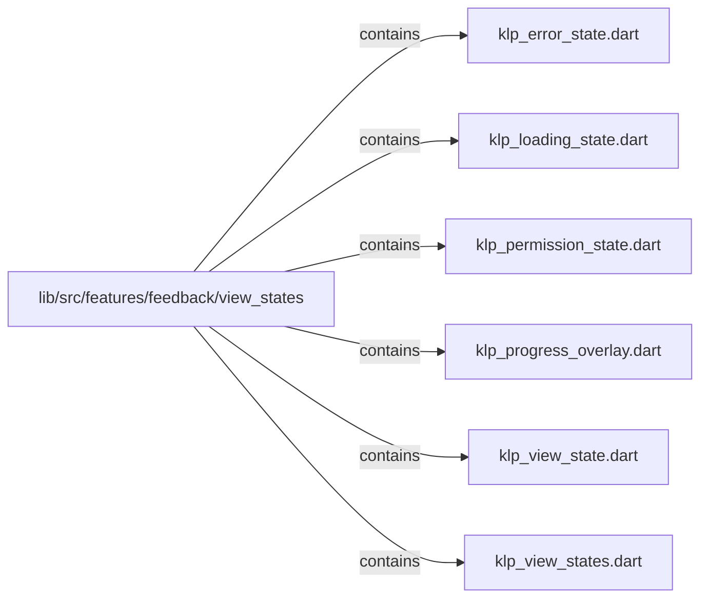

# lib/src/features/feedback/view_states：架構分析入口

[上一層](../README.md)

## 範圍

閱讀 `lib/src/features/feedback/view_states` 的直接子目錄與 Dart 檔案。結構圖表示實際檔案包含關係；依賴圖表示本層檔案明寫的 directives。每個檔案頁另列直接依賴、宣告、欄位、方法、建構子及行號證據。

## 本層直接依賴圖

箭頭以本層 Dart 檔案明寫的 directive 彙總到目標所在目錄或外部套件邊界；不遞迴將子目錄依賴算入本層。相同目標的不同 directive 類型分開計數。

| 目標邊界 | 關係 | directive 數 | 第一筆來源證據 |
|---|---|---|---|
| <code>lib/src/features/actions/button</code> | import | 1 | [lib/src/features/feedback/view_states/klp_view_states.dart:3](../../../../../../lib/src/features/feedback/view_states/klp_view_states.dart#L3) |
| <code>lib/src/features/feedback</code> | import | 1 | [lib/src/features/feedback/view_states/klp_view_states.dart:11](../../../../../../lib/src/features/feedback/view_states/klp_view_states.dart#L11) |
| <code>lib/src/foundation</code> | import | 2 | [lib/src/features/feedback/view_states/klp_view_states.dart:4](../../../../../../lib/src/features/feedback/view_states/klp_view_states.dart#L4) |
| <code>lib/src/foundation/content</code> | import | 1 | [lib/src/features/feedback/view_states/klp_view_states.dart:10](../../../../../../lib/src/features/feedback/view_states/klp_view_states.dart#L10) |
| <code>lib/src/foundation/layout</code> | import | 1 | [lib/src/features/feedback/view_states/klp_view_states.dart:6](../../../../../../lib/src/features/feedback/view_states/klp_view_states.dart#L6) |
| <code>lib/src/foundation/surface</code> | import | 2 | [lib/src/features/feedback/view_states/klp_view_states.dart:7](../../../../../../lib/src/features/feedback/view_states/klp_view_states.dart#L7) |
| <code>lib/src/styling/legacy_theme</code> | import | 1 | [lib/src/features/feedback/view_states/klp_view_states.dart:9](../../../../../../lib/src/features/feedback/view_states/klp_view_states.dart#L9) |
| <code>package:flutter</code> | import | 1 | [lib/src/features/feedback/view_states/klp_view_states.dart:1](../../../../../../lib/src/features/feedback/view_states/klp_view_states.dart#L1) |

### 同目錄依賴

| 來源 → 目標 | 關係 | 證據 |
|---|---|---|
| <code>klp_error_state.dart → klp_view_states.dart</code> | part of | [lib/src/features/feedback/view_states/klp_error_state.dart:1](../../../../../../lib/src/features/feedback/view_states/klp_error_state.dart#L1) |
| <code>klp_loading_state.dart → klp_view_states.dart</code> | part of | [lib/src/features/feedback/view_states/klp_loading_state.dart:1](../../../../../../lib/src/features/feedback/view_states/klp_loading_state.dart#L1) |
| <code>klp_permission_state.dart → klp_view_states.dart</code> | part of | [lib/src/features/feedback/view_states/klp_permission_state.dart:1](../../../../../../lib/src/features/feedback/view_states/klp_permission_state.dart#L1) |
| <code>klp_progress_overlay.dart → klp_view_states.dart</code> | part of | [lib/src/features/feedback/view_states/klp_progress_overlay.dart:1](../../../../../../lib/src/features/feedback/view_states/klp_progress_overlay.dart#L1) |
| <code>klp_view_state.dart → klp_view_states.dart</code> | part of | [lib/src/features/feedback/view_states/klp_view_state.dart:1](../../../../../../lib/src/features/feedback/view_states/klp_view_state.dart#L1) |
| <code>klp_view_states.dart → klp_error_state.dart</code> | part | [lib/src/features/feedback/view_states/klp_view_states.dart:13](../../../../../../lib/src/features/feedback/view_states/klp_view_states.dart#L13) |
| <code>klp_view_states.dart → klp_loading_state.dart</code> | part | [lib/src/features/feedback/view_states/klp_view_states.dart:14](../../../../../../lib/src/features/feedback/view_states/klp_view_states.dart#L14) |
| <code>klp_view_states.dart → klp_permission_state.dart</code> | part | [lib/src/features/feedback/view_states/klp_view_states.dart:15](../../../../../../lib/src/features/feedback/view_states/klp_view_states.dart#L15) |
| <code>klp_view_states.dart → klp_progress_overlay.dart</code> | part | [lib/src/features/feedback/view_states/klp_view_states.dart:16](../../../../../../lib/src/features/feedback/view_states/klp_view_states.dart#L16) |
| <code>klp_view_states.dart → klp_view_state.dart</code> | part | [lib/src/features/feedback/view_states/klp_view_states.dart:17](../../../../../../lib/src/features/feedback/view_states/klp_view_states.dart#L17) |

## 目錄結構圖

## 子目錄

| 目錄 | 導航 | 來源證據 |
|---|---|---|
| 無 | 目前沒有下一層目錄 | — |

## 本層檔案

| 檔案 | 宣告 | 細節 | 來源證據 |
|---|---|---|---|
| `klp_error_state.dart` | KlpErrorState | [架構與 API](klp_error_state.md) | [lib/src/features/feedback/view_states/klp_error_state.dart:1](../../../../../../lib/src/features/feedback/view_states/klp_error_state.dart#L1) |
| `klp_loading_state.dart` | KlpLoadingState | [架構與 API](klp_loading_state.md) | [lib/src/features/feedback/view_states/klp_loading_state.dart:1](../../../../../../lib/src/features/feedback/view_states/klp_loading_state.dart#L1) |
| `klp_permission_state.dart` | KlpPermissionState | [架構與 API](klp_permission_state.md) | [lib/src/features/feedback/view_states/klp_permission_state.dart:1](../../../../../../lib/src/features/feedback/view_states/klp_permission_state.dart#L1) |
| `klp_progress_overlay.dart` | KlpProgressOverlay | [架構與 API](klp_progress_overlay.md) | [lib/src/features/feedback/view_states/klp_progress_overlay.dart:1](../../../../../../lib/src/features/feedback/view_states/klp_progress_overlay.dart#L1) |
| `klp_view_state.dart` | _KlpViewState | [架構與 API](klp_view_state.md) | [lib/src/features/feedback/view_states/klp_view_state.dart:1](../../../../../../lib/src/features/feedback/view_states/klp_view_state.dart#L1) |
| `klp_view_states.dart` | 無頂層宣告 | [架構與 API](klp_view_states.md) | [lib/src/features/feedback/view_states/klp_view_states.dart:1](../../../../../../lib/src/features/feedback/view_states/klp_view_states.dart#L1) |

## 閱讀說明

箭頭只表示來源明寫的靜態關係；import 不等於呼叫。未分析動態呼叫、欄位的實際物件擁有權、狀態轉移或渲染流程；型別未進行語意解析，繼承目標保留原始型別拼寫。public／private 依 Dart 名稱前綴判斷；public 宣告不代表已由 `lib/kallopis.dart` 匯出。

本頁的目錄與檔案由來源清冊產生；`manifest.json` 位於本圖集根目錄，可核對 SHA-256 與覆蓋數。人工模組摘要存於 `tool/architecture_atlas/briefs/`，重新生成時保留。
