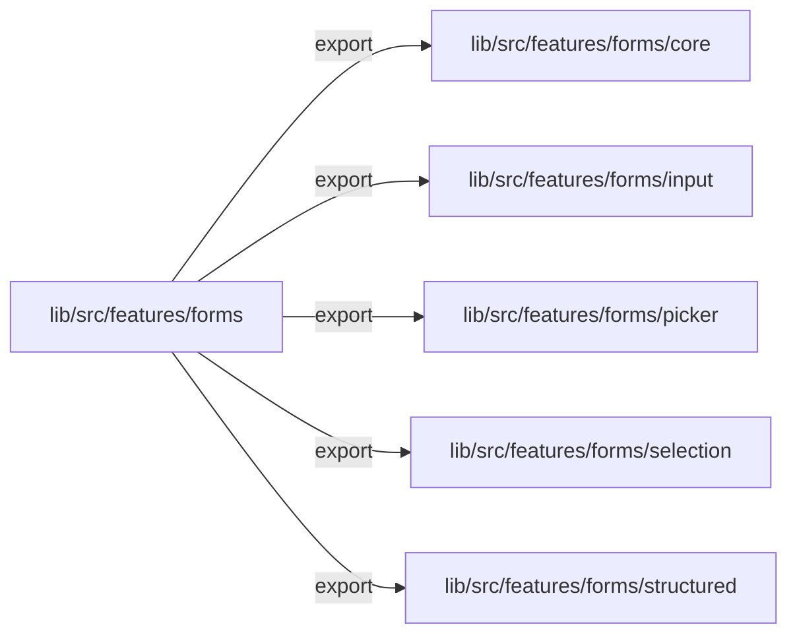
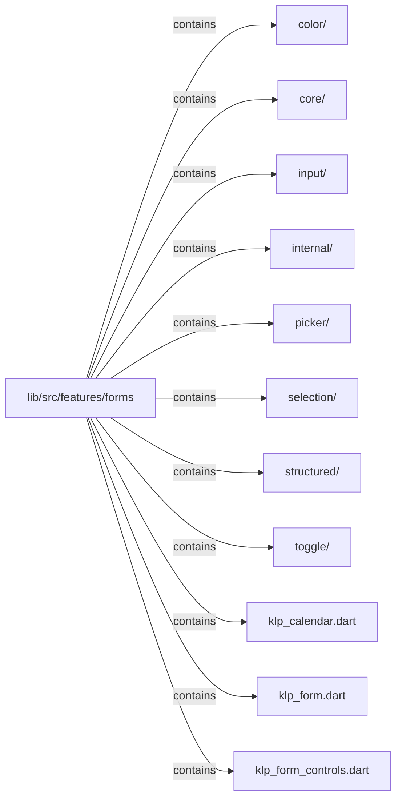
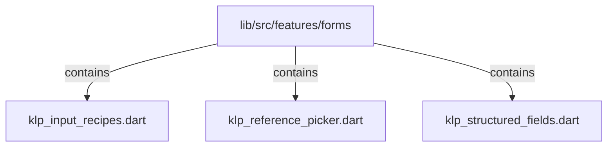

# lib/src/features/forms：架構分析入口

[上一層](../README.md)

## 範圍

閱讀 `lib/src/features/forms` 的直接子目錄與 Dart 檔案。結構圖表示實際檔案包含關係；依賴圖表示本層檔案明寫的 directives。每個檔案頁另列直接依賴、宣告、欄位、方法、建構子及行號證據。

## 本層直接依賴圖

箭頭以本層 Dart 檔案明寫的 directive 彙總到目標所在目錄或外部套件邊界；不遞迴將子目錄依賴算入本層。相同目標的不同 directive 類型分開計數。

| 目標邊界 | 關係 | directive 數 | 第一筆來源證據 |
|---|---|---|---|
| <code>lib/src/features/forms/core</code> | export | 11 | [lib/src/features/forms/klp_form.dart:1](../../../../../lib/src/features/forms/klp_form.dart#L1) |
| <code>lib/src/features/forms/input</code> | export | 6 | [lib/src/features/forms/klp_form_controls.dart:1](../../../../../lib/src/features/forms/klp_form_controls.dart#L1) |
| <code>lib/src/features/forms/picker</code> | export | 1 | [lib/src/features/forms/klp_reference_picker.dart:1](../../../../../lib/src/features/forms/klp_reference_picker.dart#L1) |
| <code>lib/src/features/forms/selection</code> | export | 11 | [lib/src/features/forms/klp_calendar.dart:1](../../../../../lib/src/features/forms/klp_calendar.dart#L1) |
| <code>lib/src/features/forms/structured</code> | export | 7 | [lib/src/features/forms/klp_structured_fields.dart:2](../../../../../lib/src/features/forms/klp_structured_fields.dart#L2) |

## 目錄結構圖

## 子目錄

| 目錄 | 導航 | 來源證據 |
|---|---|---|
| `color/` | [架構入口](color/README.md) | [來源目錄](../../../../../lib/src/features/forms/color) |
| `core/` | [架構入口](core/README.md) | [來源目錄](../../../../../lib/src/features/forms/core) |
| `input/` | [架構入口](input/README.md) | [來源目錄](../../../../../lib/src/features/forms/input) |
| `internal/` | [架構入口](internal/README.md) | [來源目錄](../../../../../lib/src/features/forms/internal) |
| `picker/` | [架構入口](picker/README.md) | [來源目錄](../../../../../lib/src/features/forms/picker) |
| `selection/` | [架構入口](selection/README.md) | [來源目錄](../../../../../lib/src/features/forms/selection) |
| `structured/` | [架構入口](structured/README.md) | [來源目錄](../../../../../lib/src/features/forms/structured) |
| `toggle/` | [架構入口](toggle/README.md) | [來源目錄](../../../../../lib/src/features/forms/toggle) |

## 本層檔案

| 檔案 | 宣告 | 細節 | 來源證據 |
|---|---|---|---|
| `klp_calendar.dart` | 無頂層宣告 | [架構與 API](klp_calendar.md) | [lib/src/features/forms/klp_calendar.dart:1](../../../../../lib/src/features/forms/klp_calendar.dart#L1) |
| `klp_form.dart` | 無頂層宣告 | [架構與 API](klp_form.md) | [lib/src/features/forms/klp_form.dart:1](../../../../../lib/src/features/forms/klp_form.dart#L1) |
| `klp_form_controls.dart` | 無頂層宣告 | [架構與 API](klp_form_controls.md) | [lib/src/features/forms/klp_form_controls.dart:1](../../../../../lib/src/features/forms/klp_form_controls.dart#L1) |
| `klp_input_recipes.dart` | 無頂層宣告 | [架構與 API](klp_input_recipes.md) | [lib/src/features/forms/klp_input_recipes.dart:1](../../../../../lib/src/features/forms/klp_input_recipes.dart#L1) |
| `klp_reference_picker.dart` | 無頂層宣告 | [架構與 API](klp_reference_picker.md) | [lib/src/features/forms/klp_reference_picker.dart:1](../../../../../lib/src/features/forms/klp_reference_picker.dart#L1) |
| `klp_structured_fields.dart` | 無頂層宣告 | [架構與 API](klp_structured_fields.md) | [lib/src/features/forms/klp_structured_fields.dart:1](../../../../../lib/src/features/forms/klp_structured_fields.dart#L1) |

## 閱讀說明

箭頭只表示來源明寫的靜態關係；import 不等於呼叫。未分析動態呼叫、欄位的實際物件擁有權、狀態轉移或渲染流程；型別未進行語意解析，繼承目標保留原始型別拼寫。public／private 依 Dart 名稱前綴判斷；public 宣告不代表已由 `lib/kallopis.dart` 匯出。

本頁的目錄與檔案由來源清冊產生；`manifest.json` 位於本圖集根目錄，可核對 SHA-256 與覆蓋數。人工模組摘要存於 `tool/architecture_atlas/briefs/`，重新生成時保留。
