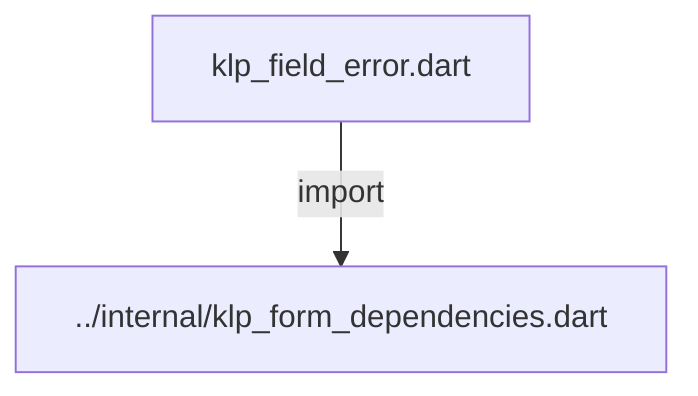
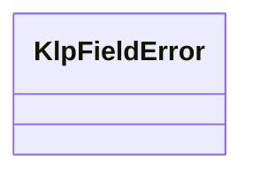
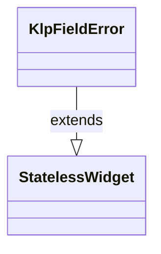

# klp_field_error.dart：直接依賴與宣告架構

[回到目錄](README.md) · [來源檔案](../../../../../../lib/src/features/forms/core/klp_field_error.dart)

## 範圍

核心是 `lib/src/features/forms/core/klp_field_error.dart`。主要視角為該檔案明寫的 import／export／part；輔助視角為本檔宣告及 extends／implements／with／on 關係。只展開一層外部邊界。

## 直接依賴圖

## 依賴證據

| 關係 | 原始 directive | 來源 |
|---|---|---|
| import | <code>import &#x27;../internal/klp_form_dependencies.dart&#x27;;</code> | [lib/src/features/forms/core/klp_field_error.dart:1](../../../../../../lib/src/features/forms/core/klp_field_error.dart#L1) |

## 宣告關係圖

本組節點是本檔宣告；沒有箭頭的宣告未在此圖主張互相依賴。

## 宣告與成員證據

成員包含 public 與 private；簽章取自來源，省略函式本體與欄位初始值。`(inferred)` 表示來源未明寫型別；建構子只顯示參數部分，不含初始化列表。

### KlpFieldError

ClassDeclaration · public · [lib/src/features/forms/core/klp_field_error.dart:3](../../../../../../lib/src/features/forms/core/klp_field_error.dart#L3)

<code>class KlpFieldError extends StatelessWidget</code>

來源註解摘要：單獨呈現的欄位錯誤文字，包了 Kallopis live region，讓螢幕 報讀器在錯誤出現時主動唸出來，不需要使用者手動聚焦。 [KlpField] 的內建錯誤列沒有這層 live region 包裝；需要非同步驗證結果 出現時立即被報讀器感知，才需要在 [KlpField] 之外單獨用它。

- `extends` → <code>StatelessWidget</code>：[lib/src/features/forms/core/klp_field_error.dart:8](../../../../../../lib/src/features/forms/core/klp_field_error.dart#L8)

| 成員 | 可見性 | 簽章／型別 | 來源註解摘要 | 證據 |
|---|---|---|---|---|
| constructor <code>KlpFieldError</code> | public | <code>const KlpFieldError({super.key, required this.error})</code> |  | [lib/src/features/forms/core/klp_field_error.dart:9](../../../../../../lib/src/features/forms/core/klp_field_error.dart#L9) |
| field <code>error</code> | public | <code>final String error</code> |  | [lib/src/features/forms/core/klp_field_error.dart:11](../../../../../../lib/src/features/forms/core/klp_field_error.dart#L11) |
| method <code>build</code> | public | <code>Widget build(BuildContext context)</code> |  | [lib/src/features/forms/core/klp_field_error.dart:13](../../../../../../lib/src/features/forms/core/klp_field_error.dart#L13) |

## 閱讀說明與限制

箭頭只表示來源明寫的靜態關係；import 不等於呼叫。未分析動態呼叫、欄位的實際物件擁有權、狀態轉移或渲染流程；型別未進行語意解析，繼承目標保留原始型別拼寫。public／private 依 Dart 名稱前綴判斷；public 宣告不代表已由 `lib/kallopis.dart` 匯出。

本頁由 `tool/architecture_atlas` 產生；編輯來源或生成工具後重新產生，避免手改本頁。
