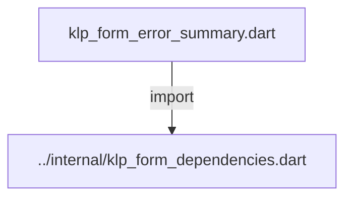
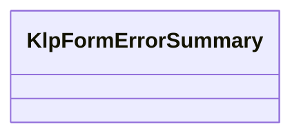
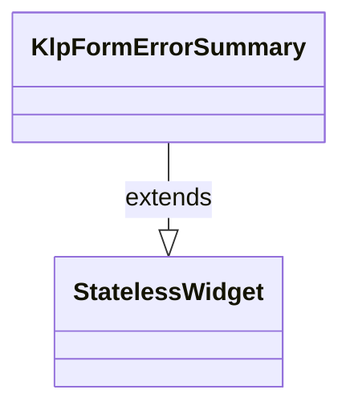

# klp_form_error_summary.dart：直接依賴與宣告架構

[回到目錄](README.md) · [來源檔案](../../../../../../lib/src/features/forms/core/klp_form_error_summary.dart)

## 範圍

核心是 `lib/src/features/forms/core/klp_form_error_summary.dart`。主要視角為該檔案明寫的 import／export／part；輔助視角為本檔宣告及 extends／implements／with／on 關係。只展開一層外部邊界。

## 直接依賴圖

## 依賴證據

| 關係 | 原始 directive | 來源 |
|---|---|---|
| import | <code>import &#x27;../internal/klp_form_dependencies.dart&#x27;;</code> | [lib/src/features/forms/core/klp_form_error_summary.dart:1](../../../../../../lib/src/features/forms/core/klp_form_error_summary.dart#L1) |

## 宣告關係圖

本組節點是本檔宣告；沒有箭頭的宣告未在此圖主張互相依賴。

## 宣告與成員證據

成員包含 public 與 private；簽章取自來源，省略函式本體與欄位初始值。`(inferred)` 表示來源未明寫型別；建構子只顯示參數部分，不含初始化列表。

### KlpFormErrorSummary

ClassDeclaration · public · [lib/src/features/forms/core/klp_form_error_summary.dart:3](../../../../../../lib/src/features/forms/core/klp_form_error_summary.dart#L3)

<code>class KlpFormErrorSummary extends StatelessWidget</code>

來源註解摘要：表單頂部的錯誤總覽卡片，把所有驗證失敗的欄位集中列成清單。 [errors] 的 key 是欄位識別碼、value 是要顯示的錯誤文字；點擊某一項會透過 [onSelected] 回報該欄位的 key，呼叫端通常用它把焦點捲動或移到對應欄位。 不會反查欄位在畫面上的位置——[KlpForm] 之類的容器也不知道每個欄位的 GlobalKey，捲動與聚焦的實作留給呼叫端。

- `extends` → <code>StatelessWidget</code>：[lib/src/features/forms/core/klp_form_error_summary.dart:9](../../../../../../lib/src/features/forms/core/klp_form_error_summary.dart#L9)

| 成員 | 可見性 | 簽章／型別 | 來源註解摘要 | 證據 |
|---|---|---|---|---|
| constructor <code>KlpFormErrorSummary</code> | public | <code>const KlpFormErrorSummary({ super.key, required this.title, required this.errors, this.onSelected, })</code> |  | [lib/src/features/forms/core/klp_form_error_summary.dart:10](../../../../../../lib/src/features/forms/core/klp_form_error_summary.dart#L10) |
| field <code>title</code> | public | <code>final String title</code> |  | [lib/src/features/forms/core/klp_form_error_summary.dart:17](../../../../../../lib/src/features/forms/core/klp_form_error_summary.dart#L17) |
| field <code>errors</code> | public | <code>final Map&lt;String, String&gt; errors</code> |  | [lib/src/features/forms/core/klp_form_error_summary.dart:18](../../../../../../lib/src/features/forms/core/klp_form_error_summary.dart#L18) |
| field <code>onSelected</code> | public | <code>final ValueChanged&lt;String&gt;? onSelected</code> |  | [lib/src/features/forms/core/klp_form_error_summary.dart:19](../../../../../../lib/src/features/forms/core/klp_form_error_summary.dart#L19) |
| method <code>build</code> | public | <code>Widget build(BuildContext context)</code> |  | [lib/src/features/forms/core/klp_form_error_summary.dart:21](../../../../../../lib/src/features/forms/core/klp_form_error_summary.dart#L21) |

## 閱讀說明與限制

箭頭只表示來源明寫的靜態關係；import 不等於呼叫。未分析動態呼叫、欄位的實際物件擁有權、狀態轉移或渲染流程；型別未進行語意解析，繼承目標保留原始型別拼寫。public／private 依 Dart 名稱前綴判斷；public 宣告不代表已由 `lib/kallopis.dart` 匯出。

本頁由 `tool/architecture_atlas` 產生；編輯來源或生成工具後重新產生，避免手改本頁。
