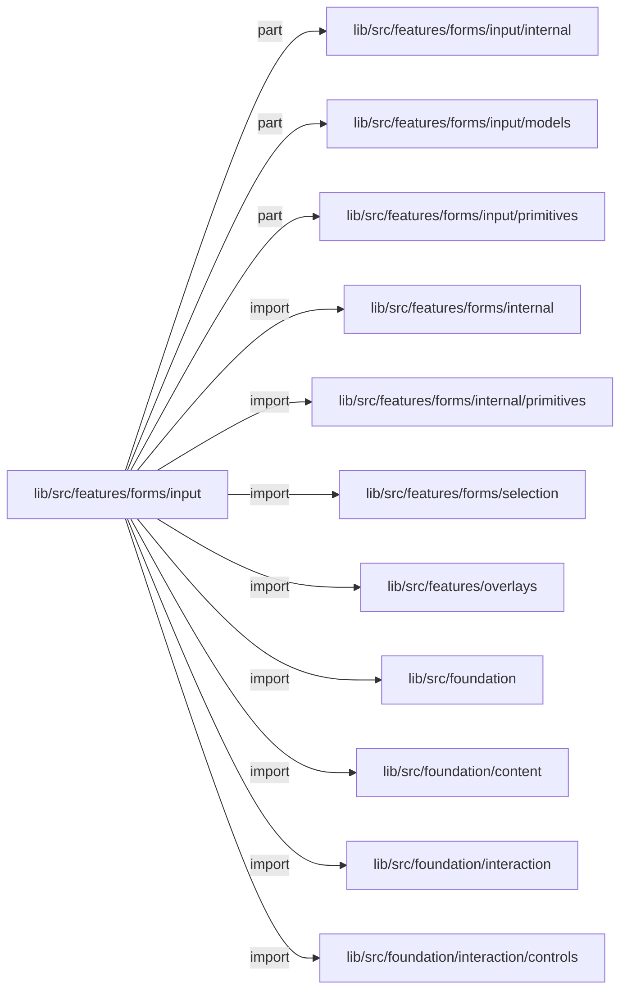
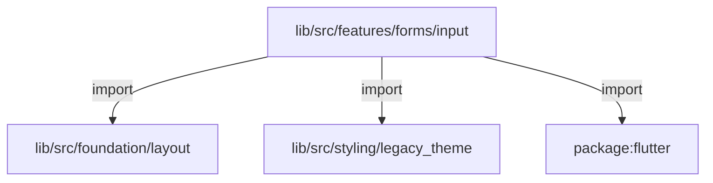
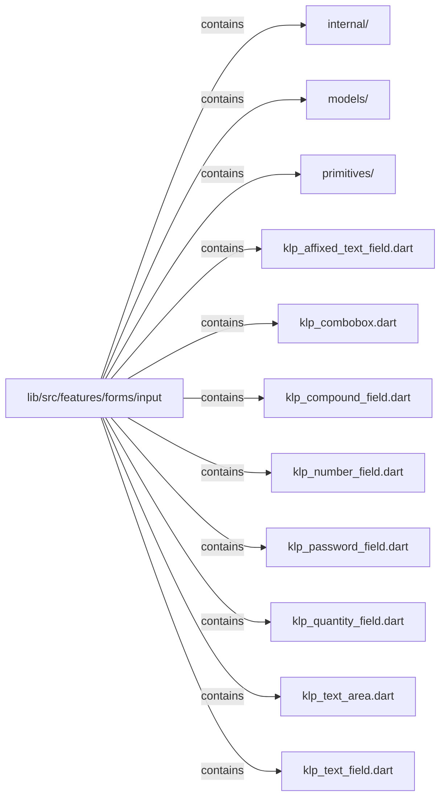

# lib/src/features/forms/input：架構分析入口

[上一層](../README.md)

## 範圍

閱讀 `lib/src/features/forms/input` 的直接子目錄與 Dart 檔案。結構圖表示實際檔案包含關係；依賴圖表示本層檔案明寫的 directives。每個檔案頁另列直接依賴、宣告、欄位、方法、建構子及行號證據。

## 本層直接依賴圖

箭頭以本層 Dart 檔案明寫的 directive 彙總到目標所在目錄或外部套件邊界；不遞迴將子目錄依賴算入本層。相同目標的不同 directive 類型分開計數。

| 目標邊界 | 關係 | directive 數 | 第一筆來源證據 |
|---|---|---|---|
| <code>lib/src/features/forms/input/internal</code> | part | 12 | [lib/src/features/forms/input/klp_combobox.dart:10](../../../../../../lib/src/features/forms/input/klp_combobox.dart#L10) |
| <code>lib/src/features/forms/input/models</code> | part | 1 | [lib/src/features/forms/input/klp_password_field.dart:5](../../../../../../lib/src/features/forms/input/klp_password_field.dart#L5) |
| <code>lib/src/features/forms/input/primitives</code> | part | 5 | [lib/src/features/forms/input/klp_compound_field.dart:10](../../../../../../lib/src/features/forms/input/klp_compound_field.dart#L10) |
| <code>lib/src/features/forms/internal</code> | import | 9 | [lib/src/features/forms/input/klp_affixed_text_field.dart:1](../../../../../../lib/src/features/forms/input/klp_affixed_text_field.dart#L1) |
| <code>lib/src/features/forms/internal/primitives</code> | import | 7 | [lib/src/features/forms/input/klp_affixed_text_field.dart:3](../../../../../../lib/src/features/forms/input/klp_affixed_text_field.dart#L3) |
| <code>lib/src/features/forms/selection</code> | import | 1 | [lib/src/features/forms/input/klp_compound_field.dart:5](../../../../../../lib/src/features/forms/input/klp_compound_field.dart#L5) |
| <code>lib/src/features/overlays</code> | import | 1 | [lib/src/features/forms/input/klp_combobox.dart:7](../../../../../../lib/src/features/forms/input/klp_combobox.dart#L7) |
| <code>lib/src/foundation</code> | import | 2 | [lib/src/features/forms/input/klp_text_field.dart:4](../../../../../../lib/src/features/forms/input/klp_text_field.dart#L4) |
| <code>lib/src/foundation/content</code> | import | 1 | [lib/src/features/forms/input/klp_text_field.dart:8](../../../../../../lib/src/features/forms/input/klp_text_field.dart#L8) |
| <code>lib/src/foundation/interaction</code> | import | 2 | [lib/src/features/forms/input/klp_combobox.dart:4](../../../../../../lib/src/features/forms/input/klp_combobox.dart#L4) |
| <code>lib/src/foundation/interaction/controls</code> | import | 1 | [lib/src/features/forms/input/klp_text_field.dart:9](../../../../../../lib/src/features/forms/input/klp_text_field.dart#L9) |
| <code>lib/src/foundation/layout</code> | import | 3 | [lib/src/features/forms/input/klp_combobox.dart:6](../../../../../../lib/src/features/forms/input/klp_combobox.dart#L6) |
| <code>lib/src/styling/legacy_theme</code> | import | 1 | [lib/src/features/forms/input/klp_text_field.dart:7](../../../../../../lib/src/features/forms/input/klp_text_field.dart#L7) |
| <code>package:flutter</code> | import | 4 | [lib/src/features/forms/input/klp_combobox.dart:1](../../../../../../lib/src/features/forms/input/klp_combobox.dart#L1) |

### 同目錄依賴

| 來源 → 目標 | 關係 | 證據 |
|---|---|---|
| <code>klp_combobox.dart → klp_text_field.dart</code> | import | [lib/src/features/forms/input/klp_combobox.dart:8](../../../../../../lib/src/features/forms/input/klp_combobox.dart#L8) |

## 目錄結構圖

## 子目錄

| 目錄 | 導航 | 來源證據 |
|---|---|---|
| `internal/` | [架構入口](internal/README.md) | [來源目錄](../../../../../../lib/src/features/forms/input/internal) |
| `models/` | [架構入口](models/README.md) | [來源目錄](../../../../../../lib/src/features/forms/input/models) |
| `primitives/` | [架構入口](primitives/README.md) | [來源目錄](../../../../../../lib/src/features/forms/input/primitives) |

## 本層檔案

| 檔案 | 宣告 | 細節 | 來源證據 |
|---|---|---|---|
| `klp_affixed_text_field.dart` | KlpAffixedTextField | [架構與 API](klp_affixed_text_field.md) | [lib/src/features/forms/input/klp_affixed_text_field.dart:1](../../../../../../lib/src/features/forms/input/klp_affixed_text_field.dart#L1) |
| `klp_combobox.dart` | 無頂層宣告 | [架構與 API](klp_combobox.md) | [lib/src/features/forms/input/klp_combobox.dart:1](../../../../../../lib/src/features/forms/input/klp_combobox.dart#L1) |
| `klp_compound_field.dart` | 無頂層宣告 | [架構與 API](klp_compound_field.md) | [lib/src/features/forms/input/klp_compound_field.dart:1](../../../../../../lib/src/features/forms/input/klp_compound_field.dart#L1) |
| `klp_number_field.dart` | KlpNumberField | [架構與 API](klp_number_field.md) | [lib/src/features/forms/input/klp_number_field.dart:1](../../../../../../lib/src/features/forms/input/klp_number_field.dart#L1) |
| `klp_password_field.dart` | 無頂層宣告 | [架構與 API](klp_password_field.md) | [lib/src/features/forms/input/klp_password_field.dart:1](../../../../../../lib/src/features/forms/input/klp_password_field.dart#L1) |
| `klp_quantity_field.dart` | KlpQuantityField | [架構與 API](klp_quantity_field.md) | [lib/src/features/forms/input/klp_quantity_field.dart:1](../../../../../../lib/src/features/forms/input/klp_quantity_field.dart#L1) |
| `klp_text_area.dart` | KlpTextArea | [架構與 API](klp_text_area.md) | [lib/src/features/forms/input/klp_text_area.dart:1](../../../../../../lib/src/features/forms/input/klp_text_area.dart#L1) |
| `klp_text_field.dart` | 無頂層宣告 | [架構與 API](klp_text_field.md) | [lib/src/features/forms/input/klp_text_field.dart:1](../../../../../../lib/src/features/forms/input/klp_text_field.dart#L1) |

## 閱讀說明

箭頭只表示來源明寫的靜態關係；import 不等於呼叫。未分析動態呼叫、欄位的實際物件擁有權、狀態轉移或渲染流程；型別未進行語意解析，繼承目標保留原始型別拼寫。public／private 依 Dart 名稱前綴判斷；public 宣告不代表已由 `lib/kallopis.dart` 匯出。

本頁的目錄與檔案由來源清冊產生；`manifest.json` 位於本圖集根目錄，可核對 SHA-256 與覆蓋數。人工模組摘要存於 `tool/architecture_atlas/briefs/`，重新生成時保留。
