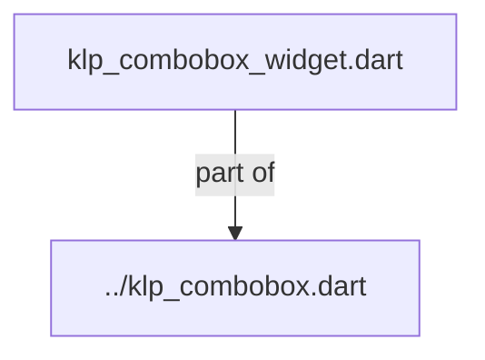
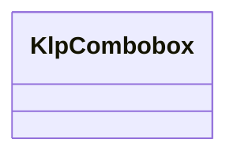
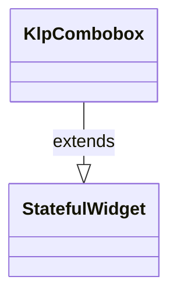

# klp_combobox_widget.dart：直接依賴與宣告架構

[回到目錄](README.md) · [來源檔案](../../../../../../../lib/src/features/forms/input/internal/klp_combobox_widget.dart)

## 範圍

核心是 `lib/src/features/forms/input/internal/klp_combobox_widget.dart`。主要視角為該檔案明寫的 import／export／part；輔助視角為本檔宣告及 extends／implements／with／on 關係。只展開一層外部邊界。

## 直接依賴圖

## 依賴證據

| 關係 | 原始 directive | 來源 |
|---|---|---|
| part of | <code>part of &#x27;../klp_combobox.dart&#x27;;</code> | [lib/src/features/forms/input/internal/klp_combobox_widget.dart:1](../../../../../../../lib/src/features/forms/input/internal/klp_combobox_widget.dart#L1) |

## 宣告關係圖

本組節點是本檔宣告；沒有箭頭的宣告未在此圖主張互相依賴。

## 宣告與成員證據

成員包含 public 與 private；簽章取自來源，省略函式本體與欄位初始值。`(inferred)` 表示來源未明寫型別；建構子只顯示參數部分，不含初始化列表。

### KlpCombobox

ClassDeclaration · public · [lib/src/features/forms/input/internal/klp_combobox_widget.dart:3](../../../../../../../lib/src/features/forms/input/internal/klp_combobox_widget.dart#L3)

<code>class KlpCombobox extends StatefulWidget</code>

來源註解摘要：可輸入的下拉選單。輸入框重用 [KlpTextField]，下拉面板重用 [KlpMenu]。 這是受控元件：[query]、[options] 由呼叫端持有，本元件只負責過濾、鍵盤 導覽與事件分發。方向鍵移動候選，Enter 選定；允許自由文字時，沒有醒目 候選的 Enter 會觸發 [onFreeTextSubmitted]；Esc 收起面板。

- `extends` → <code>StatefulWidget</code>：[lib/src/features/forms/input/internal/klp_combobox_widget.dart:8](../../../../../../../lib/src/features/forms/input/internal/klp_combobox_widget.dart#L8)

| 成員 | 可見性 | 簽章／型別 | 來源註解摘要 | 證據 |
|---|---|---|---|---|
| constructor <code>KlpCombobox</code> | public | <code>const KlpCombobox({ super.key, required this.label, required this.query, required this.options, required this.menuLabel, required this.onQueryChanged, required this.onSelected, this.placeholder, this.helper, this.error, this.enabled = true, this.allowFreeText = false, this.onFreeTextSubmitted, })</code> |  | [lib/src/features/forms/input/internal/klp_combobox_widget.dart:9](../../../../../../../lib/src/features/forms/input/internal/klp_combobox_widget.dart#L9) |
| field <code>label</code> | public | <code>final String label</code> |  | [lib/src/features/forms/input/internal/klp_combobox_widget.dart:28](../../../../../../../lib/src/features/forms/input/internal/klp_combobox_widget.dart#L28) |
| field <code>query</code> | public | <code>final String query</code> |  | [lib/src/features/forms/input/internal/klp_combobox_widget.dart:29](../../../../../../../lib/src/features/forms/input/internal/klp_combobox_widget.dart#L29) |
| field <code>options</code> | public | <code>final List&lt;KlpComboboxOption&gt; options</code> |  | [lib/src/features/forms/input/internal/klp_combobox_widget.dart:30](../../../../../../../lib/src/features/forms/input/internal/klp_combobox_widget.dart#L30) |
| field <code>menuLabel</code> | public | <code>final String menuLabel</code> |  | [lib/src/features/forms/input/internal/klp_combobox_widget.dart:31](../../../../../../../lib/src/features/forms/input/internal/klp_combobox_widget.dart#L31) |
| field <code>placeholder</code> | public | <code>final String? placeholder</code> |  | [lib/src/features/forms/input/internal/klp_combobox_widget.dart:32](../../../../../../../lib/src/features/forms/input/internal/klp_combobox_widget.dart#L32) |
| field <code>helper</code> | public | <code>final String? helper</code> |  | [lib/src/features/forms/input/internal/klp_combobox_widget.dart:33](../../../../../../../lib/src/features/forms/input/internal/klp_combobox_widget.dart#L33) |
| field <code>error</code> | public | <code>final String? error</code> |  | [lib/src/features/forms/input/internal/klp_combobox_widget.dart:34](../../../../../../../lib/src/features/forms/input/internal/klp_combobox_widget.dart#L34) |
| field <code>enabled</code> | public | <code>final bool enabled</code> |  | [lib/src/features/forms/input/internal/klp_combobox_widget.dart:35](../../../../../../../lib/src/features/forms/input/internal/klp_combobox_widget.dart#L35) |
| field <code>onQueryChanged</code> | public | <code>final ValueChanged&lt;String&gt; onQueryChanged</code> |  | [lib/src/features/forms/input/internal/klp_combobox_widget.dart:36](../../../../../../../lib/src/features/forms/input/internal/klp_combobox_widget.dart#L36) |
| field <code>onSelected</code> | public | <code>final ValueChanged&lt;KlpComboboxOption&gt; onSelected</code> |  | [lib/src/features/forms/input/internal/klp_combobox_widget.dart:37](../../../../../../../lib/src/features/forms/input/internal/klp_combobox_widget.dart#L37) |
| field <code>allowFreeText</code> | public | <code>final bool allowFreeText</code> |  | [lib/src/features/forms/input/internal/klp_combobox_widget.dart:38](../../../../../../../lib/src/features/forms/input/internal/klp_combobox_widget.dart#L38) |
| field <code>onFreeTextSubmitted</code> | public | <code>final ValueChanged&lt;String&gt;? onFreeTextSubmitted</code> |  | [lib/src/features/forms/input/internal/klp_combobox_widget.dart:39](../../../../../../../lib/src/features/forms/input/internal/klp_combobox_widget.dart#L39) |
| method <code>createState</code> | public | <code>State&lt;KlpCombobox&gt; createState()</code> |  | [lib/src/features/forms/input/internal/klp_combobox_widget.dart:41](../../../../../../../lib/src/features/forms/input/internal/klp_combobox_widget.dart#L41) |

## 閱讀說明與限制

箭頭只表示來源明寫的靜態關係；import 不等於呼叫。未分析動態呼叫、欄位的實際物件擁有權、狀態轉移或渲染流程；型別未進行語意解析，繼承目標保留原始型別拼寫。public／private 依 Dart 名稱前綴判斷；public 宣告不代表已由 `lib/kallopis.dart` 匯出。

本頁由 `tool/architecture_atlas` 產生；編輯來源或生成工具後重新產生，避免手改本頁。
