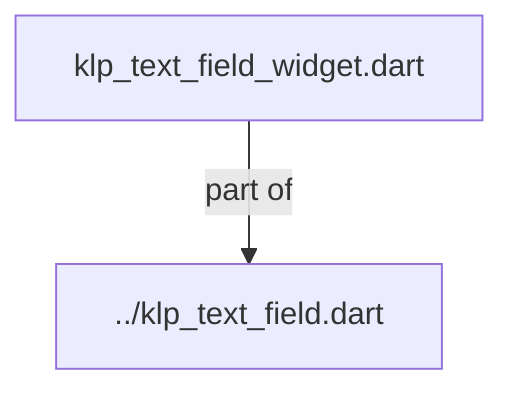
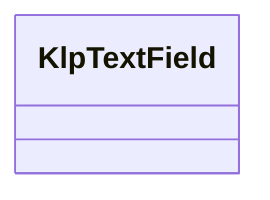
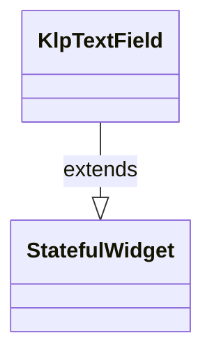

# klp_text_field_widget.dart：直接依賴與宣告架構

[回到目錄](README.md) · [來源檔案](../../../../../../../lib/src/features/forms/input/internal/klp_text_field_widget.dart)

## 範圍

核心是 `lib/src/features/forms/input/internal/klp_text_field_widget.dart`。主要視角為該檔案明寫的 import／export／part；輔助視角為本檔宣告及 extends／implements／with／on 關係。只展開一層外部邊界。

## 直接依賴圖

## 依賴證據

| 關係 | 原始 directive | 來源 |
|---|---|---|
| part of | <code>part of &#x27;../klp_text_field.dart&#x27;;</code> | [lib/src/features/forms/input/internal/klp_text_field_widget.dart:1](../../../../../../../lib/src/features/forms/input/internal/klp_text_field_widget.dart#L1) |

## 宣告關係圖

本組節點是本檔宣告；沒有箭頭的宣告未在此圖主張互相依賴。

## 宣告與成員證據

成員包含 public 與 private；簽章取自來源，省略函式本體與欄位初始值。`(inferred)` 表示來源未明寫型別；建構子只顯示參數部分，不含初始化列表。

### KlpTextField

ClassDeclaration · public · [lib/src/features/forms/input/internal/klp_text_field_widget.dart:3](../../../../../../../lib/src/features/forms/input/internal/klp_text_field_widget.dart#L3)

<code>class KlpTextField extends StatefulWidget</code>

來源註解摘要：單行或多行文字輸入。底層輸入能力由 Kallopis primitive 提供，消費者不需要 額外準備 `Material` 祖先。

- `extends` → <code>StatefulWidget</code>：[lib/src/features/forms/input/internal/klp_text_field_widget.dart:5](../../../../../../../lib/src/features/forms/input/internal/klp_text_field_widget.dart#L5)

| 成員 | 可見性 | 簽章／型別 | 來源註解摘要 | 證據 |
|---|---|---|---|---|
| constructor <code>KlpTextField</code> | public | <code>const KlpTextField({ super.key, this.label, this.placeholder, this.helper, this.error, this.leadingIcon, this.leadingIconWeight = KlpIconWeight.regular, this.initialValue, this.controller, this.maxLength, this.size = KlpControlSize.md, this.onChanged, this.onSubmitted, this.focusNode, this.autofocus = false, this.enabled = true, this.multiline = false, this.minLines, this.maxLines, this.unboundedLines = false, this.outlined = false, this.suffixText, this.obscureText = false, this.trailingActionIcon, this.trailingActionIconWeight = KlpIconWeight.regular, this.trailingActionLabel, this.onTrailingActionPressed, this.stepper = false, this.clearable = false, this.conflict = false, this.readOnly = false, this.onClear, this.onStepUp, this.onStepDown, })</code> |  | [lib/src/features/forms/input/internal/klp_text_field_widget.dart:6](../../../../../../../lib/src/features/forms/input/internal/klp_text_field_widget.dart#L6) |
| field <code>label</code> | public | <code>final String? label</code> |  | [lib/src/features/forms/input/internal/klp_text_field_widget.dart:59](../../../../../../../lib/src/features/forms/input/internal/klp_text_field_widget.dart#L59) |
| field <code>placeholder</code> | public | <code>final String? placeholder</code> |  | [lib/src/features/forms/input/internal/klp_text_field_widget.dart:60](../../../../../../../lib/src/features/forms/input/internal/klp_text_field_widget.dart#L60) |
| field <code>helper</code> | public | <code>final String? helper</code> |  | [lib/src/features/forms/input/internal/klp_text_field_widget.dart:61](../../../../../../../lib/src/features/forms/input/internal/klp_text_field_widget.dart#L61) |
| field <code>error</code> | public | <code>final String? error</code> |  | [lib/src/features/forms/input/internal/klp_text_field_widget.dart:62](../../../../../../../lib/src/features/forms/input/internal/klp_text_field_widget.dart#L62) |
| field <code>leadingIcon</code> | public | <code>final KlpIconData? leadingIcon</code> |  | [lib/src/features/forms/input/internal/klp_text_field_widget.dart:63](../../../../../../../lib/src/features/forms/input/internal/klp_text_field_widget.dart#L63) |
| field <code>leadingIconWeight</code> | public | <code>final KlpIconWeight leadingIconWeight</code> |  | [lib/src/features/forms/input/internal/klp_text_field_widget.dart:64](../../../../../../../lib/src/features/forms/input/internal/klp_text_field_widget.dart#L64) |
| field <code>initialValue</code> | public | <code>final String? initialValue</code> |  | [lib/src/features/forms/input/internal/klp_text_field_widget.dart:65](../../../../../../../lib/src/features/forms/input/internal/klp_text_field_widget.dart#L65) |
| field <code>controller</code> | public | <code>final TextEditingController? controller</code> | 外部持有的文字控制器。沒有給時本元件用 [initialValue] 自行管理；給了 [controller] 就由呼叫端全權掌控文字內容，兩者互斥。 | [lib/src/features/forms/input/internal/klp_text_field_widget.dart:69](../../../../../../../lib/src/features/forms/input/internal/klp_text_field_widget.dart#L69) |
| field <code>maxLength</code> | public | <code>final int? maxLength</code> |  | [lib/src/features/forms/input/internal/klp_text_field_widget.dart:70](../../../../../../../lib/src/features/forms/input/internal/klp_text_field_widget.dart#L70) |
| field <code>size</code> | public | <code>final KlpControlSize size</code> |  | [lib/src/features/forms/input/internal/klp_text_field_widget.dart:71](../../../../../../../lib/src/features/forms/input/internal/klp_text_field_widget.dart#L71) |
| field <code>onChanged</code> | public | <code>final ValueChanged&lt;String&gt;? onChanged</code> |  | [lib/src/features/forms/input/internal/klp_text_field_widget.dart:72](../../../../../../../lib/src/features/forms/input/internal/klp_text_field_widget.dart#L72) |
| field <code>onSubmitted</code> | public | <code>final ValueChanged&lt;String&gt;? onSubmitted</code> |  | [lib/src/features/forms/input/internal/klp_text_field_widget.dart:73](../../../../../../../lib/src/features/forms/input/internal/klp_text_field_widget.dart#L73) |
| field <code>focusNode</code> | public | <code>final FocusNode? focusNode</code> |  | [lib/src/features/forms/input/internal/klp_text_field_widget.dart:74](../../../../../../../lib/src/features/forms/input/internal/klp_text_field_widget.dart#L74) |
| field <code>autofocus</code> | public | <code>final bool autofocus</code> |  | [lib/src/features/forms/input/internal/klp_text_field_widget.dart:75](../../../../../../../lib/src/features/forms/input/internal/klp_text_field_widget.dart#L75) |
| field <code>enabled</code> | public | <code>final bool enabled</code> |  | [lib/src/features/forms/input/internal/klp_text_field_widget.dart:76](../../../../../../../lib/src/features/forms/input/internal/klp_text_field_widget.dart#L76) |
| field <code>multiline</code> | public | <code>final bool multiline</code> |  | [lib/src/features/forms/input/internal/klp_text_field_widget.dart:77](../../../../../../../lib/src/features/forms/input/internal/klp_text_field_widget.dart#L77) |
| field <code>minLines</code> | public | <code>final int? minLines</code> |  | [lib/src/features/forms/input/internal/klp_text_field_widget.dart:78](../../../../../../../lib/src/features/forms/input/internal/klp_text_field_widget.dart#L78) |
| field <code>maxLines</code> | public | <code>final int? maxLines</code> |  | [lib/src/features/forms/input/internal/klp_text_field_widget.dart:79](../../../../../../../lib/src/features/forms/input/internal/klp_text_field_widget.dart#L79) |
| field <code>unboundedLines</code> | public | <code>final bool unboundedLines</code> |  | [lib/src/features/forms/input/internal/klp_text_field_widget.dart:80](../../../../../../../lib/src/features/forms/input/internal/klp_text_field_widget.dart#L80) |
| field <code>outlined</code> | public | <code>final bool outlined</code> |  | [lib/src/features/forms/input/internal/klp_text_field_widget.dart:81](../../../../../../../lib/src/features/forms/input/internal/klp_text_field_widget.dart#L81) |
| field <code>suffixText</code> | public | <code>final String? suffixText</code> |  | [lib/src/features/forms/input/internal/klp_text_field_widget.dart:82](../../../../../../../lib/src/features/forms/input/internal/klp_text_field_widget.dart#L82) |
| field <code>obscureText</code> | public | <code>final bool obscureText</code> |  | [lib/src/features/forms/input/internal/klp_text_field_widget.dart:83](../../../../../../../lib/src/features/forms/input/internal/klp_text_field_widget.dart#L83) |
| field <code>trailingActionIcon</code> | public | <code>final KlpIconData? trailingActionIcon</code> |  | [lib/src/features/forms/input/internal/klp_text_field_widget.dart:84](../../../../../../../lib/src/features/forms/input/internal/klp_text_field_widget.dart#L84) |
| field <code>trailingActionIconWeight</code> | public | <code>final KlpIconWeight trailingActionIconWeight</code> |  | [lib/src/features/forms/input/internal/klp_text_field_widget.dart:85](../../../../../../../lib/src/features/forms/input/internal/klp_text_field_widget.dart#L85) |
| field <code>trailingActionLabel</code> | public | <code>final String? trailingActionLabel</code> |  | [lib/src/features/forms/input/internal/klp_text_field_widget.dart:86](../../../../../../../lib/src/features/forms/input/internal/klp_text_field_widget.dart#L86) |
| field <code>onTrailingActionPressed</code> | public | <code>final VoidCallback? onTrailingActionPressed</code> |  | [lib/src/features/forms/input/internal/klp_text_field_widget.dart:87](../../../../../../../lib/src/features/forms/input/internal/klp_text_field_widget.dart#L87) |
| field <code>stepper</code> | public | <code>final bool stepper</code> |  | [lib/src/features/forms/input/internal/klp_text_field_widget.dart:88](../../../../../../../lib/src/features/forms/input/internal/klp_text_field_widget.dart#L88) |
| field <code>clearable</code> | public | <code>final bool clearable</code> |  | [lib/src/features/forms/input/internal/klp_text_field_widget.dart:89](../../../../../../../lib/src/features/forms/input/internal/klp_text_field_widget.dart#L89) |
| field <code>conflict</code> | public | <code>final bool conflict</code> |  | [lib/src/features/forms/input/internal/klp_text_field_widget.dart:90](../../../../../../../lib/src/features/forms/input/internal/klp_text_field_widget.dart#L90) |
| field <code>readOnly</code> | public | <code>final bool readOnly</code> |  | [lib/src/features/forms/input/internal/klp_text_field_widget.dart:91](../../../../../../../lib/src/features/forms/input/internal/klp_text_field_widget.dart#L91) |
| field <code>onClear</code> | public | <code>final VoidCallback? onClear</code> |  | [lib/src/features/forms/input/internal/klp_text_field_widget.dart:92](../../../../../../../lib/src/features/forms/input/internal/klp_text_field_widget.dart#L92) |
| field <code>onStepUp</code> | public | <code>final VoidCallback? onStepUp</code> |  | [lib/src/features/forms/input/internal/klp_text_field_widget.dart:93](../../../../../../../lib/src/features/forms/input/internal/klp_text_field_widget.dart#L93) |
| field <code>onStepDown</code> | public | <code>final VoidCallback? onStepDown</code> |  | [lib/src/features/forms/input/internal/klp_text_field_widget.dart:94](../../../../../../../lib/src/features/forms/input/internal/klp_text_field_widget.dart#L94) |
| method <code>createState</code> | public | <code>State&lt;KlpTextField&gt; createState()</code> |  | [lib/src/features/forms/input/internal/klp_text_field_widget.dart:96](../../../../../../../lib/src/features/forms/input/internal/klp_text_field_widget.dart#L96) |

## 閱讀說明與限制

箭頭只表示來源明寫的靜態關係；import 不等於呼叫。未分析動態呼叫、欄位的實際物件擁有權、狀態轉移或渲染流程；型別未進行語意解析，繼承目標保留原始型別拼寫。public／private 依 Dart 名稱前綴判斷；public 宣告不代表已由 `lib/kallopis.dart` 匯出。

本頁由 `tool/architecture_atlas` 產生；編輯來源或生成工具後重新產生，避免手改本頁。
