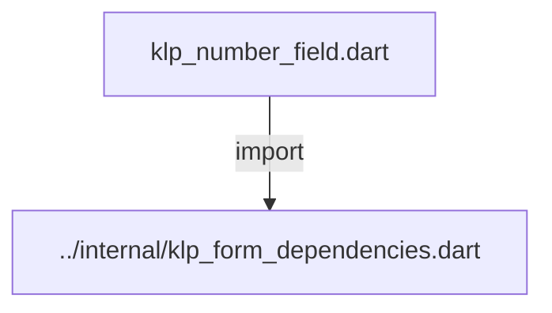
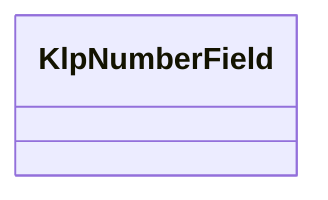
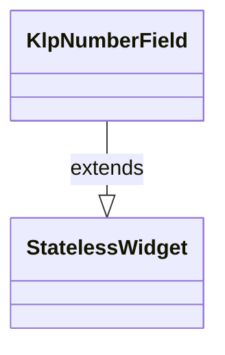

# klp_number_field.dart：直接依賴與宣告架構

[回到目錄](README.md) · [來源檔案](../../../../../../lib/src/features/forms/input/klp_number_field.dart)

## 範圍

核心是 `lib/src/features/forms/input/klp_number_field.dart`。主要視角為該檔案明寫的 import／export／part；輔助視角為本檔宣告及 extends／implements／with／on 關係。只展開一層外部邊界。

## 直接依賴圖

## 依賴證據

| 關係 | 原始 directive | 來源 |
|---|---|---|
| import | <code>import &#x27;../internal/klp_form_dependencies.dart&#x27;;</code> | [lib/src/features/forms/input/klp_number_field.dart:1](../../../../../../lib/src/features/forms/input/klp_number_field.dart#L1) |

## 宣告關係圖

本組節點是本檔宣告；沒有箭頭的宣告未在此圖主張互相依賴。

## 宣告與成員證據

成員包含 public 與 private；簽章取自來源，省略函式本體與欄位初始值。`(inferred)` 表示來源未明寫型別；建構子只顯示參數部分，不含初始化列表。

### KlpNumberField

ClassDeclaration · public · [lib/src/features/forms/input/klp_number_field.dart:3](../../../../../../lib/src/features/forms/input/klp_number_field.dart#L3)

<code>class KlpNumberField extends StatelessWidget</code>

來源註解摘要：數值輸入欄位，底層仍是文字輸入框（[KlpTextField]），但只在能解析成 [double] 且落在 [minimum]／[maximum] 範圍內時才呼叫 [onChanged]。 超出範圍或無法解析的輸入會被直接忽略——欄位仍顯示使用者打的字，但 [onChanged] 不會觸發，因此外部的 `value` 不會更新。需要即時錯誤提示時 請自行比較顯示字串與 [value] 是否一致，而不是依賴 [onChanged] 的呼叫時機。

- `extends` → <code>StatelessWidget</code>：[lib/src/features/forms/input/klp_number_field.dart:9](../../../../../../lib/src/features/forms/input/klp_number_field.dart#L9)

| 成員 | 可見性 | 簽章／型別 | 來源註解摘要 | 證據 |
|---|---|---|---|---|
| constructor <code>KlpNumberField</code> | public | <code>const KlpNumberField({ super.key, required this.label, required this.value, required this.onChanged, this.minimum, this.maximum, this.unit, this.error, })</code> |  | [lib/src/features/forms/input/klp_number_field.dart:10](../../../../../../lib/src/features/forms/input/klp_number_field.dart#L10) |
| field <code>label</code> | public | <code>final String label</code> |  | [lib/src/features/forms/input/klp_number_field.dart:21](../../../../../../lib/src/features/forms/input/klp_number_field.dart#L21) |
| field <code>value</code> | public | <code>final double value</code> |  | [lib/src/features/forms/input/klp_number_field.dart:22](../../../../../../lib/src/features/forms/input/klp_number_field.dart#L22) |
| field <code>onChanged</code> | public | <code>final ValueChanged&lt;double&gt;? onChanged</code> |  | [lib/src/features/forms/input/klp_number_field.dart:23](../../../../../../lib/src/features/forms/input/klp_number_field.dart#L23) |
| field <code>minimum</code> | public | <code>final double? minimum</code> |  | [lib/src/features/forms/input/klp_number_field.dart:24](../../../../../../lib/src/features/forms/input/klp_number_field.dart#L24) |
| field <code>maximum</code> | public | <code>final double? maximum</code> |  | [lib/src/features/forms/input/klp_number_field.dart:25](../../../../../../lib/src/features/forms/input/klp_number_field.dart#L25) |
| field <code>unit</code> | public | <code>final String? unit</code> |  | [lib/src/features/forms/input/klp_number_field.dart:26](../../../../../../lib/src/features/forms/input/klp_number_field.dart#L26) |
| field <code>error</code> | public | <code>final String? error</code> |  | [lib/src/features/forms/input/klp_number_field.dart:27](../../../../../../lib/src/features/forms/input/klp_number_field.dart#L27) |
| method <code>build</code> | public | <code>Widget build(BuildContext context)</code> |  | [lib/src/features/forms/input/klp_number_field.dart:29](../../../../../../lib/src/features/forms/input/klp_number_field.dart#L29) |

## 閱讀說明與限制

箭頭只表示來源明寫的靜態關係；import 不等於呼叫。未分析動態呼叫、欄位的實際物件擁有權、狀態轉移或渲染流程；型別未進行語意解析，繼承目標保留原始型別拼寫。public／private 依 Dart 名稱前綴判斷；public 宣告不代表已由 `lib/kallopis.dart` 匯出。

本頁由 `tool/architecture_atlas` 產生；編輯來源或生成工具後重新產生，避免手改本頁。
