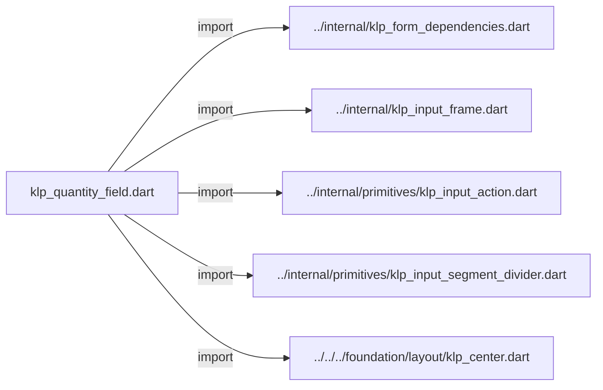
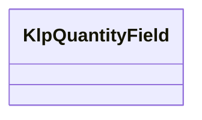
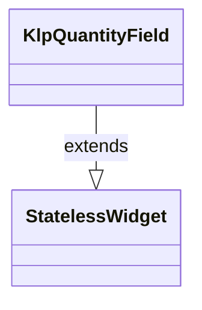

# klp_quantity_field.dart：直接依賴與宣告架構

[回到目錄](README.md) · [來源檔案](../../../../../../lib/src/features/forms/input/klp_quantity_field.dart)

## 範圍

核心是 `lib/src/features/forms/input/klp_quantity_field.dart`。主要視角為該檔案明寫的 import／export／part；輔助視角為本檔宣告及 extends／implements／with／on 關係。只展開一層外部邊界。

## 直接依賴圖

## 依賴證據

| 關係 | 原始 directive | 來源 |
|---|---|---|
| import | <code>import &#x27;../internal/klp_form_dependencies.dart&#x27;;</code> | [lib/src/features/forms/input/klp_quantity_field.dart:1](../../../../../../lib/src/features/forms/input/klp_quantity_field.dart#L1) |
| import | <code>import &#x27;../internal/klp_input_frame.dart&#x27;;</code> | [lib/src/features/forms/input/klp_quantity_field.dart:2](../../../../../../lib/src/features/forms/input/klp_quantity_field.dart#L2) |
| import | <code>import &#x27;../internal/primitives/klp_input_action.dart&#x27;;</code> | [lib/src/features/forms/input/klp_quantity_field.dart:3](../../../../../../lib/src/features/forms/input/klp_quantity_field.dart#L3) |
| import | <code>import &#x27;../internal/primitives/klp_input_segment_divider.dart&#x27;;</code> | [lib/src/features/forms/input/klp_quantity_field.dart:4](../../../../../../lib/src/features/forms/input/klp_quantity_field.dart#L4) |
| import | <code>import &#x27;../../../foundation/layout/klp_center.dart&#x27;;</code> | [lib/src/features/forms/input/klp_quantity_field.dart:5](../../../../../../lib/src/features/forms/input/klp_quantity_field.dart#L5) |

## 宣告關係圖

本組節點是本檔宣告；沒有箭頭的宣告未在此圖主張互相依賴。

## 宣告與成員證據

成員包含 public 與 private；簽章取自來源，省略函式本體與欄位初始值。`(inferred)` 表示來源未明寫型別；建構子只顯示參數部分，不含初始化列表。

### KlpQuantityField

ClassDeclaration · public · [lib/src/features/forms/input/klp_quantity_field.dart:7](../../../../../../lib/src/features/forms/input/klp_quantity_field.dart#L7)

<code>class KlpQuantityField extends StatelessWidget</code>

來源註解摘要：以欄位等高的減少／增加操作調整數量。

- `extends` → <code>StatelessWidget</code>：[lib/src/features/forms/input/klp_quantity_field.dart:8](../../../../../../lib/src/features/forms/input/klp_quantity_field.dart#L8)

| 成員 | 可見性 | 簽章／型別 | 來源註解摘要 | 證據 |
|---|---|---|---|---|
| field <code>label</code> | public | <code>final String label</code> |  | [lib/src/features/forms/input/klp_quantity_field.dart:9](../../../../../../lib/src/features/forms/input/klp_quantity_field.dart#L9) |
| field <code>value</code> | public | <code>final num value</code> |  | [lib/src/features/forms/input/klp_quantity_field.dart:10](../../../../../../lib/src/features/forms/input/klp_quantity_field.dart#L10) |
| field <code>step</code> | public | <code>final num step</code> |  | [lib/src/features/forms/input/klp_quantity_field.dart:11](../../../../../../lib/src/features/forms/input/klp_quantity_field.dart#L11) |
| field <code>minimum</code> | public | <code>final num? minimum</code> |  | [lib/src/features/forms/input/klp_quantity_field.dart:12](../../../../../../lib/src/features/forms/input/klp_quantity_field.dart#L12) |
| field <code>maximum</code> | public | <code>final num? maximum</code> |  | [lib/src/features/forms/input/klp_quantity_field.dart:13](../../../../../../lib/src/features/forms/input/klp_quantity_field.dart#L13) |
| field <code>onChanged</code> | public | <code>final ValueChanged&lt;num&gt;? onChanged</code> |  | [lib/src/features/forms/input/klp_quantity_field.dart:14](../../../../../../lib/src/features/forms/input/klp_quantity_field.dart#L14) |
| field <code>enabled</code> | public | <code>final bool enabled</code> |  | [lib/src/features/forms/input/klp_quantity_field.dart:15](../../../../../../lib/src/features/forms/input/klp_quantity_field.dart#L15) |
| field <code>readOnly</code> | public | <code>final bool readOnly</code> |  | [lib/src/features/forms/input/klp_quantity_field.dart:16](../../../../../../lib/src/features/forms/input/klp_quantity_field.dart#L16) |
| field <code>error</code> | public | <code>final String? error</code> |  | [lib/src/features/forms/input/klp_quantity_field.dart:17](../../../../../../lib/src/features/forms/input/klp_quantity_field.dart#L17) |
| field <code>decreaseLabel</code> | public | <code>final String? decreaseLabel</code> |  | [lib/src/features/forms/input/klp_quantity_field.dart:18](../../../../../../lib/src/features/forms/input/klp_quantity_field.dart#L18) |
| field <code>increaseLabel</code> | public | <code>final String? increaseLabel</code> |  | [lib/src/features/forms/input/klp_quantity_field.dart:19](../../../../../../lib/src/features/forms/input/klp_quantity_field.dart#L19) |
| constructor <code>KlpQuantityField</code> | public | <code>const KlpQuantityField({ super.key, required this.label, required this.value, this.step = 1, this.minimum, this.maximum, this.onChanged, this.enabled = true, this.readOnly = false, this.error, this.decreaseLabel, this.increaseLabel, })</code> |  | [lib/src/features/forms/input/klp_quantity_field.dart:21](../../../../../../lib/src/features/forms/input/klp_quantity_field.dart#L21) |
| getter <code>_canDecrease</code> | private | <code>bool get _canDecrease</code> |  | [lib/src/features/forms/input/klp_quantity_field.dart:36](../../../../../../lib/src/features/forms/input/klp_quantity_field.dart#L36) |
| getter <code>_canIncrease</code> | private | <code>bool get _canIncrease</code> |  | [lib/src/features/forms/input/klp_quantity_field.dart:37](../../../../../../lib/src/features/forms/input/klp_quantity_field.dart#L37) |
| method <code>build</code> | public | <code>Widget build(BuildContext context)</code> |  | [lib/src/features/forms/input/klp_quantity_field.dart:39](../../../../../../lib/src/features/forms/input/klp_quantity_field.dart#L39) |

## 閱讀說明與限制

箭頭只表示來源明寫的靜態關係；import 不等於呼叫。未分析動態呼叫、欄位的實際物件擁有權、狀態轉移或渲染流程；型別未進行語意解析，繼承目標保留原始型別拼寫。public／private 依 Dart 名稱前綴判斷；public 宣告不代表已由 `lib/kallopis.dart` 匯出。

本頁由 `tool/architecture_atlas` 產生；編輯來源或生成工具後重新產生，避免手改本頁。
