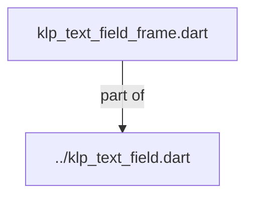
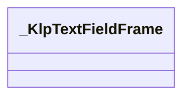
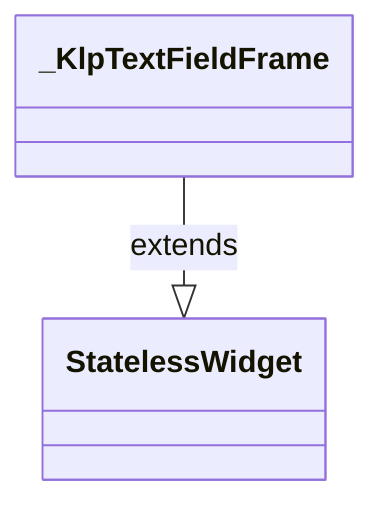

# klp_text_field_frame.dart：直接依賴與宣告架構

[回到目錄](README.md) · [來源檔案](../../../../../../../lib/src/features/forms/input/primitives/klp_text_field_frame.dart)

## 範圍

核心是 `lib/src/features/forms/input/primitives/klp_text_field_frame.dart`。主要視角為該檔案明寫的 import／export／part；輔助視角為本檔宣告及 extends／implements／with／on 關係。只展開一層外部邊界。

## 直接依賴圖

## 依賴證據

| 關係 | 原始 directive | 來源 |
|---|---|---|
| part of | <code>part of &#x27;../klp_text_field.dart&#x27;;</code> | [lib/src/features/forms/input/primitives/klp_text_field_frame.dart:1](../../../../../../../lib/src/features/forms/input/primitives/klp_text_field_frame.dart#L1) |

## 宣告關係圖

本組節點是本檔宣告；沒有箭頭的宣告未在此圖主張互相依賴。

## 宣告與成員證據

成員包含 public 與 private；簽章取自來源，省略函式本體與欄位初始值。`(inferred)` 表示來源未明寫型別；建構子只顯示參數部分，不含初始化列表。

### _KlpTextFieldFrame

ClassDeclaration · private · [lib/src/features/forms/input/primitives/klp_text_field_frame.dart:3](../../../../../../../lib/src/features/forms/input/primitives/klp_text_field_frame.dart#L3)

<code>class _KlpTextFieldFrame extends StatelessWidget</code>

- `extends` → <code>StatelessWidget</code>：[lib/src/features/forms/input/primitives/klp_text_field_frame.dart:3](../../../../../../../lib/src/features/forms/input/primitives/klp_text_field_frame.dart#L3)

| 成員 | 可見性 | 簽章／型別 | 來源註解摘要 | 證據 |
|---|---|---|---|---|
| constructor <code>_KlpTextFieldFrame</code> | private | <code>const _KlpTextFieldFrame({ required this.style, required this.controller, required this.initialValue, required this.focusNode, required this.autofocus, required this.enabled, required this.readOnly, required this.obscureText, required this.multiline, required this.minLines, required this.maxLines, required this.maxLength, required this.placeholder, required this.leadingIcon, required this.leadingIconWeight, required this.suffix, required this.onChanged, required this.onSubmitted, required this.onFocusChanged, })</code> |  | [lib/src/features/forms/input/primitives/klp_text_field_frame.dart:4](../../../../../../../lib/src/features/forms/input/primitives/klp_text_field_frame.dart#L4) |
| field <code>style</code> | public | <code>final _KlpTextFieldStyle style</code> |  | [lib/src/features/forms/input/primitives/klp_text_field_frame.dart:26](../../../../../../../lib/src/features/forms/input/primitives/klp_text_field_frame.dart#L26) |
| field <code>controller</code> | public | <code>final TextEditingController? controller</code> |  | [lib/src/features/forms/input/primitives/klp_text_field_frame.dart:27](../../../../../../../lib/src/features/forms/input/primitives/klp_text_field_frame.dart#L27) |
| field <code>initialValue</code> | public | <code>final String? initialValue</code> |  | [lib/src/features/forms/input/primitives/klp_text_field_frame.dart:28](../../../../../../../lib/src/features/forms/input/primitives/klp_text_field_frame.dart#L28) |
| field <code>focusNode</code> | public | <code>final FocusNode? focusNode</code> |  | [lib/src/features/forms/input/primitives/klp_text_field_frame.dart:29](../../../../../../../lib/src/features/forms/input/primitives/klp_text_field_frame.dart#L29) |
| field <code>autofocus</code> | public | <code>final bool autofocus</code> |  | [lib/src/features/forms/input/primitives/klp_text_field_frame.dart:30](../../../../../../../lib/src/features/forms/input/primitives/klp_text_field_frame.dart#L30) |
| field <code>enabled</code> | public | <code>final bool enabled</code> |  | [lib/src/features/forms/input/primitives/klp_text_field_frame.dart:31](../../../../../../../lib/src/features/forms/input/primitives/klp_text_field_frame.dart#L31) |
| field <code>readOnly</code> | public | <code>final bool readOnly</code> |  | [lib/src/features/forms/input/primitives/klp_text_field_frame.dart:32](../../../../../../../lib/src/features/forms/input/primitives/klp_text_field_frame.dart#L32) |
| field <code>obscureText</code> | public | <code>final bool obscureText</code> |  | [lib/src/features/forms/input/primitives/klp_text_field_frame.dart:33](../../../../../../../lib/src/features/forms/input/primitives/klp_text_field_frame.dart#L33) |
| field <code>multiline</code> | public | <code>final bool multiline</code> |  | [lib/src/features/forms/input/primitives/klp_text_field_frame.dart:34](../../../../../../../lib/src/features/forms/input/primitives/klp_text_field_frame.dart#L34) |
| field <code>minLines</code> | public | <code>final int minLines</code> |  | [lib/src/features/forms/input/primitives/klp_text_field_frame.dart:35](../../../../../../../lib/src/features/forms/input/primitives/klp_text_field_frame.dart#L35) |
| field <code>maxLines</code> | public | <code>final int? maxLines</code> |  | [lib/src/features/forms/input/primitives/klp_text_field_frame.dart:36](../../../../../../../lib/src/features/forms/input/primitives/klp_text_field_frame.dart#L36) |
| field <code>maxLength</code> | public | <code>final int? maxLength</code> |  | [lib/src/features/forms/input/primitives/klp_text_field_frame.dart:37](../../../../../../../lib/src/features/forms/input/primitives/klp_text_field_frame.dart#L37) |
| field <code>placeholder</code> | public | <code>final String? placeholder</code> |  | [lib/src/features/forms/input/primitives/klp_text_field_frame.dart:38](../../../../../../../lib/src/features/forms/input/primitives/klp_text_field_frame.dart#L38) |
| field <code>leadingIcon</code> | public | <code>final KlpIconData? leadingIcon</code> |  | [lib/src/features/forms/input/primitives/klp_text_field_frame.dart:39](../../../../../../../lib/src/features/forms/input/primitives/klp_text_field_frame.dart#L39) |
| field <code>leadingIconWeight</code> | public | <code>final KlpIconWeight leadingIconWeight</code> |  | [lib/src/features/forms/input/primitives/klp_text_field_frame.dart:40](../../../../../../../lib/src/features/forms/input/primitives/klp_text_field_frame.dart#L40) |
| field <code>suffix</code> | public | <code>final Widget? suffix</code> |  | [lib/src/features/forms/input/primitives/klp_text_field_frame.dart:41](../../../../../../../lib/src/features/forms/input/primitives/klp_text_field_frame.dart#L41) |
| field <code>onChanged</code> | public | <code>final ValueChanged&lt;String&gt;? onChanged</code> |  | [lib/src/features/forms/input/primitives/klp_text_field_frame.dart:42](../../../../../../../lib/src/features/forms/input/primitives/klp_text_field_frame.dart#L42) |
| field <code>onSubmitted</code> | public | <code>final ValueChanged&lt;String&gt;? onSubmitted</code> |  | [lib/src/features/forms/input/primitives/klp_text_field_frame.dart:43](../../../../../../../lib/src/features/forms/input/primitives/klp_text_field_frame.dart#L43) |
| field <code>onFocusChanged</code> | public | <code>final ValueChanged&lt;bool&gt; onFocusChanged</code> |  | [lib/src/features/forms/input/primitives/klp_text_field_frame.dart:44](../../../../../../../lib/src/features/forms/input/primitives/klp_text_field_frame.dart#L44) |
| method <code>build</code> | public | <code>Widget build(BuildContext context)</code> |  | [lib/src/features/forms/input/primitives/klp_text_field_frame.dart:46](../../../../../../../lib/src/features/forms/input/primitives/klp_text_field_frame.dart#L46) |

## 閱讀說明與限制

箭頭只表示來源明寫的靜態關係；import 不等於呼叫。未分析動態呼叫、欄位的實際物件擁有權、狀態轉移或渲染流程；型別未進行語意解析，繼承目標保留原始型別拼寫。public／private 依 Dart 名稱前綴判斷；public 宣告不代表已由 `lib/kallopis.dart` 匯出。

本頁由 `tool/architecture_atlas` 產生；編輯來源或生成工具後重新產生，避免手改本頁。
