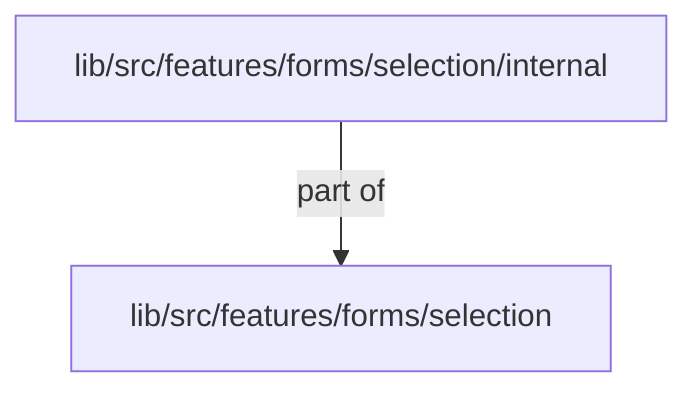
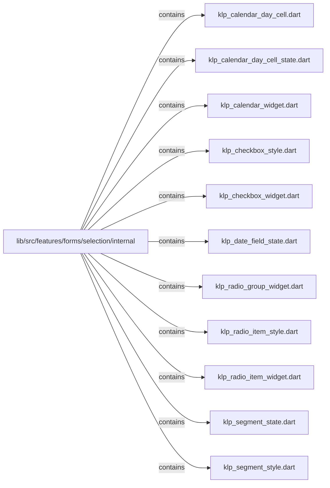
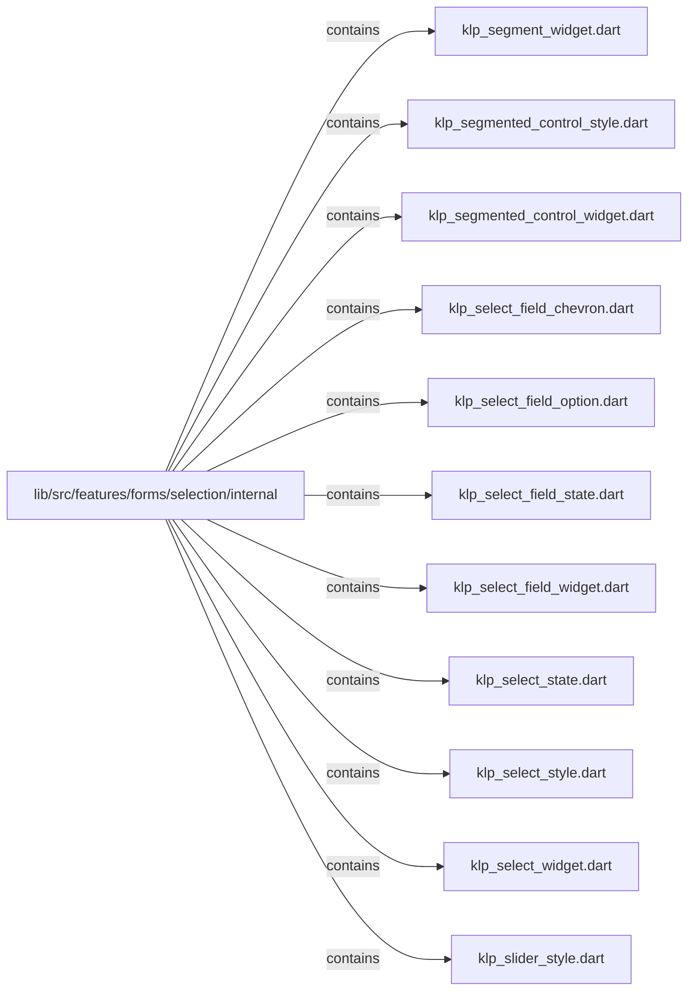
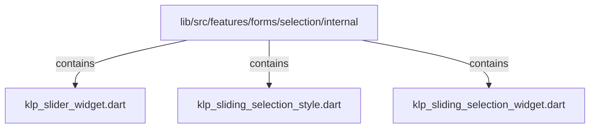

# lib/src/features/forms/selection/internal：架構分析入口

[上一層](../README.md)

## 範圍

閱讀 `lib/src/features/forms/selection/internal` 的直接子目錄與 Dart 檔案。結構圖表示實際檔案包含關係；依賴圖表示本層檔案明寫的 directives。每個檔案頁另列直接依賴、宣告、欄位、方法、建構子及行號證據。

## 本層直接依賴圖

箭頭以本層 Dart 檔案明寫的 directive 彙總到目標所在目錄或外部套件邊界；不遞迴將子目錄依賴算入本層。相同目標的不同 directive 類型分開計數。

| 目標邊界 | 關係 | directive 數 | 第一筆來源證據 |
|---|---|---|---|
| <code>lib/src/features/forms/selection</code> | part of | 25 | [lib/src/features/forms/selection/internal/klp_calendar_day_cell.dart:1](../../../../../../../lib/src/features/forms/selection/internal/klp_calendar_day_cell.dart#L1) |

## 目錄結構圖

## 子目錄

| 目錄 | 導航 | 來源證據 |
|---|---|---|
| 無 | 目前沒有下一層目錄 | — |

## 本層檔案

| 檔案 | 宣告 | 細節 | 來源證據 |
|---|---|---|---|
| `klp_calendar_day_cell.dart` | _KlpCalendarDayCell | [架構與 API](klp_calendar_day_cell.md) | [lib/src/features/forms/selection/internal/klp_calendar_day_cell.dart:1](../../../../../../../lib/src/features/forms/selection/internal/klp_calendar_day_cell.dart#L1) |
| `klp_calendar_day_cell_state.dart` | _KlpCalendarDayCellState | [架構與 API](klp_calendar_day_cell_state.md) | [lib/src/features/forms/selection/internal/klp_calendar_day_cell_state.dart:1](../../../../../../../lib/src/features/forms/selection/internal/klp_calendar_day_cell_state.dart#L1) |
| `klp_calendar_widget.dart` | KlpCalendar | [架構與 API](klp_calendar_widget.md) | [lib/src/features/forms/selection/internal/klp_calendar_widget.dart:1](../../../../../../../lib/src/features/forms/selection/internal/klp_calendar_widget.dart#L1) |
| `klp_checkbox_style.dart` | _KlpCheckboxStyle | [架構與 API](klp_checkbox_style.md) | [lib/src/features/forms/selection/internal/klp_checkbox_style.dart:1](../../../../../../../lib/src/features/forms/selection/internal/klp_checkbox_style.dart#L1) |
| `klp_checkbox_widget.dart` | KlpCheckbox | [架構與 API](klp_checkbox_widget.md) | [lib/src/features/forms/selection/internal/klp_checkbox_widget.dart:1](../../../../../../../lib/src/features/forms/selection/internal/klp_checkbox_widget.dart#L1) |
| `klp_date_field_state.dart` | _KlpDateFieldState | [架構與 API](klp_date_field_state.md) | [lib/src/features/forms/selection/internal/klp_date_field_state.dart:1](../../../../../../../lib/src/features/forms/selection/internal/klp_date_field_state.dart#L1) |
| `klp_radio_group_widget.dart` | KlpRadioGroup | [架構與 API](klp_radio_group_widget.md) | [lib/src/features/forms/selection/internal/klp_radio_group_widget.dart:1](../../../../../../../lib/src/features/forms/selection/internal/klp_radio_group_widget.dart#L1) |
| `klp_radio_item_style.dart` | _KlpRadioItemStyle | [架構與 API](klp_radio_item_style.md) | [lib/src/features/forms/selection/internal/klp_radio_item_style.dart:1](../../../../../../../lib/src/features/forms/selection/internal/klp_radio_item_style.dart#L1) |
| `klp_radio_item_widget.dart` | _KlpRadioItem | [架構與 API](klp_radio_item_widget.md) | [lib/src/features/forms/selection/internal/klp_radio_item_widget.dart:1](../../../../../../../lib/src/features/forms/selection/internal/klp_radio_item_widget.dart#L1) |
| `klp_segment_state.dart` | _KlpSegmentState | [架構與 API](klp_segment_state.md) | [lib/src/features/forms/selection/internal/klp_segment_state.dart:1](../../../../../../../lib/src/features/forms/selection/internal/klp_segment_state.dart#L1) |
| `klp_segment_style.dart` | _KlpSegmentStyle | [架構與 API](klp_segment_style.md) | [lib/src/features/forms/selection/internal/klp_segment_style.dart:1](../../../../../../../lib/src/features/forms/selection/internal/klp_segment_style.dart#L1) |
| `klp_segment_widget.dart` | _KlpSegment | [架構與 API](klp_segment_widget.md) | [lib/src/features/forms/selection/internal/klp_segment_widget.dart:1](../../../../../../../lib/src/features/forms/selection/internal/klp_segment_widget.dart#L1) |
| `klp_segmented_control_style.dart` | _KlpSegmentedControlStyle | [架構與 API](klp_segmented_control_style.md) | [lib/src/features/forms/selection/internal/klp_segmented_control_style.dart:1](../../../../../../../lib/src/features/forms/selection/internal/klp_segmented_control_style.dart#L1) |
| `klp_segmented_control_widget.dart` | KlpSegmentedControl | [架構與 API](klp_segmented_control_widget.md) | [lib/src/features/forms/selection/internal/klp_segmented_control_widget.dart:1](../../../../../../../lib/src/features/forms/selection/internal/klp_segmented_control_widget.dart#L1) |
| `klp_select_field_chevron.dart` | _KlpSelectFieldChevron | [架構與 API](klp_select_field_chevron.md) | [lib/src/features/forms/selection/internal/klp_select_field_chevron.dart:1](../../../../../../../lib/src/features/forms/selection/internal/klp_select_field_chevron.dart#L1) |
| `klp_select_field_option.dart` | _KlpSelectFieldOption | [架構與 API](klp_select_field_option.md) | [lib/src/features/forms/selection/internal/klp_select_field_option.dart:1](../../../../../../../lib/src/features/forms/selection/internal/klp_select_field_option.dart#L1) |
| `klp_select_field_state.dart` | _KlpSelectFieldState | [架構與 API](klp_select_field_state.md) | [lib/src/features/forms/selection/internal/klp_select_field_state.dart:1](../../../../../../../lib/src/features/forms/selection/internal/klp_select_field_state.dart#L1) |
| `klp_select_field_widget.dart` | KlpSelectField | [架構與 API](klp_select_field_widget.md) | [lib/src/features/forms/selection/internal/klp_select_field_widget.dart:1](../../../../../../../lib/src/features/forms/selection/internal/klp_select_field_widget.dart#L1) |
| `klp_select_state.dart` | _KlpSelectState | [架構與 API](klp_select_state.md) | [lib/src/features/forms/selection/internal/klp_select_state.dart:1](../../../../../../../lib/src/features/forms/selection/internal/klp_select_state.dart#L1) |
| `klp_select_style.dart` | _KlpSelectStyle | [架構與 API](klp_select_style.md) | [lib/src/features/forms/selection/internal/klp_select_style.dart:1](../../../../../../../lib/src/features/forms/selection/internal/klp_select_style.dart#L1) |
| `klp_select_widget.dart` | KlpSelect | [架構與 API](klp_select_widget.md) | [lib/src/features/forms/selection/internal/klp_select_widget.dart:1](../../../../../../../lib/src/features/forms/selection/internal/klp_select_widget.dart#L1) |
| `klp_slider_style.dart` | _KlpSliderStyle | [架構與 API](klp_slider_style.md) | [lib/src/features/forms/selection/internal/klp_slider_style.dart:1](../../../../../../../lib/src/features/forms/selection/internal/klp_slider_style.dart#L1) |
| `klp_slider_widget.dart` | KlpSlider | [架構與 API](klp_slider_widget.md) | [lib/src/features/forms/selection/internal/klp_slider_widget.dart:1](../../../../../../../lib/src/features/forms/selection/internal/klp_slider_widget.dart#L1) |
| `klp_sliding_selection_style.dart` | _KlpSlidingSelectionStyle | [架構與 API](klp_sliding_selection_style.md) | [lib/src/features/forms/selection/internal/klp_sliding_selection_style.dart:1](../../../../../../../lib/src/features/forms/selection/internal/klp_sliding_selection_style.dart#L1) |
| `klp_sliding_selection_widget.dart` | KlpSlidingSelection | [架構與 API](klp_sliding_selection_widget.md) | [lib/src/features/forms/selection/internal/klp_sliding_selection_widget.dart:1](../../../../../../../lib/src/features/forms/selection/internal/klp_sliding_selection_widget.dart#L1) |

## 閱讀說明

箭頭只表示來源明寫的靜態關係；import 不等於呼叫。未分析動態呼叫、欄位的實際物件擁有權、狀態轉移或渲染流程；型別未進行語意解析，繼承目標保留原始型別拼寫。public／private 依 Dart 名稱前綴判斷；public 宣告不代表已由 `lib/kallopis.dart` 匯出。

本頁的目錄與檔案由來源清冊產生；`manifest.json` 位於本圖集根目錄，可核對 SHA-256 與覆蓋數。人工模組摘要存於 `tool/architecture_atlas/briefs/`，重新生成時保留。
