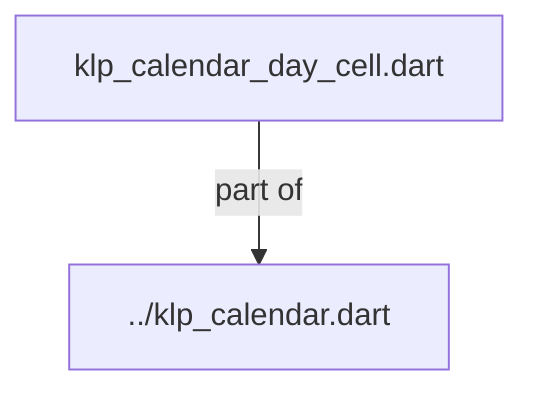
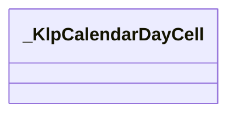
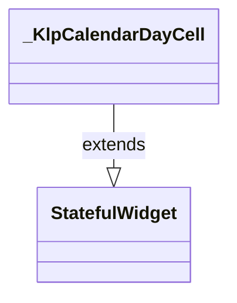

# klp_calendar_day_cell.dart：直接依賴與宣告架構

[回到目錄](README.md) · [來源檔案](../../../../../../../lib/src/features/forms/selection/internal/klp_calendar_day_cell.dart)

## 範圍

核心是 `lib/src/features/forms/selection/internal/klp_calendar_day_cell.dart`。主要視角為該檔案明寫的 import／export／part；輔助視角為本檔宣告及 extends／implements／with／on 關係。只展開一層外部邊界。

## 直接依賴圖

## 依賴證據

| 關係 | 原始 directive | 來源 |
|---|---|---|
| part of | <code>part of &#x27;../klp_calendar.dart&#x27;;</code> | [lib/src/features/forms/selection/internal/klp_calendar_day_cell.dart:1](../../../../../../../lib/src/features/forms/selection/internal/klp_calendar_day_cell.dart#L1) |

## 宣告關係圖

本組節點是本檔宣告；沒有箭頭的宣告未在此圖主張互相依賴。

## 宣告與成員證據

成員包含 public 與 private；簽章取自來源，省略函式本體與欄位初始值。`(inferred)` 表示來源未明寫型別；建構子只顯示參數部分，不含初始化列表。

### _KlpCalendarDayCell

ClassDeclaration · private · [lib/src/features/forms/selection/internal/klp_calendar_day_cell.dart:3](../../../../../../../lib/src/features/forms/selection/internal/klp_calendar_day_cell.dart#L3)

<code>class _KlpCalendarDayCell extends StatefulWidget</code>

- `extends` → <code>StatefulWidget</code>：[lib/src/features/forms/selection/internal/klp_calendar_day_cell.dart:3](../../../../../../../lib/src/features/forms/selection/internal/klp_calendar_day_cell.dart#L3)

| 成員 | 可見性 | 簽章／型別 | 來源註解摘要 | 證據 |
|---|---|---|---|---|
| constructor <code>_KlpCalendarDayCell</code> | private | <code>const _KlpCalendarDayCell({ required this.label, required this.selected, required this.inRange, required this.isToday, required this.disabled, required this.onTap, required this.content, })</code> |  | [lib/src/features/forms/selection/internal/klp_calendar_day_cell.dart:4](../../../../../../../lib/src/features/forms/selection/internal/klp_calendar_day_cell.dart#L4) |
| field <code>content</code> | public | <code>final Widget? content</code> | 日期數字底下的內容。`null` 表示這一格只有數字。 | [lib/src/features/forms/selection/internal/klp_calendar_day_cell.dart:15](../../../../../../../lib/src/features/forms/selection/internal/klp_calendar_day_cell.dart#L15) |
| field <code>label</code> | public | <code>final String label</code> |  | [lib/src/features/forms/selection/internal/klp_calendar_day_cell.dart:16](../../../../../../../lib/src/features/forms/selection/internal/klp_calendar_day_cell.dart#L16) |
| field <code>selected</code> | public | <code>final bool selected</code> |  | [lib/src/features/forms/selection/internal/klp_calendar_day_cell.dart:17](../../../../../../../lib/src/features/forms/selection/internal/klp_calendar_day_cell.dart#L17) |
| field <code>inRange</code> | public | <code>final bool inRange</code> |  | [lib/src/features/forms/selection/internal/klp_calendar_day_cell.dart:18](../../../../../../../lib/src/features/forms/selection/internal/klp_calendar_day_cell.dart#L18) |
| field <code>isToday</code> | public | <code>final bool isToday</code> |  | [lib/src/features/forms/selection/internal/klp_calendar_day_cell.dart:19](../../../../../../../lib/src/features/forms/selection/internal/klp_calendar_day_cell.dart#L19) |
| field <code>disabled</code> | public | <code>final bool disabled</code> |  | [lib/src/features/forms/selection/internal/klp_calendar_day_cell.dart:20](../../../../../../../lib/src/features/forms/selection/internal/klp_calendar_day_cell.dart#L20) |
| field <code>onTap</code> | public | <code>final VoidCallback? onTap</code> |  | [lib/src/features/forms/selection/internal/klp_calendar_day_cell.dart:21](../../../../../../../lib/src/features/forms/selection/internal/klp_calendar_day_cell.dart#L21) |
| method <code>createState</code> | public | <code>State&lt;_KlpCalendarDayCell&gt; createState()</code> |  | [lib/src/features/forms/selection/internal/klp_calendar_day_cell.dart:23](../../../../../../../lib/src/features/forms/selection/internal/klp_calendar_day_cell.dart#L23) |

## 閱讀說明與限制

箭頭只表示來源明寫的靜態關係；import 不等於呼叫。未分析動態呼叫、欄位的實際物件擁有權、狀態轉移或渲染流程；型別未進行語意解析，繼承目標保留原始型別拼寫。public／private 依 Dart 名稱前綴判斷；public 宣告不代表已由 `lib/kallopis.dart` 匯出。

本頁由 `tool/architecture_atlas` 產生；編輯來源或生成工具後重新產生，避免手改本頁。
