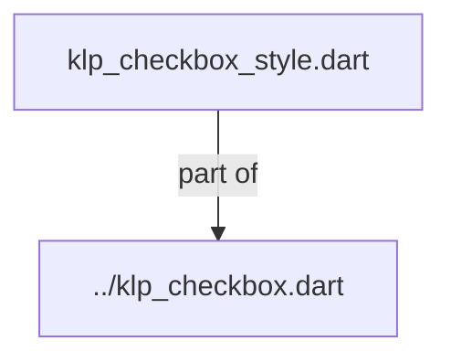
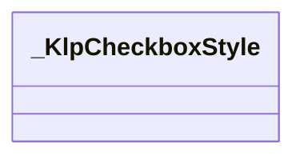

# klp_checkbox_style.dart：直接依賴與宣告架構

[回到目錄](README.md) · [來源檔案](../../../../../../../lib/src/features/forms/selection/internal/klp_checkbox_style.dart)

## 範圍

核心是 `lib/src/features/forms/selection/internal/klp_checkbox_style.dart`。主要視角為該檔案明寫的 import／export／part；輔助視角為本檔宣告及 extends／implements／with／on 關係。只展開一層外部邊界。

## 直接依賴圖

## 依賴證據

| 關係 | 原始 directive | 來源 |
|---|---|---|
| part of | <code>part of &#x27;../klp_checkbox.dart&#x27;;</code> | [lib/src/features/forms/selection/internal/klp_checkbox_style.dart:1](../../../../../../../lib/src/features/forms/selection/internal/klp_checkbox_style.dart#L1) |

## 宣告關係圖

本組節點是本檔宣告；沒有箭頭的宣告未在此圖主張互相依賴。

## 宣告與成員證據

成員包含 public 與 private；簽章取自來源，省略函式本體與欄位初始值。`(inferred)` 表示來源未明寫型別；建構子只顯示參數部分，不含初始化列表。

### _KlpCheckboxStyle

ClassDeclaration · private · [lib/src/features/forms/selection/internal/klp_checkbox_style.dart:3](../../../../../../../lib/src/features/forms/selection/internal/klp_checkbox_style.dart#L3)

<code>class _KlpCheckboxStyle</code>

| 成員 | 可見性 | 簽章／型別 | 來源註解摘要 | 證據 |
|---|---|---|---|---|
| constructor <code>_KlpCheckboxStyle</code> | private | <code>const _KlpCheckboxStyle({ required this.activeColor, required this.inactiveBorderColor, required this.checkColor, required this.clearColor, required this.controlExtent, required this.iconExtent, required this.controlRadius, required this.indicatorRadius, required this.strokeWidth, required this.verticalInset, required this.duration, })</code> |  | [lib/src/features/forms/selection/internal/klp_checkbox_style.dart:4](../../../../../../../lib/src/features/forms/selection/internal/klp_checkbox_style.dart#L4) |
| field <code>activeColor</code> | public | <code>final Color activeColor</code> |  | [lib/src/features/forms/selection/internal/klp_checkbox_style.dart:18](../../../../../../../lib/src/features/forms/selection/internal/klp_checkbox_style.dart#L18) |
| field <code>inactiveBorderColor</code> | public | <code>final Color inactiveBorderColor</code> |  | [lib/src/features/forms/selection/internal/klp_checkbox_style.dart:19](../../../../../../../lib/src/features/forms/selection/internal/klp_checkbox_style.dart#L19) |
| field <code>checkColor</code> | public | <code>final Color checkColor</code> |  | [lib/src/features/forms/selection/internal/klp_checkbox_style.dart:20](../../../../../../../lib/src/features/forms/selection/internal/klp_checkbox_style.dart#L20) |
| field <code>clearColor</code> | public | <code>final Color clearColor</code> |  | [lib/src/features/forms/selection/internal/klp_checkbox_style.dart:21](../../../../../../../lib/src/features/forms/selection/internal/klp_checkbox_style.dart#L21) |
| field <code>controlExtent</code> | public | <code>final double controlExtent</code> |  | [lib/src/features/forms/selection/internal/klp_checkbox_style.dart:22](../../../../../../../lib/src/features/forms/selection/internal/klp_checkbox_style.dart#L22) |
| field <code>iconExtent</code> | public | <code>final double iconExtent</code> |  | [lib/src/features/forms/selection/internal/klp_checkbox_style.dart:23](../../../../../../../lib/src/features/forms/selection/internal/klp_checkbox_style.dart#L23) |
| field <code>controlRadius</code> | public | <code>final double controlRadius</code> |  | [lib/src/features/forms/selection/internal/klp_checkbox_style.dart:24](../../../../../../../lib/src/features/forms/selection/internal/klp_checkbox_style.dart#L24) |
| field <code>indicatorRadius</code> | public | <code>final double indicatorRadius</code> |  | [lib/src/features/forms/selection/internal/klp_checkbox_style.dart:25](../../../../../../../lib/src/features/forms/selection/internal/klp_checkbox_style.dart#L25) |
| field <code>strokeWidth</code> | public | <code>final double strokeWidth</code> |  | [lib/src/features/forms/selection/internal/klp_checkbox_style.dart:26](../../../../../../../lib/src/features/forms/selection/internal/klp_checkbox_style.dart#L26) |
| field <code>verticalInset</code> | public | <code>final double verticalInset</code> |  | [lib/src/features/forms/selection/internal/klp_checkbox_style.dart:27](../../../../../../../lib/src/features/forms/selection/internal/klp_checkbox_style.dart#L27) |
| field <code>duration</code> | public | <code>final Duration duration</code> |  | [lib/src/features/forms/selection/internal/klp_checkbox_style.dart:28](../../../../../../../lib/src/features/forms/selection/internal/klp_checkbox_style.dart#L28) |
| constructor <code>resolve</code> | public | <code>factory _KlpCheckboxStyle.resolve(KlpTheme klp, {required bool enabled})</code> |  | [lib/src/features/forms/selection/internal/klp_checkbox_style.dart:30](../../../../../../../lib/src/features/forms/selection/internal/klp_checkbox_style.dart#L30) |

## 閱讀說明與限制

箭頭只表示來源明寫的靜態關係；import 不等於呼叫。未分析動態呼叫、欄位的實際物件擁有權、狀態轉移或渲染流程；型別未進行語意解析，繼承目標保留原始型別拼寫。public／private 依 Dart 名稱前綴判斷；public 宣告不代表已由 `lib/kallopis.dart` 匯出。

本頁由 `tool/architecture_atlas` 產生；編輯來源或生成工具後重新產生，避免手改本頁。
