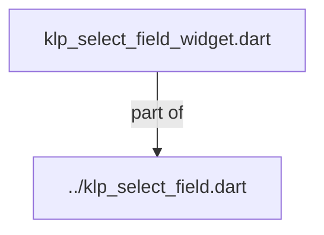
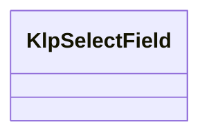
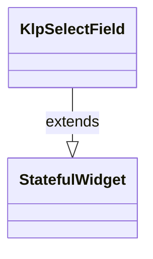

# klp_select_field_widget.dart：直接依賴與宣告架構

[回到目錄](README.md) · [來源檔案](../../../../../../../lib/src/features/forms/selection/internal/klp_select_field_widget.dart)

## 範圍

核心是 `lib/src/features/forms/selection/internal/klp_select_field_widget.dart`。主要視角為該檔案明寫的 import／export／part；輔助視角為本檔宣告及 extends／implements／with／on 關係。只展開一層外部邊界。

## 直接依賴圖

## 依賴證據

| 關係 | 原始 directive | 來源 |
|---|---|---|
| part of | <code>part of &#x27;../klp_select_field.dart&#x27;;</code> | [lib/src/features/forms/selection/internal/klp_select_field_widget.dart:1](../../../../../../../lib/src/features/forms/selection/internal/klp_select_field_widget.dart#L1) |

## 宣告關係圖

本組節點是本檔宣告；沒有箭頭的宣告未在此圖主張互相依賴。

## 宣告與成員證據

成員包含 public 與 private；簽章取自來源，省略函式本體與欄位初始值。`(inferred)` 表示來源未明寫型別；建構子只顯示參數部分，不含初始化列表。

### KlpSelectField

ClassDeclaration · public · [lib/src/features/forms/selection/internal/klp_select_field_widget.dart:3](../../../../../../../lib/src/features/forms/selection/internal/klp_select_field_widget.dart#L3)

<code>class KlpSelectField extends StatefulWidget</code>

來源註解摘要：單選下拉欄位：目前值顯示為一列文字，點擊展開選項清單並就地插入版面 （不是彈出層），選中後自動收合。 [valueLabel] 是呼叫端算好的顯示文字，不會反查 [options] 對應哪一項—— 這個元件不知道「目前選的是哪個 id」，只負責畫出清單與回報點擊。 需要彈出式選單而非就地展開時請改用 [KlpMenu]。

- `extends` → <code>StatefulWidget</code>：[lib/src/features/forms/selection/internal/klp_select_field_widget.dart:9](../../../../../../../lib/src/features/forms/selection/internal/klp_select_field_widget.dart#L9)

| 成員 | 可見性 | 簽章／型別 | 來源註解摘要 | 證據 |
|---|---|---|---|---|
| constructor <code>KlpSelectField</code> | public | <code>const KlpSelectField({ super.key, required this.label, required this.valueLabel, required this.options, required this.onSelected, this.enabled = true, this.readOnly = false, this.error, })</code> |  | [lib/src/features/forms/selection/internal/klp_select_field_widget.dart:10](../../../../../../../lib/src/features/forms/selection/internal/klp_select_field_widget.dart#L10) |
| field <code>label</code> | public | <code>final String label</code> |  | [lib/src/features/forms/selection/internal/klp_select_field_widget.dart:21](../../../../../../../lib/src/features/forms/selection/internal/klp_select_field_widget.dart#L21) |
| field <code>valueLabel</code> | public | <code>final String valueLabel</code> |  | [lib/src/features/forms/selection/internal/klp_select_field_widget.dart:22](../../../../../../../lib/src/features/forms/selection/internal/klp_select_field_widget.dart#L22) |
| field <code>options</code> | public | <code>final List&lt;KlpChoiceOption&gt; options</code> |  | [lib/src/features/forms/selection/internal/klp_select_field_widget.dart:23](../../../../../../../lib/src/features/forms/selection/internal/klp_select_field_widget.dart#L23) |
| field <code>onSelected</code> | public | <code>final ValueChanged&lt;String&gt;? onSelected</code> |  | [lib/src/features/forms/selection/internal/klp_select_field_widget.dart:24](../../../../../../../lib/src/features/forms/selection/internal/klp_select_field_widget.dart#L24) |
| field <code>enabled</code> | public | <code>final bool enabled</code> |  | [lib/src/features/forms/selection/internal/klp_select_field_widget.dart:25](../../../../../../../lib/src/features/forms/selection/internal/klp_select_field_widget.dart#L25) |
| field <code>readOnly</code> | public | <code>final bool readOnly</code> |  | [lib/src/features/forms/selection/internal/klp_select_field_widget.dart:26](../../../../../../../lib/src/features/forms/selection/internal/klp_select_field_widget.dart#L26) |
| field <code>error</code> | public | <code>final String? error</code> |  | [lib/src/features/forms/selection/internal/klp_select_field_widget.dart:27](../../../../../../../lib/src/features/forms/selection/internal/klp_select_field_widget.dart#L27) |
| method <code>createState</code> | public | <code>State&lt;KlpSelectField&gt; createState()</code> |  | [lib/src/features/forms/selection/internal/klp_select_field_widget.dart:29](../../../../../../../lib/src/features/forms/selection/internal/klp_select_field_widget.dart#L29) |

## 閱讀說明與限制

箭頭只表示來源明寫的靜態關係；import 不等於呼叫。未分析動態呼叫、欄位的實際物件擁有權、狀態轉移或渲染流程；型別未進行語意解析，繼承目標保留原始型別拼寫。public／private 依 Dart 名稱前綴判斷；public 宣告不代表已由 `lib/kallopis.dart` 匯出。

本頁由 `tool/architecture_atlas` 產生；編輯來源或生成工具後重新產生，避免手改本頁。
