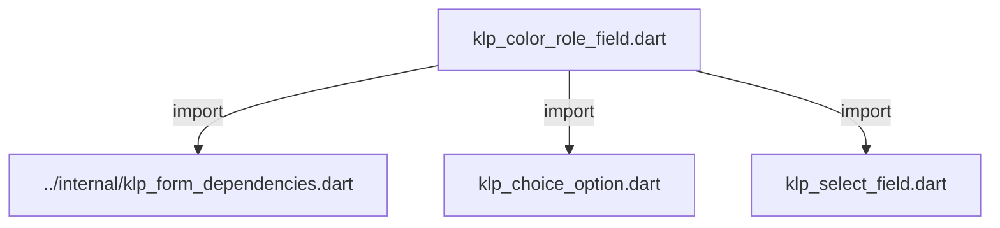
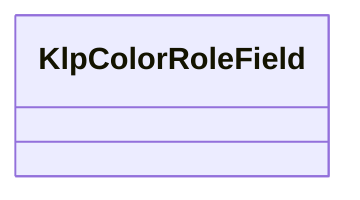
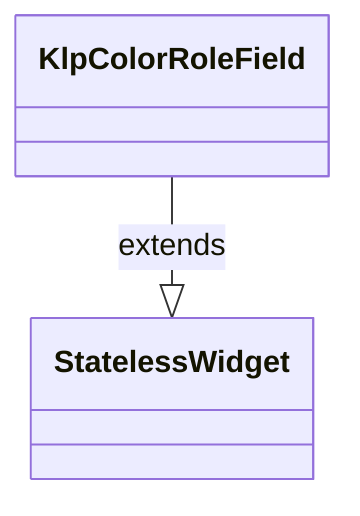

# klp_color_role_field.dart：直接依賴與宣告架構

[回到目錄](README.md) · [來源檔案](../../../../../../lib/src/features/forms/selection/klp_color_role_field.dart)

## 範圍

核心是 `lib/src/features/forms/selection/klp_color_role_field.dart`。主要視角為該檔案明寫的 import／export／part；輔助視角為本檔宣告及 extends／implements／with／on 關係。只展開一層外部邊界。

## 直接依賴圖

## 依賴證據

| 關係 | 原始 directive | 來源 |
|---|---|---|
| import | <code>import &#x27;../internal/klp_form_dependencies.dart&#x27;;</code> | [lib/src/features/forms/selection/klp_color_role_field.dart:1](../../../../../../lib/src/features/forms/selection/klp_color_role_field.dart#L1) |
| import | <code>import &#x27;klp_choice_option.dart&#x27;;</code> | [lib/src/features/forms/selection/klp_color_role_field.dart:2](../../../../../../lib/src/features/forms/selection/klp_color_role_field.dart#L2) |
| import | <code>import &#x27;klp_select_field.dart&#x27;;</code> | [lib/src/features/forms/selection/klp_color_role_field.dart:3](../../../../../../lib/src/features/forms/selection/klp_color_role_field.dart#L3) |

## 宣告關係圖

本組節點是本檔宣告；沒有箭頭的宣告未在此圖主張互相依賴。

## 宣告與成員證據

成員包含 public 與 private；簽章取自來源，省略函式本體與欄位初始值。`(inferred)` 表示來源未明寫型別；建構子只顯示參數部分，不含初始化列表。

### KlpColorRoleField

ClassDeclaration · public · [lib/src/features/forms/selection/klp_color_role_field.dart:5](../../../../../../lib/src/features/forms/selection/klp_color_role_field.dart#L5)

<code>class KlpColorRoleField extends StatelessWidget</code>

來源註解摘要：從一組色彩角色（例如 semantic token 名稱）中選擇一個的下拉欄位。 是 [KlpSelectField] 針對「選項本身就是色彩角色」這個情境的薄封裝—— [roles] 直接複用 [KlpChoiceOption]，實際渲染完全委派給 [KlpSelectField]。 找不到 [selectedId] 對應的角色時會退回顯示 [roles] 的第一項。

- `extends` → <code>StatelessWidget</code>：[lib/src/features/forms/selection/klp_color_role_field.dart:10](../../../../../../lib/src/features/forms/selection/klp_color_role_field.dart#L10)

| 成員 | 可見性 | 簽章／型別 | 來源註解摘要 | 證據 |
|---|---|---|---|---|
| constructor <code>KlpColorRoleField</code> | public | <code>const KlpColorRoleField({ super.key, required this.label, required this.roles, required this.selectedId, required this.onSelected, })</code> |  | [lib/src/features/forms/selection/klp_color_role_field.dart:11](../../../../../../lib/src/features/forms/selection/klp_color_role_field.dart#L11) |
| field <code>label</code> | public | <code>final String label</code> |  | [lib/src/features/forms/selection/klp_color_role_field.dart:19](../../../../../../lib/src/features/forms/selection/klp_color_role_field.dart#L19) |
| field <code>roles</code> | public | <code>final List&lt;KlpChoiceOption&gt; roles</code> |  | [lib/src/features/forms/selection/klp_color_role_field.dart:20](../../../../../../lib/src/features/forms/selection/klp_color_role_field.dart#L20) |
| field <code>selectedId</code> | public | <code>final String selectedId</code> |  | [lib/src/features/forms/selection/klp_color_role_field.dart:21](../../../../../../lib/src/features/forms/selection/klp_color_role_field.dart#L21) |
| field <code>onSelected</code> | public | <code>final ValueChanged&lt;String&gt;? onSelected</code> |  | [lib/src/features/forms/selection/klp_color_role_field.dart:22](../../../../../../lib/src/features/forms/selection/klp_color_role_field.dart#L22) |
| method <code>build</code> | public | <code>Widget build(BuildContext context)</code> |  | [lib/src/features/forms/selection/klp_color_role_field.dart:24](../../../../../../lib/src/features/forms/selection/klp_color_role_field.dart#L24) |

## 閱讀說明與限制

箭頭只表示來源明寫的靜態關係；import 不等於呼叫。未分析動態呼叫、欄位的實際物件擁有權、狀態轉移或渲染流程；型別未進行語意解析，繼承目標保留原始型別拼寫。public／private 依 Dart 名稱前綴判斷；public 宣告不代表已由 `lib/kallopis.dart` 匯出。

本頁由 `tool/architecture_atlas` 產生；編輯來源或生成工具後重新產生，避免手改本頁。
