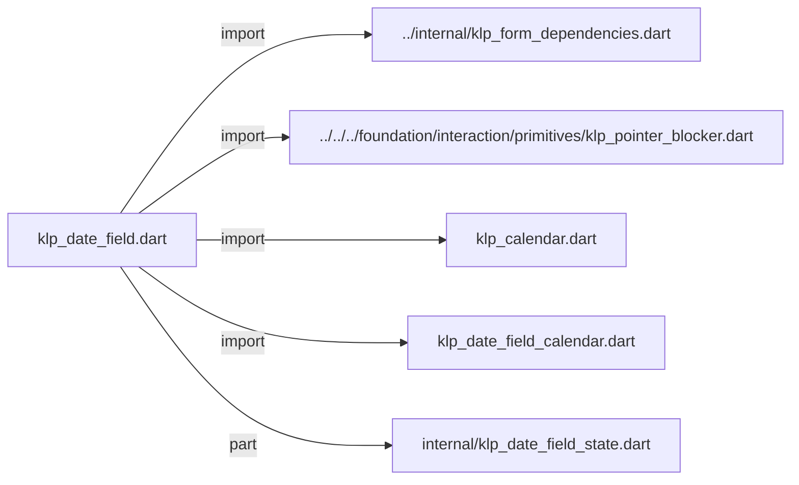
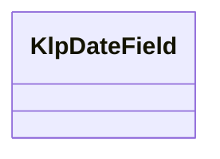
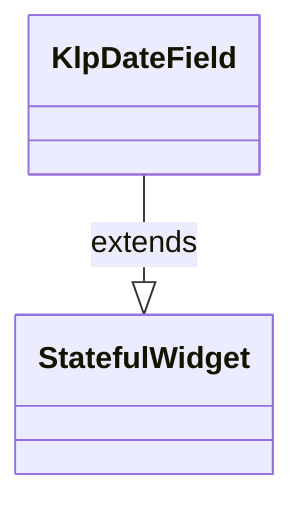

# klp_date_field.dart：直接依賴與宣告架構

[回到目錄](README.md) · [來源檔案](../../../../../../lib/src/features/forms/selection/klp_date_field.dart)

## 範圍

核心是 `lib/src/features/forms/selection/klp_date_field.dart`。主要視角為該檔案明寫的 import／export／part；輔助視角為本檔宣告及 extends／implements／with／on 關係。只展開一層外部邊界。

## 直接依賴圖

## 依賴證據

| 關係 | 原始 directive | 來源 |
|---|---|---|
| import | <code>import &#x27;../internal/klp_form_dependencies.dart&#x27;;</code> | [lib/src/features/forms/selection/klp_date_field.dart:1](../../../../../../lib/src/features/forms/selection/klp_date_field.dart#L1) |
| import | <code>import &#x27;../../../foundation/interaction/primitives/klp_pointer_blocker.dart&#x27;;</code> | [lib/src/features/forms/selection/klp_date_field.dart:2](../../../../../../lib/src/features/forms/selection/klp_date_field.dart#L2) |
| import | <code>import &#x27;klp_calendar.dart&#x27;;</code> | [lib/src/features/forms/selection/klp_date_field.dart:3](../../../../../../lib/src/features/forms/selection/klp_date_field.dart#L3) |
| import | <code>import &#x27;klp_date_field_calendar.dart&#x27;;</code> | [lib/src/features/forms/selection/klp_date_field.dart:4](../../../../../../lib/src/features/forms/selection/klp_date_field.dart#L4) |
| part | <code>part &#x27;internal/klp_date_field_state.dart&#x27;;</code> | [lib/src/features/forms/selection/klp_date_field.dart:6](../../../../../../lib/src/features/forms/selection/klp_date_field.dart#L6) |

## 宣告關係圖

本組節點是本檔宣告；沒有箭頭的宣告未在此圖主張互相依賴。

## 宣告與成員證據

成員包含 public 與 private；簽章取自來源，省略函式本體與欄位初始值。`(inferred)` 表示來源未明寫型別；建構子只顯示參數部分，不含初始化列表。

### KlpDateField

ClassDeclaration · public · [lib/src/features/forms/selection/klp_date_field.dart:8](../../../../../../lib/src/features/forms/selection/klp_date_field.dart#L8)

<code>class KlpDateField extends StatefulWidget</code>

來源註解摘要：日期輸入欄位。文字輸入永遠可用；提供 [calendar] 時額外接上 [KlpCalendar] 作為挑選面板，兩套輸入路徑共用同一個文字結果，不是各自獨立的兩個元件。

- `extends` → <code>StatefulWidget</code>：[lib/src/features/forms/selection/klp_date_field.dart:10](../../../../../../lib/src/features/forms/selection/klp_date_field.dart#L10)

| 成員 | 可見性 | 簽章／型別 | 來源註解摘要 | 證據 |
|---|---|---|---|---|
| constructor <code>KlpDateField</code> | public | <code>const KlpDateField({ super.key, required this.label, required this.value, required this.onChanged, this.placeholder, this.calendar, })</code> |  | [lib/src/features/forms/selection/klp_date_field.dart:11](../../../../../../lib/src/features/forms/selection/klp_date_field.dart#L11) |
| field <code>label</code> | public | <code>final String label</code> |  | [lib/src/features/forms/selection/klp_date_field.dart:20](../../../../../../lib/src/features/forms/selection/klp_date_field.dart#L20) |
| field <code>value</code> | public | <code>final String value</code> |  | [lib/src/features/forms/selection/klp_date_field.dart:21](../../../../../../lib/src/features/forms/selection/klp_date_field.dart#L21) |
| field <code>onChanged</code> | public | <code>final ValueChanged&lt;String&gt;? onChanged</code> |  | [lib/src/features/forms/selection/klp_date_field.dart:22](../../../../../../lib/src/features/forms/selection/klp_date_field.dart#L22) |
| field <code>placeholder</code> | public | <code>final String? placeholder</code> |  | [lib/src/features/forms/selection/klp_date_field.dart:23](../../../../../../lib/src/features/forms/selection/klp_date_field.dart#L23) |
| field <code>calendar</code> | public | <code>final KlpDateFieldCalendar? calendar</code> | 月曆挑選面板的設定；`null` 時欄位維持純文字輸入。 | [lib/src/features/forms/selection/klp_date_field.dart:26](../../../../../../lib/src/features/forms/selection/klp_date_field.dart#L26) |
| method <code>createState</code> | public | <code>State&lt;KlpDateField&gt; createState()</code> |  | [lib/src/features/forms/selection/klp_date_field.dart:28](../../../../../../lib/src/features/forms/selection/klp_date_field.dart#L28) |

## 閱讀說明與限制

箭頭只表示來源明寫的靜態關係；import 不等於呼叫。未分析動態呼叫、欄位的實際物件擁有權、狀態轉移或渲染流程；型別未進行語意解析，繼承目標保留原始型別拼寫。public／private 依 Dart 名稱前綴判斷；public 宣告不代表已由 `lib/kallopis.dart` 匯出。

本頁由 `tool/architecture_atlas` 產生；編輯來源或生成工具後重新產生，避免手改本頁。
