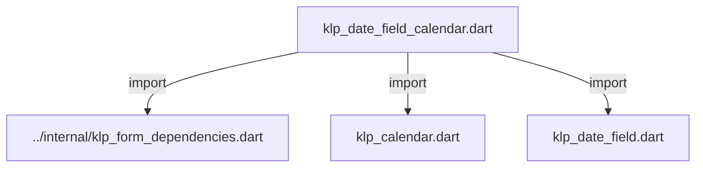
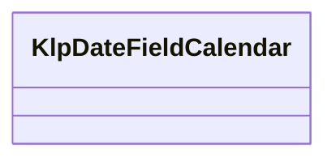

# klp_date_field_calendar.dart：直接依賴與宣告架構

[回到目錄](README.md) · [來源檔案](../../../../../../lib/src/features/forms/selection/klp_date_field_calendar.dart)

## 範圍

核心是 `lib/src/features/forms/selection/klp_date_field_calendar.dart`。主要視角為該檔案明寫的 import／export／part；輔助視角為本檔宣告及 extends／implements／with／on 關係。只展開一層外部邊界。

## 直接依賴圖

## 依賴證據

| 關係 | 原始 directive | 來源 |
|---|---|---|
| import | <code>import &#x27;../internal/klp_form_dependencies.dart&#x27;;</code> | [lib/src/features/forms/selection/klp_date_field_calendar.dart:1](../../../../../../lib/src/features/forms/selection/klp_date_field_calendar.dart#L1) |
| import | <code>import &#x27;klp_calendar.dart&#x27;;</code> | [lib/src/features/forms/selection/klp_date_field_calendar.dart:2](../../../../../../lib/src/features/forms/selection/klp_date_field_calendar.dart#L2) |
| import | <code>import &#x27;klp_date_field.dart&#x27;;</code> | [lib/src/features/forms/selection/klp_date_field_calendar.dart:3](../../../../../../lib/src/features/forms/selection/klp_date_field_calendar.dart#L3) |

## 宣告關係圖

本組節點是本檔宣告；沒有箭頭的宣告未在此圖主張互相依賴。

## 宣告與成員證據

成員包含 public 與 private；簽章取自來源，省略函式本體與欄位初始值。`(inferred)` 表示來源未明寫型別；建構子只顯示參數部分，不含初始化列表。

### KlpDateFieldCalendar

ClassDeclaration · public · [lib/src/features/forms/selection/klp_date_field_calendar.dart:5](../../../../../../lib/src/features/forms/selection/klp_date_field_calendar.dart#L5)

<code>class KlpDateFieldCalendar</code>

來源註解摘要：[KlpDateField] 掛上月曆挑選面板所需的受控設定。 月份、選取日期、停用規則全部由呼叫端持有並傳入，欄位本身不記憶任何日期。

| 成員 | 可見性 | 簽章／型別 | 來源註解摘要 | 證據 |
|---|---|---|---|---|
| constructor <code>KlpDateFieldCalendar</code> | public | <code>const KlpDateFieldCalendar({ required this.month, required this.monthLabel, required this.weekdayLabels, required this.previousMonthLabel, required this.nextMonthLabel, required this.onDateSelected, this.selectedDate, this.isDateDisabled, this.onPreviousMonth, this.onNextMonth, this.today, })</code> |  | [lib/src/features/forms/selection/klp_date_field_calendar.dart:10](../../../../../../lib/src/features/forms/selection/klp_date_field_calendar.dart#L10) |
| field <code>month</code> | public | <code>final DateTime month</code> | 面板目前顯示的月份，轉發給 [KlpCalendar.month]。 | [lib/src/features/forms/selection/klp_date_field_calendar.dart:25](../../../../../../lib/src/features/forms/selection/klp_date_field_calendar.dart#L25) |
| field <code>monthLabel</code> | public | <code>final String monthLabel</code> |  | [lib/src/features/forms/selection/klp_date_field_calendar.dart:26](../../../../../../lib/src/features/forms/selection/klp_date_field_calendar.dart#L26) |
| field <code>weekdayLabels</code> | public | <code>final List&lt;String&gt; weekdayLabels</code> |  | [lib/src/features/forms/selection/klp_date_field_calendar.dart:27](../../../../../../lib/src/features/forms/selection/klp_date_field_calendar.dart#L27) |
| field <code>previousMonthLabel</code> | public | <code>final String previousMonthLabel</code> |  | [lib/src/features/forms/selection/klp_date_field_calendar.dart:28](../../../../../../lib/src/features/forms/selection/klp_date_field_calendar.dart#L28) |
| field <code>nextMonthLabel</code> | public | <code>final String nextMonthLabel</code> |  | [lib/src/features/forms/selection/klp_date_field_calendar.dart:29](../../../../../../lib/src/features/forms/selection/klp_date_field_calendar.dart#L29) |
| field <code>selectedDate</code> | public | <code>final DateTime? selectedDate</code> |  | [lib/src/features/forms/selection/klp_date_field_calendar.dart:30](../../../../../../lib/src/features/forms/selection/klp_date_field_calendar.dart#L30) |
| field <code>today</code> | public | <code>final DateTime? today</code> |  | [lib/src/features/forms/selection/klp_date_field_calendar.dart:31](../../../../../../lib/src/features/forms/selection/klp_date_field_calendar.dart#L31) |
| field <code>isDateDisabled</code> | public | <code>final bool Function(DateTime date)? isDateDisabled</code> |  | [lib/src/features/forms/selection/klp_date_field_calendar.dart:32](../../../../../../lib/src/features/forms/selection/klp_date_field_calendar.dart#L32) |
| field <code>onDateSelected</code> | public | <code>final ValueChanged&lt;DateTime&gt; onDateSelected</code> | 使用者在面板上點了某一天。欄位會在轉發這個回呼之後自行收起面板。 | [lib/src/features/forms/selection/klp_date_field_calendar.dart:35](../../../../../../lib/src/features/forms/selection/klp_date_field_calendar.dart#L35) |
| field <code>onPreviousMonth</code> | public | <code>final VoidCallback? onPreviousMonth</code> |  | [lib/src/features/forms/selection/klp_date_field_calendar.dart:36](../../../../../../lib/src/features/forms/selection/klp_date_field_calendar.dart#L36) |
| field <code>onNextMonth</code> | public | <code>final VoidCallback? onNextMonth</code> |  | [lib/src/features/forms/selection/klp_date_field_calendar.dart:37](../../../../../../lib/src/features/forms/selection/klp_date_field_calendar.dart#L37) |

## 閱讀說明與限制

箭頭只表示來源明寫的靜態關係；import 不等於呼叫。未分析動態呼叫、欄位的實際物件擁有權、狀態轉移或渲染流程；型別未進行語意解析，繼承目標保留原始型別拼寫。public／private 依 Dart 名稱前綴判斷；public 宣告不代表已由 `lib/kallopis.dart` 匯出。

本頁由 `tool/architecture_atlas` 產生；編輯來源或生成工具後重新產生，避免手改本頁。
