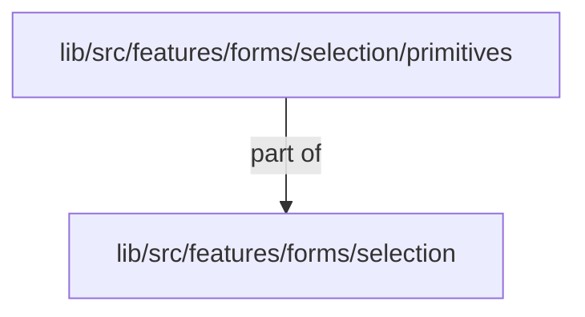
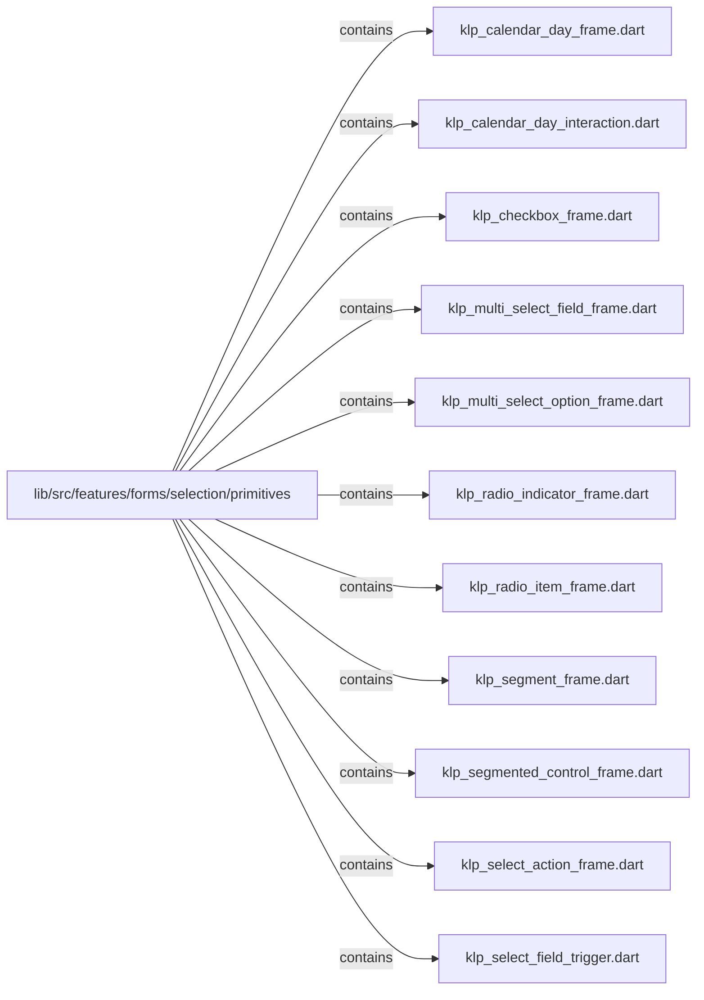
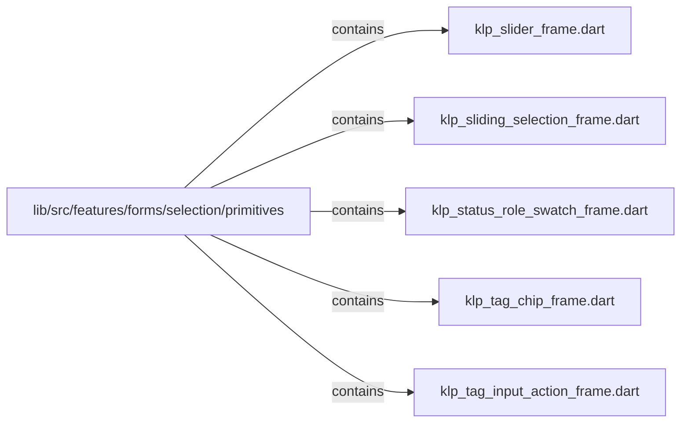

# lib/src/features/forms/selection/primitives：架構分析入口

[上一層](../README.md)

## 範圍

閱讀 `lib/src/features/forms/selection/primitives` 的直接子目錄與 Dart 檔案。結構圖表示實際檔案包含關係；依賴圖表示本層檔案明寫的 directives。每個檔案頁另列直接依賴、宣告、欄位、方法、建構子及行號證據。

## 本層直接依賴圖

箭頭以本層 Dart 檔案明寫的 directive 彙總到目標所在目錄或外部套件邊界；不遞迴將子目錄依賴算入本層。相同目標的不同 directive 類型分開計數。

| 目標邊界 | 關係 | directive 數 | 第一筆來源證據 |
|---|---|---|---|
| <code>lib/src/features/forms/selection</code> | part of | 16 | [lib/src/features/forms/selection/primitives/klp_calendar_day_frame.dart:1](../../../../../../../lib/src/features/forms/selection/primitives/klp_calendar_day_frame.dart#L1) |

## 目錄結構圖

## 子目錄

| 目錄 | 導航 | 來源證據 |
|---|---|---|
| 無 | 目前沒有下一層目錄 | — |

## 本層檔案

| 檔案 | 宣告 | 細節 | 來源證據 |
|---|---|---|---|
| `klp_calendar_day_frame.dart` | _KlpCalendarDayFrame | [架構與 API](klp_calendar_day_frame.md) | [lib/src/features/forms/selection/primitives/klp_calendar_day_frame.dart:1](../../../../../../../lib/src/features/forms/selection/primitives/klp_calendar_day_frame.dart#L1) |
| `klp_calendar_day_interaction.dart` | _KlpCalendarDayInteraction | [架構與 API](klp_calendar_day_interaction.md) | [lib/src/features/forms/selection/primitives/klp_calendar_day_interaction.dart:1](../../../../../../../lib/src/features/forms/selection/primitives/klp_calendar_day_interaction.dart#L1) |
| `klp_checkbox_frame.dart` | _KlpCheckboxFrame | [架構與 API](klp_checkbox_frame.md) | [lib/src/features/forms/selection/primitives/klp_checkbox_frame.dart:1](../../../../../../../lib/src/features/forms/selection/primitives/klp_checkbox_frame.dart#L1) |
| `klp_multi_select_field_frame.dart` | _KlpMultiSelectFieldFrame | [架構與 API](klp_multi_select_field_frame.md) | [lib/src/features/forms/selection/primitives/klp_multi_select_field_frame.dart:1](../../../../../../../lib/src/features/forms/selection/primitives/klp_multi_select_field_frame.dart#L1) |
| `klp_multi_select_option_frame.dart` | _KlpMultiSelectOptionFrame | [架構與 API](klp_multi_select_option_frame.md) | [lib/src/features/forms/selection/primitives/klp_multi_select_option_frame.dart:1](../../../../../../../lib/src/features/forms/selection/primitives/klp_multi_select_option_frame.dart#L1) |
| `klp_radio_indicator_frame.dart` | _KlpRadioIndicatorFrame | [架構與 API](klp_radio_indicator_frame.md) | [lib/src/features/forms/selection/primitives/klp_radio_indicator_frame.dart:1](../../../../../../../lib/src/features/forms/selection/primitives/klp_radio_indicator_frame.dart#L1) |
| `klp_radio_item_frame.dart` | _KlpRadioItemFrame | [架構與 API](klp_radio_item_frame.md) | [lib/src/features/forms/selection/primitives/klp_radio_item_frame.dart:1](../../../../../../../lib/src/features/forms/selection/primitives/klp_radio_item_frame.dart#L1) |
| `klp_segment_frame.dart` | _KlpSegmentFrame | [架構與 API](klp_segment_frame.md) | [lib/src/features/forms/selection/primitives/klp_segment_frame.dart:1](../../../../../../../lib/src/features/forms/selection/primitives/klp_segment_frame.dart#L1) |
| `klp_segmented_control_frame.dart` | _KlpSegmentedControlFrame | [架構與 API](klp_segmented_control_frame.md) | [lib/src/features/forms/selection/primitives/klp_segmented_control_frame.dart:1](../../../../../../../lib/src/features/forms/selection/primitives/klp_segmented_control_frame.dart#L1) |
| `klp_select_action_frame.dart` | _KlpSelectActionFrame | [架構與 API](klp_select_action_frame.md) | [lib/src/features/forms/selection/primitives/klp_select_action_frame.dart:1](../../../../../../../lib/src/features/forms/selection/primitives/klp_select_action_frame.dart#L1) |
| `klp_select_field_trigger.dart` | _KlpSelectFieldTrigger | [架構與 API](klp_select_field_trigger.md) | [lib/src/features/forms/selection/primitives/klp_select_field_trigger.dart:1](../../../../../../../lib/src/features/forms/selection/primitives/klp_select_field_trigger.dart#L1) |
| `klp_slider_frame.dart` | _KlpSliderFrame | [架構與 API](klp_slider_frame.md) | [lib/src/features/forms/selection/primitives/klp_slider_frame.dart:1](../../../../../../../lib/src/features/forms/selection/primitives/klp_slider_frame.dart#L1) |
| `klp_sliding_selection_frame.dart` | _KlpSlidingSelectionFrame | [架構與 API](klp_sliding_selection_frame.md) | [lib/src/features/forms/selection/primitives/klp_sliding_selection_frame.dart:1](../../../../../../../lib/src/features/forms/selection/primitives/klp_sliding_selection_frame.dart#L1) |
| `klp_status_role_swatch_frame.dart` | _KlpStatusRoleSwatchFrame | [架構與 API](klp_status_role_swatch_frame.md) | [lib/src/features/forms/selection/primitives/klp_status_role_swatch_frame.dart:1](../../../../../../../lib/src/features/forms/selection/primitives/klp_status_role_swatch_frame.dart#L1) |
| `klp_tag_chip_frame.dart` | _KlpTagChipFrame | [架構與 API](klp_tag_chip_frame.md) | [lib/src/features/forms/selection/primitives/klp_tag_chip_frame.dart:1](../../../../../../../lib/src/features/forms/selection/primitives/klp_tag_chip_frame.dart#L1) |
| `klp_tag_input_action_frame.dart` | _KlpTagInputActionFrame | [架構與 API](klp_tag_input_action_frame.md) | [lib/src/features/forms/selection/primitives/klp_tag_input_action_frame.dart:1](../../../../../../../lib/src/features/forms/selection/primitives/klp_tag_input_action_frame.dart#L1) |

## 閱讀說明

箭頭只表示來源明寫的靜態關係；import 不等於呼叫。未分析動態呼叫、欄位的實際物件擁有權、狀態轉移或渲染流程；型別未進行語意解析，繼承目標保留原始型別拼寫。public／private 依 Dart 名稱前綴判斷；public 宣告不代表已由 `lib/kallopis.dart` 匯出。

本頁的目錄與檔案由來源清冊產生；`manifest.json` 位於本圖集根目錄，可核對 SHA-256 與覆蓋數。人工模組摘要存於 `tool/architecture_atlas/briefs/`，重新生成時保留。
