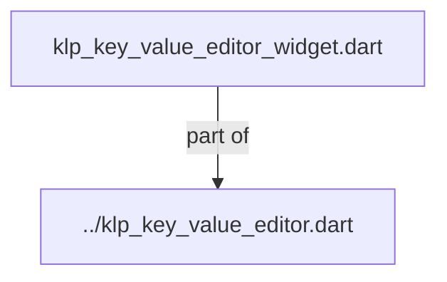
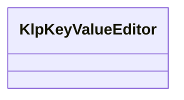
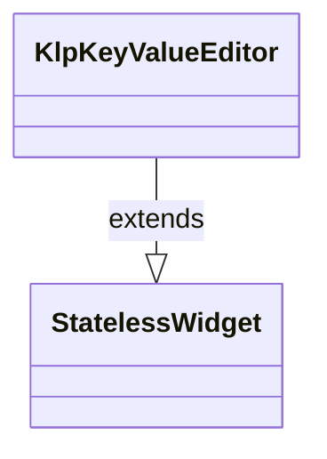

# klp_key_value_editor_widget.dart：直接依賴與宣告架構

[回到目錄](README.md) · [來源檔案](../../../../../../../lib/src/features/forms/structured/internal/klp_key_value_editor_widget.dart)

## 範圍

核心是 `lib/src/features/forms/structured/internal/klp_key_value_editor_widget.dart`。主要視角為該檔案明寫的 import／export／part；輔助視角為本檔宣告及 extends／implements／with／on 關係。只展開一層外部邊界。

## 直接依賴圖

## 依賴證據

| 關係 | 原始 directive | 來源 |
|---|---|---|
| part of | <code>part of &#x27;../klp_key_value_editor.dart&#x27;;</code> | [lib/src/features/forms/structured/internal/klp_key_value_editor_widget.dart:1](../../../../../../../lib/src/features/forms/structured/internal/klp_key_value_editor_widget.dart#L1) |

## 宣告關係圖

本組節點是本檔宣告；沒有箭頭的宣告未在此圖主張互相依賴。

## 宣告與成員證據

成員包含 public 與 private；簽章取自來源，省略函式本體與欄位初始值。`(inferred)` 表示來源未明寫型別；建構子只顯示參數部分，不含初始化列表。

### KlpKeyValueEditor

ClassDeclaration · public · [lib/src/features/forms/structured/internal/klp_key_value_editor_widget.dart:3](../../../../../../../lib/src/features/forms/structured/internal/klp_key_value_editor_widget.dart#L3)

<code>class KlpKeyValueEditor extends StatelessWidget</code>

來源註解摘要：任意鍵值對清單的編輯器（例如 HTTP header、環境變數），每列一個 key 輸入 框與一個 value 輸入框。 不提供新增／刪除列的按鈕——這個元件只負責編輯既有 [entries] 的內容， 增減列數請自行在 [entries] 外包一層（可參考 [KlpRepeaterField] 的模式）。

- `extends` → <code>StatelessWidget</code>：[lib/src/features/forms/structured/internal/klp_key_value_editor_widget.dart:8](../../../../../../../lib/src/features/forms/structured/internal/klp_key_value_editor_widget.dart#L8)

| 成員 | 可見性 | 簽章／型別 | 來源註解摘要 | 證據 |
|---|---|---|---|---|
| constructor <code>KlpKeyValueEditor</code> | public | <code>const KlpKeyValueEditor({ super.key, required this.label, required this.entries, required this.onChanged, })</code> |  | [lib/src/features/forms/structured/internal/klp_key_value_editor_widget.dart:9](../../../../../../../lib/src/features/forms/structured/internal/klp_key_value_editor_widget.dart#L9) |
| field <code>label</code> | public | <code>final String label</code> |  | [lib/src/features/forms/structured/internal/klp_key_value_editor_widget.dart:16](../../../../../../../lib/src/features/forms/structured/internal/klp_key_value_editor_widget.dart#L16) |
| field <code>entries</code> | public | <code>final List&lt;KlpKeyValueEntry&gt; entries</code> |  | [lib/src/features/forms/structured/internal/klp_key_value_editor_widget.dart:17](../../../../../../../lib/src/features/forms/structured/internal/klp_key_value_editor_widget.dart#L17) |
| field <code>onChanged</code> | public | <code>final ValueChanged&lt;List&lt;KlpKeyValueEntry&gt;&gt;? onChanged</code> |  | [lib/src/features/forms/structured/internal/klp_key_value_editor_widget.dart:18](../../../../../../../lib/src/features/forms/structured/internal/klp_key_value_editor_widget.dart#L18) |
| method <code>build</code> | public | <code>Widget build(BuildContext context)</code> |  | [lib/src/features/forms/structured/internal/klp_key_value_editor_widget.dart:20](../../../../../../../lib/src/features/forms/structured/internal/klp_key_value_editor_widget.dart#L20) |
| method <code>_keyChangedHandler</code> | private | <code>ValueChanged&lt;String&gt;? _keyChangedHandler(int index)</code> |  | [lib/src/features/forms/structured/internal/klp_key_value_editor_widget.dart:52](../../../../../../../lib/src/features/forms/structured/internal/klp_key_value_editor_widget.dart#L52) |
| method <code>_valueChangedHandler</code> | private | <code>ValueChanged&lt;String&gt;? _valueChangedHandler(int index)</code> |  | [lib/src/features/forms/structured/internal/klp_key_value_editor_widget.dart:58](../../../../../../../lib/src/features/forms/structured/internal/klp_key_value_editor_widget.dart#L58) |
| method <code>_replace</code> | private | <code>void _replace(int index, KlpKeyValueEntry entry)</code> |  | [lib/src/features/forms/structured/internal/klp_key_value_editor_widget.dart:64](../../../../../../../lib/src/features/forms/structured/internal/klp_key_value_editor_widget.dart#L64) |

## 閱讀說明與限制

箭頭只表示來源明寫的靜態關係；import 不等於呼叫。未分析動態呼叫、欄位的實際物件擁有權、狀態轉移或渲染流程；型別未進行語意解析，繼承目標保留原始型別拼寫。public／private 依 Dart 名稱前綴判斷；public 宣告不代表已由 `lib/kallopis.dart` 匯出。

本頁由 `tool/architecture_atlas` 產生；編輯來源或生成工具後重新產生，避免手改本頁。
