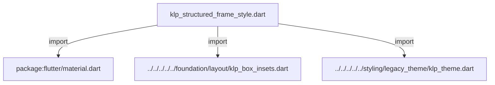
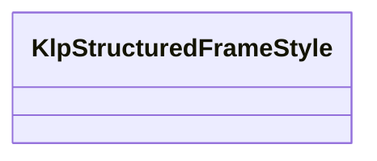

# klp_structured_frame_style.dart：直接依賴與宣告架構

[回到目錄](README.md) · [來源檔案](../../../../../../../../lib/src/features/forms/structured/primitives/internal/klp_structured_frame_style.dart)

## 範圍

核心是 `lib/src/features/forms/structured/primitives/internal/klp_structured_frame_style.dart`。主要視角為該檔案明寫的 import／export／part；輔助視角為本檔宣告及 extends／implements／with／on 關係。只展開一層外部邊界。

## 直接依賴圖

## 依賴證據

| 關係 | 原始 directive | 來源 |
|---|---|---|
| import | <code>import &#x27;package:flutter/material.dart&#x27;;</code> | [lib/src/features/forms/structured/primitives/internal/klp_structured_frame_style.dart:1](../../../../../../../../lib/src/features/forms/structured/primitives/internal/klp_structured_frame_style.dart#L1) |
| import | <code>import &#x27;../../../../../foundation/layout/klp_box_insets.dart&#x27;;</code> | [lib/src/features/forms/structured/primitives/internal/klp_structured_frame_style.dart:3](../../../../../../../../lib/src/features/forms/structured/primitives/internal/klp_structured_frame_style.dart#L3) |
| import | <code>import &#x27;../../../../../styling/legacy_theme/klp_theme.dart&#x27;;</code> | [lib/src/features/forms/structured/primitives/internal/klp_structured_frame_style.dart:4](../../../../../../../../lib/src/features/forms/structured/primitives/internal/klp_structured_frame_style.dart#L4) |

## 宣告關係圖

本組節點是本檔宣告；沒有箭頭的宣告未在此圖主張互相依賴。

## 宣告與成員證據

成員包含 public 與 private；簽章取自來源，省略函式本體與欄位初始值。`(inferred)` 表示來源未明寫型別；建構子只顯示參數部分，不含初始化列表。

### KlpStructuredFrameStyle

ClassDeclaration · public · [lib/src/features/forms/structured/primitives/internal/klp_structured_frame_style.dart:6](../../../../../../../../lib/src/features/forms/structured/primitives/internal/klp_structured_frame_style.dart#L6)

<code>class KlpStructuredFrameStyle</code>

來源註解摘要：Structured form frame 解析後的完整風格。

| 成員 | 可見性 | 簽章／型別 | 來源註解摘要 | 證據 |
|---|---|---|---|---|
| constructor <code>KlpStructuredFrameStyle</code> | public | <code>const KlpStructuredFrameStyle({ required this.background, required this.radius, required this.insets, this.borderColor, this.borderWidth, this.height, this.alignment, })</code> |  | [lib/src/features/forms/structured/primitives/internal/klp_structured_frame_style.dart:8](../../../../../../../../lib/src/features/forms/structured/primitives/internal/klp_structured_frame_style.dart#L8) |
| constructor <code>approvalRow</code> | public | <code>factory KlpStructuredFrameStyle.approvalRow(BuildContext context)</code> |  | [lib/src/features/forms/structured/primitives/internal/klp_structured_frame_style.dart:18](../../../../../../../../lib/src/features/forms/structured/primitives/internal/klp_structured_frame_style.dart#L18) |
| constructor <code>approvalRole</code> | public | <code>factory KlpStructuredFrameStyle.approvalRole(BuildContext context)</code> |  | [lib/src/features/forms/structured/primitives/internal/klp_structured_frame_style.dart:35](../../../../../../../../lib/src/features/forms/structured/primitives/internal/klp_structured_frame_style.dart#L35) |
| constructor <code>codeBody</code> | public | <code>factory KlpStructuredFrameStyle.codeBody(BuildContext context)</code> |  | [lib/src/features/forms/structured/primitives/internal/klp_structured_frame_style.dart:50](../../../../../../../../lib/src/features/forms/structured/primitives/internal/klp_structured_frame_style.dart#L50) |
| constructor <code>codeFooter</code> | public | <code>factory KlpStructuredFrameStyle.codeFooter(BuildContext context)</code> |  | [lib/src/features/forms/structured/primitives/internal/klp_structured_frame_style.dart:62](../../../../../../../../lib/src/features/forms/structured/primitives/internal/klp_structured_frame_style.dart#L62) |
| constructor <code>dropzone</code> | public | <code>factory KlpStructuredFrameStyle.dropzone(BuildContext context)</code> |  | [lib/src/features/forms/structured/primitives/internal/klp_structured_frame_style.dart:77](../../../../../../../../lib/src/features/forms/structured/primitives/internal/klp_structured_frame_style.dart#L77) |
| constructor <code>fileChoose</code> | public | <code>factory KlpStructuredFrameStyle.fileChoose(BuildContext context)</code> |  | [lib/src/features/forms/structured/primitives/internal/klp_structured_frame_style.dart:89](../../../../../../../../lib/src/features/forms/structured/primitives/internal/klp_structured_frame_style.dart#L89) |
| constructor <code>fileAttachment</code> | public | <code>factory KlpStructuredFrameStyle.fileAttachment(BuildContext context)</code> |  | [lib/src/features/forms/structured/primitives/internal/klp_structured_frame_style.dart:106](../../../../../../../../lib/src/features/forms/structured/primitives/internal/klp_structured_frame_style.dart#L106) |
| field <code>background</code> | public | <code>final Color background</code> |  | [lib/src/features/forms/structured/primitives/internal/klp_structured_frame_style.dart:121](../../../../../../../../lib/src/features/forms/structured/primitives/internal/klp_structured_frame_style.dart#L121) |
| field <code>radius</code> | public | <code>final double radius</code> |  | [lib/src/features/forms/structured/primitives/internal/klp_structured_frame_style.dart:122](../../../../../../../../lib/src/features/forms/structured/primitives/internal/klp_structured_frame_style.dart#L122) |
| field <code>insets</code> | public | <code>final KlpBoxInsets insets</code> |  | [lib/src/features/forms/structured/primitives/internal/klp_structured_frame_style.dart:123](../../../../../../../../lib/src/features/forms/structured/primitives/internal/klp_structured_frame_style.dart#L123) |
| field <code>borderColor</code> | public | <code>final Color? borderColor</code> |  | [lib/src/features/forms/structured/primitives/internal/klp_structured_frame_style.dart:124](../../../../../../../../lib/src/features/forms/structured/primitives/internal/klp_structured_frame_style.dart#L124) |
| field <code>borderWidth</code> | public | <code>final double? borderWidth</code> |  | [lib/src/features/forms/structured/primitives/internal/klp_structured_frame_style.dart:125](../../../../../../../../lib/src/features/forms/structured/primitives/internal/klp_structured_frame_style.dart#L125) |
| field <code>height</code> | public | <code>final double? height</code> |  | [lib/src/features/forms/structured/primitives/internal/klp_structured_frame_style.dart:126](../../../../../../../../lib/src/features/forms/structured/primitives/internal/klp_structured_frame_style.dart#L126) |
| field <code>alignment</code> | public | <code>final AlignmentGeometry? alignment</code> |  | [lib/src/features/forms/structured/primitives/internal/klp_structured_frame_style.dart:127](../../../../../../../../lib/src/features/forms/structured/primitives/internal/klp_structured_frame_style.dart#L127) |

## 閱讀說明與限制

箭頭只表示來源明寫的靜態關係；import 不等於呼叫。未分析動態呼叫、欄位的實際物件擁有權、狀態轉移或渲染流程；型別未進行語意解析，繼承目標保留原始型別拼寫。public／private 依 Dart 名稱前綴判斷；public 宣告不代表已由 `lib/kallopis.dart` 匯出。

本頁由 `tool/architecture_atlas` 產生；編輯來源或生成工具後重新產生，避免手改本頁。
