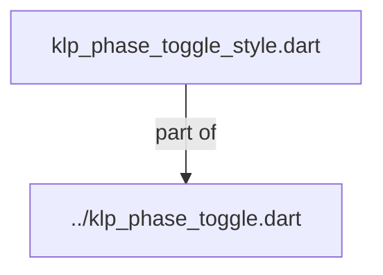
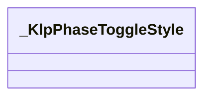

# klp_phase_toggle_style.dart：直接依賴與宣告架構

[回到目錄](README.md) · [來源檔案](../../../../../../../lib/src/features/forms/toggle/internal/klp_phase_toggle_style.dart)

## 範圍

核心是 `lib/src/features/forms/toggle/internal/klp_phase_toggle_style.dart`。主要視角為該檔案明寫的 import／export／part；輔助視角為本檔宣告及 extends／implements／with／on 關係。只展開一層外部邊界。

## 直接依賴圖

## 依賴證據

| 關係 | 原始 directive | 來源 |
|---|---|---|
| part of | <code>part of &#x27;../klp_phase_toggle.dart&#x27;;</code> | [lib/src/features/forms/toggle/internal/klp_phase_toggle_style.dart:1](../../../../../../../lib/src/features/forms/toggle/internal/klp_phase_toggle_style.dart#L1) |

## 宣告關係圖

本組節點是本檔宣告；沒有箭頭的宣告未在此圖主張互相依賴。

## 宣告與成員證據

成員包含 public 與 private；簽章取自來源，省略函式本體與欄位初始值。`(inferred)` 表示來源未明寫型別；建構子只顯示參數部分，不含初始化列表。

### _KlpPhaseToggleStyle

ClassDeclaration · private · [lib/src/features/forms/toggle/internal/klp_phase_toggle_style.dart:3](../../../../../../../lib/src/features/forms/toggle/internal/klp_phase_toggle_style.dart#L3)

<code>class _KlpPhaseToggleStyle</code>

| 成員 | 可見性 | 簽章／型別 | 來源註解摘要 | 證據 |
|---|---|---|---|---|
| constructor <code>_</code> | private | <code>const _KlpPhaseToggleStyle._({ required this.segmentExtent, required this.totalWidth, required this.totalHeight, required this.padding, required this.trackRadius, required this.selectionRadius, required this.trackColor, required this.border, required this.activeBackground, required this.text, required this.textMuted, required this.textFaint, required this.danger, required this.success, required this.onActiveBackground, required this.positionDuration, required this.styleDuration, required this.positionCurve, })</code> |  | [lib/src/features/forms/toggle/internal/klp_phase_toggle_style.dart:5](../../../../../../../lib/src/features/forms/toggle/internal/klp_phase_toggle_style.dart#L5) |
| field <code>segmentExtent</code> | public | <code>final double segmentExtent</code> |  | [lib/src/features/forms/toggle/internal/klp_phase_toggle_style.dart:26](../../../../../../../lib/src/features/forms/toggle/internal/klp_phase_toggle_style.dart#L26) |
| field <code>totalWidth</code> | public | <code>final double totalWidth</code> |  | [lib/src/features/forms/toggle/internal/klp_phase_toggle_style.dart:27](../../../../../../../lib/src/features/forms/toggle/internal/klp_phase_toggle_style.dart#L27) |
| field <code>totalHeight</code> | public | <code>final double totalHeight</code> |  | [lib/src/features/forms/toggle/internal/klp_phase_toggle_style.dart:28](../../../../../../../lib/src/features/forms/toggle/internal/klp_phase_toggle_style.dart#L28) |
| field <code>padding</code> | public | <code>final EdgeInsets padding</code> |  | [lib/src/features/forms/toggle/internal/klp_phase_toggle_style.dart:29](../../../../../../../lib/src/features/forms/toggle/internal/klp_phase_toggle_style.dart#L29) |
| field <code>trackRadius</code> | public | <code>final double trackRadius</code> |  | [lib/src/features/forms/toggle/internal/klp_phase_toggle_style.dart:30](../../../../../../../lib/src/features/forms/toggle/internal/klp_phase_toggle_style.dart#L30) |
| field <code>selectionRadius</code> | public | <code>final double selectionRadius</code> |  | [lib/src/features/forms/toggle/internal/klp_phase_toggle_style.dart:31](../../../../../../../lib/src/features/forms/toggle/internal/klp_phase_toggle_style.dart#L31) |
| field <code>trackColor</code> | public | <code>final Color trackColor</code> |  | [lib/src/features/forms/toggle/internal/klp_phase_toggle_style.dart:32](../../../../../../../lib/src/features/forms/toggle/internal/klp_phase_toggle_style.dart#L32) |
| field <code>border</code> | public | <code>final Border border</code> |  | [lib/src/features/forms/toggle/internal/klp_phase_toggle_style.dart:33](../../../../../../../lib/src/features/forms/toggle/internal/klp_phase_toggle_style.dart#L33) |
| field <code>activeBackground</code> | public | <code>final Color activeBackground</code> |  | [lib/src/features/forms/toggle/internal/klp_phase_toggle_style.dart:34](../../../../../../../lib/src/features/forms/toggle/internal/klp_phase_toggle_style.dart#L34) |
| field <code>text</code> | public | <code>final Color text</code> |  | [lib/src/features/forms/toggle/internal/klp_phase_toggle_style.dart:35](../../../../../../../lib/src/features/forms/toggle/internal/klp_phase_toggle_style.dart#L35) |
| field <code>textMuted</code> | public | <code>final Color textMuted</code> |  | [lib/src/features/forms/toggle/internal/klp_phase_toggle_style.dart:36](../../../../../../../lib/src/features/forms/toggle/internal/klp_phase_toggle_style.dart#L36) |
| field <code>textFaint</code> | public | <code>final Color textFaint</code> |  | [lib/src/features/forms/toggle/internal/klp_phase_toggle_style.dart:37](../../../../../../../lib/src/features/forms/toggle/internal/klp_phase_toggle_style.dart#L37) |
| field <code>danger</code> | public | <code>final Color danger</code> |  | [lib/src/features/forms/toggle/internal/klp_phase_toggle_style.dart:38](../../../../../../../lib/src/features/forms/toggle/internal/klp_phase_toggle_style.dart#L38) |
| field <code>success</code> | public | <code>final Color success</code> |  | [lib/src/features/forms/toggle/internal/klp_phase_toggle_style.dart:39](../../../../../../../lib/src/features/forms/toggle/internal/klp_phase_toggle_style.dart#L39) |
| field <code>onActiveBackground</code> | public | <code>final Color onActiveBackground</code> |  | [lib/src/features/forms/toggle/internal/klp_phase_toggle_style.dart:40](../../../../../../../lib/src/features/forms/toggle/internal/klp_phase_toggle_style.dart#L40) |
| field <code>positionDuration</code> | public | <code>final Duration positionDuration</code> |  | [lib/src/features/forms/toggle/internal/klp_phase_toggle_style.dart:41](../../../../../../../lib/src/features/forms/toggle/internal/klp_phase_toggle_style.dart#L41) |
| field <code>styleDuration</code> | public | <code>final Duration styleDuration</code> |  | [lib/src/features/forms/toggle/internal/klp_phase_toggle_style.dart:42](../../../../../../../lib/src/features/forms/toggle/internal/klp_phase_toggle_style.dart#L42) |
| field <code>positionCurve</code> | public | <code>final Curve positionCurve</code> |  | [lib/src/features/forms/toggle/internal/klp_phase_toggle_style.dart:43](../../../../../../../lib/src/features/forms/toggle/internal/klp_phase_toggle_style.dart#L43) |
| constructor <code>resolve</code> | public | <code>factory _KlpPhaseToggleStyle.resolve( KlpTheme klp, { required int optionCount, required bool enabled, required KlpFeedbackTone? selectedTone, })</code> |  | [lib/src/features/forms/toggle/internal/klp_phase_toggle_style.dart:45](../../../../../../../lib/src/features/forms/toggle/internal/klp_phase_toggle_style.dart#L45) |
| method <code>foregroundFor</code> | public | <code>Color foregroundFor( KlpFeedbackTone? tone, { required bool selected, required bool enabled, })</code> |  | [lib/src/features/forms/toggle/internal/klp_phase_toggle_style.dart:105](../../../../../../../lib/src/features/forms/toggle/internal/klp_phase_toggle_style.dart#L105) |

## 閱讀說明與限制

箭頭只表示來源明寫的靜態關係；import 不等於呼叫。未分析動態呼叫、欄位的實際物件擁有權、狀態轉移或渲染流程；型別未進行語意解析，繼承目標保留原始型別拼寫。public／private 依 Dart 名稱前綴判斷；public 宣告不代表已由 `lib/kallopis.dart` 匯出。

本頁由 `tool/architecture_atlas` 產生；編輯來源或生成工具後重新產生，避免手改本頁。
