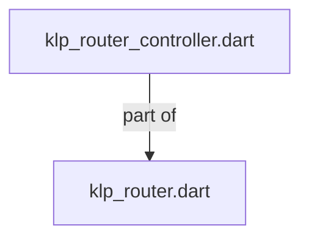
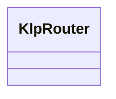
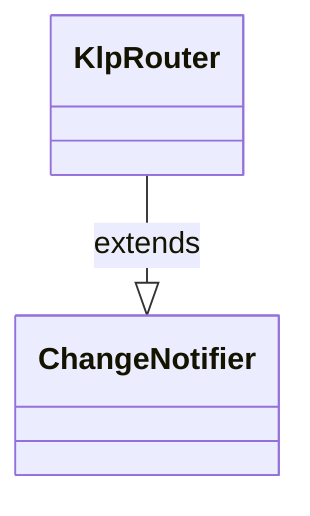

# klp_router_controller.dart：直接依賴與宣告架構

[回到目錄](README.md) · [來源檔案](../../../../../../lib/src/features/navigation/legacy_router/klp_router_controller.dart)

## 範圍

核心是 `lib/src/features/navigation/legacy_router/klp_router_controller.dart`。主要視角為該檔案明寫的 import／export／part；輔助視角為本檔宣告及 extends／implements／with／on 關係。只展開一層外部邊界。

## 直接依賴圖

## 依賴證據

| 關係 | 原始 directive | 來源 |
|---|---|---|
| part of | <code>part of &#x27;klp_router.dart&#x27;;</code> | [lib/src/features/navigation/legacy_router/klp_router_controller.dart:1](../../../../../../lib/src/features/navigation/legacy_router/klp_router_controller.dart#L1) |

## 宣告關係圖

本組節點是本檔宣告；沒有箭頭的宣告未在此圖主張互相依賴。

## 宣告與成員證據

成員包含 public 與 private；簽章取自來源，省略函式本體與欄位初始值。`(inferred)` 表示來源未明寫型別；建構子只顯示參數部分，不含初始化列表。

### KlpRouter

ClassDeclaration · public · [lib/src/features/navigation/legacy_router/klp_router_controller.dart:3](../../../../../../lib/src/features/navigation/legacy_router/klp_router_controller.dart#L3)

<code>class KlpRouter extends ChangeNotifier</code>

來源註解摘要：目的地登記簿與切換器，只負責產品路由分發機制。

- `extends` → <code>ChangeNotifier</code>：[lib/src/features/navigation/legacy_router/klp_router_controller.dart:4](../../../../../../lib/src/features/navigation/legacy_router/klp_router_controller.dart#L4)

| 成員 | 可見性 | 簽章／型別 | 來源註解摘要 | 證據 |
|---|---|---|---|---|
| constructor <code>KlpRouter</code> | public | <code>KlpRouter({required List&lt;KlpRoute&gt; routes, required String initialId})</code> |  | [lib/src/features/navigation/legacy_router/klp_router_controller.dart:5](../../../../../../lib/src/features/navigation/legacy_router/klp_router_controller.dart#L5) |
| field <code>_routes</code> | private | <code>final Map&lt;String, KlpRoute&gt; _routes</code> |  | [lib/src/features/navigation/legacy_router/klp_router_controller.dart:16](../../../../../../lib/src/features/navigation/legacy_router/klp_router_controller.dart#L16) |
| field <code>_history</code> | private | <code>late List&lt;String&gt; _history</code> |  | [lib/src/features/navigation/legacy_router/klp_router_controller.dart:17](../../../../../../lib/src/features/navigation/legacy_router/klp_router_controller.dart#L17) |
| method <code>_duplicateIds</code> | private | <code>static Iterable&lt;String&gt; _duplicateIds(List&lt;KlpRoute&gt; routes)</code> |  | [lib/src/features/navigation/legacy_router/klp_router_controller.dart:19](../../../../../../lib/src/features/navigation/legacy_router/klp_router_controller.dart#L19) |
| getter <code>current</code> | public | <code>KlpRoute get current</code> |  | [lib/src/features/navigation/legacy_router/klp_router_controller.dart:24](../../../../../../lib/src/features/navigation/legacy_router/klp_router_controller.dart#L24) |
| getter <code>currentId</code> | public | <code>String get currentId</code> |  | [lib/src/features/navigation/legacy_router/klp_router_controller.dart:25](../../../../../../lib/src/features/navigation/legacy_router/klp_router_controller.dart#L25) |
| getter <code>ids</code> | public | <code>Iterable&lt;String&gt; get ids</code> |  | [lib/src/features/navigation/legacy_router/klp_router_controller.dart:26](../../../../../../lib/src/features/navigation/legacy_router/klp_router_controller.dart#L26) |
| getter <code>routes</code> | public | <code>Iterable&lt;KlpRoute&gt; get routes</code> |  | [lib/src/features/navigation/legacy_router/klp_router_controller.dart:27](../../../../../../lib/src/features/navigation/legacy_router/klp_router_controller.dart#L27) |
| method <code>contains</code> | public | <code>bool contains(String id)</code> |  | [lib/src/features/navigation/legacy_router/klp_router_controller.dart:28](../../../../../../lib/src/features/navigation/legacy_router/klp_router_controller.dart#L28) |
| method <code>find</code> | public | <code>KlpRoute? find(String id)</code> |  | [lib/src/features/navigation/legacy_router/klp_router_controller.dart:29](../../../../../../lib/src/features/navigation/legacy_router/klp_router_controller.dart#L29) |
| getter <code>canGoBack</code> | public | <code>bool get canGoBack</code> |  | [lib/src/features/navigation/legacy_router/klp_router_controller.dart:30](../../../../../../lib/src/features/navigation/legacy_router/klp_router_controller.dart#L30) |
| method <code>go</code> | public | <code>void go(String id)</code> |  | [lib/src/features/navigation/legacy_router/klp_router_controller.dart:32](../../../../../../lib/src/features/navigation/legacy_router/klp_router_controller.dart#L32) |
| method <code>goBack</code> | public | <code>bool goBack()</code> |  | [lib/src/features/navigation/legacy_router/klp_router_controller.dart:39](../../../../../../lib/src/features/navigation/legacy_router/klp_router_controller.dart#L39) |
| method <code>reset</code> | public | <code>void reset(String id)</code> |  | [lib/src/features/navigation/legacy_router/klp_router_controller.dart:46](../../../../../../lib/src/features/navigation/legacy_router/klp_router_controller.dart#L46) |
| method <code>register</code> | public | <code>void register(KlpRoute route)</code> |  | [lib/src/features/navigation/legacy_router/klp_router_controller.dart:52](../../../../../../lib/src/features/navigation/legacy_router/klp_router_controller.dart#L52) |
| method <code>unregister</code> | public | <code>void unregister(String id)</code> |  | [lib/src/features/navigation/legacy_router/klp_router_controller.dart:60](../../../../../../lib/src/features/navigation/legacy_router/klp_router_controller.dart#L60) |

## 閱讀說明與限制

箭頭只表示來源明寫的靜態關係；import 不等於呼叫。未分析動態呼叫、欄位的實際物件擁有權、狀態轉移或渲染流程；型別未進行語意解析，繼承目標保留原始型別拼寫。public／private 依 Dart 名稱前綴判斷；public 宣告不代表已由 `lib/kallopis.dart` 匯出。

本頁由 `tool/architecture_atlas` 產生；編輯來源或生成工具後重新產生，避免手改本頁。
