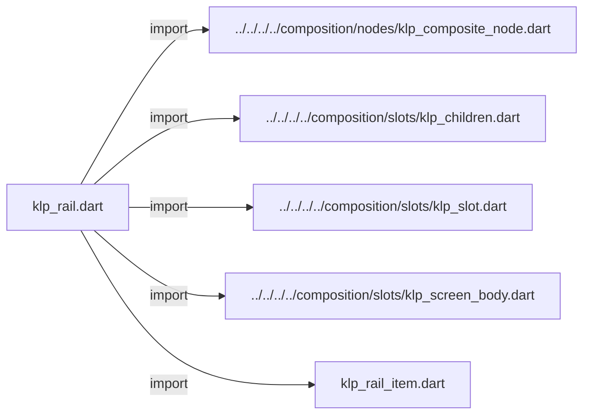
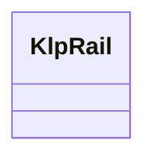
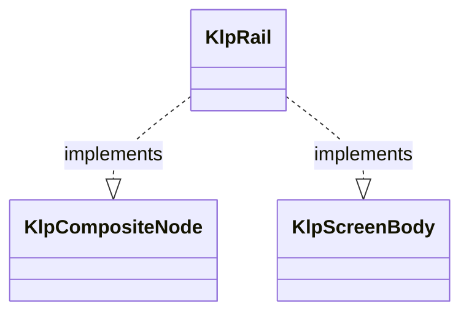

# klp_rail.dart：直接依賴與宣告架構

[回到目錄](README.md) · [來源檔案](../../../../../../../lib/src/features/navigation/rail/contracts/klp_rail.dart)

## 範圍

核心是 `lib/src/features/navigation/rail/contracts/klp_rail.dart`。主要視角為該檔案明寫的 import／export／part；輔助視角為本檔宣告及 extends／implements／with／on 關係。只展開一層外部邊界。

## 直接依賴圖

## 依賴證據

| 關係 | 原始 directive | 來源 |
|---|---|---|
| import | <code>import &#x27;../../../../composition/nodes/klp_composite_node.dart&#x27;;</code> | [lib/src/features/navigation/rail/contracts/klp_rail.dart:1](../../../../../../../lib/src/features/navigation/rail/contracts/klp_rail.dart#L1) |
| import | <code>import &#x27;../../../../composition/slots/klp_children.dart&#x27;;</code> | [lib/src/features/navigation/rail/contracts/klp_rail.dart:2](../../../../../../../lib/src/features/navigation/rail/contracts/klp_rail.dart#L2) |
| import | <code>import &#x27;../../../../composition/slots/klp_slot.dart&#x27;;</code> | [lib/src/features/navigation/rail/contracts/klp_rail.dart:3](../../../../../../../lib/src/features/navigation/rail/contracts/klp_rail.dart#L3) |
| import | <code>import &#x27;../../../../composition/slots/klp_screen_body.dart&#x27;;</code> | [lib/src/features/navigation/rail/contracts/klp_rail.dart:4](../../../../../../../lib/src/features/navigation/rail/contracts/klp_rail.dart#L4) |
| import | <code>import &#x27;klp_rail_item.dart&#x27;;</code> | [lib/src/features/navigation/rail/contracts/klp_rail.dart:5](../../../../../../../lib/src/features/navigation/rail/contracts/klp_rail.dart#L5) |

## 宣告關係圖

本組節點是本檔宣告；沒有箭頭的宣告未在此圖主張互相依賴。

## 宣告與成員證據

成員包含 public 與 private；簽章取自來源，省略函式本體與欄位初始值。`(inferred)` 表示來源未明寫型別；建構子只顯示參數部分，不含初始化列表。

### KlpRail

ClassDeclaration · public · [lib/src/features/navigation/rail/contracts/klp_rail.dart:7](../../../../../../../lib/src/features/navigation/rail/contracts/klp_rail.dart#L7)

<code>final class KlpRail implements KlpCompositeNode, KlpScreenBody</code>

來源註解摘要：三區受控結構宣告；選取狀態與呈現由本庫在安裝後持有。

- `implements` → <code>KlpCompositeNode</code>：[lib/src/features/navigation/rail/contracts/klp_rail.dart:8](../../../../../../../lib/src/features/navigation/rail/contracts/klp_rail.dart#L8)
- `implements` → <code>KlpScreenBody</code>：[lib/src/features/navigation/rail/contracts/klp_rail.dart:8](../../../../../../../lib/src/features/navigation/rail/contracts/klp_rail.dart#L8)

| 成員 | 可見性 | 簽章／型別 | 來源註解摘要 | 證據 |
|---|---|---|---|---|
| field <code>typeId</code> | public | <code>static const String typeId</code> |  | [lib/src/features/navigation/rail/contracts/klp_rail.dart:9](../../../../../../../lib/src/features/navigation/rail/contracts/klp_rail.dart#L9) |
| field <code>topSlot</code> | public | <code>static final (inferred) topSlot</code> |  | [lib/src/features/navigation/rail/contracts/klp_rail.dart:10](../../../../../../../lib/src/features/navigation/rail/contracts/klp_rail.dart#L10) |
| field <code>centerSlot</code> | public | <code>static final (inferred) centerSlot</code> |  | [lib/src/features/navigation/rail/contracts/klp_rail.dart:11](../../../../../../../lib/src/features/navigation/rail/contracts/klp_rail.dart#L11) |
| field <code>bottomSlot</code> | public | <code>static final (inferred) bottomSlot</code> |  | [lib/src/features/navigation/rail/contracts/klp_rail.dart:12](../../../../../../../lib/src/features/navigation/rail/contracts/klp_rail.dart#L12) |
| field <code>id</code> | public | <code>final String id</code> |  | [lib/src/features/navigation/rail/contracts/klp_rail.dart:15](../../../../../../../lib/src/features/navigation/rail/contracts/klp_rail.dart#L15) |
| field <code>top</code> | public | <code>final List&lt;KlpRailItem&gt; top</code> |  | [lib/src/features/navigation/rail/contracts/klp_rail.dart:16](../../../../../../../lib/src/features/navigation/rail/contracts/klp_rail.dart#L16) |
| field <code>center</code> | public | <code>final List&lt;KlpRailItem&gt; center</code> |  | [lib/src/features/navigation/rail/contracts/klp_rail.dart:17](../../../../../../../lib/src/features/navigation/rail/contracts/klp_rail.dart#L17) |
| field <code>bottom</code> | public | <code>final List&lt;KlpRailItem&gt; bottom</code> |  | [lib/src/features/navigation/rail/contracts/klp_rail.dart:18](../../../../../../../lib/src/features/navigation/rail/contracts/klp_rail.dart#L18) |
| field <code>onSelected</code> | public | <code>final void Function(String)? onSelected</code> |  | [lib/src/features/navigation/rail/contracts/klp_rail.dart:19](../../../../../../../lib/src/features/navigation/rail/contracts/klp_rail.dart#L19) |
| field <code>children</code> | public | <code>final KlpChildren children</code> |  | [lib/src/features/navigation/rail/contracts/klp_rail.dart:21](../../../../../../../lib/src/features/navigation/rail/contracts/klp_rail.dart#L21) |
| constructor <code>KlpRail</code> | public | <code>KlpRail({ required String id, List&lt;KlpRailItem&gt; top = const [], List&lt;KlpRailItem&gt; center = const [], List&lt;KlpRailItem&gt; bottom = const [], void Function(String)? onSelected, })</code> |  | [lib/src/features/navigation/rail/contracts/klp_rail.dart:23](../../../../../../../lib/src/features/navigation/rail/contracts/klp_rail.dart#L23) |
| constructor <code>_</code> | private | <code>KlpRail._(this.id, this.top, this.center, this.bottom, this.onSelected)</code> |  | [lib/src/features/navigation/rail/contracts/klp_rail.dart:37](../../../../../../../lib/src/features/navigation/rail/contracts/klp_rail.dart#L37) |
| getter <code>definitionId</code> | public | <code>String get definitionId</code> |  | [lib/src/features/navigation/rail/contracts/klp_rail.dart:44](../../../../../../../lib/src/features/navigation/rail/contracts/klp_rail.dart#L44) |

## 閱讀說明與限制

箭頭只表示來源明寫的靜態關係；import 不等於呼叫。未分析動態呼叫、欄位的實際物件擁有權、狀態轉移或渲染流程；型別未進行語意解析，繼承目標保留原始型別拼寫。public／private 依 Dart 名稱前綴判斷；public 宣告不代表已由 `lib/kallopis.dart` 匯出。

本頁由 `tool/architecture_atlas` 產生；編輯來源或生成工具後重新產生，避免手改本頁。
