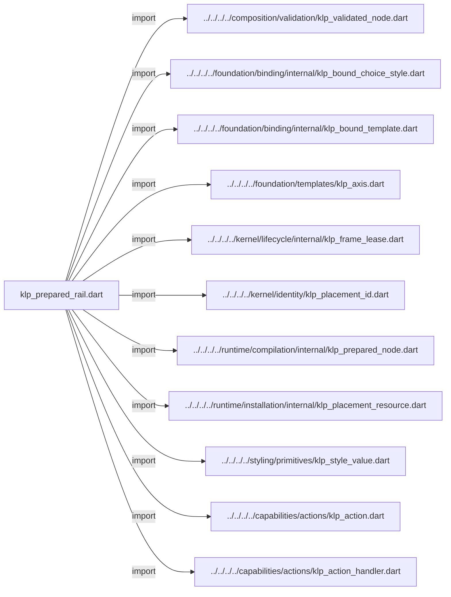
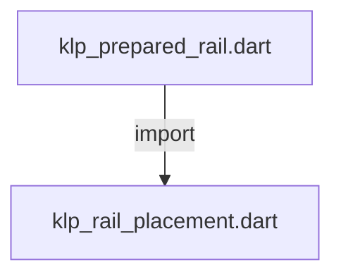
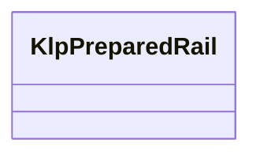
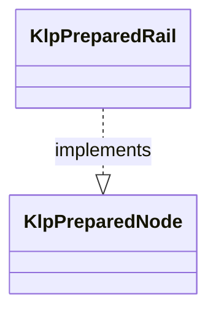

# klp_prepared_rail.dart：直接依賴與宣告架構

[回到目錄](README.md) · [來源檔案](../../../../../../../lib/src/features/navigation/rail/internal/klp_prepared_rail.dart)

## 範圍

核心是 `lib/src/features/navigation/rail/internal/klp_prepared_rail.dart`。主要視角為該檔案明寫的 import／export／part；輔助視角為本檔宣告及 extends／implements／with／on 關係。只展開一層外部邊界。

## 直接依賴圖

## 依賴證據

| 關係 | 原始 directive | 來源 |
|---|---|---|
| import | <code>import &#x27;../../../../composition/validation/klp_validated_node.dart&#x27;;</code> | [lib/src/features/navigation/rail/internal/klp_prepared_rail.dart:1](../../../../../../../lib/src/features/navigation/rail/internal/klp_prepared_rail.dart#L1) |
| import | <code>import &#x27;../../../../foundation/binding/internal/klp_bound_choice_style.dart&#x27;;</code> | [lib/src/features/navigation/rail/internal/klp_prepared_rail.dart:2](../../../../../../../lib/src/features/navigation/rail/internal/klp_prepared_rail.dart#L2) |
| import | <code>import &#x27;../../../../foundation/binding/internal/klp_bound_template.dart&#x27;;</code> | [lib/src/features/navigation/rail/internal/klp_prepared_rail.dart:3](../../../../../../../lib/src/features/navigation/rail/internal/klp_prepared_rail.dart#L3) |
| import | <code>import &#x27;../../../../foundation/templates/klp_axis.dart&#x27;;</code> | [lib/src/features/navigation/rail/internal/klp_prepared_rail.dart:4](../../../../../../../lib/src/features/navigation/rail/internal/klp_prepared_rail.dart#L4) |
| import | <code>import &#x27;../../../../kernel/lifecycle/internal/klp_frame_lease.dart&#x27;;</code> | [lib/src/features/navigation/rail/internal/klp_prepared_rail.dart:5](../../../../../../../lib/src/features/navigation/rail/internal/klp_prepared_rail.dart#L5) |
| import | <code>import &#x27;../../../../kernel/identity/klp_placement_id.dart&#x27;;</code> | [lib/src/features/navigation/rail/internal/klp_prepared_rail.dart:6](../../../../../../../lib/src/features/navigation/rail/internal/klp_prepared_rail.dart#L6) |
| import | <code>import &#x27;../../../../runtime/compilation/internal/klp_prepared_node.dart&#x27;;</code> | [lib/src/features/navigation/rail/internal/klp_prepared_rail.dart:7](../../../../../../../lib/src/features/navigation/rail/internal/klp_prepared_rail.dart#L7) |
| import | <code>import &#x27;../../../../runtime/installation/internal/klp_placement_resource.dart&#x27;;</code> | [lib/src/features/navigation/rail/internal/klp_prepared_rail.dart:8](../../../../../../../lib/src/features/navigation/rail/internal/klp_prepared_rail.dart#L8) |
| import | <code>import &#x27;../../../../styling/primitives/klp_style_value.dart&#x27;;</code> | [lib/src/features/navigation/rail/internal/klp_prepared_rail.dart:9](../../../../../../../lib/src/features/navigation/rail/internal/klp_prepared_rail.dart#L9) |
| import | <code>import &#x27;../../../../capabilities/actions/klp_action.dart&#x27;;</code> | [lib/src/features/navigation/rail/internal/klp_prepared_rail.dart:10](../../../../../../../lib/src/features/navigation/rail/internal/klp_prepared_rail.dart#L10) |
| import | <code>import &#x27;../../../../capabilities/actions/klp_action_handler.dart&#x27;;</code> | [lib/src/features/navigation/rail/internal/klp_prepared_rail.dart:11](../../../../../../../lib/src/features/navigation/rail/internal/klp_prepared_rail.dart#L11) |
| import | <code>import &#x27;klp_rail_placement.dart&#x27;;</code> | [lib/src/features/navigation/rail/internal/klp_prepared_rail.dart:12](../../../../../../../lib/src/features/navigation/rail/internal/klp_prepared_rail.dart#L12) |

## 宣告關係圖

本組節點是本檔宣告；沒有箭頭的宣告未在此圖主張互相依賴。

## 宣告與成員證據

成員包含 public 與 private；簽章取自來源，省略函式本體與欄位初始值。`(inferred)` 表示來源未明寫型別；建構子只顯示參數部分，不含初始化列表。

### KlpPreparedRail

ClassDeclaration · public · [lib/src/features/navigation/rail/internal/klp_prepared_rail.dart:14](../../../../../../../lib/src/features/navigation/rail/internal/klp_prepared_rail.dart#L14)

<code>final class KlpPreparedRail implements KlpPreparedNode</code>

來源註解摘要：已投影的 Rail 資料；實體化不再讀取外部節點或執行 selector。

- `implements` → <code>KlpPreparedNode</code>：[lib/src/features/navigation/rail/internal/klp_prepared_rail.dart:15](../../../../../../../lib/src/features/navigation/rail/internal/klp_prepared_rail.dart#L15)

| 成員 | 可見性 | 簽章／型別 | 來源註解摘要 | 證據 |
|---|---|---|---|---|
| field <code>items</code> | public | <code>final List&lt;({KlpPlacementId id, String label, KlpAction? action})&gt; items</code> |  | [lib/src/features/navigation/rail/internal/klp_prepared_rail.dart:16](../../../../../../../lib/src/features/navigation/rail/internal/klp_prepared_rail.dart#L16) |
| field <code>topCount</code> | public | <code>final int topCount</code> |  | [lib/src/features/navigation/rail/internal/klp_prepared_rail.dart:17](../../../../../../../lib/src/features/navigation/rail/internal/klp_prepared_rail.dart#L17) |
| field <code>centerCount</code> | public | <code>final int centerCount</code> |  | [lib/src/features/navigation/rail/internal/klp_prepared_rail.dart:18](../../../../../../../lib/src/features/navigation/rail/internal/klp_prepared_rail.dart#L18) |
| field <code>onSelected</code> | public | <code>final void Function(String)? onSelected</code> |  | [lib/src/features/navigation/rail/internal/klp_prepared_rail.dart:19](../../../../../../../lib/src/features/navigation/rail/internal/klp_prepared_rail.dart#L19) |
| field <code>choiceStyle</code> | public | <code>final KlpBoundChoiceStyle choiceStyle</code> |  | [lib/src/features/navigation/rail/internal/klp_prepared_rail.dart:20](../../../../../../../lib/src/features/navigation/rail/internal/klp_prepared_rail.dart#L20) |
| field <code>background</code> | public | <code>final KlpColor background</code> |  | [lib/src/features/navigation/rail/internal/klp_prepared_rail.dart:21](../../../../../../../lib/src/features/navigation/rail/internal/klp_prepared_rail.dart#L21) |
| field <code>width</code> | public | <code>final KlpDistance width</code> |  | [lib/src/features/navigation/rail/internal/klp_prepared_rail.dart:22](../../../../../../../lib/src/features/navigation/rail/internal/klp_prepared_rail.dart#L22) |
| field <code>inset</code> | public | <code>final KlpDistance inset</code> |  | [lib/src/features/navigation/rail/internal/klp_prepared_rail.dart:23](../../../../../../../lib/src/features/navigation/rail/internal/klp_prepared_rail.dart#L23) |
| field <code>gap</code> | public | <code>final KlpDistance gap</code> |  | [lib/src/features/navigation/rail/internal/klp_prepared_rail.dart:24](../../../../../../../lib/src/features/navigation/rail/internal/klp_prepared_rail.dart#L24) |
| field <code>topExtent</code> | public | <code>final KlpDistance topExtent</code> |  | [lib/src/features/navigation/rail/internal/klp_prepared_rail.dart:25](../../../../../../../lib/src/features/navigation/rail/internal/klp_prepared_rail.dart#L25) |
| field <code>bottomExtent</code> | public | <code>final KlpDistance bottomExtent</code> |  | [lib/src/features/navigation/rail/internal/klp_prepared_rail.dart:26](../../../../../../../lib/src/features/navigation/rail/internal/klp_prepared_rail.dart#L26) |
| field <code>minimumBodyExtent</code> | public | <code>final KlpDistance minimumBodyExtent</code> |  | [lib/src/features/navigation/rail/internal/klp_prepared_rail.dart:27](../../../../../../../lib/src/features/navigation/rail/internal/klp_prepared_rail.dart#L27) |
| field <code>actionHandler</code> | public | <code>final KlpActionHandler? actionHandler</code> |  | [lib/src/features/navigation/rail/internal/klp_prepared_rail.dart:28](../../../../../../../lib/src/features/navigation/rail/internal/klp_prepared_rail.dart#L28) |
| constructor <code>KlpPreparedRail</code> | public | <code>KlpPreparedRail({ required Iterable&lt;({KlpPlacementId id, String label, KlpAction? action})&gt; items, required this.topCount, required this.centerCount, required this.onSelected, required this.choiceStyle, required this.background, required this.width, required this.inset, required this.gap, required this.topExtent, required this.bottomExtent, required this.minimumBodyExtent, required this.actionHandler, })</code> |  | [lib/src/features/navigation/rail/internal/klp_prepared_rail.dart:30](../../../../../../../lib/src/features/navigation/rail/internal/klp_prepared_rail.dart#L30) |
| method <code>createResource</code> | public | <code>KlpPlacementResource createResource(KlpValidatedNode node)</code> |  | [lib/src/features/navigation/rail/internal/klp_prepared_rail.dart:47](../../../../../../../lib/src/features/navigation/rail/internal/klp_prepared_rail.dart#L47) |
| method <code>materialize</code> | public | <code>KlpBoundTemplate materialize( KlpPlacementResource resource, List&lt;KlpBoundTemplate&gt; children, KlpFrameLease lease, )</code> |  | [lib/src/features/navigation/rail/internal/klp_prepared_rail.dart:51](../../../../../../../lib/src/features/navigation/rail/internal/klp_prepared_rail.dart#L51) |

## 閱讀說明與限制

箭頭只表示來源明寫的靜態關係；import 不等於呼叫。未分析動態呼叫、欄位的實際物件擁有權、狀態轉移或渲染流程；型別未進行語意解析，繼承目標保留原始型別拼寫。public／private 依 Dart 名稱前綴判斷；public 宣告不代表已由 `lib/kallopis.dart` 匯出。

本頁由 `tool/architecture_atlas` 產生；編輯來源或生成工具後重新產生，避免手改本頁。
