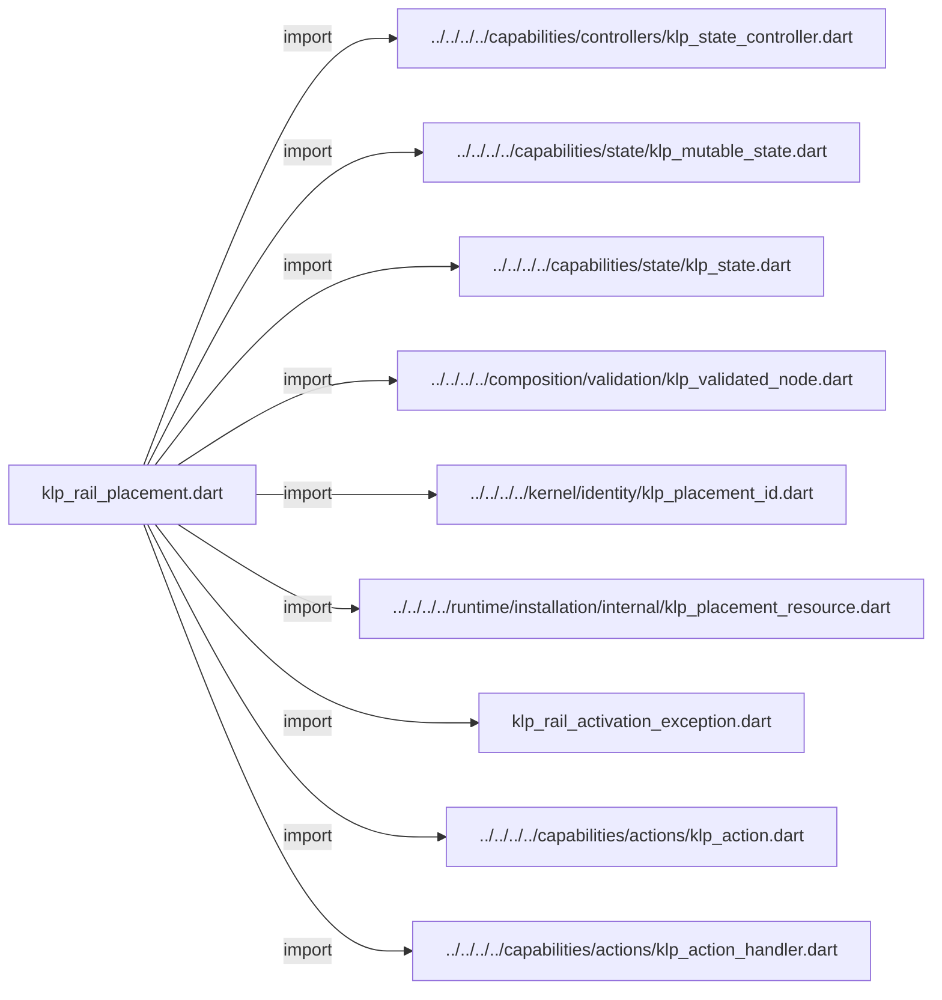
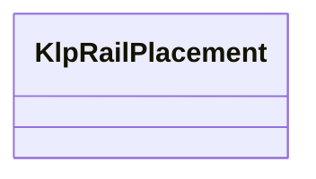
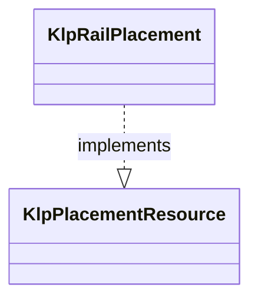

# klp_rail_placement.dart：直接依賴與宣告架構

[回到目錄](README.md) · [來源檔案](../../../../../../../lib/src/features/navigation/rail/internal/klp_rail_placement.dart)

## 範圍

核心是 `lib/src/features/navigation/rail/internal/klp_rail_placement.dart`。主要視角為該檔案明寫的 import／export／part；輔助視角為本檔宣告及 extends／implements／with／on 關係。只展開一層外部邊界。

## 直接依賴圖

## 依賴證據

| 關係 | 原始 directive | 來源 |
|---|---|---|
| import | <code>import &#x27;../../../../capabilities/controllers/klp_state_controller.dart&#x27;;</code> | [lib/src/features/navigation/rail/internal/klp_rail_placement.dart:1](../../../../../../../lib/src/features/navigation/rail/internal/klp_rail_placement.dart#L1) |
| import | <code>import &#x27;../../../../capabilities/state/klp_mutable_state.dart&#x27;;</code> | [lib/src/features/navigation/rail/internal/klp_rail_placement.dart:2](../../../../../../../lib/src/features/navigation/rail/internal/klp_rail_placement.dart#L2) |
| import | <code>import &#x27;../../../../capabilities/state/klp_state.dart&#x27;;</code> | [lib/src/features/navigation/rail/internal/klp_rail_placement.dart:3](../../../../../../../lib/src/features/navigation/rail/internal/klp_rail_placement.dart#L3) |
| import | <code>import &#x27;../../../../composition/validation/klp_validated_node.dart&#x27;;</code> | [lib/src/features/navigation/rail/internal/klp_rail_placement.dart:4](../../../../../../../lib/src/features/navigation/rail/internal/klp_rail_placement.dart#L4) |
| import | <code>import &#x27;../../../../kernel/identity/klp_placement_id.dart&#x27;;</code> | [lib/src/features/navigation/rail/internal/klp_rail_placement.dart:5](../../../../../../../lib/src/features/navigation/rail/internal/klp_rail_placement.dart#L5) |
| import | <code>import &#x27;../../../../runtime/installation/internal/klp_placement_resource.dart&#x27;;</code> | [lib/src/features/navigation/rail/internal/klp_rail_placement.dart:6](../../../../../../../lib/src/features/navigation/rail/internal/klp_rail_placement.dart#L6) |
| import | <code>import &#x27;klp_rail_activation_exception.dart&#x27;;</code> | [lib/src/features/navigation/rail/internal/klp_rail_placement.dart:7](../../../../../../../lib/src/features/navigation/rail/internal/klp_rail_placement.dart#L7) |
| import | <code>import &#x27;../../../../capabilities/actions/klp_action.dart&#x27;;</code> | [lib/src/features/navigation/rail/internal/klp_rail_placement.dart:8](../../../../../../../lib/src/features/navigation/rail/internal/klp_rail_placement.dart#L8) |
| import | <code>import &#x27;../../../../capabilities/actions/klp_action_handler.dart&#x27;;</code> | [lib/src/features/navigation/rail/internal/klp_rail_placement.dart:9](../../../../../../../lib/src/features/navigation/rail/internal/klp_rail_placement.dart#L9) |

## 宣告關係圖

本組節點是本檔宣告；沒有箭頭的宣告未在此圖主張互相依賴。

## 宣告與成員證據

成員包含 public 與 private；簽章取自來源，省略函式本體與欄位初始值。`(inferred)` 表示來源未明寫型別；建構子只顯示參數部分，不含初始化列表。

### KlpRailPlacement

ClassDeclaration · public · [lib/src/features/navigation/rail/internal/klp_rail_placement.dart:11](../../../../../../../lib/src/features/navigation/rail/internal/klp_rail_placement.dart#L11)

<code>final class KlpRailPlacement implements KlpPlacementResource</code>

來源註解摘要：Rail 擁有選取狀態；畫面與控制器只借用同一來源。

- `implements` → <code>KlpPlacementResource</code>：[lib/src/features/navigation/rail/internal/klp_rail_placement.dart:12](../../../../../../../lib/src/features/navigation/rail/internal/klp_rail_placement.dart#L12)

| 成員 | 可見性 | 簽章／型別 | 來源註解摘要 | 證據 |
|---|---|---|---|---|
| field <code>_node</code> | private | <code>KlpValidatedNode _node</code> |  | [lib/src/features/navigation/rail/internal/klp_rail_placement.dart:13](../../../../../../../lib/src/features/navigation/rail/internal/klp_rail_placement.dart#L13) |
| field <code>_selection</code> | private | <code>final KlpMutableState&lt;KlpPlacementId?&gt; _selection</code> |  | [lib/src/features/navigation/rail/internal/klp_rail_placement.dart:14](../../../../../../../lib/src/features/navigation/rail/internal/klp_rail_placement.dart#L14) |
| field <code>controller</code> | public | <code>final KlpStateController&lt;KlpPlacementId?&gt; controller</code> |  | [lib/src/features/navigation/rail/internal/klp_rail_placement.dart:15](../../../../../../../lib/src/features/navigation/rail/internal/klp_rail_placement.dart#L15) |
| field <code>_activating</code> | private | <code>bool _activating</code> |  | [lib/src/features/navigation/rail/internal/klp_rail_placement.dart:16](../../../../../../../lib/src/features/navigation/rail/internal/klp_rail_placement.dart#L16) |
| constructor <code>KlpRailPlacement</code> | public | <code>KlpRailPlacement(this._node)</code> |  | [lib/src/features/navigation/rail/internal/klp_rail_placement.dart:18](../../../../../../../lib/src/features/navigation/rail/internal/klp_rail_placement.dart#L18) |
| getter <code>selection</code> | public | <code>KlpState&lt;KlpPlacementId?&gt; get selection</code> |  | [lib/src/features/navigation/rail/internal/klp_rail_placement.dart:22](../../../../../../../lib/src/features/navigation/rail/internal/klp_rail_placement.dart#L22) |
| getter <code>isDisposed</code> | public | <code>bool get isDisposed</code> |  | [lib/src/features/navigation/rail/internal/klp_rail_placement.dart:23](../../../../../../../lib/src/features/navigation/rail/internal/klp_rail_placement.dart#L23) |
| method <code>update</code> | public | <code>void update(KlpValidatedNode node)</code> |  | [lib/src/features/navigation/rail/internal/klp_rail_placement.dart:25](../../../../../../../lib/src/features/navigation/rail/internal/klp_rail_placement.dart#L25) |
| method <code>activate</code> | public | <code>Future&lt;void&gt; activate( KlpPlacementId id, KlpAction action, KlpActionHandler? actionHandler, void Function(String)? onSelected, )</code> |  | [lib/src/features/navigation/rail/internal/klp_rail_placement.dart:34](../../../../../../../lib/src/features/navigation/rail/internal/klp_rail_placement.dart#L34) |
| method <code>dispose</code> | public | <code>void dispose()</code> |  | [lib/src/features/navigation/rail/internal/klp_rail_placement.dart:73](../../../../../../../lib/src/features/navigation/rail/internal/klp_rail_placement.dart#L73) |

## 閱讀說明與限制

箭頭只表示來源明寫的靜態關係；import 不等於呼叫。未分析動態呼叫、欄位的實際物件擁有權、狀態轉移或渲染流程；型別未進行語意解析，繼承目標保留原始型別拼寫。public／private 依 Dart 名稱前綴判斷；public 宣告不代表已由 `lib/kallopis.dart` 匯出。

本頁由 `tool/architecture_atlas` 產生；編輯來源或生成工具後重新產生，避免手改本頁。
